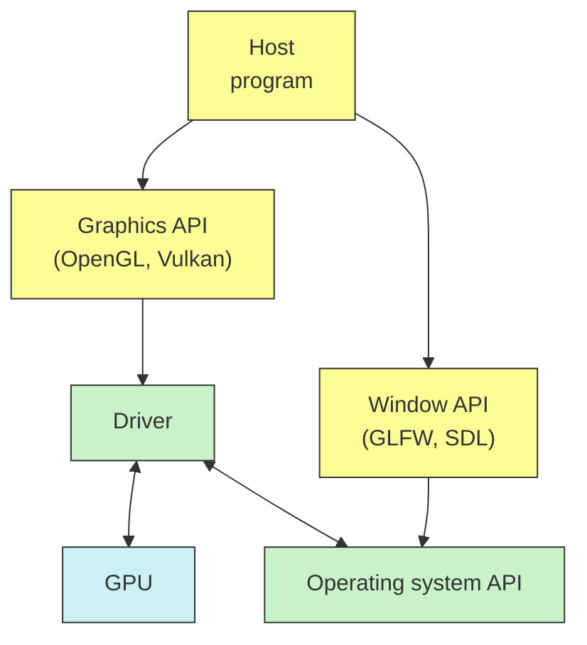

<h1 align="center">3D ГРАФИКА</h1>

---
<p align="center">Программирование GPU, основы Vulkan API и подход к трёхмерной графике как к объектно-ориентированной системе.</p>
## GPU и OpenGL
#### GPU как вычислительная система
• Видеокарта решает задачу **рендеринга**, т.е. двумерного представления трёхмерной сцены.
• Эта задача сложна и специфична. Графические процессоры всегда отличались от CPU и с ними традиционно работают через разные API.

#### Давайте отрендерим квадрат
• OpenGL для рендеринга.
```cpp
glClear(GL_COLOR_BUFFER_BIT);
glBegin(GL_QUADS);
glColor3f(1.0, 1.0, 1.0);
for(auto Coord : Vertices)
	glVertex3fv(Coord);
glEnd();
```
• GLFW для окон и управления.
```cpp
glfwSwapBuffers(Wnd.get());
glfwPollEvents();
```
![[../../../_Meta/attachments/10.1.png]]
Пример с гита:
```cpp
//---------------------------------------------------------------------------
//
// Source code for MIPT ILab
// Slides: https://sourceforge.net/projects/cpp-lects-rus/files/cpp-graduate/
// Licensed after GNU GPL v3
//
//---------------------------------------------------------------------------
//
// Motion simple example: utilizing GLM and view / projection in vertex shader
// This example extends ogl-frag-shader
// Show how vertex lists are indexed in VBO's
// Shows camera motion and zoom with mouse and keyboard GLFW
//
// cl /EHsc ogl-motion.cc /link glad.lib gl
//
//---------------------------------------------------------------------------
```