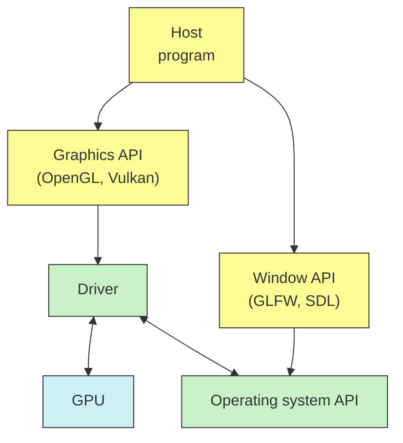
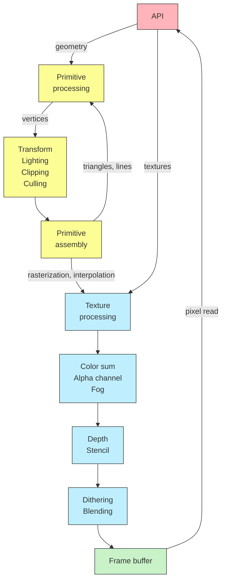
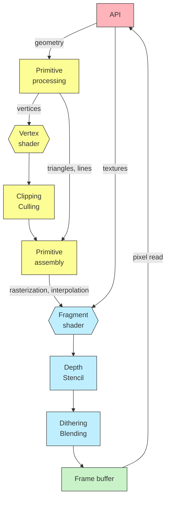

<h1 align="center">3D ГРАФИКА</h1>

---
<p align="center">Программирование GPU, основы Vulkan API и подход к трёхмерной графике как к объектно-ориентированной системе.</p>
## GPU и OpenGL
#### GPU как вычислительная система
• Видеокарта решает задачу **рендеринга**, т.е. двумерного представления трёхмерной сцены.
• Эта задача сложна и специфична. Графические процессоры всегда отличались от CPU и с ними традиционно работают через разные API.

#### Давайте отрендерим квадрат
• OpenGL для рендеринга.
```cpp
glClear(GL_COLOR_BUFFER_BIT);
glBegin(GL_QUADS);
glColor3f(1.0, 1.0, 1.0);
for(auto Coord : Vertices)
	glVertex3fv(Coord);
glEnd();
```
• GLFW для окон и управления.
```cpp
glfwSwapBuffers(Wnd.get());
glfwPollEvents();
```
![[../../../_Meta/attachments/10.1.png]]
Пример с гита:
```cpp
//-------------------------------------------------------------------------------
//
// Source code for MIPT ILab
// Slides: https://sourceforge.net/projects/cpp-lects-rus/files/cpp-graduate/
// Licensed after GNU GPL v3
//
//-------------------------------------------------------------------------------
//
// Simplest example: blank square on the screen
// This example also show how to use GLFW library which is rather standard
// Note really short time to first triangle (quad in this case)
//
// cl /EHsc ogl-simplest.cc /link glfw3dll.lib opengl32.lib
//
//-------------------------------------------------------------------------------

#include <cassert>
#include <iostream>
#include <memory>
#include <stdexcept>

#include <GLFW/glfw3.h>

// initial window sizes
constexpr int SZX = 600;
constexpr int SZY = 600;

// custom error handler class
struct glfw_error : public std::runtime_error {
	glfw_error(const char* s) : std::runtime_error(s) {}
};

// throw on errors
void error_callback(int, const char* err_str) { throw glfw_error(err_str); }

// make sure the viewport matches the new window dimensions
void framebuffer_size_callback(GLFWwindow* window, int width, int height) {
	glViewport(0, 0, width, height);
}

// initialization routine
GLFWwindow* initialize_window() {
	GLFWwindow* Window;
	glfwSetErrorCallback(error_callback);
	glfwInit();
	Window = glfwCreateWindow(SZX, SZY, "Hello World", NULL, NULL);
	assert(Window); // error callback shall throw otherwise
	glfwMakeContextCurrent(Window);
	glfwSetFrameBufferSizeCallback(Window, framebuffer_size_callback);
	return Window;
}

// vertices to render
GLfloat Vertices[4][3] = {
	{-0.5f, 0.5f, 0.0f}, // top left
	{0.5f, 0.5f, 0.0f}, // top right
	{0.5f, -0.5f, 0.0f}, // bottom right
	{-0.5f, -0.5f, 0.0f}, // bottom left
};

// render routine
void do_render() {
	glClearColor(0.2f, 0.3f, 0.3f, 1.0f);
	glClear(GL_COLOR_BUFFER_BIT);
	glBegin(GL_QUADS);
	glColor3f(1.0, 1.0, 1.0);
	for(auto Coord : Vertices)
		glVertex3fv(Coord);
	glEnd();
}

// entry point
int main() try {
	auto Cleanup = [](GLFWwindow*) { glfwTerminate(); };
	using UWnd = std::unique_ptr<GLFWwindow, decltype(Cleanup)>;
	UWnd Wnd(initialize_window(), Cleanup);
	
	while(!glfwWindowShouldClose(Wnd.get())) {
		do_render();
		glfwSwapBuffers(Wnd.get());
		glfwPollEvents();
	}
} catch(glfw_error& E) {
	std::cout << "GLFW error: " << E.what() << std::endl;
} catch(std::exception& E) {
	std::cout << "Standard error: " << E.what() << std::endl;
} catch(...) {
	std::cout << "Unknown error\n";
}
```
#### Фиксированный конвейер
• Фиксированные блоки.
• Управляют отдельными функциями
```cpp
glEnable(GL_DEPTH_TEST);
glDepthFunc(GL_LESS);
glEnable(GL_CULL_FACE);
glClear(GL_COLOR_BUFFER_BIT);
```
• Это тонна API функций и enums.

#### Общение с рантаймом
• Каждый раз, когда вы дёргаете API функцию, вы дёргаете рантайм, который должен в какой-то момент послать информацию драйверу.
```cpp
for(auto Coord : Vertices)
	glVertex3fv(Coord); // это вызов OpenGL runtime
```
• Проблема в том, что каждый такой API вызов предполагает накладные расходы, на которые вы идёте каждый фрейм. И которые сложно кешировать.
• Нам наоборот хочется максимум отдать в память GPU и минимально с ней взаимодействовать.
• Во многом это компенсируется тем, что в OpenGL возможны **расширения**.
#### Расширения OpenGL: буферы вершин
• Отрендерим тот же квадрат по другому: подготовим буферы вершин.
```cpp
glGenVertexArrays(1, &VAO);
glGenBuffers(1, &VBO);
glBindVertexArray(VAO);
glBindBuffer(GL_ARRAY_BUFFER, VBO);
glBufferData(GL_ARRAY_BUFFER, sizeof(Vertices)), Vertices, GL_STATIC_DRAW);
```
• В цикле рендеринга теперь всё стало куда приятней.
```cpp
glClear(GL_COLOR_BUFFER_BIT);
glBindVertexArray(VAO);
glDrawArrays(GL_QUADS, 0, 4);
```
Пример с гита:
```cpp
//-------------------------------------------------------------------------------
//
// Source code for MIPT ILab
// Slides: https://sourceforge.net/projects/cpp-lects-rus/files/cpp-graduate/
// Licensed after GNU GPL v3
//
//-------------------------------------------------------------------------------
//
// Extensions simplest example: blank square on the screen
// This example extends ogl_simplest
// glad required for using extensions like GL_ARRAY_BUFFER of GL_STATIC_DRAW
//
// cl /EHsc ogl-extensions.cc /link glad.lib glfw3dll.lib opengl32.lib
//
//-------------------------------------------------------------------------------

#include <cassert>
#include <iostream>
#include <memory>
#include <stdexcept>

// clang-format off
// this headers shall be in this position
#include <glad/glad.h>
// clang format on

#include <GLFW/glfw3.h>

// initial window sizes
constexpr int SZX = 600;
constexpr int SZY = 600;

// custom error handler class
struct glfw_error : public std::runtime_error {
	glfw_error(const char* s) : std::runtime_error(s) {}
};

// throw on errors
void error_callback(int, const char* err_str) { throw glfw_error(err_str); }

// make sure the viewport matches the new window dimensions
void framebuffer_size_callback(GLFWwindow* window, int width, int height) {
	glViewport(0, 0, width, height);
}

// initialization routine
GLFWwindow* initialize_window() {
	GLFWwindow* Window;
	glfwSetErrorCallback(error_callback);
	glfwInit();
	Window = glfwCreateWindow(SZX, SZY, "Hello World", NULL, NULL);
	assert(Window); // error callback shall throw otherwise
	glfwMakeContextCurrent(Window);
	glfwSetFrameBufferSizeCallback(Window, framebuffer_size_callback);
	if(!gladLoadGLLoader(reinterpret_cast<GLADLoadproc>(glfwGetProcAddress)))
		throw glfw_error("Failed to initialize GLAD");
	return Window;
}

// vertices to render
GLfloat Vertices[] = {
	// positions        // colors (not used in this example)
	-0.5f, 0.5f,  0.0f, 0.0f, 0.0f, 0.0f, // top left
	0.5f,  0.5f,  0.0f, 0.0f, 0.0f, 0.0f, // top right
	0.5f,  -0.5f, 0.0f, 0.0f, 0.0f, 0.0f, // bottom right
	-0.5f, -0.5f, 0.0f, 0.0f, 0.0f, 0.0f, // bottom left
};

// render routine
void do_render() {
	glClearColor(0.2f, 0.3f, 0.3f, 1.0f);
	glClear(GL_COLOR_BUFFER_BIT);
	glBindVertexArray(VAO);
	glDrawArrays(GL_QUADS, 0, 4);
}

// entry point
int main() try {
	auto Cleanup = [](GLFWwindow*) { glfwTerminate(); };
	using UWnd = std::unique_ptr<GLFWwindow, decltype(Cleanup)>;
	UWnd Wnd(initialize_window(), Cleanup);
	
	GLuint VBO, VAO;
	glGenVertexArrays(1, &VAO);
	glGenBuffers(1, &VBO);
	
	glBindVertexArray(VAO);
	
	glBindBuffer(GL_ARRAY_BUFFER, VBO);
	glBufferData(GL_ARRAY_BUFFER, sizeof(Vertices), Vertices, GL_STATIC_DRAW);
	
	// position attribute
	glVertexAttribPointer(0, 3, GL_FLOAT, GL_FALSE, 6 * sizeof(GLfloat), nullptr);
	glEnableVertexAttribArray(0);
	// color attribute
	// ...
} catch(glfw_error& E) {
	std::cout << "GLFW error: " << E.what() << std::endl;
} catch(std::exception& E) {
	std::cout << "Standard error: " << E.what() << std::endl;
} catch(...) {
	std::cout << "Unknown error\n";
}
```
#### Расширения и версии
• Буфера вершин были введены расширением ARB_vertex_array_object в OpenGL 2.1 и закреплены в стандарте OpenGL 3.0.
• Расширения предлагаются участниками консорциума и их реально десятки.
https://www.khronos.org/registry/OpenGL/extensions
• Существуют автоматизированные системы такие как glad, запрашивающие вам расширения и генерирующие хедер с доступными функциями.
• Для более тонкого контроля есть библиотека GLEW (The OpenGL Extension Wrangler Library), позволяющая проверять доступность расширений и многое другое.
#### Нефиксированный конвейер
• Первой идеей, появившейся достаточно рано была идея шейдера, т.е. небольшой программы для видеокарты, которая позволяет гибко управлять светом и тенью на каждой вершине.
• Так в 2001 году в OpenGL 2.0 появился язык GLSL.
• В программировании GPU есть своя специфика.

#### Вершинные шейдеры
• В примере с каждой вершиной связан цвет.
```cpp
// positions      // colors
0.5f, 0.5f, 0.0f, 0.0f, 1.0f, 0.0f,
```
• Этот цвет как атрибут вершины передаётся в вершинный шейдер
```glsl
layout (location = 0) in vec3 aPos;
layout (location = 1) in vec3 aColor;

out vec3 vColor;

...

vColor = aColor; // выход во фрагменты
```
![[../../../_Meta/attachments/10.2.png]]
Пример с гита для вершинного шейдера:
```glsl
//-------------------------------------------------------------------------------
//
// Source code for MIPT ILab
// Slides: https://sourceforge.net/projects/cpp-lects-rus/files/cpp-graduate/
// Licensed after GNU GPL v3
//
//-------------------------------------------------------------------------------
//
// Simple vertex shader: output varying color passed to fragment
//
//-------------------------------------------------------------------------------

#version 460

layout (location = 0) in vec3 aPos;
layout (location = 1) in vec3 aColor;

out vec3 vColor;

void main() {
	gl_Position = vec4(aPos, 1.0);
	vColor = aColor;
}
```
Пример с гита для фрагментного шейдера:
```glsl
//-------------------------------------------------------------------------------
//
// Source code for MIPT ILab
// Slides: https://sourceforge.net/projects/cpp-lects-rus/files/cpp-graduate/
// Licensed after GNU GPL v3
//
//-------------------------------------------------------------------------------
//
// Simple fragment shader: varying color passed from vertex, interpolated
//
//-------------------------------------------------------------------------------

#version 460

// from vertex shader
in vec3 vColor;

// time in seconds with fractional part
uniform float time;

void main() {
	gl_FragColor = vec4(vColor, 1.0);
}
```
Сама программа с шейдерами:
```cpp
//-------------------------------------------------------------------------------
//
// Source code for MIPT ILab
// Slides: https://sourceforge.net/projects/cpp-lects-rus/files/cpp-graduate/
// Licensed after GNU GPL v3
//
//-------------------------------------------------------------------------------
//
// Extensions simplest example: blank square on the screen
// This example extends ogl_extensions
// Show how vertex attributes starts playing in coloring
// Show simplest fragment shader and uniform variable
//
// cl /EHsc ogl-frag-shader.cc /link glad.lib glfw3dll.lib opengl32.lib
//
//-------------------------------------------------------------------------------

#include <cassert>
#include <fstream>
#include <iostream>
#include <memory>
#include <sstream>
#include <stdexcept>
#include <vector>

// clang-format off
// this headers shall be in this position
#include <glad/glad.h>
// clang format on

#include <GLFW/glfw3.h>

// initial window sizes
constexpr int SZX = 600;
constexpr int SZY = 600;

constexpr const char* VERTNAME = "shaders/simplest.vert";
#ifdef SINCOLOR
constexpr const char* FRAGNAME = "shaders/sincolor.frag";
#else
constexpr const char* FRAGNAME = "shaders/simplest.frag";
#endif

// custom error handler class: GLFW
struct glfw_error : public std::runtime_error {
	glfw_error(const char* s) : std::runtime_error(s) {}
};

// custom error handler class: GLSL
struct glsl_error : public std::runtime_error {
	std::string ShaderLog;
	glsl_error(const char* s) : std::runtime_error(s) {}
};

// custom error handler class: GLSL compilation
struct glsl_compile_error : public glsl_error {
	glsl_compile_error(const char* s, GLuint ShaderID) : glsl_error(s) {
		GLint Length;
		glGetShaderiv(ShaderID, GL_INFO_LOG_LENGTH, &Length);
		std::vector<char> ShaderLogV(Length);
		glGetShaderInfoLog(ShaderID, Length, NULL, ShaderLogV.data());
		ShaderLog.assign(ShaderLogV.begin(), ShaderLogV.end());
	}
};

// custom error handler class: GLSL link
struct glsl_link_error : public glsl_error {
	glsl_link_error(const char* s, GLuint ProgID) : glsl_error(s) {
		GLint Length;
		glGetProgramiv(ProgID, GL_INFO_LOG_LENGTH, &Length);
		std::vector<char> ShaderLogV(Length);
		glGetShaderInfoLog(ProgID, Length, NULL, ShaderLogV.data());
		ShaderLog.assign(ShaderLogV.begin(), ShaderLogV.end());
	}
};

// throw on errors
void error_callback(int, const char* err_str) { throw glfw_error(err_str); }

// make sure the viewport matches the new window dimensions
void framebuffer_size_callback(GLFWwindow* window, int width, int height) {
	glViewport(0, 0, width, height);
}

// initialization routine
GLFWwindow* initialize_window() {
	GLFWwindow* Window;
	glfwSetErrorCallback(error_callback);
	glfwInit();
	Window = glfwCreateWindow(SZX, SZY, "Hello World", NULL, NULL);
	assert(Window); // error callback shall throw otherwise
	glfwMakeContextCurrent(Window);
	glfwSetFrameBufferSizeCallback(Window, framebuffer_size_callback);
	if(!gladLoadGLLoader(reinterpret_cast<GLADLoadproc>(glfwGetProcAddress)))
		throw glfw_error("Failed to initialize GLAD");
	return Window;
}

// vertices to render
GLfloat Vertices[] = {
	// positions        // colors
	0.5f, 0.5f,   0.0f, 0.0f, 1.0f, 0.0f, // top right
	-0.5f,  0.5f, 0.0f, 0.0f, 0.0f, 0.0f, // top left
	0.5f,  -0.5f, 0.0f, 1.0f, 0.0f, 0.0f, // bottom right
	-0.5f, -0.5f, 0.0f, 1.0f, 1.0f, 0.0f, // bottom left
};

// read program code from file
std::string readFile(const char* Path) {
	std::string Code;
	std::ifstream ShaderFile;
	ShaderFile.exceptions(std::ifstream::failbit | std::ifstream::badbit);
	ShaderFile.open(Path);
	std::stringstream ShaderStream;
	ShaderStream << ShaderFile.rdbuf();
	ShaderFile.close();
	Code = ShaderStream.str();
	return Code;
}

// compile shader, check errors, return ID
GLuint installShader(std::string ShaderCode, GLenum ShaderType) {
	GLuint ShaderID = glCreateShader(ShaderType);
	const char* Str = ShaderCode.c_str();
	glShaderSource(ShaderID, 1, &Str, NULL);
	glCompileShader(ShaderID);
	
	GLint Success;
	glGetShaderiv(ShaderID, GL_COMPILE_STATUS, &Success);
	if(!Success)
		throw glsl_compile_error("Failed to compile shader", ShaderID);
	
	return ShaderID;
}

// compile vertex and fragment shaders then link program
GLuint linkShaders() {
	GLuint ProgID = glCreateProgram();
	GLuint VertexID = installShader(readFile(VERTNAME), GL_VERTEX_SHADER);
	GLuint FragmentID = installShader(readFile(FRAGNAME), GL_FRAGMENT_SHADER);
	glAttachShader(ProgID, VertexID);
	glAttachShader(ProgID, FragmentID);
	glLinkProgram(ProdID);
	GLint Success;
	glGetShaderiv(ProgID, GL_LINK_STATUS, &Success);
	if(!Success)
		throw glsl_link_error("Fi)
}
```
#### Binding points: glBindBuffer
• C++:

GLfloat Vertices[] {
	<span style="color: brown;">0.5f,  0.5f, 0.0f,</span> <span style="color: blue;">0.0f, 1.0f, 0.0f,</span>
	<span style="color: brown;">-0.5f, 0.5f, 0.0f,</span> <span style="color: blue;">0.0f, 0.0f, 0.0f,</span>
}

glBinfBuffer(GL_ARRAY_BUFFER, VBO);

glVertexAttribPointer(<span style="color: brown;">0</span>, 3, GL_FLOAT, GL_FALSE, 6 \* sizeof(GLfloat), <span style="color: brown;">0 * sizeof(GLfloat)</span>);
glVertexAttribPointer(<span style="color: brown;">1</span>, 3, GL_FLOAT, GL_FALSE, 6 \* sizeof(GLfloat), <span style="color: blue;">3 * sizeof(GLfloat)</span>);

• GLSL:

<span style="color: brown;">layout (location = 0)</span>
<span style="color: brown;">in vec3 aPos;</span>

<span style="color: blue;">layout (location = 1)</span>
<span style="color: blue;">in vec3 aColor;</span>

out vec3 vColor;

void main() {
	gl_Position = vec4(<span style="color: brown;">aPos</span>, 1.0);
	vColor = <span style="color: blue;">aColor</span>;
}
#### Что такое "фрагмент"?
• Фрагмент - это выход растеризатора.
• Также можно сказать, что фрагмент - это потенциальный пиксель.
• Когда каждый элемент геометрии растеризуется, мы получаем фрагменты на экране двумерной позицией и цветом.
• Фрагментный шейдер - это программа, индивидуально работающая для каждого фрагмента и трансформирующая его.
![[../../../_Meta/attachments/10.3.png]]
#### Фрагментные шейдеры
• Вершинный шейдер сообщает цвет в out-переменную.
```glsl
vColor = aColor; // выход во фрагменты
```
• Далее выходной цвет каждой вершины растеризуется и интерполируется.
• Фрагментный шейдер добавляет синусоиду в синий канал каждого фрагмента:
```glsl
gl_FragColor = vec4(vColor.xy, VColor.z + abs(sin(time)), 1.0);
```
![[../../../_Meta/attachments/10.4.gif]]
Фрагментный шейдер для этого примера:
```glsl
//-------------------------------------------------------------------------------
//
// Source code for MIPT ILab
// Slides: https://sourceforge.net/projects/cpp-lects-rus/files/cpp-graduate/
// Licensed after GNU GPL v3
//
//-------------------------------------------------------------------------------
//
// Simple fragment shader: blue channel changing in time
//
//-------------------------------------------------------------------------------

#version 460

// from vertex shader
in vec3 vColor;

// time in seconds with fractional part
uniform float time;

void main() {
	gl_FragColor = vec4(vColor.x, vColor.y, vColor.z + abs(sin(time)), 1.0);
}
```
#### Uniform и varying переменные
• Шейдер работает сверхпараллельно и независимо: для каждого объекта.
• Переменная, варьирующаяся от объекта называется varying. Общая на всех называется uniform (например, время).
in vec3 <span style="color: brown;">vColor</span>; <span style="color: gray;">// varying (приходит от растеризатора)</span>

uniform float <span style="color: blue;">time</span>; <span style="color: gray;">// uniform</span>

void main() {
	<span style="color: gray;">for(f : all fragments)</span>
		gl_FragColor<span style="color: gray;">[f]</span> = vec4(<span style="color: brown;">vColor</span><span style="color: gray;">[f]</span>.xy, <span style="color: brown;">vColor</span><span style="color: gray;">[f]</span>.z + abs(sin(<span style="color: blue;">time</span>)), 1.0);
}