<h1 align="center">3D ГРАФИКА</h1>

---
<p align="center">Программирование GPU, основы Vulkan API и подход к трёхмерной графике как к объектно-ориентированной системе.</p>
## GPU и OpenGL
#### GPU как вычислительная система
• Видеокарта решает задачу **рендеринга**, т.е. двумерного представления трёхмерной сцены.
• Эта задача сложна и специфична. Графические процессоры всегда отличались от CPU и с ними традиционно работают через разные API.
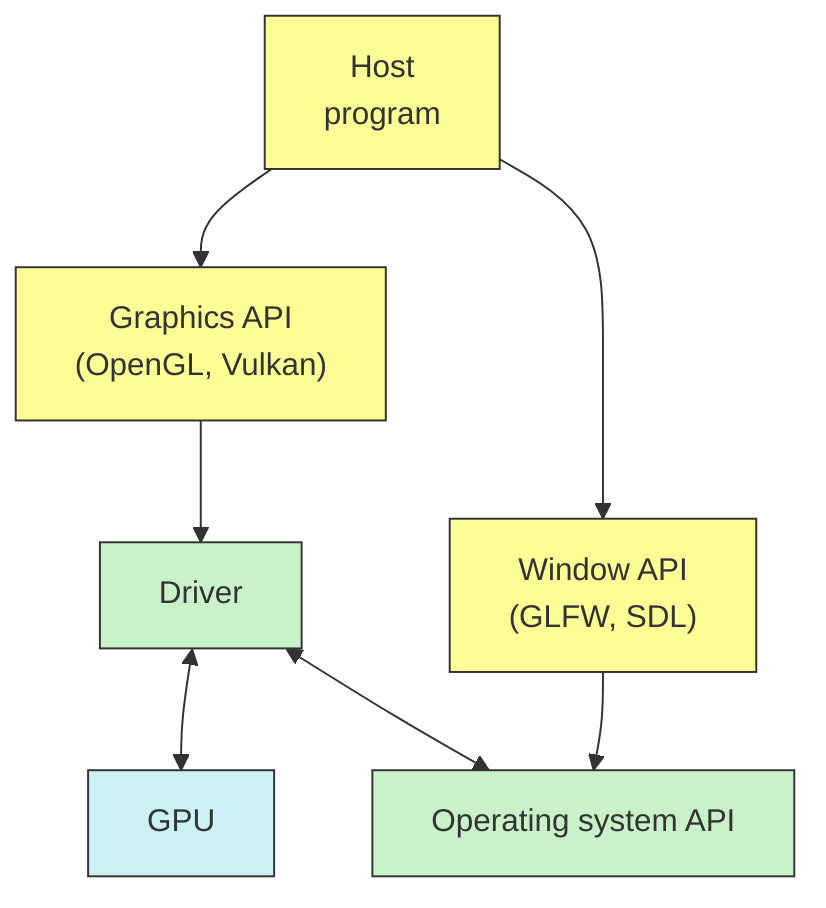
#### Давайте отрендерим квадрат
• OpenGL для рендеринга.
```cpp
glClear(GL_COLOR_BUFFER_BIT);
glBegin(GL_QUADS);
glColor3f(1.0, 1.0, 1.0);
for(auto Coord : Vertices)
	glVertex3fv(Coord);
glEnd();
```
• GLFW для окон и управления.
```cpp
glfwSwapBuffers(Wnd.get());
glfwPollEvents();
```
![[../../../_Meta/attachments/10.1.png]]
Пример с гита:
```cpp
//-------------------------------------------------------------------------------
//
// Source code for MIPT ILab
// Slides: https://sourceforge.net/projects/cpp-lects-rus/files/cpp-graduate/
// Licensed after GNU GPL v3
//
//-------------------------------------------------------------------------------
//
// Simplest example: blank square on the screen
// This example also show how to use GLFW library which is rather standard
// Note really short time to first triangle (quad in this case)
//
// cl /EHsc ogl-simplest.cc /link glfw3dll.lib opengl32.lib
//
//-------------------------------------------------------------------------------

#include <cassert>
#include <iostream>
#include <memory>
#include <stdexcept>

#include <GLFW/glfw3.h>

// initial window sizes
constexpr int SZX = 600;
constexpr int SZY = 600;

// custom error handler class
struct glfw_error : public std::runtime_error {
	glfw_error(const char* s) : std::runtime_error(s) {}
};

// throw on errors
void error_callback(int, const char* err_str) { throw glfw_error(err_str); }

// make sure the viewport matches the new window dimensions
void framebuffer_size_callback(GLFWwindow* window, int width, int height) {
	glViewport(0, 0, width, height);
}

// initialization routine
GLFWwindow* initialize_window() {
	GLFWwindow* Window;
	glfwSetErrorCallback(error_callback);
	glfwInit();
	Window = glfwCreateWindow(SZX, SZY, "Hello World", NULL, NULL);
	assert(Window); // error callback shall throw otherwise
	glfwMakeContextCurrent(Window);
	glfwSetFrameBufferSizeCallback(Window, framebuffer_size_callback);
	return Window;
}

// vertices to render
GLfloat Vertices[4][3] = {
	{-0.5f, 0.5f, 0.0f}, // top left
	{0.5f, 0.5f, 0.0f}, // top right
	{0.5f, -0.5f, 0.0f}, // bottom right
	{-0.5f, -0.5f, 0.0f}, // bottom left
};

// render routine
void do_render() {
	glClearColor(0.2f, 0.3f, 0.3f, 1.0f);
	glClear(GL_COLOR_BUFFER_BIT);
	glBegin(GL_QUADS);
	glColor3f(1.0, 1.0, 1.0);
	for(auto Coord : Vertices)
		glVertex3fv(Coord);
	glEnd();
}

// entry point
int main() try {
	auto Cleanup = [](GLFWwindow*) { glfwTerminate(); };
	using UWnd = std::unique_ptr<GLFWwindow, decltype(Cleanup)>;
	UWnd Wnd(initialize_window(), Cleanup);
	
	while(!glfwWindowShouldClose(Wnd.get())) {
		do_render();
		glfwSwapBuffers(Wnd.get());
		glfwPollEvents();
	}
} catch(glfw_error& E) {
	std::cout << "GLFW error: " << E.what() << std::endl;
} catch(std::exception& E) {
	std::cout << "Standard error: " << E.what() << std::endl;
} catch(...) {
	std::cout << "Unknown error\n";
}
```
#### Фиксированный конвейер
• Фиксированные блоки.
• Управляют отдельными функциями
```cpp
glEnable(GL_DEPTH_TEST);
glDepthFunc(GL_LESS);
glEnable(GL_CULL_FACE);
glClear(GL_COLOR_BUFFER_BIT);
```
• Это тонна API функций и enums.
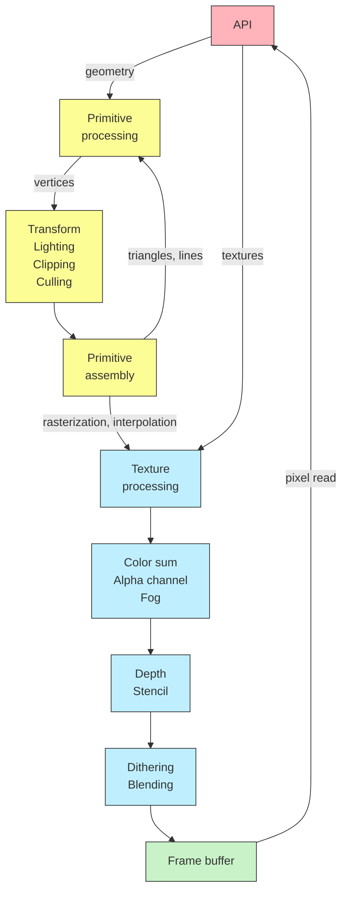
#### Общение с рантаймом
• Каждый раз, когда вы дёргаете API функцию, вы дёргаете рантайм, который должен в какой-то момент послать информацию драйверу.
```cpp
for(auto Coord : Vertices)
	glVertex3fv(Coord); // это вызов OpenGL runtime
```
• Проблема в том, что каждый такой API вызов предполагает накладные расходы, на которые вы идёте каждый фрейм. И которые сложно кешировать.
• Нам наоборот хочется максимум отдать в память GPU и минимально с ней взаимодействовать.
• Во многом это компенсируется тем, что в OpenGL возможны **расширения**.
#### Расширения OpenGL: буферы вершин
• Отрендерим тот же квадрат по другому: подготовим буферы вершин.
```cpp
glGenVertexArrays(1, &VAO);
glGenBuffers(1, &VBO);
glBindVertexArray(VAO);
glBindBuffer(GL_ARRAY_BUFFER, VBO);
glBufferData(GL_ARRAY_BUFFER, sizeof(Vertices)), Vertices, GL_STATIC_DRAW);
```
• В цикле рендеринга теперь всё стало куда приятней.
```cpp
glClear(GL_COLOR_BUFFER_BIT);
glBindVertexArray(VAO);
glDrawArrays(GL_QUADS, 0, 4);
```
Пример с гита:
```cpp
//-------------------------------------------------------------------------------
//
// Source code for MIPT ILab
// Slides: https://sourceforge.net/projects/cpp-lects-rus/files/cpp-graduate/
// Licensed after GNU GPL v3
//
//-------------------------------------------------------------------------------
//
// Extensions simplest example: blank square on the screen
// This example extends ogl_simplest
// glad required for using extensions like GL_ARRAY_BUFFER of GL_STATIC_DRAW
//
// cl /EHsc ogl-extensions.cc /link glad.lib glfw3dll.lib opengl32.lib
//
//-------------------------------------------------------------------------------

#include <cassert>
#include <iostream>
#include <memory>
#include <stdexcept>

// clang-format off
// this headers shall be in this position
#include <glad/glad.h>
// clang format on

#include <GLFW/glfw3.h>

// initial window sizes
constexpr int SZX = 600;
constexpr int SZY = 600;

// custom error handler class
struct glfw_error : public std::runtime_error {
	glfw_error(const char* s) : std::runtime_error(s) {}
};

// throw on errors
void error_callback(int, const char* err_str) { throw glfw_error(err_str); }

// make sure the viewport matches the new window dimensions
void framebuffer_size_callback(GLFWwindow* window, int width, int height) {
	glViewport(0, 0, width, height);
}

// initialization routine
GLFWwindow* initialize_window() {
	GLFWwindow* Window;
	glfwSetErrorCallback(error_callback);
	glfwInit();
	Window = glfwCreateWindow(SZX, SZY, "Hello World", NULL, NULL);
	assert(Window); // error callback shall throw otherwise
	glfwMakeContextCurrent(Window);
	glfwSetFrameBufferSizeCallback(Window, framebuffer_size_callback);
	if(!gladLoadGLLoader(reinterpret_cast<GLADLoadproc>(glfwGetProcAddress)))
		throw glfw_error("Failed to initialize GLAD");
	return Window;
}

// vertices to render
GLfloat Vertices[] = {
	// positions        // colors (not used in this example)
	-0.5f, 0.5f,  0.0f, 0.0f, 0.0f, 0.0f, // top left
	0.5f,  0.5f,  0.0f, 0.0f, 0.0f, 0.0f, // top right
	0.5f,  -0.5f, 0.0f, 0.0f, 0.0f, 0.0f, // bottom right
	-0.5f, -0.5f, 0.0f, 0.0f, 0.0f, 0.0f, // bottom left
};

// render routine
void do_render() {
	glClearColor(0.2f, 0.3f, 0.3f, 1.0f);
	glClear(GL_COLOR_BUFFER_BIT);
	glBindVertexArray(VAO);
	glDrawArrays(GL_QUADS, 0, 4);
}

// entry point
int main() try {
	auto Cleanup = [](GLFWwindow*) { glfwTerminate(); };
	using UWnd = std::unique_ptr<GLFWwindow, decltype(Cleanup)>;
	UWnd Wnd(initialize_window(), Cleanup);
	
	GLuint VBO, VAO;
	glGenVertexArrays(1, &VAO);
	glGenBuffers(1, &VBO);
	
	glBindVertexArray(VAO);
	
	glBindBuffer(GL_ARRAY_BUFFER, VBO);
	glBufferData(GL_ARRAY_BUFFER, sizeof(Vertices), Vertices, GL_STATIC_DRAW);
	
	// position attribute
	glVertexAttribPointer(0, 3, GL_FLOAT, GL_FALSE, 6 * sizeof(GLfloat), nullptr);
	glEnableVertexAttribArray(0);
	// color attribute
	// ...
} catch(glfw_error& E) {
	std::cout << "GLFW error: " << E.what() << std::endl;
} catch(std::exception& E) {
	std::cout << "Standard error: " << E.what() << std::endl;
} catch(...) {
	std::cout << "Unknown error\n";
}
```
#### Расширения и версии
• Буфера вершин были введены расширением ARB_vertex_array_object в OpenGL 2.1 и закреплены в стандарте OpenGL 3.0.
• Расширения предлагаются участниками консорциума и их реально десятки.
https://www.khronos.org/registry/OpenGL/extensions
• Существуют автоматизированные системы такие как glad, запрашивающие вам расширения и генерирующие хедер с доступными функциями.
• Для более тонкого контроля есть библиотека GLEW (The OpenGL Extension Wrangler Library), позволяющая проверять доступность расширений и многое другое.
#### Нефиксированный конвейер
• Первой идеей, появившейся достаточно рано была идея шейдера, т.е. небольшой программы для видеокарты, которая позволяет гибко управлять светом и тенью на каждой вершине.
• Так в 2001 году в OpenGL 2.0 появился язык GLSL.
• В программировании GPU есть своя специфика.
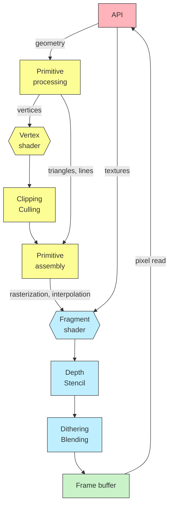
#### Вершинные шейдеры
• В примере с каждой вершиной связан цвет.
```cpp
// positions      // colors
0.5f, 0.5f, 0.0f, 0.0f, 1.0f, 0.0f,
```
• Этот цвет как атрибут вершины передаётся в вершинный шейдер
```glsl
layout (location = 0) in vec3 aPos;
layout (location = 1) in vec3 aColor;

out vec3 vColor;

...

vColor = aColor; // выход во фрагменты
```
![[../../../_Meta/attachments/10.2.png]]
Пример с гита для вершинного шейдера:
```glsl
//-------------------------------------------------------------------------------
//
// Source code for MIPT ILab
// Slides: https://sourceforge.net/projects/cpp-lects-rus/files/cpp-graduate/
// Licensed after GNU GPL v3
//
//-------------------------------------------------------------------------------
//
// Simple vertex shader: output varying color passed to fragment
//
//-------------------------------------------------------------------------------

#version 460

layout (location = 0) in vec3 aPos;
layout (location = 1) in vec3 aColor;

out vec3 vColor;

void main() {
	gl_Position = vec4(aPos, 1.0);
	vColor = aColor;
}
```
Пример с гита для фрагментного шейдера:
```glsl
//-------------------------------------------------------------------------------
//
// Source code for MIPT ILab
// Slides: https://sourceforge.net/projects/cpp-lects-rus/files/cpp-graduate/
// Licensed after GNU GPL v3
//
//-------------------------------------------------------------------------------
//
// Simple fragment shader: varying color passed from vertex, interpolated
//
//-------------------------------------------------------------------------------

#version 460

// from vertex shader
in vec3 vColor;

// time in seconds with fractional part
uniform float time;

void main() {
	gl_FragColor = vec4(vColor, 1.0);
}
```
Сама программа с шейдерами:
```cpp
//-------------------------------------------------------------------------------
//
// Source code for MIPT ILab
// Slides: https://sourceforge.net/projects/cpp-lects-rus/files/cpp-graduate/
// Licensed after GNU GPL v3
//
//-------------------------------------------------------------------------------
//
// Extensions simplest example: blank square on the screen
// This example extends ogl_extensions
// Show how vertex attributes starts playing in coloring
// Show simplest fragment shader and uniform variable
//
// cl /EHsc ogl-frag-shader.cc /link glad.lib glfw3dll.lib opengl32.lib
//
//-------------------------------------------------------------------------------

#include <cassert>
#include <fstream>
#include <iostream>
#include <memory>
#include <sstream>
#include <stdexcept>
#include <vector>

// clang-format off
// this headers shall be in this position
#include <glad/glad.h>
// clang format on

#include <GLFW/glfw3.h>

// initial window sizes
constexpr int SZX = 600;
constexpr int SZY = 600;

constexpr const char* VERTNAME = "shaders/simplest.vert";
#ifdef SINCOLOR
constexpr const char* FRAGNAME = "shaders/sincolor.frag";
#else
constexpr const char* FRAGNAME = "shaders/simplest.frag";
#endif

// custom error handler class: GLFW
struct glfw_error : public std::runtime_error {
	glfw_error(const char* s) : std::runtime_error(s) {}
};

// custom error handler class: GLSL
struct glsl_error : public std::runtime_error {
	std::string ShaderLog;
	glsl_error(const char* s) : std::runtime_error(s) {}
};

// custom error handler class: GLSL compilation
struct glsl_compile_error : public glsl_error {
	glsl_compile_error(const char* s, GLuint ShaderID) : glsl_error(s) {
		GLint Length;
		glGetShaderiv(ShaderID, GL_INFO_LOG_LENGTH, &Length);
		std::vector<char> ShaderLogV(Length);
		glGetShaderInfoLog(ShaderID, Length, NULL, ShaderLogV.data());
		ShaderLog.assign(ShaderLogV.begin(), ShaderLogV.end());
	}
};

// custom error handler class: GLSL link
struct glsl_link_error : public glsl_error {
	glsl_link_error(const char* s, GLuint ProgID) : glsl_error(s) {
		GLint Length;
		glGetProgramiv(ProgID, GL_INFO_LOG_LENGTH, &Length);
		std::vector<char> ShaderLogV(Length);
		glGetShaderInfoLog(ProgID, Length, NULL, ShaderLogV.data());
		ShaderLog.assign(ShaderLogV.begin(), ShaderLogV.end());
	}
};

// throw on errors
void error_callback(int, const char* err_str) { throw glfw_error(err_str); }

// make sure the viewport matches the new window dimensions
void framebuffer_size_callback(GLFWwindow* window, int width, int height) {
	glViewport(0, 0, width, height);
}

// initialization routine
GLFWwindow* initialize_window() {
	GLFWwindow* Window;
	glfwSetErrorCallback(error_callback);
	glfwInit();
	Window = glfwCreateWindow(SZX, SZY, "Hello World", NULL, NULL);
	assert(Window); // error callback shall throw otherwise
	glfwMakeContextCurrent(Window);
	glfwSetFrameBufferSizeCallback(Window, framebuffer_size_callback);
	if(!gladLoadGLLoader(reinterpret_cast<GLADLoadproc>(glfwGetProcAddress)))
		throw glfw_error("Failed to initialize GLAD");
	return Window;
}

// vertices to render
GLfloat Vertices[] = {
	// positions        // colors
	0.5f, 0.5f,   0.0f, 0.0f, 1.0f, 0.0f, // top right
	-0.5f,  0.5f, 0.0f, 0.0f, 0.0f, 0.0f, // top left
	0.5f,  -0.5f, 0.0f, 1.0f, 0.0f, 0.0f, // bottom right
	-0.5f, -0.5f, 0.0f, 1.0f, 1.0f, 0.0f, // bottom left
};

// read program code from file
std::string readFile(const char* Path) {
	std::string Code;
	std::ifstream ShaderFile;
	ShaderFile.exceptions(std::ifstream::failbit | std::ifstream::badbit);
	ShaderFile.open(Path);
	std::stringstream ShaderStream;
	ShaderStream << ShaderFile.rdbuf();
	ShaderFile.close();
	Code = ShaderStream.str();
	return Code;
}

// compile shader, check errors, return ID
GLuint installShader(std::string ShaderCode, GLenum ShaderType) {
	GLuint ShaderID = glCreateShader(ShaderType);
	const char* Str = ShaderCode.c_str();
	glShaderSource(ShaderID, 1, &Str, NULL);
	glCompileShader(ShaderID);
	
	GLint Success;
	glGetShaderiv(ShaderID, GL_COMPILE_STATUS, &Success);
	if(!Success)
		throw glsl_compile_error("Failed to compile shader", ShaderID);
	
	return ShaderID;
}

// compile vertex and fragment shaders then link program
GLuint linkShaders() {
	GLuint ProgID = glCreateProgram();
	GLuint VertexID = installShader(readFile(VERTNAME), GL_VERTEX_SHADER);
	GLuint FragmentID = installShader(readFile(FRAGNAME), GL_FRAGMENT_SHADER);
	glAttachShader(ProgID, VertexID);
	glAttachShader(ProgID, FragmentID);
	glLinkProgram(ProdID);
	GLint Success;
	glGetShaderiv(ProgID, GL_LINK_STATUS, &Success);
	if(!Success)
		throw glsl_link_error("Failed to link program", ProgID);
	return ProgID;
}

// set uniform value: 1 float
void setFloat(GLuint ProgID, const char* Name, float Val) {
	GLint Loc = glGetUniformLocation(ProgID, Name);
	glUniform1f(Loc, Val);
}

// render routine
void do_render(GLuint VAO, GLuint ProgID) {
	glClearColor(0.2f, 0.3f, 0.3f, 1.0f);
	glClear(GL_COLOR_BUFFER_BIT);
	glUseProgram(ProgID);
	setFloat(ProgID, "time", glfwGetTime());
	glBindVertexArray(VAO);
	glDrawArrays(GL_TRIANGLE_STRIP, 0, 4);
}

// entry point
int main() try {
	auto Cleanup = [](GLFWwindow*) { glfwTerminate(); };
	using UWnd = std::unique_ptr<GLFWwindow, decltype(Cleanup)>;
	UWnd Wnd(initialize_window(), Cleanup);
	
	GLuint VBO, VAO;
	glGenVertexArrays(1, &VAO);
	glBindVertexArray(VAO);
	
	glGenBuffers(1, &VBO);
	glBindBuffer(GL_ARRAY_BUFFER, VBO);
	glBufferData(GL_ARRAY_BUFFER, sizeof(Vertices), Vertices, GL_STATIC_DRAW);
	
	// position attribute
	glVertexAttribPointer(0, 3, GL_FLOAT, GL_FALSE, 6 * sizeof(GLfloat),
												reinterpret_cast<void*>(0 * sizeof(GLfloat)));
	glEnableVertexAttribArray(0);
	// color attribute
	glVertexAttribPointer(1, 3, GL_FLOAT, GL_FALSE, 6 * sizeof(GLfloat),
												reinterpret_cast<void*>(3 * sizeof(GLfloat)));
	glEnableVertexAttribArray(1);
	
	// create/install shaders
	GLuint ProgID = linkShaders();
	
	while(!glfwWindowShouldClose(Wnd.get())) {
		do_render(VAO, ProgID);
		glfwSwapBuffers(Wnd.get());
		glfwPollEvents();
	}
	
	// NOTE: non-exception safe here. Will be fixed in following example
	//       how will you fix it, BTW?
	glDeleteVertexArrays(1, &VAO);
	glDeleteBuffers(1, &VBO);
} catch(glsl_error& E) {
	std::cout << "GLSL error: " << E.what() << std::endl;
	std::cout << E.ShaderLog << std::endl;
} catch(glfw_error& E) {
	std::cout << "GLFW error: " << E.what() << std::endl;
} catch(std::exception& E) {
	std::cout << "Standard error: " << E.what() << std::endl;
} catch(...) {
	std::cout << "Unknown error" << std::endl;
}
```
#### Binding points: glBindBuffer
• C++:

GLfloat Vertices[] {
	<span style="color: brown;">0.5f,  0.5f, 0.0f,</span> <span style="color: blue;">0.0f, 1.0f, 0.0f,</span>
	<span style="color: brown;">-0.5f, 0.5f, 0.0f,</span> <span style="color: blue;">0.0f, 0.0f, 0.0f,</span>
}

glBinfBuffer(GL_ARRAY_BUFFER, VBO);

glVertexAttribPointer(<span style="color: brown;">0</span>, 3, GL_FLOAT, GL_FALSE, 6 \* sizeof(GLfloat), <span style="color: brown;">0 * sizeof(GLfloat)</span>);
glVertexAttribPointer(<span style="color: brown;">1</span>, 3, GL_FLOAT, GL_FALSE, 6 \* sizeof(GLfloat), <span style="color: blue;">3 * sizeof(GLfloat)</span>);

• GLSL:

<span style="color: brown;">layout (location = 0)</span>
<span style="color: brown;">in vec3 aPos;</span>

<span style="color: blue;">layout (location = 1)</span>
<span style="color: blue;">in vec3 aColor;</span>

out vec3 vColor;

void main() {
	gl_Position = vec4(<span style="color: brown;">aPos</span>, 1.0);
	vColor = <span style="color: blue;">aColor</span>;
}
#### Что такое "фрагмент"?
• Фрагмент - это выход растеризатора.
• Также можно сказать, что фрагмент - это потенциальный пиксель.
• Когда каждый элемент геометрии растеризуется, мы получаем фрагменты на экране двумерной позицией и цветом.
• Фрагментный шейдер - это программа, индивидуально работающая для каждого фрагмента и трансформирующая его.
![[../../../_Meta/attachments/10.3.png]]
#### Фрагментные шейдеры
• Вершинный шейдер сообщает цвет в out-переменную.
```glsl
vColor = aColor; // выход во фрагменты
```
• Далее выходной цвет каждой вершины растеризуется и интерполируется.
• Фрагментный шейдер добавляет синусоиду в синий канал каждого фрагмента:
```glsl
gl_FragColor = vec4(vColor.xy, VColor.z + abs(sin(time)), 1.0);
```
![[../../../_Meta/attachments/10.4.gif]]
Фрагментный шейдер для этого примера:
```glsl
//-------------------------------------------------------------------------------
//
// Source code for MIPT ILab
// Slides: https://sourceforge.net/projects/cpp-lects-rus/files/cpp-graduate/
// Licensed after GNU GPL v3
//
//-------------------------------------------------------------------------------
//
// Simple fragment shader: blue channel changing in time
//
//-------------------------------------------------------------------------------

#version 460

// from vertex shader
in vec3 vColor;

// time in seconds with fractional part
uniform float time;

void main() {
	gl_FragColor = vec4(vColor.x, vColor.y, vColor.z + abs(sin(time)), 1.0);
}
```
#### Uniform и varying переменные
• Шейдер работает сверхпараллельно и независимо: для каждого объекта.
• Переменная, варьирующаяся от объекта называется varying. Общая на всех называется uniform (например, время).
in vec3 <span style="color: brown;">vColor</span>; <span style="color: gray;">// varying (приходит от растеризатора)</span>

uniform float <span style="color: blue;">time</span>; <span style="color: gray;">// uniform</span>

void main() {
	<span style="color: gray;">for(f : all fragments)</span>
		gl_FragColor<span style="color: gray;">[f]</span> = vec4(<span style="color: brown;">vColor</span><span style="color: gray;">[f]</span>.xy, <span style="color: brown;">vColor</span><span style="color: gray;">[f]</span>.z + abs(sin(<span style="color: blue;">time</span>)), 1.0);
}
#### Компиляция и исполнение шейдеров
• Необходимость компиляции делает графический драйвер гораздо сложнее: там появляется компилятор.
• Вызовы glCompileShader, glLinkProgram - это вызовы, возвращающие (возможно) ошибку и лог компиляции.
• Компилятор OpenGL для графики Intel является LLVM-based и содержит более 150 оптимизационных фаз.
• При исполнении, шейдер можно включить через glUseProgram и можно переключить на другой.
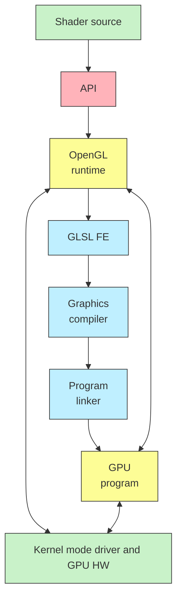
#### Обсуждение: а где же 3D?
• Пока что от обещанной трёхмерной графики мы видим только двумерный квадрат.
## Логическая модель
#### Обсуждение: сцена и отображение
• У нас есть мировые координаты сцены. Внутри сцены расположена модель.
• Как перейти от координат сцены к кординатам модели?
• Каким образом перейти от координат модели к координатам мира?
• Можно ли дополнительно учесть проекцию?
![[../../../_Meta/attachments/10.5.png]]
## Шейдер для трансформации
**C++**:

glm::vec3 Position;
glm::vec3 Up;

<span style="color: gray;">// ....</span>

<span style="color: purple;">glm::mat4 Model</span>(1.0f);

<span style="color: purple;">glm::mat4 View</span> = glm::lookAt(Position, LookTo, Up);

<span style="color: purple;">Projection</span> = glm::perspective\(glm::radians(FoV), Aspect, Near, Far\);

**GLSL**:

<span style="color: blue;">in vec3 aPos;</span>
<span style="color: blue;">in vec3 aColor;</span>

<span style="color: brown;">out vec3 vColor;</span>

<span style="color: purple;">uniform mat4 model;</span>
<span style="color: purple;">uniform mat4 view;</span>
<span style="color: purple;">uniform mat4 projection;</span>

void main() {
	<span style="color: brown;">gl_Position</span> = <span style="color: purple;">projection</span> \* <span style="color: purple;">view</span> \* <span style="color: purple;">model</span> \* vec4(<span style="color: blue;">aPos</span>, 1.0);
	<span style="color: brown;">vColor</span> = <span style="color: blue;">aColor</span>;
}
Пример работы программы:
![[../../../_Meta/attachments/10.6.gif]]
#### Давайте отрендерим куб
• Первый вариант: послать в режиме QUADS 6 * 4 вершин.
• Второй вариант: 2 * 4 вершин, 6 * 4 индексов.
```cpp
glBindBuffer(GL_ARRAY_BUFFER, VBO);
glBufferData(GL_ARRAY_BUFFER, sizeof(Vertices), Vertices, GL_STATIC_DRAW);

glBindBuffer(GL_ELEMENT_ARRAY_BUFFER, IBO);
glBufferData(GL_ELEMENT_ARRAY_BUFFER, sizeof(Indices), Indices, GL_STATIC_DRAW);
```
• Это несколько меньше данных для посылки на видеокарту (48 байт против 72), и это показывает ещё одну binding point.
#### Первая проблема: culling
• Небольшая ошибка с буферами индексов:
```cpp
GLubyte Indices[] {
	// quads
	0, 3, 2, 1,
	0, 3, 7, 4,
	1, 2, 6, 5,
	5, 1, 0, 4,
	3, 7, 6, 2,
	5, 6, 7, 4,
};
```
![[../../../_Meta/attachments/10.7.png]]
• Демонстрирует face culling.
![[../../../_Meta/attachments/10.8.png]]
#### Вторая проблема: depth
• Даже если правильно угадать с буферами, но забыть depth и culling checks, всё ещё могут быть артефакты.
```cpp
glEnable(GL_DEPTH_TEST);
glDepthFunc(GL_LESS);

glEnable(GL_DEPTH_CLAMP);

glEnable(GL_CULL_FACE);
```
![[../../../_Meta/attachments/10.9.png]]
• Конвейер OpenGL плохо понимает, что человек имел в виду. Для него важен режим геометрии.
#### Режимы геометрии: QUADS vs LINES
![[../../../_Meta/attachments/10.10.png]]
Пример с гита:
```cpp
//-------------------------------------------------------------------------------
//
// Source code for MIPT ILab
// Slides: https://sourceforge.net/projects/cpp-lects-rus/files/cpp-graduate/
// Licensed after GNU GPL v3
//
//-------------------------------------------------------------------------------
//
// Motion simple example: utilizing GLM and view / projection in vertex shader
// This example extends ogl-frag-shader
// Show how vertex lists are indexed in VBO's
// Shows camera motion and zoom with mouse and keyboard GLFW
//
// cl /EHsc ogl-motion.cc /link glad.lib glfw3dll.lib opengl32.lib
//
//-------------------------------------------------------------------------------

#include <algorithm>
#include <cassert>
#include <fstream>
#include <iostream>
#include <memory>
#include <sstream>
#include <stdexcept>
#include <vector>

// clang-format off
// this headers shall be in this position
#include <glad/glad.h>
// clang-format on

#include <glm/glm.hpp
#include <glm/cxt.hpp>
#include <glm/gtx/string_cast.hpp>
#include <GLFW/glfw3.h>

//initial window sizes
constexpr int SZX = 600;
constexpr int SZY = 600;

constexpr const char* VERTNAME = "shaders/models.vert";
constexpr const char* FRAGNAME = "shaders/sincolor.frag";

constexpr glm::vec3 STARTPOS = {0.0f, 0.0f, 3.0f};
constexpr glm::vec3 STARTFRONT = {0.0f, 0.0f, 0.0f};
constexpr glm::vec3 STARTUP = {0.0f, 1.0f, 0.0f};

constexpr float Sensitivity = 0.2f;
constexpr float RadiusDelta = 0.02f;

// vertices to render
GLfloat Vertices[] = {
	// positions        // colors
	// for +Z (cube front)
	-0.5f, 0.5f,  0.5f, 0.0f, 0.0f, 0.0f, // top left (-X, +Y)
	0.5f,  0.5f,  0.5f, 0.0f, 1.0f, 0.0f, // top right (+X, +Y)
	0.5f,  -0.5f, 0.5f, 1.0f, 0.0f, 0.0f, // bottom right (+X, -Y)
	-0.5f, -0.5f, 0.5f, 1.0f, 1.0f, 0.0f, // bottom left (-X, -Y)
	
	// for -Z (cube back)
	-0.5f, 0.5f,  -0.5f, 1.0f, 1.0f, 0.0f, // top left (-X, +Y)
	0.5f,  0.5f,  -0.5f, 1.0f, 0.0f, 0.0f, // top right (+X, +Y)
	0.5f,  -0.5f, -0.5f, 0.0f, 1.0f, 0.0f, // bottom right (+X, -Y)
	-0.5f, -0.5f, -0.5f, 0.0f, 0.0f, 0.0f, // bottom left (-X, -Y)
};

// cubes sides to render
GLubyte Indices[] = {
		// clang-format off
		// those indices better to be in cube order
		// quads
		0, 3, 2, 1,
		4, 7, 3, 0,
		1, 2, 6, 5,
		4, 0, 1, 5,
		3, 7, 6, 2,
		5, 6, 7, 4,
		// clang-format on
};

// simplest approach: do you already see problems?
class Renderer {
	GLFWwindow* Wnd_;
	GLuint ProgID;
	GLuint VAO, VBO, IBO;
	
	// camera params: vertical angle, horizontal angle, radius
	float HorizontalAngle = 0.0f;
	float VerticalAngle = 0.0f;
	float Radius = 3.0f;
	
	// projection params: Field of view, Aspect, etc...
	float FoV = 45.0f;
	float Aspect = static_cast<float>(SZX) / SZY;
	float Near = 0.1f;
	float Far = 100.0f;
	
	// Mouse button params to make control easier
	bool LeftPress = false;
	double OldX, OldY;
	
	// Sceleton mode toggle support
	bool LineMode = false;
	
public:
	Renderer(GLFWwindow* Wnd);
	Renderer(const Renderer&) = delete;
	Renderer(Renderer&&) = delete;
	Renderer& operator=(const Renderer&) = delete;
	Renderer& operator=(Renderer&&) = delete;
	~Renderer() {
		glDeleteVertexArrays(1, &VAO);
		glDeleteBuffers(1, &VBO);
		glDeleteBuffers(1, &IBO);
	}
	void display() const;
	void notifyKey(int key, int scancode, int action, int mode);
	void notifyMouseMove(double xpos, double ypos);
	void notifyMouseButton(int button, int action, int mods);
	void notifyAspect(float w, float h) { Aspect = w / h; }
};

// global renderer here to redirect handlers
std::unique_ptr<Renderer> TheRenderer;

// custom error handler class: GLFW
struct glfw_error: public std::runtime_error {
	glfw_error(const char* s) : std::runtime_error(s) {}
};

// custom error handler class: GLSL
struct glsl_error : public std::runtime_error {
	std::string ShaderLog;
	glsl_error(const char* s) : std::runtime_error(s) {}
};

// custom error handler class: GLSL compilation
struct glsl_compile_error : public glsl_error {
	glsl_compile_error(const char* s, GLuint ShaderID) : glsl_error(s) {
		GLint Length;
		glGetShaderiv(ShaderID, GL_INFO_LOG_LENGTH, &Length);
		std::vector<char> ShaderLogV(Length);
		glGetShaderInfoLog(ShaderID, Length, NULL, ShaderLogV.data());
		ShaderLog.assign(ShaderLogV.begin(), ShaderLogV.end());
	}
};

// custom error handler class: GLSL link
struct glsl_link_error : public glsl_error {
	glsl_link_error(const char* s, GLuint ProgID) : glsl_error(s) {
		GLint Length;
		glGetProgramiv(ProgID, GL_INFO_LOG_LENGTH, &Length);
		std::vector<char> ShaderLogV(Length);
		glGetShaderInfoLog(ProgID, Length, NULL, ShaderLogV.data());
		ShaderLog.assign(ShaderLogV.begin(), ShaderLogV.end());
	}
};

// { differenct trivial callbacks

static void error_callback(int, const char* err_str) {
	throw glfw_error(err_str);
}

static void key_callback(GLFWwindow* window, int key, int scancode, int action,
												 int mods) {
	TheRenderer->notifyKey(key, scancode, action, mods);
}

static void cursor_position_callback(GLFWwindow* window, double xpos,
																		 double ypos) {
	TheRenderer->notifyMouseMove(xpos, ypos);
}

static void mouse_button_callback(GLFWwindow* window, int button, int action
																	int mods) {
	TheRenderer->notifyMouseButton(button, action, mods);
}

// }

// make sure the viewport matches the new window dimensions
void framebuffer_size_callback(GLFWwindow* window, int width, int height) {
	glViewport(0, 0, width, height);
}

// и так далее...
```
#### Обсуждение: архитектура
• Покритикуйте код поворота кубика, выложенный на гитхабе по ссылке (выше в данном конспекте).
• С чего бы вы начали проектирование?
#### Что происходит в программе?
• Приложение формирует геометрию, шейдеры и прочее и кормит OpenGL API.
• Кроме того, приложение взаимодействует с оконным интерфейсом.
• Который сам по себе может взаимодействовать с API, например, для перерисовки.
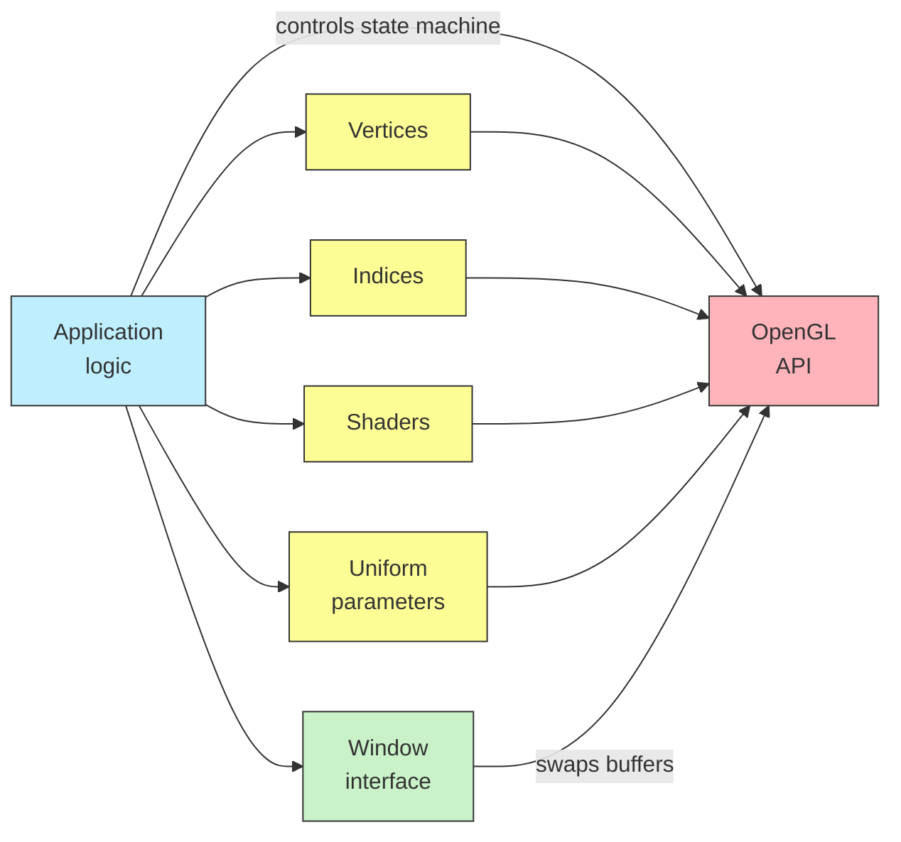
• Где тут место для рендерера?
#### Обсуждение: что такое вершина?
• Атрибутами вершины могут быть
	• Координаты
	• Цвет
	• Нормали (для правильного освещения)
	• Что угодно ещё (у нас же программируемый конвейер)
• Значит, рендерер должен как-то принимать обобщённый буфер вершин.
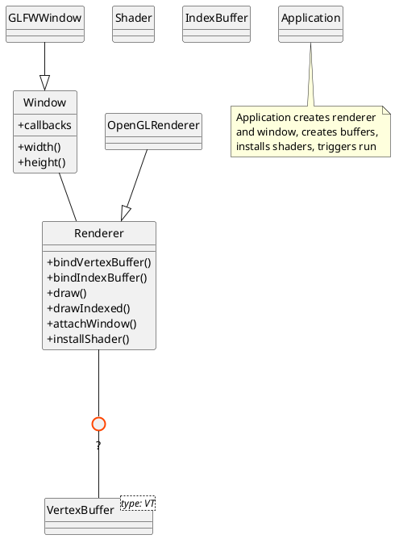
#### Идея сцены и простые вершины
• Класс сцены хранит всю информацию о вершинах и геометрии.
• Его взаимодействие с рендерером можно сделать низкоуровневым.
• Рендерер предоставляет обёртку Index/Vertex Buffer Object над любыми данными.
• Любые данные передаются туда как сырая память.
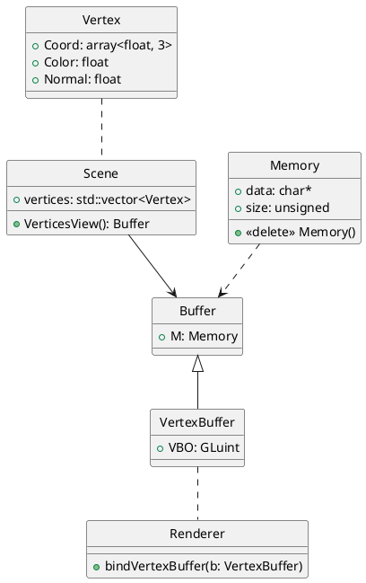
#### Ассиметрия в параметрах шейдера
• Vertex/index buffers можно трактовать как наследники одной структуры.
```cpp
struct Buffer {
	virtual size_t size() const = 0;
	virtual void push(Memory) = 0;
	virtual ~Buffer() = default;
};
```
• Но параметры шейдера могут потребовать установки uniform переменных в таком же зависимом от сцены ключе.
• Следует ли завести для них отдельный интерфейс и где?
#### Uniform buffer objects
**GLSL**:

<span style="color: blue;">in vec3 aPos;</span>
<span style="color: blue;">in vec3 aColor;</span>

<span style="color: red;">out vec3 vColor;</span>

<span style="color: purple;">uniform mat4 model;</span>
<span style="color: purple;">uniform mat4 view;</span>
<span style="color: purple;">uniform mat4 projection;</span>

void main() {
	<span style="color: gray;">  // используем</span>
}

**GLSL**:

<span style="color: blue;">layout (location = 0) in vec3 aPos;</span>
<span style="color: blue;">layout (location = 1) in vec3 aColor;</span>

<span style="color: red;">layout (location = 0) out vec3 vColor;</span>

<span style="color: purple;">layout (std140) uniform Matrices {</span>
	<span style="color: purple;">  mat4 model;</span>
	<span style="color: purple;">  mat4 view;</span>
	<span style="color: purple;">  mat4 projection;</span>
<span style="color: purple;">};</span>

void main() {
	<span style="color: gray;">  // тут всё это используем</span>
}
#### Обсуждение
• Кто и в какой момент должен переключать автомат OpenGL?
```cpp
glEnable(GL_DEPTH_CLAMP);
glEnable(GL_CULL_FACE);
```
и т. д.
• Разумеется, довольно странно на каждый чих делать по методу в рендерере.
• Мы видим, что сама модель OpenGL как гигантского конечного автомата делает его объектное представление неудобным.
• И, как мы дальше увидим, неэффективным.
## Vulkan API
#### На пути к Vulkan
• OpenGL API слишком высокоуровневое. У него всегда был некоторый перекос в сторону усложения графических драйверов.
• Из-за этого OpenGL мало пригоден как к производству игр, так и к мобильным приложениям.
• Необходимость нового графического API была осознана к 2016-му.
• В отличии от OpenGL, Vulkan пока не идёт в стандартной поставке OS, и его SDK приходится скачивать отдельно.
#### Концпептуальаня модель Вулкана
• Основные отличия от OpenGL: возможность записать несколько буферов команд и использовать несколько очередей устройства.
• Добавлено явное управление памятью и разные типы памяти.
• Кроме того, API отвязано от условного "экрана", swap chain для Вулкана - это расширение, рендеринг может идти куда угодно.
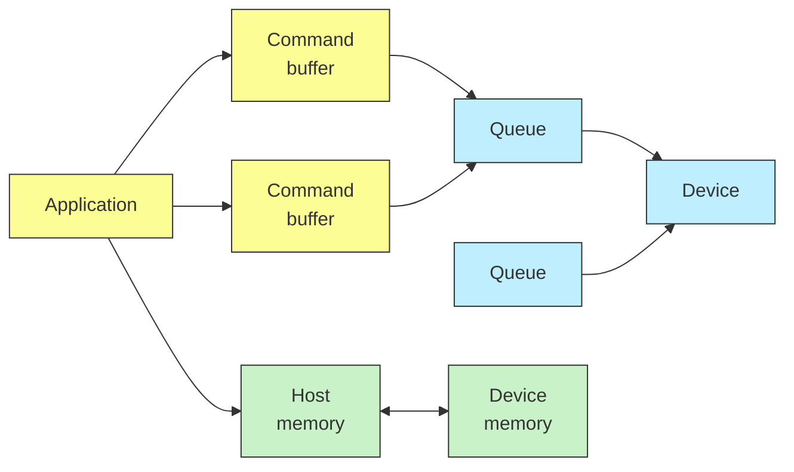
#### Основы: Instance, Device, Queue
• vkCreateInstance (в одном приложении м.б. несколько)
• vkEnumeratePhysicalDevices
	• API поддерживает работу с несколькими физическими устройствами для каждого Instance.
• vkGetPhysicalDeviceQueueFamilyProperties
	• Очереди могут быть разных типов.
• vkCreateDevice
	• Логическое устройство может содержать много очередей.
• vkGetDeviceQueue
	• Дескриптор очереди далее нужен для использования в API.
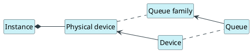
#### Рендеринг: swap chain, images, pipeline
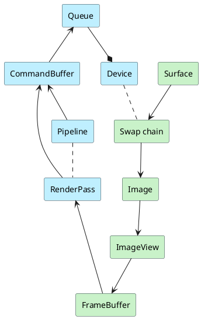
• Image здесь это то, что пойдёт на экран. Программа сама делает двойную (тройную и т.п.) буферизацию.
• Три новых важных термина:
	• Render pass
	• Pipeline
	• Command buffer
• Казалось бы хм... pipeline? Для OpenGL он один и глобальный.
#### Пасс рендеринга
![[../../../_Meta/attachments/10.11.svg]]
#### Фиксированный конвейер
<table style="border-collapse:collapse;text-align:center;font-weight:bold;color:#111">
<tr>
<td style="background:#bfefff;padding:6px 9px;border:1px solid #999;color:#111">VI</td>
<td style="background:#bfefff;padding:6px 9px;border:1px solid #999;color:#111">IA</td>
<td style="background:#fdfd96;padding:6px 9px;border:1px solid #999;color:#111">VS</td>
<td style="background:#fdfd96;padding:6px 9px;border:1px solid #999;color:#111">CS</td>
<td style="background:#bfefff;padding:6px 9px;border:1px solid #999;color:#111">TS</td>
<td style="background:#fdfd96;padding:6px 9px;border:1px solid #999;color:#111">ES</td>
<td style="background:#fdfd96;padding:6px 9px;border:1px solid #999;color:#111">GS</td>
<td style="background:#bfefff;padding:6px 9px;border:1px solid #999;color:#111">VP</td>
<td style="background:#bfefff;padding:6px 9px;border:1px solid #999;color:#111">RS</td>
<td style="background:#bfefff;padding:6px 9px;border:1px solid #999;color:#111">MS</td>
<td style="background:#bfefff;padding:6px 9px;border:1px solid #999;color:#111">DS</td>
<td style="background:#fdfd96;padding:6px 9px;border:1px solid #999;color:#111">FS</td>
<td style="background:#bfefff;padding:6px 9px;border:1px solid #999;color:#111">CB</td>
</tr>
</table>
Взял на себя смелость отформатировать легенду читаемей, нежели в оригинале.
<table style="border-collapse:collapse">
<tr>
<td style="vertical-align:top;padding-right:40px">
<b style="color:#bfefff">Fixed-function</b><br>
<b style="color:#bfefff">VI</b> = vertex input<br>
<b style="color:#bfefff">IA</b> = input assembly<br>
<b style="color:#bfefff">TS</b> = tesselation<br>
<b style="color:#bfefff">VP</b> = viewport<br>
<b style="color:#bfefff">RS</b> = raster<br>
<b style="color:#bfefff">MS</b> = multisample<br>
<b style="color:#bfefff">DS</b> = depth / stencil<br>
<b style="color:#bfefff">CB</b> = color blend
</td>
<td style="vertical-align:top">
<b style="color:#fdfd96">Shaders</b><br>
<b style="color:#fdfd96">VS</b> = vertex shader<br>
<b style="color:#fdfd96">CS</b> = tessellation control<br>
<b style="color:#fdfd96">ES</b> = tessellation evaluation<br>
<b style="color:#fdfd96">GS</b> = geometry shader<br>
<b style="color:#fdfd96">FS</b> = fragment shader
</td>
</tr>
</table>
• К конвейеру обязательно привязывает renderpass.
• Единожды созданный конвейер не изменяется. Его можно только пересоздать.
• Программа может оперировать любым количеством конвейеров.
Пример "простой" программы на Vulkan, которая точно так же просто отрисовывает квадрат.
```cpp
//-----------------------------------------------------------------------------
//
// Source code for MIPT ILab
// Slides: https://sourceforge.net/projects/cpp-lects-rus/files/cpp-graduate/
// Licensed after GNU GPL v3
//
//-----------------------------------------------------------------------------
//
//  Simplest VK example: blank square on the screen
//  Note incredibly long time to first triangle
//  Lets for a moment close eyes for really ugly design -- it will be improved
//  really soon
//
//  Inspired by: https://vulkan-tutorial.com
//
//  cl /EHsc vk-simplest.cc /link glfw3dll.lib vulkan-1.lib
//
//-----------------------------------------------------------------------------

#include <array>
#include <cassert>
#include <fstream>
#include <iostream>
#include <memory>
#include <set>
#include <sstream>
#include <stdexcept>
#include <vector>

#include <glm/ext.hpp>
#include <glm/glm.hpp>
#include <glm/gtx/string_cast.hpp>

#define GLFW_INCLUDE_VULKAN
#include <GLFW/glfw3.h>

#ifndef ANALYZE
#define ANALYZE 1
#endif

#define dbgs                                                                   \
  if (!ANALYZE) {                                                              \
  } else                                                                       \
    std::cout

#define VK_CHECK_RESULT(f)                                                     \
  {                                                                            \
    VkResult Res = (f);                                                        \
    if (Res != VK_SUCCESS) {                                                   \
      std::ostringstream Os;                                                   \
      Os << "Vulkan error at " << __FILE__ << ":" << __LINE__ << "\n";         \
      throw vulkan_error(Res, Os.str());                                       \
    }                                                                          \
  }

// initial window sizes
constexpr int SZX = 600;
constexpr int SZY = 600;

// double-buffering
constexpr int MAX_FRAMES_IN_FLIGHT = 2;

const std::vector<const char *> validationLayers = {
    "VK_LAYER_KHRONOS_validation"};

// extensions list to query
const std::vector<const char *> deviceExtensions = {
    VK_KHR_SWAPCHAIN_EXTENSION_NAME};

const bool enableValidationLayers = true;

// shader names
constexpr const char *VERTNAME = "shaders/simplest-v.vert.spv";
constexpr const char *FRAGNAME = "shaders/simplest-v.frag.spv";

auto Cleanup = [](GLFWwindow *w) {
  if (w) {
    glfwDestroyWindow(w);
  }
  glfwTerminate();
};

struct Vertex {
  glm::vec2 pos;
  glm::vec3 color;

  static VkVertexInputBindingDescription getBindingDescription() {
    VkVertexInputBindingDescription bindingDescription{};
    bindingDescription.binding = 0;
    bindingDescription.stride = sizeof(Vertex);
    bindingDescription.inputRate = VK_VERTEX_INPUT_RATE_VERTEX;

    return bindingDescription;
  }

  static std::array<VkVertexInputAttributeDescription, 2>
  getAttributeDescriptions() {
    std::array<VkVertexInputAttributeDescription, 2> attributeDescriptions{};

    attributeDescriptions[0].binding = 0;
    attributeDescriptions[0].location = 0;
    attributeDescriptions[0].format = VK_FORMAT_R32G32_SFLOAT;
    attributeDescriptions[0].offset = offsetof(Vertex, pos);

    attributeDescriptions[1].binding = 0;
    attributeDescriptions[1].location = 1;
    attributeDescriptions[1].format = VK_FORMAT_R32G32B32_SFLOAT;
    attributeDescriptions[1].offset = offsetof(Vertex, color);

    return attributeDescriptions;
  }
};

const std::vector<Vertex> Vertices = {{{-0.5f, -0.5f}, {1.0f, 0.0f, 0.0f}},
                                      {{0.5f, -0.5f}, {0.0f, 1.0f, 0.0f}},
                                      {{0.5f, 0.5f}, {0.0f, 0.0f, 1.0f}},
                                      {{-0.5f, 0.5f}, {1.0f, 1.0f, 1.0f}}};

const std::vector<unsigned short> Indices = {0, 1, 2, 2, 3, 0};

struct VkApp {
  std::unique_ptr<GLFWwindow, decltype(Cleanup)> Wnd;

  VkInstance Instance;
  VkPhysicalDevice PhysDevice;
  VkDevice Device;
  VkSurfaceKHR Surface;
  VkQueue GraphicsQueue;
  VkQueue PresentQueue;
  VkSwapchainKHR SwapChain;
  VkExtent2D Extent;
  VkSurfaceFormatKHR SurfaceFormat;
  std::vector<VkImage> SwapChainImages;
  VkFormat SwapChainImageFormat;
  VkExtent2D SwapChainExtent;
  std::vector<VkImageView> SwapChainImageViews;
  std::vector<VkFramebuffer> SwapChainFramebuffers;
  VkRenderPass RenderPass;
  VkPipelineLayout PipelineLayout;
  VkPipeline GraphicsPipeline;
  VkCommandPool CommandPool;
  VkBuffer VertexBuffer;
  VkDeviceMemory VertexBufferMemory;
  VkBuffer IndexBuffer;
  VkDeviceMemory IndexBufferMemory;
  std::vector<VkCommandBuffer> CommandBuffers;
  std::vector<VkSemaphore> ImageAvailableSemaphores;
  std::vector<VkSemaphore> RenderFinishedSemaphores;
  std::vector<VkFence> InFlightFences;
  std::vector<VkFence> ImagesInFlight;
  size_t CurrentFrame = 0;
  VkShaderModule StoredVertexID, StoredFragmentID;

  unsigned PresentFamily = -1u;
  unsigned GraphicsFamily = -1u;

  void initialize_window();
  void create_instance();
  void peek_device();
  void find_queues();
  void create_logical_device();

  VkShaderModule installShader(std::vector<char> ShaderCode);

  void create_swap_chain();
  void create_image_views();
  void create_render_pass();
  void create_descset_layout();
  void create_pipeline(VkShaderModule VertexID, VkShaderModule FragmentID);
  void create_frame_buffer();
  void create_command_pool();
  void create_buffers();
  void create_command_buffers();
  void create_sync_objs();

  void render_frame();
  void run();

  unsigned findMemoryType(unsigned typeFilter,
                          VkMemoryPropertyFlags properties);
  void createBuffer(VkDeviceSize size, VkBufferUsageFlags usage,
                    VkMemoryPropertyFlags properties, VkBuffer &buffer,
                    VkDeviceMemory &bufferMemory);
  void copyBuffer(VkBuffer srcBuffer, VkBuffer dstBuffer, VkDeviceSize size);

  bool FramebufferResized;

  VkApp() : Wnd(nullptr, Cleanup) {}

  void update_swap_chain(); // really create from scratch

  void cleanup_swap_chain() {
    for (auto framebuffer : SwapChainFramebuffers)
      vkDestroyFramebuffer(Device, framebuffer, nullptr);

    vkFreeCommandBuffers(Device, CommandPool, CommandBuffers.size(),
                         CommandBuffers.data());

    vkDestroyPipeline(Device, GraphicsPipeline, nullptr);
    vkDestroyPipelineLayout(Device, PipelineLayout, nullptr);
    vkDestroyRenderPass(Device, RenderPass, nullptr);

    for (auto imageView : SwapChainImageViews)
      vkDestroyImageView(Device, imageView, nullptr);

    vkDestroySwapchainKHR(Device, SwapChain, nullptr);
  }

  ~VkApp() {
    cleanup_swap_chain();

    // TODO: to "unique pointers"
    vkDestroyDevice(Device, nullptr);
    vkDestroySurfaceKHR(Instance, Surface, nullptr);
    vkDestroyInstance(Instance, nullptr);
  }
};

// custom error handler class
struct glfw_error : public std::runtime_error {
  glfw_error(const char *s) : std::runtime_error(s) {}
};

// vulkan-specific error (knows error code)
struct vulkan_error : public std::runtime_error {
  VkResult Res;
  vulkan_error(VkResult R, std::string S) : std::runtime_error(S), Res(R) {}
};

// throw on errors
void error_callback(int, const char *err_str) { throw glfw_error(err_str); }

// make sure the viewport matches the new window dimensions
void framebuffer_size_callback(GLFWwindow *window, int width, int height) {
  auto App = reinterpret_cast<VkApp *>(glfwGetWindowUserPointer(window));
  App->FramebufferResized = true;
}

// creating GLFW window
void VkApp::initialize_window() {
  glfwInit();
  glfwSetErrorCallback(error_callback);

  // this is interesting:
  // GLFW_NO_API required to NOT create OpenGL context
  glfwWindowHint(GLFW_CLIENT_API, GLFW_NO_API);

  auto *Window = glfwCreateWindow(SZX, SZY, "Hello, Vulkan", NULL, NULL);
  assert(Window); // error callback shall throw otherwise
  // so no need to call glfwMakeContextCurrent
  glfwSetWindowUserPointer(Window, this);
  glfwSetFramebufferSizeCallback(Window, framebuffer_size_callback);
  Wnd.reset(Window);
}

// create Vulkan Instance and Surface (requires window)
void VkApp::create_instance() {
  VkApplicationInfo appInfo{};
  appInfo.sType = VK_STRUCTURE_TYPE_APPLICATION_INFO;
  appInfo.pApplicationName = "Hello, Vulkan";
  appInfo.applicationVersion = VK_MAKE_VERSION(1, 0, 0);
  appInfo.pEngineName = "No Engine";
  appInfo.engineVersion = VK_MAKE_VERSION(1, 0, 0);
  appInfo.apiVersion = VK_API_VERSION_1_0;

  unsigned glfwExtensionCount = 0;
  const char **glfwExtensions;
  glfwExtensions = glfwGetRequiredInstanceExtensions(&glfwExtensionCount);
  dbgs << "Enumerated: " << glfwExtensionCount << " glfw required extensions\n";

  // note: create info requires extensions list
  VkInstanceCreateInfo createInfo{};
  createInfo.sType = VK_STRUCTURE_TYPE_INSTANCE_CREATE_INFO;
  createInfo.pApplicationInfo = &appInfo;
  createInfo.enabledExtensionCount = glfwExtensionCount;
  createInfo.ppEnabledExtensionNames = glfwExtensions;

  // note: we may use enabledLayerCount to enable validation layers
  createInfo.enabledLayerCount = 0;

  VK_CHECK_RESULT(vkCreateInstance(&createInfo, nullptr, &Instance));

  // note: surface requires instance and window
  VK_CHECK_RESULT(
      glfwCreateWindowSurface(Instance, Wnd.get(), nullptr, &Surface));
}

// Peek Vulkan physical device (requires Instance)
void VkApp::peek_device() {
  unsigned deviceCount = 0;
  VK_CHECK_RESULT(vkEnumeratePhysicalDevices(Instance, &deviceCount, nullptr));
  if (deviceCount != 1)
    throw std::runtime_error("Multiple Vulkan devices not supported yet");
  dbgs << deviceCount << " devices enumerated\n";
  VK_CHECK_RESULT(
      vkEnumeratePhysicalDevices(Instance, &deviceCount, &PhysDevice));
}

// Query queue families (requires PhysDevice and Surface)
void VkApp::find_queues() {
  unsigned queueFamilyCount = 0;
  int i = 0;
  vkGetPhysicalDeviceQueueFamilyProperties(PhysDevice, &queueFamilyCount,
                                           nullptr);
  dbgs << queueFamilyCount << " queue families found\n";

  std::vector<VkQueueFamilyProperties> queueFamilies(queueFamilyCount);
  vkGetPhysicalDeviceQueueFamilyProperties(PhysDevice, &queueFamilyCount,
                                           queueFamilies.data());

  for (const auto &queueFamily : queueFamilies) {
    if (queueFamily.queueFlags & VK_QUEUE_GRAPHICS_BIT) {
      GraphicsFamily = i;
      dbgs << "Graphics queue family: " << i << std::endl;
    }
    VkBool32 presentSupport = false;
    VK_CHECK_RESULT(vkGetPhysicalDeviceSurfaceSupportKHR(PhysDevice, i, Surface,
                                                         &presentSupport));
    if (presentSupport) {
      PresentFamily = i;
      dbgs << "Present queue family: " << i << std::endl;
    }
    if (PresentFamily != -1u && GraphicsFamily != -1u) {
      break;
    }
    i += 1;
  }

  if (PresentFamily == -1u || GraphicsFamily == -1u)
    throw std::runtime_error("Present and Graphics not found");
}

// Create logical device and queues (requires physical device and queue
// families)
void VkApp::create_logical_device() {
  std::set<unsigned> uniqueQueueFamilies = {PresentFamily, GraphicsFamily};
  std::vector<VkDeviceQueueCreateInfo> queueCreateInfos;

  float queuePriority = 1.0f;
  for (auto queueFamily : uniqueQueueFamilies) {
    VkDeviceQueueCreateInfo queueCreateInfo{};
    queueCreateInfo.sType = VK_STRUCTURE_TYPE_DEVICE_QUEUE_CREATE_INFO;
    queueCreateInfo.queueFamilyIndex = queueFamily;
    queueCreateInfo.queueCount = 1;
    queueCreateInfo.pQueuePriorities = &queuePriority;
    queueCreateInfos.push_back(queueCreateInfo);
  }

  // note: we are querying no device features
  VkPhysicalDeviceFeatures deviceFeatures{};

  dbgs << deviceExtensions.size() << " device extensions to enable\n";
  VkDeviceCreateInfo createInfo{};
  createInfo.sType = VK_STRUCTURE_TYPE_DEVICE_CREATE_INFO;
  createInfo.queueCreateInfoCount = queueCreateInfos.size();
  createInfo.pQueueCreateInfos = queueCreateInfos.data();
  createInfo.pEnabledFeatures = &deviceFeatures;
  createInfo.enabledExtensionCount = deviceExtensions.size();
  createInfo.ppEnabledExtensionNames = deviceExtensions.data();

  VK_CHECK_RESULT(vkCreateDevice(PhysDevice, &createInfo, nullptr, &Device));

  vkGetDeviceQueue(Device, GraphicsFamily, 0, &GraphicsQueue);
  vkGetDeviceQueue(Device, PresentFamily, 0, &PresentQueue);
}

// WA for MSVS
template <typename T> T myclamp(T x, T low, T hi) {
  if (x > hi)
    return hi;
  if (x < low)
    return low;
  return x;
}

// create swapchain (requires physical device, logical device and surface)
void VkApp::create_swap_chain() {
  VkSurfaceCapabilitiesKHR capabilities;
  std::vector<VkSurfaceFormatKHR> formats;
  std::vector<VkPresentModeKHR> presentModes;

  VK_CHECK_RESULT(vkGetPhysicalDeviceSurfaceCapabilitiesKHR(PhysDevice, Surface,
                                                            &capabilities));

  unsigned formatCount;
  VK_CHECK_RESULT(vkGetPhysicalDeviceSurfaceFormatsKHR(PhysDevice, Surface,
                                                       &formatCount, nullptr));

  dbgs << formatCount << " physical device surface formats found\n";

  if (formatCount) {
    formats.resize(formatCount);
    VK_CHECK_RESULT(vkGetPhysicalDeviceSurfaceFormatsKHR(
        PhysDevice, Surface, &formatCount, formats.data()));
  }

  SurfaceFormat = formats[0];
  auto res = std::find_if(formats.begin(), formats.end(), [](const auto &f) {
    return (f.format == VK_FORMAT_B8G8R8A8_SRGB &&
            f.colorSpace == VK_COLOR_SPACE_SRGB_NONLINEAR_KHR);
  });

  if (res != formats.end()) {
    dbgs << "B8G8R8A8_SRGB available\n";
    SurfaceFormat = *res;
  }

  int w, h;
  glfwGetFramebufferSize(Wnd.get(), &w, &h);
  dbgs << "Frame buffer size: W = " << w << "; H = " << h << std::endl;
  unsigned width = w;
  unsigned height = h;
  Extent.width = myclamp(width, capabilities.minImageExtent.width,
                         capabilities.maxImageExtent.width);
  Extent.height = myclamp(height, capabilities.minImageExtent.height,
                          capabilities.maxImageExtent.height);
  dbgs << "Extent: W = " << Extent.width << "; H = " << Extent.height
       << std::endl;
  dbgs << "Image count: min = " << capabilities.minImageCount
       << "; max = " << capabilities.maxImageCount << std::endl;

  unsigned ImageCount = capabilities.minImageCount + 1;
  if (capabilities.maxImageCount > 0 && ImageCount > capabilities.maxImageCount)
    ImageCount = capabilities.maxImageCount;

  dbgs << "Capability image count: " << ImageCount << std::endl;

  VkSwapchainCreateInfoKHR createInfo{};
  createInfo.sType = VK_STRUCTURE_TYPE_SWAPCHAIN_CREATE_INFO_KHR;
  createInfo.surface = Surface;

  createInfo.minImageCount = ImageCount;
  createInfo.imageFormat = SurfaceFormat.format;
  createInfo.imageColorSpace = SurfaceFormat.colorSpace;
  createInfo.imageExtent = Extent;
  createInfo.imageArrayLayers = 1;
  createInfo.imageUsage = VK_IMAGE_USAGE_COLOR_ATTACHMENT_BIT;

  unsigned queueFamilyIndices[] = {GraphicsFamily, PresentFamily};

  if (GraphicsFamily != PresentFamily) {
    createInfo.imageSharingMode = VK_SHARING_MODE_CONCURRENT;
    createInfo.queueFamilyIndexCount = 2;
    createInfo.pQueueFamilyIndices = queueFamilyIndices;
    dbgs << "Graphics != Present, peeking concurrent mode\n";
  } else {
    createInfo.imageSharingMode = VK_SHARING_MODE_EXCLUSIVE;
    dbgs << "Graphics == Present, peeking exclusive mode\n";
  }

  // select presentation mode
  unsigned presentModeCount;
  VK_CHECK_RESULT(vkGetPhysicalDeviceSurfacePresentModesKHR(
      PhysDevice, Surface, &presentModeCount, nullptr));
  dbgs << presentModeCount << " presentation modes found\n";

  if (presentModeCount == 0)
    throw std::runtime_error("No presentation modes supported");

  presentModes.resize(presentModeCount);
  VK_CHECK_RESULT(vkGetPhysicalDeviceSurfacePresentModesKHR(
      PhysDevice, Surface, &presentModeCount, presentModes.data()));

  VkPresentModeKHR presentMode = VK_PRESENT_MODE_FIFO_KHR;

  if (std::find(presentModes.begin(), presentModes.end(),
                VK_PRESENT_MODE_FIFO_KHR) != presentModes.end()) {
    dbgs << "VK_PRESENT_MODE_FIFO_KHR found\n";
  } else {
    dbgs << "VK_PRESENT_MODE_FIFO_KHR not found, found following:\n";
    for (auto m : presentModes) {
      dbgs << "\t" << m << std::endl;
      presentMode = m;
    }
    dbgs << "Using mode: " << presentMode << std::endl;
  }

  createInfo.preTransform = capabilities.currentTransform;
  createInfo.compositeAlpha = VK_COMPOSITE_ALPHA_OPAQUE_BIT_KHR;
  createInfo.presentMode = presentMode;
  createInfo.clipped = VK_TRUE;

  VK_CHECK_RESULT(
      vkCreateSwapchainKHR(Device, &createInfo, nullptr, &SwapChain));
}

// create swap chain images and views (requires logical device and swapchain)
void VkApp::create_image_views() {
  unsigned ImageCount;
  VK_CHECK_RESULT(
      vkGetSwapchainImagesKHR(Device, SwapChain, &ImageCount, nullptr));
  dbgs << "Swap chain image count " << ImageCount << std::endl;
  SwapChainImages.resize(ImageCount);
  VK_CHECK_RESULT(vkGetSwapchainImagesKHR(Device, SwapChain, &ImageCount,
                                          SwapChainImages.data()));
  SwapChainImageFormat = SurfaceFormat.format;
  SwapChainExtent = Extent;
  SwapChainImageViews.resize(ImageCount);

  for (size_t i = 0; i < ImageCount; ++i) {
    VkImageViewCreateInfo createInfo{};
    createInfo.sType = VK_STRUCTURE_TYPE_IMAGE_VIEW_CREATE_INFO;
    createInfo.image = SwapChainImages[i];
    createInfo.viewType = VK_IMAGE_VIEW_TYPE_2D;
    createInfo.format = SwapChainImageFormat;
    createInfo.components.r = VK_COMPONENT_SWIZZLE_IDENTITY;
    createInfo.components.g = VK_COMPONENT_SWIZZLE_IDENTITY;
    createInfo.components.b = VK_COMPONENT_SWIZZLE_IDENTITY;
    createInfo.components.a = VK_COMPONENT_SWIZZLE_IDENTITY;
    createInfo.subresourceRange.aspectMask = VK_IMAGE_ASPECT_COLOR_BIT;
    createInfo.subresourceRange.baseMipLevel = 0;
    createInfo.subresourceRange.levelCount = 1;
    createInfo.subresourceRange.baseArrayLayer = 0;
    createInfo.subresourceRange.layerCount = 1;
    VK_CHECK_RESULT(vkCreateImageView(Device, &createInfo, nullptr,
                                      &SwapChainImageViews[i]));
  }
}

// creating render pass (requires logical device and swap chain)
void VkApp::create_render_pass() {
  // single color buffer attachment represented by one of the images from the
  // swap chain. format equals to format of swap chain images
  VkAttachmentDescription colorAttachment{};
  colorAttachment.format = SwapChainImageFormat;
  colorAttachment.samples = VK_SAMPLE_COUNT_1_BIT;
  colorAttachment.stencilLoadOp = VK_ATTACHMENT_LOAD_OP_DONT_CARE;
  colorAttachment.stencilStoreOp = VK_ATTACHMENT_STORE_OP_DONT_CARE;
  colorAttachment.initialLayout = VK_IMAGE_LAYOUT_UNDEFINED;
  colorAttachment.finalLayout = VK_IMAGE_LAYOUT_PRESENT_SRC_KHR;

  // clear frame buffer to blank before new frame
  colorAttachment.loadOp = VK_ATTACHMENT_LOAD_OP_CLEAR;

  // rendered contents stored in memory
  colorAttachment.storeOp = VK_ATTACHMENT_STORE_OP_STORE;

  VkAttachmentReference colorAttachmentRef{};
  colorAttachmentRef.attachment = 0;
  colorAttachmentRef.layout = VK_IMAGE_LAYOUT_COLOR_ATTACHMENT_OPTIMAL;

  VkSubpassDescription subpass{};
  // subpass bound to graphics pipeline (alternatives: compute, etc)
  subpass.pipelineBindPoint = VK_PIPELINE_BIND_POINT_GRAPHICS;
  subpass.colorAttachmentCount = 1;
  subpass.pColorAttachments = &colorAttachmentRef;

  VkSubpassDependency dependency{};
  dependency.srcSubpass = VK_SUBPASS_EXTERNAL;
  dependency.dstSubpass = 0;
  dependency.srcStageMask = VK_PIPELINE_STAGE_COLOR_ATTACHMENT_OUTPUT_BIT;
  dependency.srcAccessMask = 0;
  dependency.dstStageMask = VK_PIPELINE_STAGE_COLOR_ATTACHMENT_OUTPUT_BIT;
  dependency.dstAccessMask = VK_ACCESS_COLOR_ATTACHMENT_WRITE_BIT;

  VkRenderPassCreateInfo renderPassInfo{};
  renderPassInfo.sType = VK_STRUCTURE_TYPE_RENDER_PASS_CREATE_INFO;
  renderPassInfo.attachmentCount = 1;
  renderPassInfo.pAttachments = &colorAttachment;
  renderPassInfo.subpassCount = 1;
  renderPassInfo.pSubpasses = &subpass;
  renderPassInfo.dependencyCount = 1;
  renderPassInfo.pDependencies = &dependency;

  // Note: allocator here nullptr
  //       this means we may do all allocations by ourselves
  VK_CHECK_RESULT(
      vkCreateRenderPass(Device, &renderPassInfo, nullptr, &RenderPass));
}

// pipeline requires logical device, render pass, descriptor set layout and
// shader IDs
void VkApp::create_pipeline(VkShaderModule VertexID,
                            VkShaderModule FragmentID) {
  StoredVertexID = VertexID;
  StoredFragmentID = FragmentID;

  VkPipelineShaderStageCreateInfo vertShaderStageInfo{};
  vertShaderStageInfo.sType =
      VK_STRUCTURE_TYPE_PIPELINE_SHADER_STAGE_CREATE_INFO;
  vertShaderStageInfo.stage = VK_SHADER_STAGE_VERTEX_BIT;
  vertShaderStageInfo.module = VertexID;
  vertShaderStageInfo.pName = "main";

  VkPipelineShaderStageCreateInfo fragShaderStageInfo{};
  fragShaderStageInfo.sType =
      VK_STRUCTURE_TYPE_PIPELINE_SHADER_STAGE_CREATE_INFO;
  fragShaderStageInfo.stage = VK_SHADER_STAGE_FRAGMENT_BIT;
  fragShaderStageInfo.module = FragmentID;
  fragShaderStageInfo.pName = "main";

  VkPipelineShaderStageCreateInfo shaderStages[] = {vertShaderStageInfo,
                                                    fragShaderStageInfo};

  VkPipelineVertexInputStateCreateInfo vertexInputInfo{};
  vertexInputInfo.sType =
      VK_STRUCTURE_TYPE_PIPELINE_VERTEX_INPUT_STATE_CREATE_INFO;

  auto bindingDescription = Vertex::getBindingDescription();
  auto attributeDescriptions = Vertex::getAttributeDescriptions();

  vertexInputInfo.vertexBindingDescriptionCount = 1;
  vertexInputInfo.vertexAttributeDescriptionCount =
      attributeDescriptions.size();
  vertexInputInfo.pVertexBindingDescriptions = &bindingDescription;
  vertexInputInfo.pVertexAttributeDescriptions = attributeDescriptions.data();

  VkPipelineInputAssemblyStateCreateInfo inputAssembly{};
  inputAssembly.sType =
      VK_STRUCTURE_TYPE_PIPELINE_INPUT_ASSEMBLY_STATE_CREATE_INFO;
  inputAssembly.topology = VK_PRIMITIVE_TOPOLOGY_TRIANGLE_LIST;
  inputAssembly.primitiveRestartEnable = VK_FALSE;

  VkViewport viewport{};
  viewport.x = 0.0f;
  viewport.y = 0.0f;
  viewport.width = SwapChainExtent.width;
  viewport.height = SwapChainExtent.height;
  viewport.minDepth = 0.0f;
  viewport.maxDepth = 1.0f;

  VkRect2D scissor{};
  scissor.offset = {0, 0};
  scissor.extent = SwapChainExtent;

  VkPipelineViewportStateCreateInfo viewportState{};
  viewportState.sType = VK_STRUCTURE_TYPE_PIPELINE_VIEWPORT_STATE_CREATE_INFO;
  viewportState.viewportCount = 1;
  viewportState.pViewports = &viewport;
  viewportState.scissorCount = 1;
  viewportState.pScissors = &scissor;

  VkPipelineRasterizationStateCreateInfo rasterizer{};
  rasterizer.sType = VK_STRUCTURE_TYPE_PIPELINE_RASTERIZATION_STATE_CREATE_INFO;
  rasterizer.depthClampEnable = VK_FALSE;
  rasterizer.rasterizerDiscardEnable = VK_FALSE;
  rasterizer.polygonMode = VK_POLYGON_MODE_FILL;
  rasterizer.lineWidth = 1.0f;
  rasterizer.cullMode = VK_CULL_MODE_NONE;
  rasterizer.frontFace = VK_FRONT_FACE_COUNTER_CLOCKWISE;
  rasterizer.depthBiasEnable = VK_FALSE;

  VkPipelineMultisampleStateCreateInfo multisampling{};
  multisampling.sType =
      VK_STRUCTURE_TYPE_PIPELINE_MULTISAMPLE_STATE_CREATE_INFO;
  multisampling.sampleShadingEnable = VK_FALSE;
  multisampling.rasterizationSamples = VK_SAMPLE_COUNT_1_BIT;

  VkPipelineColorBlendAttachmentState colorBlendAttachment{};
  colorBlendAttachment.colorWriteMask =
      VK_COLOR_COMPONENT_R_BIT | VK_COLOR_COMPONENT_G_BIT |
      VK_COLOR_COMPONENT_B_BIT | VK_COLOR_COMPONENT_A_BIT;
  colorBlendAttachment.blendEnable = VK_FALSE;

  VkPipelineColorBlendStateCreateInfo colorBlending{};
  colorBlending.sType =
      VK_STRUCTURE_TYPE_PIPELINE_COLOR_BLEND_STATE_CREATE_INFO;
  colorBlending.logicOpEnable = VK_FALSE;
  colorBlending.logicOp = VK_LOGIC_OP_COPY;
  colorBlending.attachmentCount = 1;
  colorBlending.pAttachments = &colorBlendAttachment;
  colorBlending.blendConstants[0] = 0.0f;
  colorBlending.blendConstants[1] = 0.0f;
  colorBlending.blendConstants[2] = 0.0f;
  colorBlending.blendConstants[3] = 0.0f;

  VkPipelineLayoutCreateInfo pipelineLayoutInfo{};
  pipelineLayoutInfo.sType = VK_STRUCTURE_TYPE_PIPELINE_LAYOUT_CREATE_INFO;
  VK_CHECK_RESULT(vkCreatePipelineLayout(Device, &pipelineLayoutInfo, nullptr,
                                         &PipelineLayout));

  VkGraphicsPipelineCreateInfo pipelineInfo{};
  pipelineInfo.sType = VK_STRUCTURE_TYPE_GRAPHICS_PIPELINE_CREATE_INFO;
  pipelineInfo.stageCount = 2;
  pipelineInfo.pStages = shaderStages;
  pipelineInfo.pVertexInputState = &vertexInputInfo;
  pipelineInfo.pInputAssemblyState = &inputAssembly;
  pipelineInfo.pViewportState = &viewportState;
  pipelineInfo.pRasterizationState = &rasterizer;
  pipelineInfo.pMultisampleState = &multisampling;
  pipelineInfo.pColorBlendState = &colorBlending;
  pipelineInfo.layout = PipelineLayout;
  pipelineInfo.renderPass = RenderPass;
  pipelineInfo.subpass = 0;
  pipelineInfo.basePipelineHandle = VK_NULL_HANDLE;
  VK_CHECK_RESULT(vkCreateGraphicsPipelines(
      Device, VK_NULL_HANDLE, 1, &pipelineInfo, nullptr, &GraphicsPipeline));
}

// creating frame buffer: requires logical device, render pass and image views
void VkApp::create_frame_buffer() {
  unsigned nFrameBuffers = SwapChainImageViews.size();
  dbgs << "Initializing " << nFrameBuffers << " frame buffers\n";
  SwapChainFramebuffers.resize(nFrameBuffers);
  for (size_t i = 0; i < nFrameBuffers; i++) {
    VkImageView attachments[] = {SwapChainImageViews[i]};
    VkFramebufferCreateInfo framebufferInfo{};
    framebufferInfo.sType = VK_STRUCTURE_TYPE_FRAMEBUFFER_CREATE_INFO;
    framebufferInfo.renderPass = RenderPass;
    framebufferInfo.attachmentCount = 1;
    framebufferInfo.pAttachments = attachments;
    framebufferInfo.width = SwapChainExtent.width;
    framebufferInfo.height = SwapChainExtent.height;
    framebufferInfo.layers = 1;
    VK_CHECK_RESULT(vkCreateFramebuffer(Device, &framebufferInfo, nullptr,
                                        &SwapChainFramebuffers[i]));
  }
}

// requires logical device and queue families
void VkApp::create_command_pool() {
  VkCommandPoolCreateInfo poolInfo{};
  poolInfo.sType = VK_STRUCTURE_TYPE_COMMAND_POOL_CREATE_INFO;
  poolInfo.queueFamilyIndex = GraphicsFamily;
  VK_CHECK_RESULT(
      vkCreateCommandPool(Device, &poolInfo, nullptr, &CommandPool));
}

template <typename T> size_t vectorsizeof(const std::vector<T> &vec) {
  return sizeof(T) * vec.size();
}

// TODO: maybe
unsigned VkApp::findMemoryType(unsigned typeFilter,
                               VkMemoryPropertyFlags properties) {
  VkPhysicalDeviceMemoryProperties memProperties;
  vkGetPhysicalDeviceMemoryProperties(PhysDevice, &memProperties);
  dbgs << memProperties.memoryTypeCount << " memory types found\n";
  for (unsigned i = 0; i < memProperties.memoryTypeCount; ++i)
    if ((typeFilter & (1 << i)) &&
        (memProperties.memoryTypes[i].propertyFlags & properties) == properties)
      return i;
  throw std::runtime_error("failed to find suitable memory type!");
}

// TODO: buffer ctor?
void VkApp::createBuffer(VkDeviceSize size, VkBufferUsageFlags usage,
                         VkMemoryPropertyFlags properties, VkBuffer &buffer,
                         VkDeviceMemory &bufferMemory) {
  VkBufferCreateInfo bufferInfo{};
  bufferInfo.sType = VK_STRUCTURE_TYPE_BUFFER_CREATE_INFO;
  bufferInfo.size = size;
  bufferInfo.usage = usage;
  bufferInfo.sharingMode = VK_SHARING_MODE_EXCLUSIVE;
  VK_CHECK_RESULT(vkCreateBuffer(Device, &bufferInfo, nullptr, &buffer));

  VkMemoryRequirements memRequirements;
  vkGetBufferMemoryRequirements(Device, buffer, &memRequirements);
  VkMemoryAllocateInfo allocInfo{};
  allocInfo.sType = VK_STRUCTURE_TYPE_MEMORY_ALLOCATE_INFO;
  allocInfo.allocationSize = memRequirements.size;
  allocInfo.memoryTypeIndex =
      findMemoryType(memRequirements.memoryTypeBits, properties);

  VK_CHECK_RESULT(vkAllocateMemory(Device, &allocInfo, nullptr, &bufferMemory));
  vkBindBufferMemory(Device, buffer, bufferMemory, 0);
}

// TODO: buffer copy ctor
void VkApp::copyBuffer(VkBuffer srcBuffer, VkBuffer dstBuffer,
                       VkDeviceSize size) {
  VkCommandBufferAllocateInfo allocInfo{};
  allocInfo.sType = VK_STRUCTURE_TYPE_COMMAND_BUFFER_ALLOCATE_INFO;
  allocInfo.level = VK_COMMAND_BUFFER_LEVEL_PRIMARY;
  allocInfo.commandPool = CommandPool;
  allocInfo.commandBufferCount = 1;

  VkCommandBuffer commandBuffer;
  vkAllocateCommandBuffers(Device, &allocInfo, &commandBuffer);

  VkCommandBufferBeginInfo beginInfo{};
  beginInfo.sType = VK_STRUCTURE_TYPE_COMMAND_BUFFER_BEGIN_INFO;
  beginInfo.flags = VK_COMMAND_BUFFER_USAGE_ONE_TIME_SUBMIT_BIT;

  vkBeginCommandBuffer(commandBuffer, &beginInfo);

  VkBufferCopy copyRegion{};
  copyRegion.size = size;
  vkCmdCopyBuffer(commandBuffer, srcBuffer, dstBuffer, 1, &copyRegion);

  vkEndCommandBuffer(commandBuffer);

  VkSubmitInfo submitInfo{};
  submitInfo.sType = VK_STRUCTURE_TYPE_SUBMIT_INFO;
  submitInfo.commandBufferCount = 1;
  submitInfo.pCommandBuffers = &commandBuffer;

  vkQueueSubmit(GraphicsQueue, 1, &submitInfo, VK_NULL_HANDLE);
  vkQueueWaitIdle(GraphicsQueue);

  vkFreeCommandBuffers(Device, CommandPool, 1, &commandBuffer);
}

void VkApp::create_buffers() {
  // vertices and indices

  {
    VkDeviceSize bufferSize = vectorsizeof(Vertices);
    dbgs << "Vertex buffer size: " << bufferSize << std::endl;
    VkBuffer stagingBuffer;
    VkDeviceMemory stagingBufferMemory;
    createBuffer(bufferSize, VK_BUFFER_USAGE_TRANSFER_SRC_BIT,
                 VK_MEMORY_PROPERTY_HOST_VISIBLE_BIT |
                     VK_MEMORY_PROPERTY_HOST_COHERENT_BIT,
                 stagingBuffer, stagingBufferMemory);

    void *data;
    vkMapMemory(Device, stagingBufferMemory, 0, bufferSize, 0, &data);
    std::copy(Vertices.begin(), Vertices.end(), static_cast<Vertex *>(data));
    vkUnmapMemory(Device, stagingBufferMemory);

    createBuffer(
        bufferSize,
        VK_BUFFER_USAGE_TRANSFER_DST_BIT | VK_BUFFER_USAGE_VERTEX_BUFFER_BIT,
        VK_MEMORY_PROPERTY_DEVICE_LOCAL_BIT, VertexBuffer, VertexBufferMemory);

    copyBuffer(stagingBuffer, VertexBuffer, bufferSize);

    vkDestroyBuffer(Device, stagingBuffer, nullptr);
    vkFreeMemory(Device, stagingBufferMemory, nullptr);
  }

  {
    VkDeviceSize bufferSize = vectorsizeof(Indices);
    dbgs << "Index buffer size: " << bufferSize << std::endl;
    VkBuffer stagingBuffer;
    VkDeviceMemory stagingBufferMemory;
    createBuffer(bufferSize, VK_BUFFER_USAGE_TRANSFER_SRC_BIT,
                 VK_MEMORY_PROPERTY_HOST_VISIBLE_BIT |
                     VK_MEMORY_PROPERTY_HOST_COHERENT_BIT,
                 stagingBuffer, stagingBufferMemory);

    void *data;
    vkMapMemory(Device, stagingBufferMemory, 0, bufferSize, 0, &data);
    std::copy(Indices.begin(), Indices.end(),
              static_cast<unsigned short *>(data));
    vkUnmapMemory(Device, stagingBufferMemory);

    createBuffer(
        bufferSize,
        VK_BUFFER_USAGE_TRANSFER_DST_BIT | VK_BUFFER_USAGE_INDEX_BUFFER_BIT,
        VK_MEMORY_PROPERTY_DEVICE_LOCAL_BIT, IndexBuffer, IndexBufferMemory);

    copyBuffer(stagingBuffer, IndexBuffer, bufferSize);

    vkDestroyBuffer(Device, stagingBuffer, nullptr);
    vkFreeMemory(Device, stagingBufferMemory, nullptr);
  }
}

// requires: render pass, pipeline, swap chain, vertex buffers
void VkApp::create_command_buffers() {
  unsigned NFrameBufs = SwapChainFramebuffers.size();
  dbgs << "Number of command buffers: " << NFrameBufs << std::endl;
  CommandBuffers.resize(NFrameBufs);

  VkCommandBufferAllocateInfo allocInfo{};
  allocInfo.sType = VK_STRUCTURE_TYPE_COMMAND_BUFFER_ALLOCATE_INFO;
  allocInfo.commandPool = CommandPool;
  allocInfo.level = VK_COMMAND_BUFFER_LEVEL_PRIMARY;
  allocInfo.commandBufferCount = NFrameBufs;

  VK_CHECK_RESULT(
      vkAllocateCommandBuffers(Device, &allocInfo, CommandBuffers.data()));

  for (unsigned i = 0; i < CommandBuffers.size(); ++i) {
    VkCommandBufferBeginInfo beginInfo{};
    beginInfo.sType = VK_STRUCTURE_TYPE_COMMAND_BUFFER_BEGIN_INFO;
    VK_CHECK_RESULT(vkBeginCommandBuffer(CommandBuffers[i], &beginInfo));

    VkRenderPassBeginInfo renderPassInfo{};
    renderPassInfo.sType = VK_STRUCTURE_TYPE_RENDER_PASS_BEGIN_INFO;
    renderPassInfo.renderPass = RenderPass;
    renderPassInfo.framebuffer = SwapChainFramebuffers[i];
    renderPassInfo.renderArea.offset = {0, 0};
    renderPassInfo.renderArea.extent = SwapChainExtent;

    VkClearValue clearColor = {{{0.2f, 0.3f, 0.3f, 1.0f}}};
    renderPassInfo.clearValueCount = 1;
    renderPassInfo.pClearValues = &clearColor;

    vkCmdBeginRenderPass(CommandBuffers[i], &renderPassInfo,
                         VK_SUBPASS_CONTENTS_INLINE);
    vkCmdBindPipeline(CommandBuffers[i], VK_PIPELINE_BIND_POINT_GRAPHICS,
                      GraphicsPipeline);
    VkBuffer vertexBuffers[] = {VertexBuffer};
    VkDeviceSize offsets[] = {0};
    vkCmdBindVertexBuffers(CommandBuffers[i], 0, 1, vertexBuffers, offsets);
    vkCmdBindIndexBuffer(CommandBuffers[i], IndexBuffer, 0,
                         VK_INDEX_TYPE_UINT16);
    vkCmdDrawIndexed(CommandBuffers[i], Indices.size(), 1, 0, 0, 0);
    vkCmdEndRenderPass(CommandBuffers[i]);
    VK_CHECK_RESULT(vkEndCommandBuffer(CommandBuffers[i]));
  }
}

void VkApp::create_sync_objs() {
  ImageAvailableSemaphores.resize(MAX_FRAMES_IN_FLIGHT);
  RenderFinishedSemaphores.resize(MAX_FRAMES_IN_FLIGHT);
  InFlightFences.resize(MAX_FRAMES_IN_FLIGHT);
  ImagesInFlight.resize(SwapChainImages.size(), VK_NULL_HANDLE);

  VkSemaphoreCreateInfo semaphoreInfo{};
  semaphoreInfo.sType = VK_STRUCTURE_TYPE_SEMAPHORE_CREATE_INFO;

  VkFenceCreateInfo fenceInfo{};
  fenceInfo.sType = VK_STRUCTURE_TYPE_FENCE_CREATE_INFO;
  fenceInfo.flags = VK_FENCE_CREATE_SIGNALED_BIT;

  for (unsigned i = 0; i < MAX_FRAMES_IN_FLIGHT; ++i) {
    VK_CHECK_RESULT(vkCreateSemaphore(Device, &semaphoreInfo, nullptr,
                                      &ImageAvailableSemaphores[i]));
    VK_CHECK_RESULT(vkCreateSemaphore(Device, &semaphoreInfo, nullptr,
                                      &RenderFinishedSemaphores[i]));
    VK_CHECK_RESULT(
        vkCreateFence(Device, &fenceInfo, nullptr, &InFlightFences[i]));
  }
}

void VkApp::update_swap_chain() {
  int width = 0, height = 0;
  glfwGetFramebufferSize(Wnd.get(), &width, &height);
  while (width == 0 || height == 0) {
    glfwGetFramebufferSize(Wnd.get(), &width, &height);
    glfwWaitEvents();
  }

  vkDeviceWaitIdle(Device);

  cleanup_swap_chain();

  create_swap_chain();
  create_image_views();
  create_render_pass();
  create_pipeline(StoredVertexID, StoredFragmentID);
  create_frame_buffer();
  create_command_buffers();

  ImagesInFlight.resize(SwapChainImages.size(), VK_NULL_HANDLE);
}

void VkApp::render_frame() {
  vkWaitForFences(Device, 1, &InFlightFences[CurrentFrame], VK_TRUE,
                  UINT64_MAX);

  unsigned imageIndex;
  VkResult result = vkAcquireNextImageKHR(
      Device, SwapChain, UINT64_MAX, ImageAvailableSemaphores[CurrentFrame],
      VK_NULL_HANDLE, &imageIndex);

  if (result == VK_ERROR_OUT_OF_DATE_KHR) {
    update_swap_chain();
    return;
  } else if (result != VK_SUCCESS && result != VK_SUBOPTIMAL_KHR) {
    throw std::runtime_error("failed to acquire swap chain image!");
  }

  if (ImagesInFlight[imageIndex] != VK_NULL_HANDLE) {
    vkWaitForFences(Device, 1, &ImagesInFlight[imageIndex], VK_TRUE,
                    UINT64_MAX);
  }
  ImagesInFlight[imageIndex] = InFlightFences[CurrentFrame];

  VkSubmitInfo submitInfo{};
  submitInfo.sType = VK_STRUCTURE_TYPE_SUBMIT_INFO;

  VkSemaphore waitSemaphores[] = {ImageAvailableSemaphores[CurrentFrame]};
  VkPipelineStageFlags waitStages[] = {
      VK_PIPELINE_STAGE_COLOR_ATTACHMENT_OUTPUT_BIT};
  submitInfo.waitSemaphoreCount = 1;
  submitInfo.pWaitSemaphores = waitSemaphores;
  submitInfo.pWaitDstStageMask = waitStages;

  submitInfo.commandBufferCount = 1;
  submitInfo.pCommandBuffers = &CommandBuffers[imageIndex];

  VkSemaphore signalSemaphores[] = {RenderFinishedSemaphores[CurrentFrame]};
  submitInfo.signalSemaphoreCount = 1;
  submitInfo.pSignalSemaphores = signalSemaphores;

  vkResetFences(Device, 1, &InFlightFences[CurrentFrame]);

  VK_CHECK_RESULT(vkQueueSubmit(GraphicsQueue, 1, &submitInfo,
                                InFlightFences[CurrentFrame]));

  VkPresentInfoKHR presentInfo{};
  presentInfo.sType = VK_STRUCTURE_TYPE_PRESENT_INFO_KHR;

  presentInfo.waitSemaphoreCount = 1;
  presentInfo.pWaitSemaphores = signalSemaphores;

  VkSwapchainKHR swapChains[] = {SwapChain};
  presentInfo.swapchainCount = 1;
  presentInfo.pSwapchains = swapChains;

  presentInfo.pImageIndices = &imageIndex;

  result = vkQueuePresentKHR(PresentQueue, &presentInfo);

  if (result == VK_ERROR_OUT_OF_DATE_KHR || result == VK_SUBOPTIMAL_KHR ||
      FramebufferResized) {
    FramebufferResized = false;
    update_swap_chain();
  } else if (result != VK_SUCCESS) {
    throw std::runtime_error("failed to present swap chain image!");
  }

  CurrentFrame = (CurrentFrame + 1) % MAX_FRAMES_IN_FLIGHT;
}

void VkApp::run() {
  while (!glfwWindowShouldClose(Wnd.get())) {
    glfwPollEvents();
    render_frame();
  }
  vkDeviceWaitIdle(Device);
}

// read program code from file
std::vector<char> readFile(const char *Path) {
  std::ifstream ShaderFile;
  ShaderFile.exceptions(std::ifstream::failbit | std::ifstream::badbit);
  ShaderFile.open(Path, std::ios::binary);
  std::istreambuf_iterator<char> Start(ShaderFile), Fin;
  return std::vector<char>(Start, Fin);
}

// requires logical device
VkShaderModule VkApp::installShader(std::vector<char> ShaderCode) {
  VkShaderModuleCreateInfo createInfo{};
  createInfo.sType = VK_STRUCTURE_TYPE_SHADER_MODULE_CREATE_INFO;
  createInfo.codeSize = ShaderCode.size();
  createInfo.pCode = reinterpret_cast<const unsigned *>(ShaderCode.data());

  VkShaderModule ShaderID;
  VK_CHECK_RESULT(
      vkCreateShaderModule(Device, &createInfo, nullptr, &ShaderID));
  return ShaderID;
}

// entry point
int main() try {
  VkApp app;
  app.initialize_window();
  app.create_instance();
  app.peek_device();
  app.find_queues();
  app.create_logical_device();

  VkShaderModule VertexID = app.installShader(readFile(VERTNAME));
  VkShaderModule FragmentID = app.installShader(readFile(FRAGNAME));

  app.create_swap_chain();
  app.create_image_views();
  app.create_render_pass();
  app.create_pipeline(VertexID, FragmentID);
  app.create_frame_buffer();
  app.create_command_pool();
  app.create_buffers();
  app.create_command_buffers();
  app.create_sync_objs();
  app.run();

} catch (vulkan_error &E) {
  std::cerr << "Vulkan error: " << E.Res << " " << E.what() << std::endl;
  switch (E.Res) {
  case VK_ERROR_OUT_OF_HOST_MEMORY:
    std::cerr << "VK_ERROR_OUT_OF_HOST_MEMORY\n";
    break;
  case VK_ERROR_OUT_OF_DEVICE_MEMORY:
    std::cerr << "VK_ERROR_OUT_OF_DEVICE_MEMORY\n";
    break;
  case VK_ERROR_DEVICE_LOST:
    std::cerr << "VK_ERROR_DEVICE_LOST\n";
    break;
  }
} catch (glfw_error &E) {
  std::cerr << "GLFW error: " << E.what() << std::endl;
} catch (std::exception &E) {
  std::cerr << "Standard error: " << E.what() << std::endl;
} catch (...) {
  std::cerr << "Unknown error\n";
}
```
#### Прекомпиляция шейдеров
• Тратить рантайм время на запуск clang - это расточительно.
• Шейдеры предварительно компилируются в SPIRV.
```bash
glslc simplest-v.vert -o simplest-v.vert.spv
```
• SPIRV - это единое представление для Vulkan, OpenGL и OpenCL (со своими расширениями).
• Бинарный формат можно дизассемблировать в нечто, напоминающее LLVM IR.
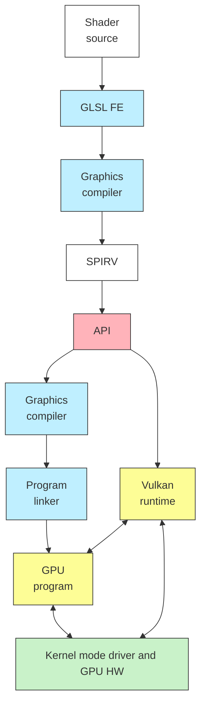
#### Буфер команд
• Буфер команд включает в себя описание конвейера, рендер пасс и всё, над чем они будут работать.
• Именно сюда биндятся все ресурсы (буферы вершин, буферы индексов и т.п.).
• Также именно тут настраиваются viewport/scissors, чтобы не приходилось пересоздавать pipeline ради их настройки.
• И далее буфера команд отправляются на очередь.
![[../../../_Meta/attachments/10.12.svg]]
#### Цикл отображения
• Командный буфер связывается с картинкой для swapchain заранее в RenderPassInfo.
• Командный буфер уходит в графическую очередь, рендерит картинку.
• Далее эта картинка отправляется в презентационную очередь на swapchain.
• Разумеется, это не обязательная схема.
![[../../../_Meta/attachments/10.13.svg]]
#### Проблема синхронизации
<span style="color: blue;">vkAcquireNextImageKHR</span>(...., &imageIndex); <span style="color: gray;">// non-blocking</span>

VkSubmitInfo submitInfo;
submitInfo.pCommandBuffers = &CommandBuffers\[imageIndex\];

<span style="color: blue;">vkQueueSubmit</span>(GraphicsQueue, ...., submitInfo); <span style="color: gray;">// same</span>

VkPresentInfoKHR presentInfo;
presentInfo.pImageIndices = &imageIndex;

<span style="color: blue;">vkQueuePresentKHR</span>(PresentQueue, &presentInfo); <span style="color: gray;">// same</span>
• Хорошая ли идея дождаться готовности кадра, т.е. сделать все эти вызовы блокирующими?
#### Семафоры для синхронизации
• Некоторые API берут специальный объекты "семафоры".
• Эти объекты не допускают начала реального исполнения, пока не просигналены.
• vkQueueSubmit берёт два семафора: один она ждёт, второй ставит для vkQueuePresentKHR.
![[../../../_Meta/attachments/10.14.svg]]
#### Фенсы для синхронизации
• Семафор используется внутри GPU runtime.
• В отличие от него, фенс позволяет синхронизировать CPU и GPU.
• Со стороны CPU мы вызываем vkWaitForFences
```cpp
vkWaitForFences(...., InFlight[CurrentFrame]); // wait
vkAcquireNextImageKHR(....);
vkResetFences(...., InFlight[CurrentFrame]); // reset
vkQueueSubmit(...., InFlight[CurrentFrame]); // set
```
#### Управление памятью
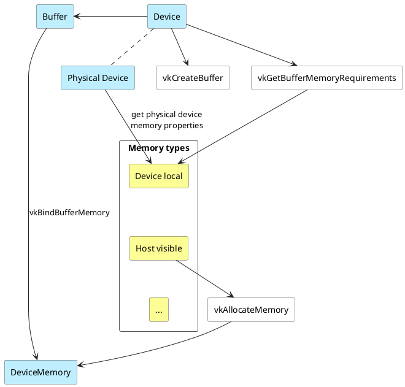
• Каждое физическое устройство возвращает массив VkMemoryType.
• Логическое устройство создаёт буффер с отдельными create/usage flags.
• Например, USAGE_TRANSFER и HOST_COHERENT.
• Далее нужно связать логический тип буфера с физическим типом памяти для него и выделить память.
#### Отображение памяти
• Допустим, мы создали на устройстве staging buffer.
```cpp
VkBuffer stagingBuffer; // usage = transfer_src
VkDeviceMemory stagingBufferMemory; // property = host_visible
```
• Теперь хочется заполнить его с хоста (например, вершинами).
• Для этого память (если она host visible) можно просто отобразить на устройство.
```cpp
void* data;

vkMapMemory(Device, stagingBufferMemory, 0, bufferSize, 0, &data);
std::copy(Vertices.begin(), Vertices.end(), cast<Vertex*>(data));
vkUnmapMemory(Device, stagingBufferMemory);
```
#### Обсуждение
• Достаточно ли вы поняли идею Вулкана, чтобы догадаться, как скопировать память из буфера в буфер **внутри** устройства?
• Или как скопировать в буфер, если он не host-visible?
• И вообще, как сделать операцию с памятью в общем случае?
#### Command buffer спешит на помощь
• Команда, которую можно положить в очередь, это, в частности, команда записи памяти.
```cpp
vkBeginCommandBuffer(commandBuffer, &beginInfo);
vkCmdCopyBuffer(commandBuffer, srcBuffer, dstBuffer, ....);
vkEndCommandBuffer(commandBuffer);
```
• Далее можно сразу отправить её в очередь и заблокироваться, дожидаясь ответа.
```cpp
vkQueueSubmit(GraphicsQueue, ....); // transfer queue?
vkQueueWaitIdle(GraphicsQueue);
```
#### Демо
• Покажем очевидное превосходство в FPS на примере.
```shell
build2> Release\uniform_buffer.exe -ogl
```
![[../../../_Meta/attachments/10.15.gif]]
Это пример на OpenGL. На карточке автора в среднем это работает в 618 FPS.
Та же программа, но написаная на Vulkan работает в среднем в 1950 FPS.
#### Обсуждение
• Покритикуйте простейшую программу по ссылке (имеется в виду гигантский пример в 1000 строк выше).
• Что бы вы там улучшили или перепроектировали и как?
## Физическая и объектная модель
#### Что происходит в программе на Vulkan?
![[../../../_Meta/attachments/10.16.png]]
#### Vulkan - это объектная модель
```cpp
// объект
VkDevice Device;
// конструктор
vkCreateDevice(PhysDevice, &createInfo, nullptr, &Device);
// методы
vkGetDeviceQueue(Device, GraphicsFamily, 0, &GraphicsQueue);
vkCreateImageView(Device, &createInfo, nullptr, &ImageView);
vkCreateRenderPass(Device, &renderPassInfo, nullptr, &Pass);
// деструктор
vkDestroyDevice(Device, nullptr);
```
#### Но она немного C-style
VkBufferCreateInfo bufferInfo{};
bufferInfo.<span style="color: brown;">sType</span> = VK_STRUCTURE_TYPE_BUFFER_CREATE_INFO;
bufferInfo.size = size;
bufferInfo.usage = usage;
bufferInfo.sharingMode = VK_SHARING_MODE_EXECUTIVE;
• В таком подходе может быть такое, что
	• sType не совпал с настоящим типом
	• Инициализированы не все нужные поля
	• Константа в sharingMode не имеет отношения к sharing mode
	• И т.д.
• Мы хотели бы сделать всё иначе.
#### Vulkan-Hpp: C++ API
```cpp
struct BufferCreateInfo {
	BufferCreateInfo(BufferCreateFlags flags_ = {}),
		DeviceSize       size_ = {},
		BufferUsageFlags usage_ = {},
		SharingMode      sharingMode_ = SharingMode::eExclusive,
		uint32_t         queueFamilyIndexCount_ = {},
		const uint32_t*  pQueueFamilyIndices_ = {});
	// .....
	};
	
BufferCreateInfo bufferInfo(size, usage);
```
#### Безопасные флаги
• Мы хотели бы, чтобы работало нечто вроде
enum class QueueFlagBits : VkQueueFlags {
	eGraphics           = VK_QUEUE_GRAPHICS_BIT,
	eCompute          = VK_QUEUE_COMPUTE_BIT,
	eTransfer            = VK_QUEUE_TRANSFER_BIT,
	eSparseBinding = VK_QUEUE_SPARSE_BINDING_BIT,
	eProtected          = VK_QUEUE_PROTECTED_BIT,
...
};

<span style="color: blue;">vk::QueueFlags</span> bits = vk::QueueFlagBits::eGraphics | vk::QueueFlagBits::eCompute;
• Задача в том, как удобней определить vk::QueueFlags?
#### Доступ к нижележащему типу
```cpp
template<typename BitType> class Flags {
	using MaskType = typename std::underlying_type<BitType>::type;
	MaskType m_mask;
// ....
	Flags<BitType> operator|(Flags<BitType> const& rhs) const {
		return Flags<BitType>(m_mask | rhs.m_mask);
	}
};

using QueueFlags = Flags<QueueFlagBits>;
```
• Здесь мы предполагаем, что мы инстанцированы исключительно enum class.
enum class QueueFlagBits : <span style="color: red;">VkQueueFlags</span> <span style="color: gray;">// -- underlying</span>
#### Размер кода существенно улучшается
```cpp
auto mapping = vk::ComponentMapping {
	vk::ComponentSwizzle::eR, vk::ComponentSwizzle::eG,
	vk::ComponentSwizzle::eB, vk::ComponentSwizzle::eA };
	
auto subrange = vk::ImageSubresourceRange {
	vk::ImageAspectFlagBits::eColor, 0, 1, 0, 1};
	
for(auto image : swapchain_images_) {
	vk::ImageViewCreateInfo image_view_create_info(
		vk::ImageViewCreateFlags(), image, vk::ImageViewType::e2D,
		format_, mapping, subrange); // наши обёрточки
	swapchain_image_views_.push_back(
		device_->createImageViewUnique(image_view_create_info));
}
```
#### Unique pointers/resources
• Большая часть объетов ведёт себя unique-pointer-подобно.
```cpp
template<typename Type, typename Dispatch>
class UniqueHandle :
	public UniqueHandleTraits<Type, Dispatch>::deleter {
// ...
```
• Это позволяет как на прошлом слайде завернуть в самоумирающий по уничтожению swapchain_image_views_ объект:
```cpp
swapchain_image_views.push_back(
	device_->createImageViewUnique(image_view_create_info));
```
#### Обсуждение
• Простая обёртка - это хорошо, но давайте вернёмся к высокоуровневой архитектуре.
• Как мы расширим рендерер с учётом возможностей вулкана? Что станет с логической моделью? Что станет со сценой?
#### Литература
1. ISO/IEC, "Information technology - Programming languages - C++", ISO/IEC 14882:2017
2. The C++ Programming Language (4th Edition)
3. John M. Kessenich, Graham Seller, Dave Shreiner - OpenGL Programming Guide: The Official Guide to Learning OpenGL, 9-th edition, 2016
4. Parminder Singh - Learning Vulkan, Packt, 2016
5. Alexander Overvoorde - Vulkan Tutorial, **self-published**, 2020
6. Dustin Land - Getting explicit: How Hard is Vulkan really, GDC 2018
7. Jason Ekstrand - What Can Vulkan do for You?, The Linux Foundation, 2017
8. Michael Worcester - Getting Started with Vulkan, The Khronos Group, 2017
9. Karl Shultz - Vulkan Tutorial, DevU, 2017
Дальше вкидывает небольшой *cliffhanger* про Compute Queues. В качестве примера приводит шейдер:
```glsl
//-------------------------------------------------------------------------------
//
// Source code for MIPT ILab
// Slides: https://sourceforge.net/projects/cpp-lects-rus/files/cpp-graduate/
// Licensed after GNU GPL v3
//
//-------------------------------------------------------------------------------
//
// Simple vertex shader: model, view, projection
//
//-------------------------------------------------------------------------------

#version 460

layout (location = 0) in vec3 aPos;
layout (location = 1) in vec3 aColor;

out vec3 vColor;

uniform mat4 model;
uniform mat4 view;
uniform mat4 projection;

void main() {
	gl_Position = projection * view * model * vec4(aPos, 1.0);
	vColor = aColor;
}
```
