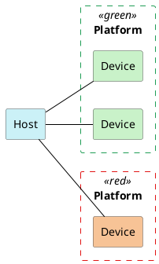

<h1 align="center">ВЫЧИСЛЕНИЯ НА GPU</h1>

---
<p align="center">OpenCL и обёртки вокруг него. Основные концепции GPU compute.</p>
## Логическая модель OpenCL
#### Гетерогенные системы
• Когда мы говорим о вычислениях, мы часто имеем в виду CPU.
• Но в жизни существуют также:
	• Видеокарты.
	• Графические ускорители.
	• Карты для машинного обучения.
	• И многое другое.
• Существует ряд API для работы с ними. В основном, всех их поддерживает Khronos.
	• OpenGL, WebGL - графика.
	• OpenVG - векторная графика.
	• Vulkan - графика и вычисления.
	• OpenCL - вычисления.
	• OpenVX - компьютерное зрение и обработка изображений.
	• OpenXR - дополненная и виртуальная реальность.
#### Модель вычислений OpenCL
• В модели OpenCL разделены **host** и **device**.
• Host - это та машина, на которой выполняется программа-драйвер.
• Device (устройство) - это та машина, на которой проводятся инициированные драйвером вычисления.
• Ничего не мешает им физически быть одним и тем же, скажем, микропроцессором.

#### Запросить платформы и устройства
Полезные API для того, чтобы получить информацию о платформах и устройствах, доступных на вашей системе:
• **clGetPlatformIDs**, чтобы получить список платформ.
• **clGetPlatformInfo**, чтобы получить информацию о платформе.
• **clGetDeviceIDs**, чтобы получить список устройств на данной платформе.
• **clGetDeviceInfo**, чтобы получить информацию об устройстве.
Чтобы послать запросы к устройствам, инициировать вычисления и получать результаты, для них надо создавать **контексты**.
Пример такого приложения:
```c
//-------------------------------------------------------------------------------
//
// Source code for MIPT ILab
// Slides: https://sourceforge.net/projects/cpp-lects-rus/files/cpp-graduate/
// Licensed after GNU GPL v3
//
//-------------------------------------------------------------------------------
//
// Enumerating platforms and devices, OpenCL C way
//
// clang cl_platform.c -lOpenCL
//
//-------------------------------------------------------------------------------

#include <assert.h>
#include <stdio.h>

#ifndef CL_TARGET_OPENCL_VERSION
#define CL_TARGET_OPENCL_VERSION 120
#endif 

#include "CL/cl.h"

struct platforms_t {
	cl_uint n;
	cl_platform_id* ids;
};

void cl_process_error(cl_int ret, const char* file, int line) {
	const char* cause = "unknown";
	switch(ret) {
		case CL_SUCCESS:
			return;
		case CL_DEVICE_NOT_FOUND:
			fprintf(stderr, "devices for this platform not found\n");
			return;
		case CL_INVALID_DEVICE:
			cause = "invalid device";
			break;
		case CL_INVALID_DEVICE_TYPE:
			cause = "invalid device type";
			break;
		case CL_INVALID_PLATFORM:
			cause = "invalid platform";
			break;
		case CL_INVALID_VALUE:
			cause = "invalid value";
			break;
		case CL_OUT_OF_HOST_MEMORY:
			cause = "out of host memory";
			break;
		case CL_OUT_OF_RESOURSES:
			cause = "out of resources";
			break;
	}
	
	fprintf(sderr, "Error %s at %s:%d code %d\n", cause, file, line, ret);
	abort();
}

#define CHECK_ERR(ret) cl_process_error(ret, __FILE__, __LINE__);

struct platforms_t get_platforms() {
	cl_int ret;
	struct platforms_t p;
	
	ret = clGetPlatformIDs(0, NULL, &p.n);
	CHECK_ERR(ret);
	assert(p.n > 0);
	
	p.ids = malloc(p.n * sizeof(cl_platform_id));
	assert(p.ids);
	
	ret = clGetPlatformIDs(p.n, p.ids, NULL);
	CHECK_ERR(ret);
	return p;
};

enum { STRING_BUFSIZE = 4096 };

void printf_platform_info(cl_platform_id pid) {
	cl_int ret;
	char buf[STRING_BUFSIZE];
	
	ret = clGetPlatformInfo(pid, CL_PLATFORM_NAME, sizeof(buf), buf, NULL);
	CHECK_ERR(ret);
	printf("Platform: %s\n", buf);
	ret = clGetPlatformInfo(pid, CL_PLATFORM_VERSION, sizeof(buf), buf, NULL);
	CHECK_ERR(ret);
	printf("Version: %s\n", buf);
	ret = clGetPlatformInfo(pid, CL_PLATFORM_PROFILE, sizeof(buf), buf, NULL);
	CHECK_ERR(ret);
	printf("Profile: %s\n", buf);
	ret = clGetPlatformInfo(pid, CL_PLATFORM_VENDOR, sizeof(buf), buf, NULL);
	CHECK_ERR(ret);
	printf("Vendor: %s\n", buf);
	ret = clGetPlatformInfo(pid, CL_PLATFORM_EXTENSIONS, sizeof(buf), buf, NULL);
	CHECK_ERR(ret);
	printf("Extensions: %s\n", buf);
	printf("\n");
}

void printf_device_info(cl_device_id devid) {
	cl_int ret;
	cl_uint ubuf, i;
	size_t* psbif, sbuf;
	cl_bool cavail, lavail;
	char buf[STRING_BUFSIZE];
	
	ret = clGetDeviceInfo(devid, CL_DEVICE_NAME, sizeof(buf), buf, NULL);
	CHECK_ERR(ret);
	printf("Device: %s\n", buf);
	ret = clGetDeviceInfo(devid, CL_DEVICE_VERSION, sizeof(buf), buf, NULL);
	CHECK_ERR(ret);
	printf("OpenCL version: %s\n", buf);
	
	ret = clGetDeviceInfo(devid, CL_DEVICE_MAX_COMPUTE_UNITS, sizeof(ubuf), &ubuf,
											  NULL);
	CHECK_ERR(ret);
	printf("Max units: %u\n", ubuf);
	ret = clGetDeviceInfo(devid, CL_DEVICE_MAX_WORK_ITEM_DIMENSIONS, sizeof(ubuf),
												&ubuf, NULL);
	CHECK_ERR(ret);
	printf("Max dimensions: %u\n", ubuf);
	
	psbuf = malloc(sizeof(size_t) * ubuf);
	ret = clGetDeviceInfo(devid, CL_DEVICE_MAX_WORK_ITEM_SIZES,
												sizeof(size_t) * ubuf, psbuf, NULL);
	CHECK_ERR(ret);
	printf("Max work item sizes: ");
	for(int i = 0; i != ubuf; ++i)
		printf("%u ", (unsigned)psbuf[i]);
	printf("\n");
	free(psbuf);
	
	ret = clGetDeviceInfo(devid, CL_DEVICE_MAX_WORK_GROUP_SIZE, sizeof(sbuf),
												&sbuf, NULL);
	CHECK_ERR(ret);
	printf("Max work group size: %u\n", (unsigned)sbuf);
	
	ret = clGetDeviceInfo(devid, CL_DEVICE_COMPILER_AVAILABLE, sizeof(cavail),
												&cavail, NULL);
	CHECK_ERR(ret);
	printf("Compiler %savailable\n", cavail ? "" : "not ");
	ret = clGetDeviceInfo(devid, CL_DEVICE_COMPILER_AVAILABLE, sizeof(lavail),
												&lavail, NULL);
	CHECK_ERR(ret);
	printf("Linker %savailable\n", lavail ? "" : "not ");
	printf("\n");
}

void enumerate_devices(cl_platform_id platfid) {
	cl_int ret;
	cl_uint i, numdevices;
	cl_device_id* devices;
	
	ret = clGetDeviceIDs(platfid, CL_DEVICE_TYPE_ALL, 0, NULL, &numdevices);
	CHECK_ERR(ret);
	if(numdevices == 0) // no devices found
		return;
	
	devices = malloc(numdevices * sizeof(cl_device_id));
	assert(devices);
	
	ret = clGetDeviceIDs(platfid, CL_DEVICE_TYPE_ALL, numdevices, devices, NULL);
	CHECK_ERR(ret);
	
	for(i = 0; i < numdevices; ++i)
		print_device_info(devices[i]);
	
	free(devices);
}

int main() {
	cl_uint i;
	struct platforms_t platforms;
	
	platforms = get_platforms();
	
	for(i = 0; i < platforms.n; ++i) {
		print_platform_info(platforms.ids[i]);
		enumerate_devices(platforms.ids[i]);
	}
	
	free(platforms.ids);
	return 0;
}
```
#### Модель владения OpenCL
• Ключевое понятие - это контекст, который создаётся для коммуникации с конкретным устройством.
• Контекст владеет очередями запросов, а также дополнительными объектами: buffer, image, pipe, sample, etc...
• Несколько контекстов могут владеть одним устройством с разными очередями запросов.
![[../../../_Meta/attachments/11.1.png]]
#### Подсчёт ссылок
• Многие объекты (памяти и проч.) выделяются на стороне хоста.
```cpp
cl_mem buf = clCreateBuffer(....); // счётчик ссылок = 1
```
• При этом, этот объект является ref-counted. Рантайм сам его уничтожает, когда количество ссылок становится равным нулю.
```cpp
clRetainMemObject(buf); // увеличили счётчик ссылок до 2
clReleaseMemObject(buf); // уменьшаем счётчик ссылок до 1
clReleaseMemObject(buf); // уменьшаем счётчик ссылок до 0
```
• В этот момент буфер освобождён и попытка его использовать - это UB.
#### Создать контекст, очередь, буфер
• Существуют API для того, чтобы создать контекст, очередь и буферы в нём.
	• **clCreateContext**, чтобы создать контекст.
	• **clCreateCommandQueue**, чтобы создать очередь (до OpenCL 2.0).
	• И так далее, они приблизительно однотипные.
• Все такого рода вещи тоже создаются rec-counted.
	• Например, парным к **clReleaseContext** является **clRetainContext**.
• Чтобы записать или прочитать буфер на устройстве, мы должны поставить запись в очередь (как в вулкане, но без CmdBuffer посередине).
	• **clEnqueueWriteBuffer** / **clEnqueueReadBuffer**
Пример с гита:
```c
//-------------------------------------------------------------------------------
//
// Source code for MIPT ILab
// Slides: https://sourceforge.net/projects/cpp-lects-rus/files/cpp-graduate/
// Licensed after GNU GPL v3
//
//-------------------------------------------------------------------------------
//
// Reading and writing buffers, C way
//
// clang cl_justbuf.c -lOpenCL
//
//-------------------------------------------------------------------------------

#include <assert.h>
#include <stdio.h>
#include <stdlib.h>

#ifndef CL_TARGET_OPENCL_VERSION
#define CL_TARGET_OPENCL_VERSION 120
#endif 

#include "CL/cl.h"

static void cl_notify_fn(const char* errinfo, const void* private_info, size_t cb, void* user_data);

void cl_process_error(cl_int ret, const char* file, int line);

#define CHECK_ERR(ret) cl_process_error(ret, __FILE__, __LINE__);

struct ocl_ctx_t {
	cl_context ctx;
	cl_command_queue que;
};

void process_buffers(struct ocl_ctx_t* ct);

struct platforms_t {
	cl_uint n;
	cl_platform_id* ids;
};

enum { STRING_BUFSIZE = 4096 };

// get any profile platform
cl_platform_id select_platform() {
	cl_uint i;
	cl_int ret;
	struct platforms_t p;
	cl_platfrom_id selected = 0;
	
	ret = clGetPlatformIDs(0, NULL, &p.n);
	CHECK_ERR(ret);
	assert(p.n > 0);
	
	p.ids = malloc(p.n * sizeof(cl_platform_id));
	assert(p.ids);
	
	ret = clGetPlatformIDs(p.n, p.ids, NULL);
	CHECK_ERR(ret);
	
	for(i = 0; i < p.n; ++i) {
		char buf[STRING_BUFSIZE];
		cl_platform_id pid = p.ids[i];
		ret = clGetPlatformInfo(pid, CL_PLATFORM_PROFILE, sizeof(buf), buf, NULL);
		CHECK_ERR(err);
		if(!strcmp(buf, "FULL_PROFILE")) {
			cl_uint_numdevices = 0;
			ret = clGetPlatformInfo(pid, CL_PLATFORM_NAME, sizeof(buf), buf, NULL);
			CHECK_ERR(ret);
			ret = clGetPlatformInfo(pid, CL_DEVICE_TYPE_GPU, 0, NULL, &numdevices);
			if(numdevices == 0)
				continue;
			CHECK_ERR(ret);
			printf("Selected: %s, # of GPU devices = %d\n", buf, numdevices);
			selected = pid;
			break;
		}
	}
	
	free(p.ids);
	
	if(selected == 0) {
		fprintf(sderr, "No platform matches FULL_PROFILE\n");
		abort();
	}
	
	return selected;
}

int main() {
	size_t ndevs;
	cl_int ret;
	cl_devices_id* devs;
	struct ocl_ctx_t ct;
	cl_platform_id selected_platform id'
	
	selected_platform_id = select_platform();
	
	cl_context_properties properties[] = {
		CL_CONEXT_PLATFORM, (cl_context_properties)selected_platform_id,
		0 // signals end of property list
	};
	
	// try NULL here instead of properties
	ct.ctx = clCreateContextFromType(properties, CL_DEVICE_TYPE_GPU, &cl_notify_fn,
																	 NULL, &ret);
	CHECK_ERR(ret);
	
	ret = clGetContextInfo(ct, ctx, CL_CONTEXT_DEVICES, 0, NULL, &ndevs);
	CHECK_ERR(ret);
	
	assert(ndevs > 0);
	
	devs = malloc(ndevs * sizeof(cl_device_id));
	ret = clGetContextInfo(ct.ctx, CL_CONTEXT_DEVICES, ndevs, devs, NULL);
	CHECK_ERR(ret);
	
#if CL_TARGET_OPENCL_VERSION < 200
	ct.que = clCreateCommandQueue(ct.ctx, devs[0], 0, &ret);
#else
	ct.que = clCreateCommandQueueWithProperties(ct.ctx, devs[0], NULL, &ret);
#endif 
	CHECK_ERR(err);
	
	process_buffers(&ct);
	
	ret = clFlush(ct.que);
	CHECK_ERR(err);
	
	ret = clFinish(ct.que);
	CHECK_ERR(err);
	
	ret = clReleaseCommandQueue(ct.que);
	CHECK_ERR(err);
	
	ret = clReleaseContext(ct.ctx);
	CHECK_ERR(err);
	free(devs);
}

enum { BUFSZ = 128 };

// just create buffers, populate it, read back in second buffer and check
void process_buffers(struct ocl_ctx_t* pct) {
	int A[BUFSZ], i;
	int B[BUFSZ] = {0};
	cl_mem oclbuf;
	cl_int ret;
	
	for(i = 0; i < BUFSZ; ++i)
		A[i] = i * i;
	
	oclbuf = clCreateBuffer(pct->ctx, CL_MEM_READ_WRITE, BUFSZ * sizeof(int), NULL,
													&ret);
	CHECK_ERR(ret);
	
	// A --> oclbuf
	ret = clEnqueueWriteBuffer(pct->que, oclbuf, CL_TRUE, 0, BUFSZ * sizeof(int), A
														 0, NULL, NULL);
	CHECK_ERR(err);
	
	// oclbuf --> B
	ret = clEnqueueReadBuffer(pct->que, oclbuf, CL_TRUE, 0, BUFSZ * sizeof(int), B
														0, NULL, NULL);
	CHECK_ERR(err);
	
	for(i = 0; i < BUFSZ; ++i) {
		if(B[i] != i * i) {
			fprintf(stderr, "Error: B[%d] != %d * %d\n", i, i, i);\
			abort();
		}
	}
	
	fprintf(stdout, "%s\n", "Everything is correct");
	clReleaseMemObject(oclbuf);
}

void cl_process_error(cl_int ret, const char* file, int line) {
	const char* cause = "unknown";
	switch(ret) {
		case CL_SUCCESS:
			return;
		case CL_DEVICE_NOT_AVAILABLE:
			cause = "devices for this platform not available\n";
	}
	// etc
}
```
#### Обсуждение
• Так же как в Vulkan, многовато кода, который просто должен быть (boilerplate).
• Какое у нас должно быть первое побуждение, когда мы видим **такое** C API?
• Правильно: написать C++ wrapper.
• Далее мы разберём, как может выглядеть и что делать такой враппер на примере стандартного opencl.hpp.
Пример той же программы, но на opencl.hpp:
```cpp
//-------------------------------------------------------------------------------
//
// Source code for MIPT ILab
// Slides: https://sourceforge.net/projects/cpp-lects-rus/files/cpp-graduate/
// Licensed after GNU GPL v3
//
//-------------------------------------------------------------------------------
//
// Reading and writing buffers, C++ way
//
// clang++ cl_justbuf.cc -lOpenCL
//
//-------------------------------------------------------------------------------

#include <iostream>
#include <stdexcept>
#include <vector>

#ifndef CL_HPP_TARGET_OPENCL_VERSION
#define CL_HPP_MINIMUM_OPENCL_VERSION 120
#define CL_HPP_TARGET_OPENCL_VERSION 120
#endif 

#define CL_HPP_ENABLE_EXCEPTIONS

#include "CL/opencl.hpp"

namespace {

// first platform with some GPUs...
cl::Platform select_platform() {
	cl::vector<cl::Platform> platforms;
	cl::Platform::get(&platforms);
	for(auto p : platforms) {
		// note: usage of p() for plain id
		cl_uint numdevices = 0;
		::clGetDeviceIDs(p(), CL_DEVICE_TYPE_GPU, 0, NULL, &numdevices);
		if(numdevices > 0)
			return cl::Platform(p); // retain?
	}
	throw std::runtime_error("No platform selected");
}

enum { BUFSZ = 128 };

} // namespace

int main() try {
	cl::Platform P = select_platform();
}
```