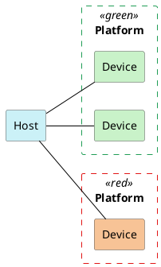
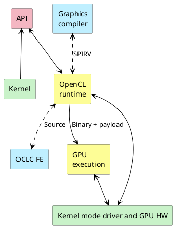

<h1 align="center">ВЫЧИСЛЕНИЯ НА GPU</h1>

---
<p align="center">OpenCL и обёртки вокруг него. Основные концепции GPU compute.</p>
## Логическая модель OpenCL
#### Гетерогенные системы
• Когда мы говорим о вычислениях, мы часто имеем в виду CPU.
• Но в жизни существуют также:
	• Видеокарты.
	• Графические ускорители.
	• Карты для машинного обучения.
	• И многое другое.
• Существует ряд API для работы с ними. В основном, всех их поддерживает Khronos.
	• OpenGL, WebGL - графика.
	• OpenVG - векторная графика.
	• Vulkan - графика и вычисления.
	• OpenCL - вычисления.
	• OpenVX - компьютерное зрение и обработка изображений.
	• OpenXR - дополненная и виртуальная реальность.
#### Модель вычислений OpenCL
• В модели OpenCL разделены **host** и **device**.
• Host - это та машина, на которой выполняется программа-драйвер.
• Device (устройство) - это та машина, на которой проводятся инициированные драйвером вычисления.
• Ничего не мешает им физически быть одним и тем же, скажем, микропроцессором.

#### Запросить платформы и устройства
Полезные API для того, чтобы получить информацию о платформах и устройствах, доступных на вашей системе:
• **clGetPlatformIDs**, чтобы получить список платформ.
• **clGetPlatformInfo**, чтобы получить информацию о платформе.
• **clGetDeviceIDs**, чтобы получить список устройств на данной платформе.
• **clGetDeviceInfo**, чтобы получить информацию об устройстве.
Чтобы послать запросы к устройствам, инициировать вычисления и получать результаты, для них надо создавать **контексты**.
Пример такого приложения:
```c
//-------------------------------------------------------------------------------
//
// Source code for MIPT ILab
// Slides: https://sourceforge.net/projects/cpp-lects-rus/files/cpp-graduate/
// Licensed after GNU GPL v3
//
//-------------------------------------------------------------------------------
//
// Enumerating platforms and devices, OpenCL C way
//
// clang cl_platform.c -lOpenCL
//
//-------------------------------------------------------------------------------

#include <assert.h>
#include <stdio.h>

#ifndef CL_TARGET_OPENCL_VERSION
#define CL_TARGET_OPENCL_VERSION 120
#endif 

#include "CL/cl.h"

struct platforms_t {
	cl_uint n;
	cl_platform_id* ids;
};

void cl_process_error(cl_int ret, const char* file, int line) {
	const char* cause = "unknown";
	switch(ret) {
		case CL_SUCCESS:
			return;
		case CL_DEVICE_NOT_FOUND:
			fprintf(stderr, "devices for this platform not found\n");
			return;
		case CL_INVALID_DEVICE:
			cause = "invalid device";
			break;
		case CL_INVALID_DEVICE_TYPE:
			cause = "invalid device type";
			break;
		case CL_INVALID_PLATFORM:
			cause = "invalid platform";
			break;
		case CL_INVALID_VALUE:
			cause = "invalid value";
			break;
		case CL_OUT_OF_HOST_MEMORY:
			cause = "out of host memory";
			break;
		case CL_OUT_OF_RESOURSES:
			cause = "out of resources";
			break;
	}
	
	fprintf(sderr, "Error %s at %s:%d code %d\n", cause, file, line, ret);
	abort();
}

#define CHECK_ERR(ret) cl_process_error(ret, __FILE__, __LINE__);

struct platforms_t get_platforms() {
	cl_int ret;
	struct platforms_t p;
	
	ret = clGetPlatformIDs(0, NULL, &p.n);
	CHECK_ERR(ret);
	assert(p.n > 0);
	
	p.ids = malloc(p.n * sizeof(cl_platform_id));
	assert(p.ids);
	
	ret = clGetPlatformIDs(p.n, p.ids, NULL);
	CHECK_ERR(ret);
	return p;
};

enum { STRING_BUFSIZE = 4096 };

void printf_platform_info(cl_platform_id pid) {
	cl_int ret;
	char buf[STRING_BUFSIZE];
	
	ret = clGetPlatformInfo(pid, CL_PLATFORM_NAME, sizeof(buf), buf, NULL);
	CHECK_ERR(ret);
	printf("Platform: %s\n", buf);
	ret = clGetPlatformInfo(pid, CL_PLATFORM_VERSION, sizeof(buf), buf, NULL);
	CHECK_ERR(ret);
	printf("Version: %s\n", buf);
	ret = clGetPlatformInfo(pid, CL_PLATFORM_PROFILE, sizeof(buf), buf, NULL);
	CHECK_ERR(ret);
	printf("Profile: %s\n", buf);
	ret = clGetPlatformInfo(pid, CL_PLATFORM_VENDOR, sizeof(buf), buf, NULL);
	CHECK_ERR(ret);
	printf("Vendor: %s\n", buf);
	ret = clGetPlatformInfo(pid, CL_PLATFORM_EXTENSIONS, sizeof(buf), buf, NULL);
	CHECK_ERR(ret);
	printf("Extensions: %s\n", buf);
	printf("\n");
}

void printf_device_info(cl_device_id devid) {
	cl_int ret;
	cl_uint ubuf, i;
	size_t* psbif, sbuf;
	cl_bool cavail, lavail;
	char buf[STRING_BUFSIZE];
	
	ret = clGetDeviceInfo(devid, CL_DEVICE_NAME, sizeof(buf), buf, NULL);
	CHECK_ERR(ret);
	printf("Device: %s\n", buf);
	ret = clGetDeviceInfo(devid, CL_DEVICE_VERSION, sizeof(buf), buf, NULL);
	CHECK_ERR(ret);
	printf("OpenCL version: %s\n", buf);
	
	ret = clGetDeviceInfo(devid, CL_DEVICE_MAX_COMPUTE_UNITS, sizeof(ubuf), &ubuf,
											  NULL);
	CHECK_ERR(ret);
	printf("Max units: %u\n", ubuf);
	ret = clGetDeviceInfo(devid, CL_DEVICE_MAX_WORK_ITEM_DIMENSIONS, sizeof(ubuf),
												&ubuf, NULL);
	CHECK_ERR(ret);
	printf("Max dimensions: %u\n", ubuf);
	
	psbuf = malloc(sizeof(size_t) * ubuf);
	ret = clGetDeviceInfo(devid, CL_DEVICE_MAX_WORK_ITEM_SIZES,
												sizeof(size_t) * ubuf, psbuf, NULL);
	CHECK_ERR(ret);
	printf("Max work item sizes: ");
	for(int i = 0; i != ubuf; ++i)
		printf("%u ", (unsigned)psbuf[i]);
	printf("\n");
	free(psbuf);
	
	ret = clGetDeviceInfo(devid, CL_DEVICE_MAX_WORK_GROUP_SIZE, sizeof(sbuf),
												&sbuf, NULL);
	CHECK_ERR(ret);
	printf("Max work group size: %u\n", (unsigned)sbuf);
	
	ret = clGetDeviceInfo(devid, CL_DEVICE_COMPILER_AVAILABLE, sizeof(cavail),
												&cavail, NULL);
	CHECK_ERR(ret);
	printf("Compiler %savailable\n", cavail ? "" : "not ");
	ret = clGetDeviceInfo(devid, CL_DEVICE_COMPILER_AVAILABLE, sizeof(lavail),
												&lavail, NULL);
	CHECK_ERR(ret);
	printf("Linker %savailable\n", lavail ? "" : "not ");
	printf("\n");
}

void enumerate_devices(cl_platform_id platfid) {
	cl_int ret;
	cl_uint i, numdevices;
	cl_device_id* devices;
	
	ret = clGetDeviceIDs(platfid, CL_DEVICE_TYPE_ALL, 0, NULL, &numdevices);
	CHECK_ERR(ret);
	if(numdevices == 0) // no devices found
		return;
	
	devices = malloc(numdevices * sizeof(cl_device_id));
	assert(devices);
	
	ret = clGetDeviceIDs(platfid, CL_DEVICE_TYPE_ALL, numdevices, devices, NULL);
	CHECK_ERR(ret);
	
	for(i = 0; i < numdevices; ++i)
		print_device_info(devices[i]);
	
	free(devices);
}

int main() {
	cl_uint i;
	struct platforms_t platforms;
	
	platforms = get_platforms();
	
	for(i = 0; i < platforms.n; ++i) {
		print_platform_info(platforms.ids[i]);
		enumerate_devices(platforms.ids[i]);
	}
	
	free(platforms.ids);
	return 0;
}
```
#### Модель владения OpenCL
• Ключевое понятие - это контекст, который создаётся для коммуникации с конкретным устройством.
• Контекст владеет очередями запросов, а также дополнительными объектами: buffer, image, pipe, sample, etc...
• Несколько контекстов могут владеть одним устройством с разными очередями запросов.
![[../../../_Meta/attachments/11.1.png]]
#### Подсчёт ссылок
• Многие объекты (памяти и проч.) выделяются на стороне хоста.
```cpp
cl_mem buf = clCreateBuffer(....); // счётчик ссылок = 1
```
• При этом, этот объект является ref-counted. Рантайм сам его уничтожает, когда количество ссылок становится равным нулю.
```cpp
clRetainMemObject(buf); // увеличили счётчик ссылок до 2
clReleaseMemObject(buf); // уменьшаем счётчик ссылок до 1
clReleaseMemObject(buf); // уменьшаем счётчик ссылок до 0
```
• В этот момент буфер освобождён и попытка его использовать - это UB.
#### Создать контекст, очередь, буфер
• Существуют API для того, чтобы создать контекст, очередь и буферы в нём.
	• **clCreateContext**, чтобы создать контекст.
	• **clCreateCommandQueue**, чтобы создать очередь (до OpenCL 2.0).
	• И так далее, они приблизительно однотипные.
• Все такого рода вещи тоже создаются rec-counted.
	• Например, парным к **clReleaseContext** является **clRetainContext**.
• Чтобы записать или прочитать буфер на устройстве, мы должны поставить запись в очередь (как в вулкане, но без CmdBuffer посередине).
	• **clEnqueueWriteBuffer** / **clEnqueueReadBuffer**
Пример с гита:
```c
//-------------------------------------------------------------------------------
//
// Source code for MIPT ILab
// Slides: https://sourceforge.net/projects/cpp-lects-rus/files/cpp-graduate/
// Licensed after GNU GPL v3
//
//-------------------------------------------------------------------------------
//
// Reading and writing buffers, C way
//
// clang cl_justbuf.c -lOpenCL
//
//-------------------------------------------------------------------------------

#include <assert.h>
#include <stdio.h>
#include <stdlib.h>

#ifndef CL_TARGET_OPENCL_VERSION
#define CL_TARGET_OPENCL_VERSION 120
#endif 

#include "CL/cl.h"

static void cl_notify_fn(const char* errinfo, const void* private_info, size_t cb, void* user_data);

void cl_process_error(cl_int ret, const char* file, int line);

#define CHECK_ERR(ret) cl_process_error(ret, __FILE__, __LINE__);

struct ocl_ctx_t {
	cl_context ctx;
	cl_command_queue que;
};

void process_buffers(struct ocl_ctx_t* ct);

struct platforms_t {
	cl_uint n;
	cl_platform_id* ids;
};

enum { STRING_BUFSIZE = 4096 };

// get any profile platform
cl_platform_id select_platform() {
	cl_uint i;
	cl_int ret;
	struct platforms_t p;
	cl_platfrom_id selected = 0;
	
	ret = clGetPlatformIDs(0, NULL, &p.n);
	CHECK_ERR(ret);
	assert(p.n > 0);
	
	p.ids = malloc(p.n * sizeof(cl_platform_id));
	assert(p.ids);
	
	ret = clGetPlatformIDs(p.n, p.ids, NULL);
	CHECK_ERR(ret);
	
	for(i = 0; i < p.n; ++i) {
		char buf[STRING_BUFSIZE];
		cl_platform_id pid = p.ids[i];
		ret = clGetPlatformInfo(pid, CL_PLATFORM_PROFILE, sizeof(buf), buf, NULL);
		CHECK_ERR(err);
		if(!strcmp(buf, "FULL_PROFILE")) {
			cl_uint_numdevices = 0;
			ret = clGetPlatformInfo(pid, CL_PLATFORM_NAME, sizeof(buf), buf, NULL);
			CHECK_ERR(ret);
			ret = clGetPlatformInfo(pid, CL_DEVICE_TYPE_GPU, 0, NULL, &numdevices);
			if(numdevices == 0)
				continue;
			CHECK_ERR(ret);
			printf("Selected: %s, # of GPU devices = %d\n", buf, numdevices);
			selected = pid;
			break;
		}
	}
	
	free(p.ids);
	
	if(selected == 0) {
		fprintf(sderr, "No platform matches FULL_PROFILE\n");
		abort();
	}
	
	return selected;
}

int main() {
	size_t ndevs;
	cl_int ret;
	cl_devices_id* devs;
	struct ocl_ctx_t ct;
	cl_platform_id selected_platform id'
	
	selected_platform_id = select_platform();
	
	cl_context_properties properties[] = {
		CL_CONEXT_PLATFORM, (cl_context_properties)selected_platform_id,
		0 // signals end of property list
	};
	
	// try NULL here instead of properties
	ct.ctx = clCreateContextFromType(properties, CL_DEVICE_TYPE_GPU, &cl_notify_fn,
																	 NULL, &ret);
	CHECK_ERR(ret);
	
	ret = clGetContextInfo(ct, ctx, CL_CONTEXT_DEVICES, 0, NULL, &ndevs);
	CHECK_ERR(ret);
	
	assert(ndevs > 0);
	
	devs = malloc(ndevs * sizeof(cl_device_id));
	ret = clGetContextInfo(ct.ctx, CL_CONTEXT_DEVICES, ndevs, devs, NULL);
	CHECK_ERR(ret);
	
#if CL_TARGET_OPENCL_VERSION < 200
	ct.que = clCreateCommandQueue(ct.ctx, devs[0], 0, &ret);
#else
	ct.que = clCreateCommandQueueWithProperties(ct.ctx, devs[0], NULL, &ret);
#endif 
	CHECK_ERR(err);
	
	process_buffers(&ct);
	
	ret = clFlush(ct.que);
	CHECK_ERR(err);
	
	ret = clFinish(ct.que);
	CHECK_ERR(err);
	
	ret = clReleaseCommandQueue(ct.que);
	CHECK_ERR(err);
	
	ret = clReleaseContext(ct.ctx);
	CHECK_ERR(err);
	free(devs);
}

enum { BUFSZ = 128 };

// just create buffers, populate it, read back in second buffer and check
void process_buffers(struct ocl_ctx_t* pct) {
	int A[BUFSZ], i;
	int B[BUFSZ] = {0};
	cl_mem oclbuf;
	cl_int ret;
	
	for(i = 0; i < BUFSZ; ++i)
		A[i] = i * i;
	
	oclbuf = clCreateBuffer(pct->ctx, CL_MEM_READ_WRITE, BUFSZ * sizeof(int), NULL,
													&ret);
	CHECK_ERR(ret);
	
	// A --> oclbuf
	ret = clEnqueueWriteBuffer(pct->que, oclbuf, CL_TRUE, 0, BUFSZ * sizeof(int), A
														 0, NULL, NULL);
	CHECK_ERR(err);
	
	// oclbuf --> B
	ret = clEnqueueReadBuffer(pct->que, oclbuf, CL_TRUE, 0, BUFSZ * sizeof(int), B
														0, NULL, NULL);
	CHECK_ERR(err);
	
	for(i = 0; i < BUFSZ; ++i) {
		if(B[i] != i * i) {
			fprintf(stderr, "Error: B[%d] != %d * %d\n", i, i, i);\
			abort();
		}
	}
	
	fprintf(stdout, "%s\n", "Everything is correct");
	clReleaseMemObject(oclbuf);
}

void cl_process_error(cl_int ret, const char* file, int line) {
	const char* cause = "unknown";
	switch(ret) {
		case CL_SUCCESS:
			return;
		case CL_DEVICE_NOT_AVAILABLE:
			cause = "devices for this platform not available\n";
	}
	// etc
}
```
#### Обсуждение
• Так же как в Vulkan, многовато кода, который просто должен быть (boilerplate).
• Какое у нас должно быть первое побуждение, когда мы видим **такое** C API?
• Правильно: написать C++ wrapper.
• Далее мы разберём, как может выглядеть и что делать такой враппер на примере стандартного opencl.hpp.
Пример той же программы, но на opencl.hpp:
```cpp
//-------------------------------------------------------------------------------
//
// Source code for MIPT ILab
// Slides: https://sourceforge.net/projects/cpp-lects-rus/files/cpp-graduate/
// Licensed after GNU GPL v3
//
//-------------------------------------------------------------------------------
//
// Reading and writing buffers, C++ way
//
// clang++ cl_justbuf.cc -lOpenCL
//
//-------------------------------------------------------------------------------

#include <iostream>
#include <stdexcept>
#include <vector>

#ifndef CL_HPP_TARGET_OPENCL_VERSION
#define CL_HPP_MINIMUM_OPENCL_VERSION 120
#define CL_HPP_TARGET_OPENCL_VERSION 120
#endif 

#define CL_HPP_ENABLE_EXCEPTIONS

#include "CL/opencl.hpp"

namespace {

// first platform with some GPUs...
cl::Platform select_platform() {
	cl::vector<cl::Platform> platforms;
	cl::Platform::get(&platforms);
	for(auto p : platforms) {
		// note: usage of p() for plain id
		cl_uint numdevices = 0;
		::clGetDeviceIDs(p(), CL_DEVICE_TYPE_GPU, 0, NULL, &numdevices);
		if(numdevices > 0)
			return cl::Platform(p); // retain?
	}
	throw std::runtime_error("No platform selected");
}

enum { BUFSZ = 128 };

} // namespace

int main() try {
	cl::Platform P = select_platform();
	cl::string name = P.getInfo<CL_PLATFORM_NAME>();
	cl::string profile = P.getInfo<CL_PLATFORM_PROFILE>();
	std::cout << "Selected: " << name << ": " << profile << std::endl;
	
	cl_context_properties properties[] = {
		CL_CONTEXT_PLATFORM, reinterpret_cast<cl_context_properties>(P()),
		0 // signals end of property list
	};
	
	cl::Context C(CL_DEVICE_TYPE_GPU, properties);
	cl::CommandQueue Q(C);
	
	cl::vector<int> A(BUFSZ), B(BUFSZ);
	for(int i = 0; i < BUFSZ; ++i)
		A[i] = i * i;
	
	cl::Buffer D(C, CL_MEM_READ_WRITE, BUFSZ * sizeof(int));
	
	cl::copy(Q, A.begin(), A.end(), D);
	cl::copy(Q, D, B.begin(), B.end());
	
	for(int i = 0; i < BUFSZ; ++i) {
		if(B[i] != i * i) {
			std::cout << "Error at: " << i << ": " << B[i] << " != " << i * i
								<< std::endl;
			return -1;
		}
	}
	
	std::cout << "Checks passed" << std::endl;
} catch(cl::Error err) {
	std::cerr << "ERROR " << err.err() << ":" << err.what() << std::endl;
	return -1;
}
```
Разницу в количестве строк можно видеть невооружённым глазом. Про читаемость не стоит и говорить.
#### Пересылка буфера на OpenCL C++
```cpp
// Буферы A и B на хоесте
cl::vector<int> A(BUFSZ), B(BUFSZ);

cl::Context Context{CL_DEVICE_TYPE_GPU, properties};
cl::CommandQueue Queue{Context};

// Буфер D на устройстве
cl::Buffer D{Context, CL_MEM_READ_WRITE, BUFSZ * sizeof(int)};

// Пересылка A -> D
cl::copy(Queue, A.begin(), A.end(), D);

// Пересылка D -> B
cl::copy(Queue, D, B.begin(), B.end());
```
#### Модель вычислений OpenCL
• Пересылать данные хорошо, но хотелось бы что-то считать.
• Устройства исполняют ядра (kernels), которые на них отсылаются, попадая в их очередь.
• Исходный код совокупности ядер называется программой (program) и компилируется на устройстве.
• И вот те данные над которыми ядра работают уже пересылаются.
![[../../../_Meta/attachments/11.2.png]]
#### Итерационное пространство задачи
• Посмотрим на kernel для сложения векторов
```openclc
__kernel void
vector_add(__global int* A, __global int* B, __global int* C) {
	int i = get_global_id(0);
	C[i] = A[i] + B[i];
}
```
• Мы пока плохо понимаем, что такое \_\_global.
• Кроме того, такое чувство, что тут написано сложение одного элемента векторов.
• Это связано с тем, что устройство OpenCL - это **SIMT**.
#### Одна инструкция - много потоков
• Аббревиатура SIMT похожа на известную многим SIMD, но разница в нюансах.
• Single instruction - multiple data имеется в виду, что **одна инструкция** работает с большим количеством данных.
• Single instruction - multiple threads  имеется в виду, что **с одной инструкцией** работает большое количество потоков.
• Модель SIMT характерна для сверхпараллельных устройств (GPU, APU) и реализует идею throughput-first вычисления.
• В обычных CPU победила latency-first модель. Процесс посылки задачи на обработку стороннему вычислителю называется **offload**.
#### Итерационное пространство задачи
• В парадигме SIMT, одно ядро исполняется на многих элементах итерационного пространства (range) в параллель.
• В примере vector add мы имели дело с одномерным пространством, но оно может быть и двумерным и трёхмерным.
• Из-за этого самая лучшая задача для OpenCL - это **та, которая лучше всего параллелится**.
![[../../../_Meta/attachments/11.3.png]]
#### Идея глобальной памяти
• Хостовая память - это привычная программисту RAM.
• Устройства состоят из computing units (CU, вычислительные модули).
• Вычислительные модули поддерживают фиксированное количество потоков исполнения.
• Все вычислительные модули внутри утройства имеют общий доступ к его глобальной памяти.
![[../../../_Meta/attachments/11.4.png]]
#### Где мы в глобальной памяти
• По сути, указатель в глобальную память - это uniform переменная.
• А вот global id - это уже varying.
```openclc
__kernel void
vector_add(__global int* A, __global int* B, __global int* C) {
	int i = get_global_id(0); // varying i
	C[i] = A[i] + B[i];
}
```
• Kernel - это точка входа вроде функции main.
• Буфер в глобальной памяти устанавливается на хосте как **аргумент** кернела.
#### C++ API: kernel functor
```cpp
cl::Context Context{CL_DEVICE_TYPE_GPU, prop};
cl::CommandQueue Queue{Context};

// true == build immediately
cl::Program program{Context, vakernel, true};

cl::NDRange GlobalRange{Sz};
cl::EnqueueArgs Args{Queue, GlobalRange};

cl::KernelFunctor<cl::Buffer, cl::Buffer, cl::Buffer>
add_vecs{program, "vector_add"};

// enque, execute, wait
cl::Event evt = add_vecs(Args, A, B, C);
```

Пример с гита:
```cpp
//-------------------------------------------------------------------------------
//
// Source code for MIPT ILab
// Slides: https://sourceforge.net/projects/cpp-lects-rus/files/cpp-graduate/
// Licensed after GNU GPL v3
//
//-------------------------------------------------------------------------------
//
// Simple vectoradd OpenCL application
//
// clang++ -o vectoradd.exe cl_vectoradd.cc -lOpenCL
//
//-------------------------------------------------------------------------------

#include <algorithm>
#include <iostream>
#include <numeric>
#include <stdexcept>
#include <vector>

#ifndef CL_HPP_TARGET_OPENCL_VERSION
#define CL_HPP_MINIMUM_OPENCL_VERSION 120
#define CL_HPP_TARGET_OPENCL_VERSION 120
#endif 

#define CL_HPP_CL_1_2_DEFAULT_BUILD
#define CL_HPP_ENABLE_EXCEPTIONS

#include "CL/opencl.hpp"

#ifndef ANALYZE
#define ANALYZE
#endif 

#define dbgs \
	if (!ANALYZE) { \
	} else \
		std::cout

constexpr size_t ARR_SIZE = 64;
constexpr size_t LOCAL_SIZE = 1;

#define STRINGIFY(...) #__VA_ARGS__

// This example have built-in kernel to easy modify, etc
// -------------------------- OpenCL --------------------------------------------
const char* vakernel = STRINGIFY(__kernel void vector_add(
		__global int* A, __global int* B, __global int* C) {
	int i = get_global_id(0);
	C[i] = A[i] + B[i];
});
// -------------------------- OpenCL --------------------------------------------

// OpenCL application encapsulates platform, context and queue
// We can offload vector addition through its public interface
class OclApp {
	cl::Platform P_;
	cl::Context C_;
	cl::CommandQueue Q_;
	
	static cl::Platform select_platform();
	static cl::Context get_gpu_context(cl_platform_id);
	
	using vadd_t = cl::KernelFunctor<cl::Buffer, cl::Buffer, cl::Buffer>;
	
public:
	OclApp() : P_(select_platform()), C_(get_gpu_context(P_())), Q_(C_) {
		cl::string name = P_.getInfo<CL_PLATFORM_NAME>();
		cl::string profile = P.getInfo<CL_PLATFORM_PROFILE>();
		dbgs << "Selected: " << name << ": " << profile << std::endl;
	}
	
	// C[i] = A[i] + B[i]
	// Here we shall ask ourselves: why not template?
	void vadd(cl_int const* A, cl_int const* B, cl_int* C, size_t Sz);
};

// select first platform with some GPUs
cl::Platform OclApp::select_platform() {
	cl::vector<cl::Platform> platforms;
	cl::Platform::get(&platforms);
	for(auto p : platforms) {
		// note : usage of p() for plain id
		cl_uint numdevices = 0;
		::clGetDeviceIDs(p(), CL_DEVICE_TYPE_GPU, 0, NULL, &numdevices);
		if(numdevices > 0)
			return cl::Platform(p); // retain?
	}
	throw std::runtime_error("No platform selected");
}

// get context for selected platform
cl::Context OclApp::get_gpu_context(cl_platform_id PId) {
	cl_context_properties properties[] = {
		CL_CONTEXT_PLATFORM, reinterpret_cast<cl_context_properties>(PId),
		0 // signals end of property list
	};
	
	return cl::Context(CL_DEVICE_TYPE_GPU, properties);
}

void OclApp::vadd(cl_int const* APtr, cl_int const* BPtr, cl_int* CPtr,
									size_t Sz) {
	size_t BufSz = Sz * sizeof(cl_int);
	
	
	cl::Buffer A(C_, CL_MEM_READ_ONLY, BufSz);
	cl::Buffer B(C_, CL_MEM_READ_ONLY, BufSz);
	cl::Buffer C(C_, CL_MEM_WRITE_ONLY, BufSz);
	
	cl::copy(Q_, APtr, APtr + Sz, A);
	cl::copy(Q_, BPtr, BPtr + Sz, B);
	
	// try forget context here and happy debugging CL_INVALID_MEM_OBJECT:
	// cl::Program program(vakernel, true /* build immediately */);
	cl::Program program(C_, vakernel, true /* build immidiately */);
	
	vadd_t add_vecs(program, "vector_add");
	
	cl::NDRange GlobalRange(Sz);
	cl::NDRange LocalRange(LOCAL_SIZE);
	cl::EnqueueArgs Args(Q_, GlobalRange, LocalRange);
	
	cl::Event evt = add_vecs(Args, A, B, C);
	evt.wait();
	
	cl::copy(Q_, C, CPtr, CPtr + Sz);
}

int main() try {
	OclApp app;
	cl::vector<cl_int> src1(ARR_SIZE), src2(ARR_SIZE), dst(ARR_SIZE);
	
	std::iota(src1.begin(), src1.end(), 0);
	std::iota(src2.begin(), src2.end(), 0);
	
	app.vadd(src1.data(), src2.data(), dst.data(), dst.size());
	
	for(int i = 0; i < ARR_SIZE; ++i) {
		auto lhs = dst[i];
		auto rhs = src1[i] + src2[i];
		if(lhs != rhs) {
			std::cerr << "Error at index " << i << ": " << lhs << " != " << rhs
								<< std::endl;
			return -1;
		}
	}
	std::cout << "All checks passed" << std::endl;
} catch (cl::Error& err) {
	std::cerr << "OCL ERROR " << err.err() << ":" << err.what() << std::endl;
	return -1;
} catch(std::runtime_error& err) {
	std::cerr << "RUNTIME ERROR " << err.what() << std::endl();
	return -1;
} catch(...) {
	std::cerr << "UNKNOWN ERROR\n";
	return -1;
}
```
Если забыть про контекст, будет примерно такая ошибка:
```
Selected: Intel(R) OpenCL HD Graphics: FULL_PROFILE
OCL ERROR -38:clSetKernelArg
```
-38 - это Invalid Memory Object.
#### Информация о выполнении
• Результатом выполнения функтора является Event.
```cpp
cl::Event evt = add_vecs(Args, A, B, C); evt.wait();
```
• Его можно использовать, чтобы подождать результат, а можно для профилировочной информации.
```cpp
time_start = evt.getProfilingInfo<CL_PROFILING_COMMAND_START>();
time_end = evt.getProfilingInfo<CL_PROFILING_COMMAND_END>();
```
• Это позволяет чётко понимать, сколько мы провели, собственно, на GPU, выполняя задачи (из всего потраченного времени).
#### Взаимозависимость кернелов
• В структуре EnqueueArgs мы можем сконфигурировать систему Events.
```cpp
cl::EnqueueArgs Args{Queue, GlobalRange};
cl::Event Evt = add_vecs(Args, A, B, C); // C = A + B
cl::EnqueueArgs DepArgs{Queue, Evt, GlobalRange};
cl::Event Evt = add_vecs(DepArgs, A, C, B); // B = A + C
```
• Здесь мы сказали запускать второе ядро только после выполнения первого.
• Одна из сложностей OpenCL: мы всегда должны думать в терминах асинхронных очередей.
## Память и синхронизация
#### Обсуждение: а что для матриц?
• Вам нужно умножить матрицу (N x M) на матрицу (M x K).
• Что будет элементом итерационного пространства этой задачи?
![[../../../_Meta/attachments/11.5.png]]
#### Case study: перемножение матриц
• Простейшее ядро для перемножения:
```openclc
__kernel void simple_multiply(__global int* A, __global int* B, __global int* C,
															int AX, int AY, int BY) {
	int row = get_global_id(0);
	int col = get_global_id(1);
	int sum = 0;
	
	for(int k = 0; k < AY; k++)
		sum += A[row * AY + k] * B[k * BY + col];
	C[row * BY + col] = sum;
}
```
• Уже даёт ощутимый выигрыш над аналогичной программой для CPU.
#### Обсуждение
• Работа с памятью - это всегда проблемы производительности.
```openclc
for(int k = 0; k < AY; k++)
	sum += A[row * AY + k] * B[k * BY + col];
```
• Можно ли здесь как-то всё улучшить?
• Подумайте, как бы вы подошли к задаче, если бы вы писали программу для обычного CPU?
#### Локальная память в OpenCL
• Каждое вычислительное устройство делится на Processing Elements (в терминологии CUDA threads).
• Все потоки внутри вычислительного устройства имеют общий доступ к локальной памяти.
• Думайте о локальной памяти, как о кэше.
![[../../../_Meta/attachments/11.6.png]]
#### Локальная память: управление с хоста
• Для OpenCL используется модификатор local.
```openclc
__kernel void histogram(__global uchar* data, int nelts, __global int* histogram,
												__local int* local_hist, int bins) {
// ....
	int lid = get_local_id(0); // varying внутри local space
	int gid = get_global_id(0); // varying внутри global space
}
```
• В хостовом C++ API есть специальный псевдо-буффер, обозначающий "тут локальная память" (это буфер с памятью null pointer, ненулевого размера).
```cpp
cl::KernelFunctor hist<cl::Buffer, cl_int, cl::Buffer,
	cl::LocalSpaceArg, cl_int>(program, "histogram");
```
#### Локальная память внутри ядра
```openclc
__kernel void matrix_multiply(__global float* A, __global float* B,
															__global TYPE* C, int AX, int AY, int BY) {
	const int row = get_local_id(0); // Local row ID (max: TS)
	const int col = get_local_id(1); // Local col ID (max: TS)
// ...
	__local TYPE Asub[TS][TS]; // local memory buffer
	__local TYPE Bsub[TS][TS];
}
```
• С хоста в любом случае нужно передать размеры локальной памяти в описании аргументов.
```cpp
cl::EnqueueArgs Args(Queue, GlobalRange, LocalRange);
```
#### Приватная память в OpenCL
• Каждый поток обладает приватной памятью (пока её мало, думайте о ней как о регистрах).
• Соотношение скорости локальной и приватной памяти - это сложный вопрос.
• Работа с локальной и приватной памятью - это высший пилотаж OpenCL.
![[../../../_Meta/attachments/11.7.png]]
#### Summary: память
• Хостовая память.
• Разновидности памяти на устройстве:
	• Private memory (просто переменная внутри ядра).
	• Global memory (обозначается \_\_global).
	• Constant memory (обозначается \_\_constant).
	• Local memory (обозначается \_\_local).
• Shared virtual memory (SVM).
	• Хостовая память, видимая с устройства. Нужна для динамических структур данных (деревья, списки).
#### Case study: улучшаем матрицы
```openclc
// переменные в приватной памяти (на регистрах)
int tiledRow = TS * t + row, tiledCol = TS * t + col;

// временные буферы в локальной памяти
Asub[col][row] = A[globalRaw * AY + tiledCol];
Bsub[col][row] = B[tiledRow * BY + globalCol];

// в цикле используем локальную память и приватную память
for(k = 0; k < TS; k++)
	acc += Asub[k][row] * Bsub[col][k];
```
• Увы, как написано на слайде это не будет работать.
• Дело в том, что потоки бегут с немного разной скоростью.
#### Идея барьеров
![[../../../_Meta/attachments/11.8.png]]
• На картинке сверху показано желаемое поведение.
• Снизу вариант реального поведения из-за рассинхронизации потоков в пределах CU.
![[../../../_Meta/attachments/11.9.png]]
• Для того, чтобы все потоки внутри CU ждали друг друга используется барьер (т.е. разновидность семафора).
• Барьеры могут быть и по глобальной и по локальной памяти.
#### Case study: улучшаем матрицы
```openclc
int tiledRow = TS * t + row, tiledCol = TS * t + col;

Asub[col][row] = A[globalRaw * AY + tiledCol];
Bsub[col][row] = B[tiledRow * BY + globalCol];

// Синхронизируем, чтобы гарантировать, что всё загружено
barrier(CLK_LOCAL_MEM_FENCE);

for(k = 0; k < TS; k++)
	acc += Asub[k][row] * Bsub[col][k];

// Синхронизируем, прежде чем начать следующую загрузку
barrier(CLK_LOCAL_MEM_FENCE);
```
Пример с гита:
```cpp
//-----------------------------------------------------------------------------
//
// Source code for MIPT ILab
// Slides: https://sourceforge.net/projects/cpp-lects-rus/files/cpp-graduate/
// Licensed after GNU GPL v3
//
//-----------------------------------------------------------------------------
//
// Simple SGEMM/DGEMM OpenCL application
// GEMM is operation like: C = alpha * A * B + beta * C
// Here we just doing special case with alpha = 1.0, beta = 0.0
//
// clang++ -std=c++20 -DTYPE=float -o sgemm.exe cl_gemm.cc -lOpenCL
// clang++ -std=c++20 -DTYPE=double -o dgemm.exe cl_gemm.cc -lOpenCL
//
// sgemm.exe -kernel=gemm_simple.cl
// sgemm.exe -kernel=gemm_simple.cl -ay=5120
// sgemm.exe -kernel=gemm_localmem.cl -ay=5120
// sgemm.exe -kernel=gemm_localmem.cl -lsz=4 -ay=5120
//
//-----------------------------------------------------------------------------

#include <algorithm>
#include <cassert>
#include <charconv>
#include <chrono>
#include <sstream>
#include <fstream>
#include <iostream>
#include <numeric>
#include <random>
#include <stdexcept>
#include <string>
#include <string_view>
#include <system_error>
#include <vector>

#ifndef CL_HPP_TARGET_OPENCL_VERSION
#define CL_HPP_MINIMUM_OPENCL_VERSION 120
#define CL_HPP_TARGET_OPENCL_VERSION 120
#endif

#define CL_HPP_CL_1_2_DEFAULT_BUILD
#define CL_HPP_ENABLE_EXCEPTIONS

#include "CL/opencl.hpp"

#ifndef COMPARE_CPU
#define COMPARE_CPU 1
#endif

#ifndef ANALYZE
#define ANALYZE 1
#endif

#define dbgs                                                                   \
  if (!ANALYZE) {                                                              \
  } else                                                                       \
    std::cout

#ifndef TYPE
#define TYPE float
#endif

#define STRINGIFY(X) #X
#define TSTRINGIFY(X) STRINGIFY(X)
#define STYPE TSTRINGIFY(TYPE)

// config for program: we can also read it from options
struct Config {
  int AX = 256 * 2;
  int AY = 256 * 2;
  int BY = 256 * 2;
  int LSZ = 1;
  const char *PATH = "gemm_simple.cl";
  cl::QueueProperties QProps =
      cl::QueueProperties::Profiling | cl::QueueProperties::OutOfOrder;
  static Config readCfg(int argc, char **argv);
  void dump(std::ostream &Os);
};

static std::ostream &operator<<(std::ostream &Os, Config Cfg) {
  Cfg.dump(Os);
  return Os;
}

// used in readcfg
struct option_error : public std::runtime_error {
  option_error(const char *s) : std::runtime_error(s) {}
};

// generic random initialization
template <typename It> void rand_init(It start, It end, TYPE low, TYPE up);

// basic reference multiplication
template <typename T>
void matrix_mult_ref(const T *A, const T *B, T *C, int AX, int AY, int BY);

// cache-friendly reference multiplication
template <typename T>
void transpose_mult_ref(const T *A, const T *B, T *C, int AX, int AY, int BY);

// OpenCL application encapsulates platform, context and queue
// We can offload vector addition through its public interface
class OclApp {
  cl::Platform P_;
  cl::Context C_;
  cl::CommandQueue Q_;
  std::string K_;
  Config Cfg_;

  static cl::Platform select_platform();
  static cl::Context get_gpu_context(cl_platform_id);
  static std::string readFile(const char *);

  using mmult_t =
      cl::KernelFunctor<cl::Buffer, cl::Buffer, cl::Buffer, int, int, int>;

public:
  OclApp(Config Cfg)
      : P_(select_platform()), C_(get_gpu_context(P_())), Q_(C_, Cfg.QProps),
        K_(readFile(Cfg.PATH)), Cfg_(Cfg) {
    std::string Def;
    cl::string name = P_.getInfo<CL_PLATFORM_NAME>();
    cl::string profile = P_.getInfo<CL_PLATFORM_PROFILE>();
    dbgs << "Selected: " << name << ": " << profile << std::endl;

#if ENABLE_EXT
    // example of how to enable OpenCL extension
    Def = "#pragma OPENCL EXTENSION cl_khr_fp64 : enable\n";
    K_ = Def + K_;
#endif
    Def = std::string("#define TYPE ") + STYPE + "\n";
    K_ = Def + K_;
    Def = std::string("#define TS ") + std::to_string(Cfg.LSZ) + "\n";
    K_ = Def + K_;
#if DUMPKERNEL
    dbgs << "-- Kernel --\n" << K_ << "\n-- End kernel --" << std::endl;
#endif
  }

  int localx() const { return Cfg_.LSZ; }
  int localy() const { return Cfg_.LSZ; }

  cl::Event mmult(const TYPE *A, const TYPE *B, TYPE *C, int AX, int AY,
                  int BY);
};

void outm(const TYPE *M, int MX, int MY) {
  for (int i = 0; i < MX; ++i) {
    for (int j = 0; j < MY; ++j)
      std::cout << M[i * MY + j] << " ";
    std::cout << std::endl;
  }
}

int main(int argc, char **argv) try {
  std::chrono::high_resolution_clock::time_point TimeStart, TimeFin;
  cl_ulong GPUTimeStart, GPUTimeFin;
  long Dur, GDur;
  Config Cfg = Config::readCfg(argc, argv);
  dbgs << "Hello from mmult. Config:\n" << Cfg << std::endl;

  OclApp App(Cfg);
  cl::vector<TYPE> A(Cfg.AX * Cfg.AY), B(Cfg.AY * Cfg.BY), C(Cfg.AX * Cfg.BY);

  // random initialize -- we just want to excersize and measure
  rand_init(A.begin(), A.end(), 0, 10);
  rand_init(B.begin(), B.end(), 0, 10);

  // do matrix multiply
  TimeStart = std::chrono::high_resolution_clock::now();
  cl::Event Evt =
      App.mmult(A.data(), B.data(), C.data(), Cfg.AX, Cfg.AY, Cfg.BY);
  TimeFin = std::chrono::high_resolution_clock::now();
  Dur =
      std::chrono::duration_cast<std::chrono::milliseconds>(TimeFin - TimeStart)
          .count();
  std::cout << "GPU wall time measured: " << Dur << " ms" << std::endl;
  GPUTimeStart = Evt.getProfilingInfo<CL_PROFILING_COMMAND_START>();
  GPUTimeFin = Evt.getProfilingInfo<CL_PROFILING_COMMAND_END>();
  GDur = (GPUTimeFin - GPUTimeStart) / 1000000; // ns -> ms
  std::cout << "GPU pure time measured: " << GDur << " ms" << std::endl;

#ifdef VISUALIZE
  std::cout << "--- Matrix ---\n";
  outm(C.data(), Cfg.AX, Cfg.BY);
  std::cout << "--- End Matrix ---\n";
#endif

#if COMPARE_CPU
  cl::vector<TYPE> CCPU(Cfg.AX * Cfg.BY);
  TimeStart = std::chrono::high_resolution_clock::now();
  transpose_mult_ref(A.data(), B.data(), CCPU.data(), Cfg.AX, Cfg.AY, Cfg.BY);
  TimeFin = std::chrono::high_resolution_clock::now();
  Dur =
      std::chrono::duration_cast<std::chrono::milliseconds>(TimeFin - TimeStart)
          .count();
  std::cout << "CPU time measured: " << Dur << " ms" << std::endl;

#ifdef VISUALIZE
  std::cout << "--- Matrix ---\n";
  outm(CCPU.data(), Cfg.AX, Cfg.BY);
  std::cout << "--- End Matrix ---\n";
#endif

  for (int i = 0; i < Cfg.AX * Cfg.BY; ++i) {
    auto lhs = C[i];
    auto rhs = CCPU[i];
    if (lhs != rhs) {
      std::cerr << "Error at index " << i << ": " << lhs << " != " << rhs
                << std::endl;
      return -1;
    }
  }
#endif

  dbgs << "All checks passed" << std::endl;
} catch (cl::BuildError &err) {
  std::cerr << "OCL BUILD ERROR: " << err.err() << ":" << err.what()
            << std::endl;
  std::cerr << "-- Log --\n";
  for (auto e : err.getBuildLog())
    std::cerr << e.second;
  std::cerr << "-- End log --\n";
  return -1;
} catch (cl::Error &err) {
  std::cerr << "OCL ERROR: " << err.err() << ":" << err.what() << std::endl;
  return -1;
} catch (option_error &err) {
  std::cerr << "INVALID OPTION: " << err.what() << std::endl;
  return -1;
} catch (std::runtime_error &err) {
  std::cerr << "RUNTIME ERROR: " << err.what() << std::endl;
  return -1;
} catch (...) {
  std::cerr << "UNKNOWN ERROR\n";
  return -1;
}

//-----------------------------------------------------------------------------
//
// OclApp methods
//
//-----------------------------------------------------------------------------

cl::Event OclApp::mmult(const TYPE *APtr, const TYPE *BPtr, TYPE *CPtr, int AX,
                        int AY, int BY) {
  size_t ASz = AX * AY, ABufSz = ASz * sizeof(TYPE);
  size_t BSz = AY * BY, BBufSz = BSz * sizeof(TYPE);
  size_t CSz = AX * BY, CBufSz = CSz * sizeof(TYPE);

  cl::Buffer A(C_, CL_MEM_READ_ONLY, ABufSz);
  cl::Buffer B(C_, CL_MEM_READ_ONLY, BBufSz);
  cl::Buffer C(C_, CL_MEM_WRITE_ONLY, CBufSz);

  cl::copy(Q_, APtr, APtr + ASz, A);
  cl::copy(Q_, BPtr, BPtr + ASz, B);

  // try forget context here and happy debugging CL_INVALID_MEM_OBJECT:
  // cl::Program program(vakernel, true /* build immediately */);
  cl::Program program(C_, K_, true /* build immediately */);

  mmult_t gemm(program, "matrix_multiply");

  cl::NDRange GlobalRange(AX, BY); // do you understand why C size here?
  cl::NDRange LocalRange(localx(), localy());
  cl::EnqueueArgs Args(Q_, GlobalRange, LocalRange);

  cl::Event Evt = gemm(Args, A, B, C, AX, AY, BY);
  Evt.wait();

  cl::copy(Q_, C, CPtr, CPtr + CSz);
  return Evt;
}

// read program code from file
std::string OclApp::readFile(const char *Path) {
  std::string Code;
  std::ifstream ShaderFile;
  ShaderFile.exceptions(std::ifstream::failbit | std::ifstream::badbit);
  ShaderFile.open(Path);
  std::stringstream ShaderStream;
  ShaderStream << ShaderFile.rdbuf();
  ShaderFile.close();
  Code = ShaderStream.str();
  return Code;
}

// select first platform with some GPUs
cl::Platform OclApp::select_platform() {
  cl::vector<cl::Platform> platforms;
  cl::Platform::get(&platforms);
  for (auto p : platforms) {
    // note: usage of p() for plain id
    cl_uint numdevices = 0;
    ::clGetDeviceIDs(p(), CL_DEVICE_TYPE_GPU, 0, NULL, &numdevices);
    if (numdevices > 0)
      return cl::Platform(p); // retain?
  }
  throw std::runtime_error("No platform selected");
}

// get context for selected platform
cl::Context OclApp::get_gpu_context(cl_platform_id PId) {
  cl_context_properties properties[] = {
      CL_CONTEXT_PLATFORM, reinterpret_cast<cl_context_properties>(PId),
      0 // signals end of property list
  };

  return cl::Context(CL_DEVICE_TYPE_GPU, properties);
}

//-----------------------------------------------------------------------------
//
// Config methods
//
//-----------------------------------------------------------------------------

// options are:
// -ax=<int>
// -ay=<int>
// -by=<int>
// -lsz=<int>
// -kernel=<string>
// I don't want to make study example depend from boost::po, so keep it simple
Config Config::readCfg(int argc, char **argv) {
  Config Cfg;
  for (int i = 1; i < argc; ++i) {
    std::string_view Argvi = argv[i];
    auto ArgviEnd = Argvi.data() + Argvi.size();
    if (Argvi.starts_with("-ax=")) {
      auto Result = std::from_chars(Argvi.data() + 4, ArgviEnd, Cfg.AX);
      if (Result.ec == std::errc::invalid_argument)
        std::cerr << "Can not parse -ax option, using default\n";
    } else if (Argvi.starts_with("-ay=")) {
      auto Result = std::from_chars(Argvi.data() + 4, ArgviEnd, Cfg.AY);
      if (Result.ec == std::errc::invalid_argument)
        std::cerr << "Can not parse -ay option, using default\n";
    } else if (Argvi.starts_with("-by=")) {
      auto Result = std::from_chars(Argvi.data() + 4, ArgviEnd, Cfg.BY);
      if (Result.ec == std::errc::invalid_argument)
        std::cerr << "Can not parse -by option, using default\n";
    } else if (Argvi.starts_with("-lsz=")) {
      auto Result = std::from_chars(Argvi.data() + 5, ArgviEnd, Cfg.LSZ);
      if (Result.ec == std::errc::invalid_argument)
        std::cerr << "Can not parse -lsz option, using default\n";
    } else if (Argvi.starts_with("-kernel=")) {
      Cfg.PATH = argv[i] + 8;
    } else {
      throw option_error(argv[i]);
    }
  }
  return Cfg;
}

// dump config to stream
void Config::dump(std::ostream &Os) {
  Os << "[" << AX << " x " << AY << "] * ";
  Os << "[" << AY << " x " << BY << "]\n";
  Os << "local size = [" << LSZ << " x " << LSZ << "]\n";
  Os << "kernel path = " << PATH;
}

//-----------------------------------------------------------------------------
//
// Helpers
//
//-----------------------------------------------------------------------------

// generic random initialization
template <typename It> void rand_init(It start, It end, TYPE low, TYPE up) {
  static std::mt19937_64 mt_source;
  std::uniform_int_distribution<int> dist(low, up);
  for (It cur = start; cur != end; ++cur)
    *cur = dist(mt_source);
}

// multiply on CPU, basic version
template <typename T>
void matrix_mult_ref(const T *A, const T *B, T *C, int AX, int AY, int BY) {
  assert(A != NULL && B != NULL && C != NULL);
  assert(AX > 0 && AY > 0 && BY > 0);
  int i, j, k;
  for (i = 0; i < AX; i++) {
    for (j = 0; j < BY; j++) {
      T acc = 0;
      for (k = 0; k < AY; k++)
        acc += A[i * AY + k] * B[k * BY + j];
      C[i * BY + j] = acc;
    }
  }
}

// multiply on CPU, cache-friendly version
template <typename T>
void transpose_mult_ref(const T *A, const T *B, T *C, int AX, int AY, int BY) {
  assert(A != NULL && B != NULL && C != NULL);
  assert(AX > 0 && AY > 0 && BY > 0);
  std::vector<T> tmp(BY * AY);
  int i, j, k;

  for (i = 0; i < AY; i++)
    for (j = 0; j < BY; j++)
      tmp[j * AY + i] = B[i * BY + j];

  for (i = 0; i < AX; i++) {
    for (j = 0; j < BY; j++) {
      T acc = 0;
      for (k = 0; k < AY; k++)
        acc += A[i * AY + k] * tmp[j * AY + k];
      C[i * BY + j] = acc;
    }
  }
}
```
Вывод такой, что GPU сильно ускоряет такого рода вычисления. Результат на машине лектора различался в 10 раз на матрице 5120 х 512.
#### Демонстрация
• Пока что мы говорили о преимуществах, но не показывали их.
• Кажется, настало время.
• Дополнительные темы:
	• Отладка INVALID_MEMORY_OBJECT
	• ocloc.exe compile -device TGLLP -file gemm_simple_modif.cl
	• ocloc.exe disasm -file gemm_simple_modif_Gen12LPlp.bin
	• Изучение ассемблера
• Дополнительные темы в C++
	• chrono, random, charconv, system_error
#### Гистограмма
• Идея гистограммы - это сложить в histarray\[n\] количество элементов из dataarray со значением n.
• Главная проблема в том, что массив данных может быть куда больше чем количество доступных нам потоков даже на GPU.
• И нам как-то надо его поделить, ну и локальную память использовать разумно.
![[../../../_Meta/attachments/11.10.png]]
#### Идея: делим ответственность
```openclc
int gid = get_global_id(0), gsize = get_global_size(0);

for(i = gid; i < num_data; i += gsize)
	histogram[data[i]] += 1; // все ли видят проблему?
```
![[../../../_Meta/attachments/11.11.png]]
Пример с гита:
```cpp
//-----------------------------------------------------------------------------
//
// Source code for MIPT ILab
// Slides: https://sourceforge.net/projects/cpp-lects-rus/files/cpp-graduate/
// Licensed after GNU GPL v3
//
//-----------------------------------------------------------------------------
//
// Simple histogram OpenCL application
//
// clang++ -std=c++20 -o hist.exe cl_hist.cc -lOpenCL
//
// hist.exe -kernel=hist-onlyg.cl -dsz=1000000 -hsz=1024 -lsz=256 -gsz=100
// hist.exe -kernel=hist-onlyg-corr.cl -dsz=1000000 -hsz=1024 -lsz=256 -gsz=100
// hist.exe -kernel=hist.cl -dsz=1000000 -hsz=1024 -lsz=256 -gsz=100
//
//-----------------------------------------------------------------------------

#include <algorithm>
#include <cassert>
#include <charconv>
#include <chrono>
#include <fstream>
#include <iostream>
#include <numeric>
#include <random>
#include <stdexcept>
#include <string>
#include <string_view>
#include <system_error>
#include <vector>

#ifndef CL_HPP_TARGET_OPENCL_VERSION
#define CL_HPP_MINIMUM_OPENCL_VERSION 120
#define CL_HPP_TARGET_OPENCL_VERSION 120
#endif

#define CL_HPP_CL_1_2_DEFAULT_BUILD
#define CL_HPP_ENABLE_EXCEPTIONS

#include "CL/opencl.hpp"

#ifndef COMPARE_CPU
#define COMPARE_CPU 1
#endif

#ifndef ANALYZE
#define ANALYZE 1
#endif

#define dbgs                                                                   \
  if (!ANALYZE) {                                                              \
  } else                                                                       \
    std::cout

constexpr int DATABLOCK = 256;

// config for program: we can also read it from options
struct Config {
  int DataSize = 1;   // number of 256-blocks
  int GlobalSize = 1; // number of 256-datagroups
  int HistSize = 32;  // number of histogram bins
  int LSZ = 1;
  const char *PATH = "hist.cl";
  cl::QueueProperties QProps =
      cl::QueueProperties::Profiling | cl::QueueProperties::OutOfOrder;
  static Config readCfg(int argc, char **argv);
  void dump(std::ostream &Os);
};

static std::ostream &operator<<(std::ostream &Os, Config Cfg) {
  Cfg.dump(Os);
  return Os;
}

// used in readcfg
struct option_error : public std::runtime_error {
  option_error(const char *s) : std::runtime_error(s) {}
};

// generic random initialization
template <typename It> void rand_init(It start, It end, int low, int up);

// reference histogram
template <typename TD, typename TH>
void hist_ref(const TD *Data, int DataSize, TH *Hist, int HistSize);

// OpenCL application encapsulates platform, context and queue
// We can offload vector addition through its public interface
class OclApp {
  cl::Platform P_;
  cl::Context C_;
  cl::CommandQueue Q_;
  std::string K_;
  Config Cfg_;

  static cl::Platform select_platform();
  static cl::Context get_gpu_context(cl_platform_id);
  static std::string readFile(const char *);

  using hist_t = cl::KernelFunctor<cl::Buffer, cl_int, cl::Buffer,
                                   cl::LocalSpaceArg, cl_int>;

public:
  OclApp(Config Cfg)
      : P_(select_platform()), C_(get_gpu_context(P_())), Q_(C_, Cfg.QProps),
        K_(readFile(Cfg.PATH)), Cfg_(Cfg) {
    std::string Def;
    cl::string name = P_.getInfo<CL_PLATFORM_NAME>();
    cl::string profile = P_.getInfo<CL_PLATFORM_PROFILE>();
    dbgs << "Selected: " << name << ": " << profile << std::endl;
  }

  int lsz() const { return Cfg_.LSZ; }

  cl::Event hist(const unsigned char *Data, int DataSize, int *Hist,
                 int HistSize);
};

int main(int argc, char **argv) try {
  std::chrono::high_resolution_clock::time_point TimeStart, TimeFin;
  cl_ulong GPUTimeStart, GPUTimeFin;
  long Dur, GDur;
  Config Cfg = Config::readCfg(argc, argv);
  dbgs << "Hello from hist. Config:\n" << Cfg << std::endl;

  OclApp App(Cfg);
  cl::vector<unsigned char> Data(Cfg.DataSize * DATABLOCK);
  cl::vector<int> Hist(Cfg.HistSize);

  rand_init(Data.begin(), Data.end(), 0, Cfg.HistSize - 1);

  TimeStart = std::chrono::high_resolution_clock::now();
  cl::Event evt = App.hist(Data.data(), Data.size(), Hist.data(), Cfg.HistSize);
  TimeFin = std::chrono::high_resolution_clock::now();
  Dur =
      std::chrono::duration_cast<std::chrono::milliseconds>(TimeFin - TimeStart)
          .count();
  std::cout << "GPU wall time measured: " << Dur << " ms" << std::endl;
  GPUTimeStart = evt.getProfilingInfo<CL_PROFILING_COMMAND_START>();
  GPUTimeFin = evt.getProfilingInfo<CL_PROFILING_COMMAND_END>();
  GDur = (GPUTimeFin - GPUTimeStart) / 1000000; // ns -> ms
  std::cout << "GPU pure time measured: " << GDur << " ms" << std::endl;

#if COMPARE_CPU
  cl::vector<int> HistCPU(Cfg.HistSize);
  TimeStart = std::chrono::high_resolution_clock::now();
  hist_ref(Data.data(), Data.size(), HistCPU.data(), Cfg.HistSize);
  TimeFin = std::chrono::high_resolution_clock::now();
  Dur =
      std::chrono::duration_cast<std::chrono::milliseconds>(TimeFin - TimeStart)
          .count();
  std::cout << "CPU time measured: " << Dur << " ms" << std::endl;

  for (int i = 0; i < Cfg.HistSize; ++i) {
    auto lhs = Hist[i];
    auto rhs = HistCPU[i];
    if (lhs != rhs) {
      std::cerr << "Error at index " << i << ": " << lhs << " != " << rhs
                << std::endl;
      return -1;
    }
  }
#endif

  dbgs << "All checks passed" << std::endl;
} catch (cl::BuildError &err) {
  std::cerr << "OCL BUILD ERROR: " << err.err() << ":" << err.what()
            << std::endl;
  std::cerr << "-- Log --\n";
  for (auto e : err.getBuildLog())
    std::cerr << e.second;
  std::cerr << "-- End log --\n";
  return -1;
} catch (cl::Error &err) {
  std::cerr << "OCL ERROR: " << err.err() << ":" << err.what() << std::endl;
  return -1;
} catch (option_error &err) {
  std::cerr << "INVALID OPTION: " << err.what() << std::endl;
  return -1;
} catch (std::runtime_error &err) {
  std::cerr << "RUNTIME ERROR: " << err.what() << std::endl;
  return -1;
} catch (...) {
  std::cerr << "UNKNOWN ERROR\n";
  return -1;
}

//-----------------------------------------------------------------------------
//
// OclApp methods
//
//-----------------------------------------------------------------------------

cl::Event OclApp::hist(const unsigned char *Data, int DataSize, int *Hist,
                       int HistSize) {
  size_t DataBufSize = DataSize * sizeof(unsigned char);
  size_t HistBufSize = HistSize * sizeof(int);

  cl::Buffer D(C_, CL_MEM_READ_ONLY, DataBufSize);
  cl::Buffer H(C_, CL_MEM_WRITE_ONLY, HistBufSize);

  cl::copy(Q_, Data, Data + DataSize, D);

  cl::Program program(C_, K_, true /* build immediately */);

  hist_t hist(program, "histogram");

  cl::NDRange GlobalRange(Cfg_.GlobalSize * DATABLOCK);
  cl::NDRange LocalRange(lsz());
  cl::EnqueueArgs Args(Q_, GlobalRange, LocalRange);

  cl::Event Evt =
      hist(Args, D, DataSize, H, cl::Local(HistSize * sizeof(int)), HistSize);
  Evt.wait();

  cl::copy(Q_, H, Hist, Hist + HistSize);
  return Evt; // to collect profiling info
}

// read program code from file
std::string OclApp::readFile(const char *Path) {
  std::string Code;
  std::ifstream ShaderFile;
  ShaderFile.exceptions(std::ifstream::failbit | std::ifstream::badbit);
  ShaderFile.open(Path);
  std::stringstream ShaderStream;
  ShaderStream << ShaderFile.rdbuf();
  ShaderFile.close();
  Code = ShaderStream.str();
  return Code;
}

// select first platform with some GPUs
cl::Platform OclApp::select_platform() {
  cl::vector<cl::Platform> platforms;
  cl::Platform::get(&platforms);
  for (auto p : platforms) {
    // note: usage of p() for plain id
    cl_uint numdevices = 0;
    ::clGetDeviceIDs(p(), CL_DEVICE_TYPE_GPU, 0, NULL, &numdevices);
    if (numdevices > 0)
      return cl::Platform(p); // retain?
  }
  throw std::runtime_error("No platform selected");
}

// get context for selected platform
cl::Context OclApp::get_gpu_context(cl_platform_id PId) {
  cl_context_properties properties[] = {
      CL_CONTEXT_PLATFORM, reinterpret_cast<cl_context_properties>(PId),
      0 // signals end of property list
  };

  return cl::Context(CL_DEVICE_TYPE_GPU, properties);
}

//-----------------------------------------------------------------------------
//
// Config methods
//
//-----------------------------------------------------------------------------

// options are:
// -dsz=<int>
// -hsz=<int>
// -lsz=<int>
// -kernel=<string>
// I don't want to make study example depend from boost::po, so keep it simple
Config Config::readCfg(int argc, char **argv) {
  Config Cfg;
  for (int i = 1; i < argc; ++i) {
    std::string_view Argvi = argv[i];
    auto ArgviEnd = Argvi.data() + Argvi.size();
    if (Argvi.starts_with("-dsz=")) {
      auto Result = std::from_chars(Argvi.data() + 5, ArgviEnd, Cfg.DataSize);
      if (Result.ec == std::errc::invalid_argument)
        std::cerr << "Can not parse -dsz option, using default\n";
    } else if (Argvi.starts_with("-gsz=")) {
      auto Result = std::from_chars(Argvi.data() + 5, ArgviEnd, Cfg.GlobalSize);
      if (Result.ec == std::errc::invalid_argument)
        std::cerr << "Can not parse -gsz option, using default\n";
    } else if (Argvi.starts_with("-hsz=")) {
      auto Result = std::from_chars(Argvi.data() + 5, ArgviEnd, Cfg.HistSize);
      if (Result.ec == std::errc::invalid_argument)
        std::cerr << "Can not parse -hsz option, using default\n";
    } else if (Argvi.starts_with("-lsz=")) {
      auto Result = std::from_chars(Argvi.data() + 5, ArgviEnd, Cfg.LSZ);
      if (Result.ec == std::errc::invalid_argument)
        std::cerr << "Can not parse -lsz option, using default\n";
    } else if (Argvi.starts_with("-kernel=")) {
      Cfg.PATH = argv[i] + 8;
    } else {
      throw option_error(argv[i]);
    }
  }
  return Cfg;
}

// dump config to stream
void Config::dump(std::ostream &Os) {
  Os << "data size = " << DataSize << "\n";
  Os << "hist size = " << HistSize << "\n";
  Os << "global size = " << GlobalSize << "\n";
  Os << "local size = " << LSZ << "\n";
  Os << "kernel path = " << PATH;
}

//-----------------------------------------------------------------------------
//
// Helpers
//
//-----------------------------------------------------------------------------

// generic random initialization
template <typename It> void rand_init(It start, It end, int low, int up) {
  static std::mt19937_64 mt_source;
  std::uniform_int_distribution<int> dist(low, up);
  for (It cur = start; cur != end; ++cur)
    *cur = dist(mt_source);
}

// reference histogram
template <typename TD, typename TH>
void hist_ref(const TD *Data, int DataSize, TH *Hist, int HistSize) {
  for (int i = 0; i < DataSize; ++i) {
    assert(Data[i] < HistSize && Data[i] >= 0);
    Hist[Data[i]] += 1;
  }
}
```
В выводе ошибка из-за data race:
```
Error at index 0: 61617 != 999857
```
#### Сложение должно быть атомарным
```openclc
int gid = get_global_id(0), gsize = get_global_size(0);

for(i = gid; i < num_data; i += gsize)
	atomic_add(&histogram[data[i]], 1);
```
• Теперь всё будет работать, но медленно.
• У кого есть идеи, как это ускорить, подключил локальную память?
#### Идея: подключаем локальную память
```openclc
int lid = get_local_id(0), gid = get_global_id(0),
		lsize = get_local_size(0), gsize = get_global_size(0);

for(i = lid; i < num_bins; i += lsize)
	local_hist[i] = 0; // зануляем только то, с чем работаем

barier(CLK_LOCAL_MEM_FENCE);

for(i = gid; i < num_data; i += gsize)
	atomic_add(&local_hist[data[i]], 1); // локальная часть

barier(CLK_LOCAL_MEM_FENCE);

for(i = lid; i < num_bins; i += lsize)
	atomic_add(&histogram[i], local_hist[i]); // собираем
```
