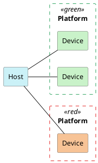

<h1 align="center">ВЫЧИСЛЕНИЯ НА GPU</h1>

---
<p align="center">OpenCL и обёртки вокруг него. Основные концепции GPU compute.</p>
## Логическая модель OpenCL
#### Гетерогенные системы
• Когда мы говорим о вычислениях, мы часто имеем в виду CPU.
• Но в жизни существуют также:
	• Видеокарты.
	• Графические ускорители.
	• Карты для машинного обучения.
	• И многое другое.
• Существует ряд API для работы с ними. В основном, всех их поддерживает Khronos.
	• OpenGL, WebGL - графика.
	• OpenVG - векторная графика.
	• Vulkan - графика и вычисления.
	• OpenCL - вычисления.
	• OpenVX - компьютерное зрение и обработка изображений.
	• OpenXR - дополненная и виртуальная реальность.
#### Модель вычислений OpenCL
• В модели OpenCL разделены **host** и **device**.
• Host - это та машина, на которой выполняется программа-драйвер.
• Device (устройство) - это та машина, на которой проводятся инициированные драйвером вычисления.
• Ничего не мешает им физически быть одним и тем же, скажем, микропроцессором.

#### Запросить платформы и устройства
Полезные API для того, чтобы получить информацию о платформах и устройствах, доступных на вашей системе:
• **clGetPlatformIDs**, чтобы получить список платформ.
• **clGetPlatformInfo**, чтобы получить информацию о платформе.
• **clGetDeviceIDs**, чтобы получить список устройств на данной платформе.
• **clGetDeviceInfo**, чтобы получить информацию об устройстве.
Чтобы послать запросы к устройствам, инициировать вычисления и получать результаты, для них надо создавать **контексты**.
Пример такого приложения:
```c
//-------------------------------------------------------------------------------
//
// Source code for MIPT ILab
// Slides: https://sourceforge.net/projects/cpp-lects-rus/files/cpp-graduate/
// Licensed after GNU GPL v3
//
//-------------------------------------------------------------------------------
//
// Enumerating platforms and devices, OpenCL C way
//
// clang cl_platform.c -lOpenCL
//
//-------------------------------------------------------------------------------

#include <assert.h>
#include <stdio.h>

#ifndef CL_TARGET_OPENCL_VERSION
#define CL_TARGET_OPENCL_VERSION 120
#endif 

#include "CL/cl.h"

struct platforms_t {
	cl_uint n;
	cl_platform_id* ids;
};

void cl_process_error(cl_int ret, const char* file, int line) {
	const char* cause = "unknown";
	switch(ret) {
		case CL_SUCCESS:
			return;
		case CL_DEVICE_NOT_FOUND:
			fprintf(stderr, "devices for this platform not found\n");
			return;
		case CL_INVALID_DEVICE:
			cause = "invalid device";
			break;
		case CL_INVALID_DEVICE_TYPE:
			cause = "invalid device type";
			break;
		case CL_INVALID_PLATFORM:
			cause = "invalid platform";
			break;
		case CL_INVALID_VALUE:
			cause = "invalid value";
			break;
		case CL_OUT_OF_HOST_MEMORY:
			cause = "out of host memory";
			break;
		case CL_OUT_OF_RESOURSES:
			cause = "out of resources";
			break;
	}
	
	fprintf(sderr, "Error %s at %s:%d code %d\n", cause, file, line, ret);
	abort();
}

#define CHECK_ERR(ret) cl_process_error(ret, __FILE__, __LINE__);

struct platforms_t get_platforms() {
	cl_int ret;
	struct platforms_t p;
	
	ret = clGetPlatformIDs(0, NULL, &p.n);
	CHECK_ERR(ret);
	assert(p.n > 0);
	
	p.ids = malloc(p.n * sizeof(cl_platform_id));
	assert(p.ids);
	
	ret = clGetPlatformIDs(p.n, p.ids, NULL);
	CHECK_ERR(ret);
	return p;
};

enum { STRING_BUFSIZE = 4096 };

void printf_platform_info(cl_platform_id pid) {
	cl_int ret;
	char buf[STRING_BUFSIZE];
	
	ret = clGetPlatformInfo(pid, CL_PLATFORM_NAME, sizeof(buf), buf, NULL);
	CHECK_ERR(ret);
	printf("Platform: %s\n", buf);
	ret = clGetPlatformInfo(pid, CL_PLATFORM_VERSION, sizeof(buf), buf, NULL);
	CHECK_ERR(ret);
	printf("Version: %s\n", buf);
	ret = clGetPlatformInfo(pid, CL_PLATFORM_PROFILE, sizeof(buf), buf, NULL);
	CHECK_ERR(ret);
	printf("Profile: %s\n", buf);
	ret = clGetPlatformInfo(pid, CL_PLATFORM_VENDOR, sizeof(buf), buf, NULL);
	CHECK_ERR(ret);
	printf("Vendor: %s\n", buf);
	ret = clGetPlatformInfo(pid, CL_PLATFORM_EXTENSIONS, sizeof(buf), buf, NULL);
	CHECK_ERR(ret);
	printf("Extensions: %s\n", buf);
	printf("\n");
}

void printf_device_info(cl_device_id devid) {
	cl_int ret;
	cl_uint ubuf, i;
	size_t* psbif, sbuf;
	cl_bool cavail, lavail;
	char buf[STRING_BUFSIZE];
	
	ret = clGetDeviceInfo(devid, CL_DEVICE_NAME, sizeof(buf), buf, NULL);
	CHECK_ERR(ret);
	printf("Device: %s\n", buf);
	ret = clGetDeviceInfo(devid, CL_DEVICE_VERSION, sizeof(buf), buf, NULL);
	CHECK_ERR(ret);
	printf("OpenCL version: %s\n", buf);
	
	ret = clGetDeviceInfo(devid, CL_DEVICE_MAX_COMPUTE_UNITS, sizeof(ubuf), &ubuf,
											  NULL);
	CHECK_ERR(ret);
	printf("Max units: %u\n", ubuf);
	ret = clGetDeviceInfo(devid, CL_DEVICE_MAX_WORK_ITEM_DIMENSIONS, sizeof(ubuf),
												&ubuf, NULL);
	CHECK_ERR(ret);
	printf("Max dimensions: %u\n", ubuf);
	
	psbuf = malloc(sizeof(size_t) * ubuf);
	ret = clGetDeviceInfo(devid, CL_DEVICE_MAX_WORK_ITEM_SIZES, sizeof(size_t) * ubuf, psbuf, NULL);
	CHECK_ERR(ret);
	printf("Max dimensions: %u\n", ubuf);
}

```