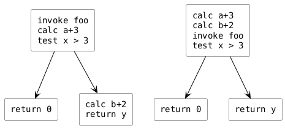

<h1 align="center">ОБОБЩЕНИЯ ТИПОВ</h1>

---
<p align="center">Специализация, инстанцирование и вывод типов.</p>
## Специализация и инстанцирование
#### Инстанцирование
• Инстанцирование - это процесс порождения специализации.
```cpp
template<typename T>
T max(T x, T y) { return x > y ? x : y; }
// ....
max<int>(2, 3); // порождает template<> int max(int, int)
```
• Мы называем этот процесс неявным (implicit) инстанцированием.
• Оно порождает код через подстановку параметра в шаблон.
#### Инстанцирование и специализация
• Явная специализация может войти в конфликт с инстанцированием.
```cpp
template<typename T> T max(T x, T y);

// OK, указываем явную специализацию
template<> double max(double x, double y) { return 42.0; }

// никакой implicit instantiation не нужно
int foo() { return max<double>(2.0, 3.0); }

// процесс implicit instantiation нужен, и он произошёл
int bar() { return max<int>(2, 3); }

// ошибка: ODR violation
template<> int max(int x, int y) { return 42; }
```
#### Удаление специализаций
• Частным случаем явной специализации является запрет специализации.
```cpp
// для всех указателей
template<typename T> void foo(T*);

// но не для char* и не для void*
template<> void foo<char>(char*) = delete;
template<> void foo<void>(void*) = delete;
```
• Подобным образом можно удалять и перегрузки.
```cpp
void foo(char*) = delete;
void foo(void*) = delete;
```
#### Специализация по nontype параметрам
• Нет никаких проблем в том, чтобы специализировать класс по любой разновидности шаблонных параметров.
• Например, по целым числам.
```cpp
template<typename T, int N> class Array;

template<typename T> class Array<T, 3> {
	// тут более эффективная реализация для трёх элементов
```
• Немного сложнее придумать разумный пример специализации по указателям и ссылкам. Можете подумать дома.
#### Ленивость и энергичность
```cpp
int foo(int x, int y) { retunr (x > 3) ? 0 : y; }
foo(a + 3, b + 2);
```

#### Инстанцирование - ленивый процесс
• Ниже если бы инстанцирование было энергичным, была бы ошибка.
```cpp
template<int N> struct Danger {
	using block = char[N]; // ошибка если N меньше нуля
};

template<typename T, int N> struct Tricky {
	void test_lazyness() { Danger<N> no_boom_yet; }
};

int main() {
	Tricky<int, -2> ok; // ошибка только при ok.test_lazyness()
}
```
• Но в данном случае инстанцировалось ровно то, что мы попросили.
#### Явное инстанцирование
• Неявное инстанцирование компилятор проводит, где захочет.
• Но вы можете взять точку инстанцирования под контроль.
```cpp
template<typename T>
T max(T x, T y) { return x > y ? x : y; }

template int max<int>(int x, int y); // инстанцировать тут
```
• Вы можете (и часто должны) также заблокировать инстанцирование в остальных модулях, указав, что оно уже проведено где-то ещё.
```cpp
extern template double max<double>(double x, double y);
```
• При явном инстанцировании вы лишаетесь ленивого поведения.
#### Частичная специализация
• Для классов доступна также возможность специализировать шаблон частично.
```cpp
template<typename T, typename U>
class Foo {}; // primary template

template<typename T>
class Foo<T, T> {} // case T == U

template<typename T>
class Foo<T, int> {}; // case U == int

template<typename T, typename U>
class Foo<T*, U*> {}l // case pointers
```
![[../../../_Meta/attachments/12.1.png]]
Пример:
```cpp
#include <iostream>

template<typename T, typename U>
struct Foo {
	Foo() { std::cout  << 1 << std::endl; }
};

template<typename T>
struct Foo<T, T> {
	Foo() { std::cout << 2 << std::endl; }
};

template<typename T>
struct Foo<T, int> {
	Foo() { std::cout << 3 << std::endl; }
};

template<typename T, typename U>
struct Foo<T*, U*> {
	Foo() { std::cout << 4 << std::endl; }
};

int main() {
	Foo<int, float> mif;     // 1
	Foo<float, float> mff;   // 2
	Foo<float, int> mfi;     // 3
	Foo<int*, float*> mpipf; // 4
	
#ifdef II
	Foo<int, int> mii; // what do you think?
#endif 
	
#ifdef PII
	Foo<int*, int*> mpipi; // what do you think?
#endif 
}
```
#### Специализация для похожих типов
• Частичная специализация возможна по семейству похожих типов.
```cpp
template<typename T> struct X;

template<typename T> struct X<std::vector<T>>;

X<int> a;              // -> primary template X<T>
X<std::vector<int>> b; // -> X<std::vector<T>>
```
• Примерно так же можно специализировать для всех функций.
```cpp
template<typename R, typename T> struct Y;
template<typename R, typename T> struct Y<R(T)>;
```
#### Упрощение имён в специализациях
• Внутри основного шаблона класса мы всегда можем сокращать имя.
```cpp
template<class T> class A {
	A* a1; // A здесь означает A<T>
};
```
• Это отлично работает также внутри частичной специализации.
```cpp
template<class T> class A<T*> {
	A* a2; // A здесь означает A<T*>
};
```
• Разумеется, указывать полные имена вполне легально (и часто лучше читается).
#### Case study: unique_ptr
• Рассмотрим следующее использование unique_ptr:
```cpp
std::unique_ptr<int> ui{new int[1000]()}; // грубая ошибка
```
• В чём, по вашему, состоит грубая ошибка?
• Можем ли мы добавить к чему-то частичную специализацию, чтобы как-то предложить законный метод делать такие вещи?
```cpp
std::unique_ptr<int[]> ui{new int[1000]()}; // хотелось бы так
```
• Хорошая ли идея добавлять частичную специализацию к самому классу unique_ptr?
#### Вспоминаем структуру unique_ptr
• Удаление отделено в параметр шаблона.
```cpp
template<typename T, typename Delete = default_delete<T>>
class unique_ptr {
	T* ptr_;
	Deleter del_;
public:
	unique_ptr(T* ptr = nullptr, Deleter del = Deleter()) : ptr_(ptr), del_(del) {}
	~unique_ptr() { del_(ptr_); }
// и так далее
};
```
• Вспоминаем, как мог бы выглядеть default_delete?
#### Частичная специализация
• На помощь приходит <span style="color: blue;">частичная специализация для массивов</span>.
```cpp
template<typename T> struct default_delete {
	void operator()(T* ptr) { delete ptr; }
};

template<typename T> struct default_delete<T[]> {
	void operator()(T* ptr) { delete[] ptr; }
};
```
• Теперь при массиво-подобном T у нас будет вызван правильный deleter.
#### Обсуждение
• Можно ли шаблонную специализацию назвать разновидностью наследования?
• В наследовании тоже более специлизированный класс наследует более общему.
#### Нарушение LSP для шаблонов
• Увы, но (частично) специализированный шаблон может не иметь ничего общего с его полной версией (вплоть до разных имён методов).
• С точки зрения наследования, это нарушение LSP.
```cpp
template<typename T> struct S { void foo(); };
template<> struct S<int> { void bar(); };
S<double> sd; sd.foo(); // -> primary template S<T>
S<int> si; si.bar();    // -> specialization S<int>
```
• И, разумеется, шаблоны инвариантны к шаблонной генерализации. Каждая специализация считается новым, не связанным с прочими, типом.
#### Обсуждение
• Рассмотрим вызов si.bar() внутри шаблонной функции.
```cpp
template<typename T> int foo(T si) { return si.bar(); }
```
• Учитывая ленивость подстановки и возможность специализаций, в какой момент компилятор должен принять решение, валиден ли этот вызов?
## Разрешение имён
#### Постановка проблемы
• Должно ли разрешение имён в шаблонах (в том числе классов) происходить до инстанцирования или после?
```cpp
template<typename T> struct Foo {
	int use() { return illegal_name; }
};
```
• Здесь illegal_name выглядит нелегальным именем, но может быть оно будет как-то легализованно после того, как будет подставлен конкретный T?
• Нужно ли выдавать ошибку сразу или подождать подстановки параметра?
#### Двухфазное разрешение имён
• Первая фаза: до инстанцирования. Шаблоны проходят общую синтаксическую проверку, а также разрешаются <span style="color: blue;">независимые</span> имена.
• Вторая фаза: во время инстанцирования. Происходит специальная синтаксическая проверка и разрешаются <span style="color: blue;">зависимые</span> имена.
• Зависимое имя - это имя, которое семантически зависи от шаблонного параметра. Шаблонный параметр может быть его типом, он может участвовать в формировании типа и так далее.
```cpp
template<typename T> struct Foo {
	int use() { return illegal_name; } // независимое имя, ошибка
};
```
Другой пример:
```cpp
template<typename T> struct Foo {
	int use() { return T::illegal_name; } // зависимое имя, ок
};
```
• Следует запомнить золотое правило: <span style="color: blue;">разрешение зависимых имён откладывается до подстановки шаблонного параметра</span>.
#### Пример Вандерворда
• Можем ли мы как-то исправить ситуацию?
```cpp
template<typename T> struct Base {
	void exit();
};

template<typename T> struct Derived : Base<T> {
	void foo() {
		exit(); // можно подумать, что это Base::exit(),
						// но exit - не зависимое имя, так что нет.
	}
};
```
• Есть несколько способов сделать имя exit зависимым.
```cpp
this->exit();
Base::exit(); // читается как Base<T>::exit();
```
• Это одно из немногих рациональных использований явного this.
```cpp
template<typename T> struct Derived : Base<T> {
	void foo() {
		this->exit(); // ага, мы стреляем в двухфазное разрешение
	}
};
```
• Хочется ещё раз призвать не использовать явный this нерационально.
#### Зависимые имена типов
• Зависимые имена типов могут вызывать неожиданные проблемы.
```cpp
struct S {
	struct subtype{};
};

template<typename T> int foo(const T& x) {
	T::subtype* y;
	// и так далее
}

foo<S>(S{}); // казалось бы, всё хорошо?
```
Компилятор воспринимает `T::subtype* y;` как умножение.  Проблема решается следующим образом:
```cpp
struct S {
	struct subtype{};
};

template<typename T> int foo(const T& x) {
	typename T::subtype* y;
	// и так далее
}

foo<S>(S{}); // теперь всё хорошо
```
• Эта техника называется устранением неоднозначности (disambiguation).
#### Зависимые имена шаблонов
• Зависимые имена шаблонов также могут вызывать неожиданные проблемы.
```cpp
template<typename T> struct S {
	template<typename U> void foo(){}
};

template<typename T> void bar() {
	S<T> s; s.foo<T>();
}
```
• Тут, как вы думаете, что-то не так или всё ok?
Конечно же, нет. Вот правильный вариант:
```cpp
template<typename T> void bar() {
	S<T> s; s.template foo<T>();
}
```
• Без разрешения неоднозначности первая треугольная скобка означала бы оператор меньше.
• Вместе: typename T::template iterator\<int\>::value_type v;
#### Обсуждение
• Итак, для разрешения имён нужно иметь информацию о типах.
• Нельзя ли использовать эту информацию для вывода типов?
## Вывод типов
#### Обсуждение
• Вернёмся к примеру с функцией max.
```cpp
template<typename T>
T max(T x, T y) { return x > y ? x : y; }
// ....
a = max/*<int>*/(2, 3); // порождает template<> int max(int, int)
```
• Компилятор видит тип int для литералов, поэтому его явное указание не нужно.
```cpp
a = max(2, 3); // тоже ок
a = max(2, 3.0); // неоднозначность, вывод типов не сработает
a = max<int>(2, 3.0); // тоже ок, мы помогли компилятору
```
#### Неуточнённые типы
• По исторической традиции вывод неуточнённого типа режет ссылки, константность и прочее.
```cpp
template<typename T>
T max(T x, T y) { return x > y ? x : y; }

const int &b = 1, &c = 2;

a = max(b, c); // -> template<> int max<int>(int, int)
```
• Это сделано, чтобы уменьшить число неоднозначностей.
```cpp
int e = 2; int& d = e; // вроде разные типы, но вывод работает
a = max(d, e); // -> template<> int max<int>(int, int)
```
#### Уточнённые типы
• Всё меняется, когда мы уточняем тип левой ссылкой или указателем.
```cpp
template<typename T> void foo(T& x);
```
• Теперь компилятор считает, что программисту виднее.
```cpp
const int x = 42;
foo(x); // -> template<> void foo<const int>(const int& x)
```
• Интересно, что иногда вы вроде уточнили, а компилятор... срезал уточнение.
```cpp
template<typename T> void bar(const T x);
bar(x); // -> template<> void bar<int>(int x)
```
• Особая статья - это уточнение правой ссылкой. Это мы пока отложим.
#### Вывод конструкторами классов (C++17)
• Начиная с C++17 конструкторы классов могут использоваться для вывода типов.
```cpp
template<typename T> struct containter {
	container(T t);
	// и так далее
};

container c(7); // -> container<int> c(7);
```
• Внезапно будет работать также списочная инициализация, но пока неясно как.
```cpp
std::vector v {1, 2, 3}; // -> std::vector<int>
```
Примечание на слайде:
```
Пример выбран плохо: double не срежется внутри initializer_list. Придумайте лучше!
```
#### Проблема: вывод через косвенность
• Конструктор класса сам может быть шаблонным:
```cpp
template<typename T> struct container {
	template<typename Iter> container(Iter beg, Iter end);
};

std::vector<double> v;
container d(v.begin, v.end()); // -> container<double>?
```
• Компилятор умён, но не **настолько** умён, чтобы сходить в std::iterator_traits.
• Тут надо как-то ему подсказать, где искать value_type.
#### Хинты для вывода (C++17)
• Пользователь может помочь выводу в сложных случаях.
```cpp
template<typename T> struct container {
	template<typename Iter> container(Iter beg, Iter end);
	// и так далее
};

//пользовательский хинт для вывода
template<typename Iter> constainer(Iter b, Iter e) ->
	container<typename iterator_traits<Iter>::value_type>;
	
std::vector<double> v;
container d(v.begin(), v.end()); // -> container<double>
```
#### Вывод без конструктора
• Агрегатное значение может и не иметь конструктора
```cpp
template<typename T> struct NamedValue {
	T value;
	std::string name;
};
```
• Тоже можно немного помочь компилятору.
```cpp
NamedValue(const char*, const char*) -> NamedValue<std::string>;
```
• Теперь конструируем агрегат из двух строк.
```cpp
NamedValue n{"hello", "world"}; // -> NamedValue<std::string>
```
#### Обсуждение
• Мы хотим такой же гибкости для локальных переменных?
#### Встречаем auto и decltype
• Для локальных переменных ключевое слово auto работает по правилам вывода типов шаблонов.
```cpp
template<typename T> foo(T x);
const int& t /*= 1*/; // была опечатка на слайде, добавил
foo(t); // -> foo<int>(int x)
auto s = t; // -> int s
```
• Для точного вывода существует decltype.
```cpp
decltype(t) u = 1; // -> const int& u
```
#### Категории выражений
• Любое выражение в языке относится к одной из категорий:
```cpp
int x, y;
   x      = x + 1   ; x      = x                 ;
// lvalue   prvalue   lvalue   lvalue to prvalue
   y      = std::move(x);
// lvalue   xvalue
```
• Есть две обобщающие категории: glvalue и xvalue.
