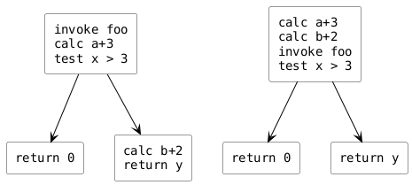

<h1 align="center">ОБОБЩЕНИЯ ТИПОВ</h1>

---
<p align="center">Специализация, инстанцирование и вывод типов.</p>
## Специализация и инстанцирование
#### Инстанцирование
• Инстанцирование - это процесс порождения специализации.
```cpp
template<typename T>
T max(T x, T y) { return x > y ? x : y; }
// ....
max<int>(2, 3); // порождает template<> int max(int, int)
```
• Мы называем этот процесс неявным (implicit) инстанцированием.
• Оно порождает код через подстановку параметра в шаблон.
#### Инстанцирование и специализация
• Явная специализация может войти в конфликт с инстанцированием.
```cpp
template<typename T> T max(T x, T y);

// OK, указываем явную специализацию
template<> double max(double x, double y) { return 42.0; }

// никакой implicit instantiation не нужно
int foo() { return max<double>(2.0, 3.0); }

// процесс implicit instantiation нужен, и он произошёл
int bar() { return max<int>(2, 3); }

// ошибка: ODR violation
template<> int max(int x, int y) { return 42; }
```
#### Удаление специализаций
• Частным случаем явной специализации является запрет специализации.
```cpp
// для всех указателей
template<typename T> void foo(T*);

// но не для char* и не для void*
template<> void foo<char>(char*) = delete;
template<> void foo<void>(void*) = delete;
```
• Подобным образом можно удалять и перегрузки.
```cpp
void foo(char*) = delete;
void foo(void*) = delete;
```
#### Специализация по nontype параметрам
• Нет никаких проблем в том, чтобы специализировать класс по любой разновидности шаблонных параметров.
• Например, по целым числам.
```cpp
template<typename T, int N> class Array;

template<typename T> class Array<T, 3> {
	// тут более эффективная реализация для трёх элементов
```
• Немного сложнее придумать разумный пример специализации по указателям и ссылкам. Можете подумать дома.
#### Ленивость и энергичность
```cpp
int foo(int x, int y) { retunr (x > 3) ? 0 : y; }
foo(a + 3, b + 2);
```

#### Инстанцирование - ленивый процесс
• Ниже если бы инстанцирование было энергичным, была бы ошибка.
```cpp
template<int N> struct Danger {
	using block = char[N]; // ошибка если N меньше нуля
};

template<typename T, int N> struct Tricky {
	void test_lazyness() { Danger<N> no_boom_yet; }
};

int main() {
	Tricky<int, -2> ok; // ошибка только при ok.test_lazyness()
}
```
• Но в данном случае инстанцировалось ровно то, что мы попросили.
#### Явное инстанцирование
• Неявное инстанцирование компилятор проводит, где захочет.
• Но вы можете взять точку инстанцирования под контроль.
```cpp
template<typename T>
T max(T x, T y) { return x > y ? x : y; }

template int max<int>(int x, int y); // инстанцировать тут
```
• Вы можете (и часто должны) также заблокировать инстанцирование в остальных модулях, указав, что оно уже проведено где-то ещё.
```cpp
extern template double max<double>(double x, double y);
```
• При явном инстанцировании вы лишаетесь ленивого поведения.