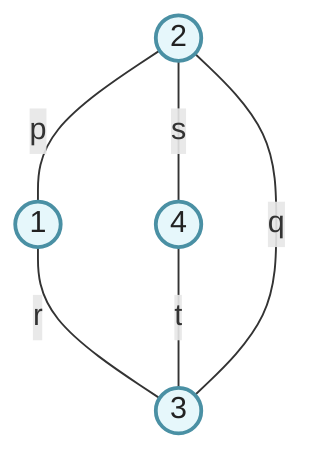

<h1 align="center">ВЕКТОРА И SFINAE</h1>

---
<p align="center">На долгом пути к std::vector - проектирование реалистичного шаблонного контейнера.</p>
## Вектора
#### От ручного выделения к векторам
```cpp
int* n = new int[10];
n[5] = 5;
// тут много кода
// какой сейчас размер у n?
// стереть крайний элемент?
// пуст ли теперь n?
// не забыть delete[]
```
```cpp
vector<int> v(10);
v[5] = 5;
// тут много кода
size_t vsize = v.size();
v.pop_back();
if(v.empty()) { /* что-то */ }
// ресурсы буду освобождены
```
#### Два непростых вопроса
• Допустим, я хочу завести в своей программе вектор из константных ссылок:
```cpp
std::vector<const int&> v;
```
• Что скажете?
• Допустим, я не знаю тип переменной x, но знаю, что это контейнер.
```cpp
template<typename Cont> void foo(const Cont& x) {
	if(x.empty()) return;
	// do something
}
```
• Могу ли я быть уверенным, что это будет работать для всех контейнеров?
#### Требования к элементам контейнеров
• Общие для всех контейнеров методы <span style="color: brown;">[container.requirements.general]</span>
	• empty - проверка пустоты контейнера
	• swap - обмен конетйнерных переменных содержимым
	• size (кроме array) - действительный размер контейнера
	• clear (кроме array) - очистка контейнера
	• begin, end, cbegin, cend - получение итераторов (см. далее)
• Требования к элементам зависят от конкретной операции, но чаще всего
	• DefaultConstructible - требование к наличию конструктора по умолчанию
	• MoveConstructible - требование к наличию конструктора перемещения или копирования
#### Гарантии непрерывности памяти
```cpp
// функция init написана в старом стиле
template<typename T> void init(T* arr, size_t size);

// но её можно использовать с векторами
vector<T> t(n);
T* start = &t[0];
init_t(start, n);
assert(t[1] == start[1]);
```
*When choosing a container, remember vector is best. Leave a comment to explain if you choose from the rest. (c) Tony van Eerd*
![[../../../_Meta/attachments/13.1.png]]
#### Неприятное исключение: vector\<bool\>
```cpp
vector<bool> t(n);
bool* start = &t[0]; // это не скомпилируется, но представим
assert(t[1] == start[1]); // oops!
```
Важно запомнить две вещи:
• <span style="color: red;">vector&ltbool&gt не удовлетворяет соглашениям контейнера vector.</span>
• <span style="color: red;">vector&ltbool&gt не содержит элементов типа bool.</span>
• Не используйте vector\<bool\> для обобщённого программирования.
```cpp
using vector_bool = vector<bool>;
vector_bool x(10); // условно ок, но тут лучше std::bitset
```
#### Задача: что можно здесь улучшить?
```cpp
vector<int> v;

for(int i = 0; i != N; ++i)
	v.push_back(i);
```
#### Ответ: вектор не терпит халатности
```cpp
vector<int> v;
v.reserve(N);

for(int i = 0; i != N; ++i)
	v.push_back(i); // теперь здесь не будет перевыделений
```
• При вставке в конец вектору могут потребовать реаллокации памяти.
• Это означает, что всегда полезно думать о памяти вектора не меньше, чем о памяти динамического массива.
#### Ещё про size и capacity
• size - это сколько элементов у вектора уже есть.
• capacity - это сколько элементов в нём может быть до первого перевыделения.
```cpp
vector<int> v(10000);

assert(v.size() == 10000);
assert(v.capacity() >= 10000);
```
Размер - это что-то, чем можно в явном виде управлять, в отличие от ёмкости.
```cpp
v.resize(100);
assert(v.size() == 100);
assert(v.capactity >= 10000);
```
#### Амортизация
• При написании метода push, вам предлагалось оценить его алгоритмическую сложность.
• Проблема в том, что она очевидно O(1), если не надо реаллоцировать и O(n), если надо.
• То есть, мы платим иногда. Это примерно как купить машину и платить только за бензин, пока машина не износится, а потом купить новую.
• В экономике распределение стоимости товара по стоимости его периода эксплуатации называется амортизацией товара.
• Амортизированное O(n) обозначается O(n)+.
#### Амортизированная стоимость
• По определению амортизированная стоимость операции - это стоимость N операций, отнесённая к N.
• Для динамического массива c<sub>i</sub> = 1 + \[*realloc*\] * (*i* - 1)
• Амортизированная стоимость одной вставки будет $\frac{\sum_i c_i}{N}$ для N вставок.
• Допустим, мы, если реаллокация нужна, растим массив на 10 элементов. ${\sum_i c_i}$ = ?
Ответ: $N + \sum_{k=1}^{N/10} 10 \cdot k = O(N^2)$
• Заметим, что это очень плохая стратегия. Амортизированная сложность push будет $\frac{O(N^2)}{N} = O(N)+$. Можем ли мы придумать и доказать нечто лучшее?
#### Лучшая стратегия
• Прирост вдвое
$$\frac{\sum_i c_i}{N} = \frac{N + \sum_{k=1}^{lg(N)} 2^j}{N} = \frac{O(N)}{N} = O(1)$$
• Видно, что разница есть: при одной стратегии у нас в среднем линейное, а при другой в среднем постоянное время вставки.
• Увы, взять сумму $\sum_{k=1}^{lg(N)} 2^j$ в общем уже не так просто, а при более сложных стратегиях, это становится мучительно.
• Можем ли мы упростить себе жизнь?
#### Дополнение: метод потенциала
• Выберем функцию потенциала Ф(n) так, чтобы Ф(0) = 0, Ф(n) $\geq$ 0.
• Здесь n - это номер шага.
• Амортизированная стомость - это стомость плюс изменение потенциальной функции $c_i + Ф(i) - Ф(i-1)$
• Выбор потенциальной функции облегчает вычисления, потому что
$$\sum_i(c_i + Ф(i) - Ф(i - 1)) = Ф(n) - Ф(0) + \sum_i c_i \geq \sum_i c_i$$
• Удачный выбор сделает выражение $\sum_i(c_i + Ф(i) - Ф(i - 1))$ проще, чем $\sum_i c_i$
• Обсуждение: как выбрать для массива?
• Для массива, поскольку при реаллокации вдвое $2 * s_n \geq c_n$
$$Ф(n) = 2 * s_n - c_n$$
• Без реаллокации
$$c_i + Ф(i) - Ф(i-1) = 1 + (2 * s_i - C) - (2 * s_{i-1} - C) = 1 + 2(s_i - s_{i-1}) = 3$$
• С реаллокацией $Ф(i - 1) = 2k - k = k$, $Ф(i) = 2(k + 1) - 2k = 2$
$$c_i + Ф(t_i) - Ф(t_{i-1}) = (k + 1) + 2 - k = 3$$
• В итоге, в любом случае, $\sum c_i \leq 3N$, и мы доказали асимптотику O(1).
• В качестве упражнения проанализируйте стратегию роста в log(N) раз.
#### Обсуждение
• Выбор простого роста вдвое не всегда лучшая стратегия.
• Реальная стратегия из libstdc++ несколько сложнее и обладает рядом приятных теоретических свойстсв.
```cpp
const size_type __len = size() + std::max(size(), __n);
```
• Попробуйте дома проанализировать эту стратегию и обосновать, почему она выбрана в качестве основной.
#### Два механизма инициализации
• Расширенный синтаксис.
• Явный конструктор из списка инициализации.
```cpp
class B {
	int a_;
public:
	B(int a) : a_(a) {}
	B(std::initializer_list<int> il);
};

B b(1), c{1}; // теперь они вызывают разные конструкторы
```
#### Списочная инициализация: вектора
```cpp
// это вектор [14, 14, 14]
vector<int> v1(3, 14);

// а это вектор [3, 14]
vector<int> v2{3, 14};
```
• Это связано с наличием у вектора **нескольких** конструкторов.
```cpp
v(10); // размер 10, инициализация по умолчанию
v(10, 1); // размер 10, инициализировать единицами
v{10, 1}; // размер = размеру списка, инициализация списком
```
#### То же для ваших контейнеров
• Хорошая новость: initializer_list - это тоже разновидность последовательного контейнера, и его можно обходить итераторами.
```cpp
template<typename T> class Tree {
	// тут какая-то специфика дерева
	bool add_node(T& data);
	
public:
	Tree(std::initializer_list<T> il) {
		for(auto ili = il.begin(); ili != il.end(); ++ili)
			add_node(*ili);
	}
};
```
• Плохая новость: вам теперь надо следить, есть ли он в классе.
#### Просто правило для {}
• Если в классе совсем нет конструкторов, это агрегат как в C.
```cpp
struct S { int x, y; }; S s = {1, 2}; // aggregate
```
• Иначе, если есть конструктор из initializer_list, возьмётся он.
• Иначе, если есть любой другой конструктор, возьмётся он.
```cpp
struct S {
	int x, y;
	S(int n) : x(n), y(n) {}
};

S s = {3}; // ctor
```
#### Первое представление об итераторах
```cpp
vector<int> v(10);

// pi - это указатель
auto pi = &v[0];
pi += 3;
assert(*pi == v[4]);

// как узнать, что pi в конце?
```
```cpp
vector<int> v(10);

// vi - это итератор
auto vi = v.begin();
vi += 3;
assert(*vi == v[4]);

if(vi == v.end()) { что-то }
```
![[../../../_Meta/attachments/13.2.png]]
#### Абстракция указателя
• Важно, что итераторы не являются указателями, они абстрагируют их.
• В итоге, любой контейнер может быть сконструирован из любого диапазона.
```cpp
std::list<int> l{1, 2, 3};
std::vector<int> v(l.begin(), l.end());
```
• Это потрясающе удобно, чтобы перекидывать один контейнер в другой.
• Как бы вы написали конструктор из пары итераторов?
#### Конструирование из итераторов
• Наивная попытка вызывает у нас небольшую проблему.
```cpp
template<typename T> class MyVector {
	// ....
public:
	MyVector(size_t nelts, T value); // 1
	template<typename Iter> MyVector(Iter fst, Iter lst); // 2
	// ....
};

MyVector<int> mvec(2, 2); // ошибка, выбран 2
```
## SFINAE
#### Обсуждение: провал подстановки
• Что если подстановка в некотором контексте не может быть выполнена?
```cpp
template<typename T>
typename T::ElementT at(T const& a, int i);

int* p = new int[30];

auto a = at<int>(p, i); // Substitution failure
```
• Что если вывод типов в некотором контексте провален?
```cpp
template<typename T> T max(T a, T b);
int g = max(1, 1.0); // Deduction failure
```
#### SFINAE
• **Substitution Failure Is Not An Error** (провал подстановки не является ошибкой).
```cpp
template<typename T> T max(T a, T b);
template<typename T, typename U> auto max(T a, U b);

int g = max(1, 1.0); // подстановка в 1 провалена
										 // подстановка в 2 успешна
```
• Если в результате подстановки в <span style="color: blue;">непосредственном контексте</span> класса (функции, алиаса, переменной) возникает <span style="color: blue;">невалидная конструкция</span>, эта подстановка неуспешна, но не ошибочна.
• В этом случае второй фазы поиска имён просто не выполняется.
#### SFINAE и ошибки
• Не любая ошибочная конструкция - это SFINAE. Важен контекст подстановки.
```cpp
int negate(int i) { return -i; }

template<typename T> T negate(const T& t) {
	typename T::value_type n = -t();
	// тут используем n
}

negate(2.0); // ошибка второй фазы
```
• Здесь в контексте сигнатуры и шаблонных параметров нет никакой невалидности.
```cpp
int negate(int i) { return -i; }

template<typename T> T::value_type negate(const T& t) {
	typename T::value_type n = -t();
	// тут используем n
}

negate(2.0); // substitution failure
```
• Здесь в контексте сигнатуры и шаблонных параметров выводится T -> double и, разумеется, T::value_type невалидно.
#### Обсуждение
• Техника SFINAE кажется очень простой, но вообще-то её приложения многочисленны и часто очень нетривиальны.
• Рассмотрим задачу: у вас есть два типа и вам нужно определить равны ли они.
```cpp
template<typename T, typename U> int foo() {
	// как вернуть 1, если T == U и 0, если нет?
}
```
• Обратим внимание, что это задача отображения из типов на числа.
• Прежде чем её решать, решим обратную задачу.
#### Интегральные константы
• Отображение из целых чисел на типы называется интегральной константой.
```cpp
template<typename T, T v> struct integral_constant {
	static const T value = v;
	typedef T value_type;
	typedef integral_constant type;
	operator value_type() const { return value; }
};
```
• Возможна даже арифметика.
```cpp
using ic6 = integral_constant<int, 6>
auto n = 7 * ic6{};
```
#### Истина и ложь для типов
• Самые полезные из интегральных констант - самые простые.
```cpp
using true_type = integral_constant<bool, true>;
using false_type = integral_constant<bool, false>;
```
• Всё это есть в стандарте: std::integral_constant и т.д.
• Попробуем написать простой определитель, чтобы проверить одинаковые ли два типа.
```cpp
template<typename T, typename U>
struct is_same : std::false_type {};
```
• По умолчанию разные. Что дальше?
#### Равенство типов
• Теперь можно решить задачу определения равенства типов.
```cpp
template<typename T, typename U>
struct is_same : std::false_type {};

template<typename T>
struct is_same<T, T> : std::true_type {}; // для T == T

template<typename T, typename U>
using is_same_t = typename is_same<T, U>::type;
```
• Благодаря SFINAE, будет работать.
```cpp
assert(is_same<int, int>::value && !is_same<char, int>::value);
```
#### Определители и модификаторы
Определитель: является ли тип ссылкой.
```cpp
template<typename T> struct is_reference : false_type {};
template<typename T> struct is_reference<T&> : true_type {};
template<typename T> struct is_reference<T&&> : true_type {};
```
Модификатор: убираем ссылку с типа. Если ссылки не было, то оставляем тип.
```cpp
template<typename T> struct remove_reference { using type = T; };
template<typename T> struct remove_reference<T&> { using type = T; };
template<typename T> struct remove_reference<T&&> { using type = T; };
```
Для модификатора полезен алиас
```cpp
template<typename T>
using remove_reference_t = typename remove_reference<T>::type;
```
#### Четырнадцать категорий
• Любой тип в языке C++ попадает хотя бы под одну из перечисленных ниже категорий.
```cpp
is_void;
is_null_pointer;
is_integral, is_floating_point; // для T и для cv T& транзитивно
is_array; // только встроенные, не std::array
is_pointer; // включая указатели на обычные функции
is_lvalue_reference, is_rvalue_reference;
is_member_object_pointer, is_member_function_pointer;
is_enum, is_union, is_class;
is_function; // обычные функции
```
• Использование довольно тривиально.
```cpp
std::cout << std::boolalpha << std::is_void<T>::value << '\n';
```
#### Свойства типов
• Также очень полезны определители свойств типов.
```cpp
is_trivially_copyable; // побайтово копируемый, memcpy
is_standard_layout; // можно адресовать поля указателем
is_aggregate; // доступна агрегатная инициализация как в C
is_default_constructible; // есть default ctor
is_copy_constructible, is_copy_assignable;
is_move_constructible, is_nothrow_move_assignable, is_move_assignable;
is_base_of; // B является базой (транзитивно, включая сам тип)
is_convertible; // есть преобразование из A к B
```
• И многие другие (их реально десятки).
#### Обсуждение: std::copy
• Рассмотрим наивное копирование, чем-то похожее на алгоритм std::copy:
```cpp
template<typename InpIter, typename OutIter>
OutIter cross_copy(InpIter fst, InpIter lst, OutIter dst) {
	while(fst != lst) { *dst = *fst; ++fst; ++dst; }
	return dst;
}
```
• Увы, по сравнению с настоящим std::copy, у него есть проблемы.
• Можем ли мы их решить с помощью SFINAE?
Пример бенчмарка с гита с таким наивным копированием:
```cpp
//-----------------------------------------------------------------------------
//
// Source code for MIPT ILab
// Slides: https://sourceforge.net/projects/cpp-lects-rus/files/cpp-graduate/
// Licensed after GNU GPL v3
//
//-----------------------------------------------------------------------------
//
// Benchmark for naive copy vs memcpy
//
// Homebrew std::copy
// > g++ -O2 benchcopy.cc -o bench
// > cl /std:c++20 /O2 /EHsc benchcopy.cc
// > bench 300000000
//
// Real std::copy
// > g++ -O2 -DSTANDARD benchcopy.cc -o bench
// > cl /std:c++20 /O2 /DSTANDARD /EHsc benchcopy.cc
// > bench 300000000
//
//-----------------------------------------------------------------------------

#include <algorithm>
#include <chrono>
#include <cstring>
#include <iostream>
#include <list>
#include <random>
#include <vector>

#ifndef STANDARD
#define NAIVE
#endif

using std::chrono::duration_cast;
using std::chrono::high_resolution_clock;
using std::chrono::milliseconds;

const int IMAX = 9;

template <typename InputIt, typename OutputIt>
OutputIt naive_copy(InputIt first, InputIt last, OutputIt d_first) {
  while (first != last)
    *d_first++ = *first++;
  return d_first;
}

int main(int argc, char **argv) {
  if (argc < 2) {
    std::cerr << "usage: " << argv[0] << " nelts" << std::endl;
    return -1;
  }

  auto nelts = std::stoi(argv[1]);
  std::vector<int> arr(nelts);
  std::vector<int> arrcopy(nelts);
  std::vector<int> arrcopy2(nelts);

  std::random_device rd;
  std::default_random_engine reng(rd());
  std::uniform_int_distribution<int> dist(0, IMAX);

  std::generate(arr.begin(), arr.end(), [&dist, &reng] { return dist(reng); });

  auto tstart = high_resolution_clock::now();
  std::memcpy(arrcopy.data(), arr.data(), nelts * sizeof(int));
  auto tfin = high_resolution_clock::now();

  std::cout << "memcpy: " << duration_cast<milliseconds>(tfin - tstart).count()
            << std::endl;

  tstart = high_resolution_clock::now();
#ifdef NAIVE
  naive_copy(arr.begin(), arr.end(), arrcopy2.begin());
#else
  std::copy(arr.begin(), arr.end(), arrcopy2.begin());
#endif
  tfin = high_resolution_clock::now();

#ifdef NAIVE
  std::cout << "naive copy: "
#else
  std::cout << "std copy: "
#endif
            << duration_cast<milliseconds>(tfin - tstart).count() << std::endl;

  // sanity: do we have mismatch (we shall not)
  auto mism = std::mismatch(arrcopy.begin(), arrcopy.end(), arrcopy2.begin());
  if (mism.first != arrcopy.end() || mism.second != arrcopy2.end()) {
    std::cout << "mismatch: " << *mism.first << " vs " << *mism.second
              << std::endl;
    std::cout << "at: " << std::distance(arrcopy.begin(), mism.first)
              << std::endl;
  }
}
```
Вывод на 500000000 чисел:
```
memcpy: 698
naive copy: 1609
```
При запуске с -DSTANDARD (std\:\:copy) на тех же 500000000 чисел:
```
memcpy: 684
std copy: 7443
```
Там был лаг в связи со стримом. Так как std\:\:copy ест слишком много памяти. На меньшем количестве чисел std\:\:copy выигрывает у memcpy. Например на 300000000 вывод:
```
memcpy: 189
std copy: 139
```
#### Решение проблемы std::copy
• Заведём хелпер и его специализацию для true:
```cpp
template<bool Triv, typename In, typename Out> struct CpSel {
	static Out select(In begin, In end, Out out)
		{ return CopyNormal(begin, end, out); }
};

template<typename In, typename Out>
struct CpSel<true, In, Out> {
	static Out select(In begin, In end, Out out)
		{ return CopyFast(begin, end, out); } // для простых типов
};
```
• Теперь сам алгоритм копирования будет просто решать, кого он вызывает.
• Также тривиально мы решаем проблему с копированием:
```cpp
template<typename In, typename Out>
Out realistic_copy(In begin, In end, Out out) {
	using in_type = /* pointee type (In); */ // как это написать?
	using out_type = /* pointee type (Out); */
	
	enum { Sel = std::is_trivially_copyable<in_type>::value &&
							 std::is_trivially_copyable<out_type>::value &&
							 std::is_same<in_type, out_type>::value };
	
	return CpSel<Sel, In, Out,>::select(begin, end, out);
}
```
Дальше лектор объясняет, что пишется это через std::iterator_traits\<In\>::value_type на примере с гита:
```cpp
//-----------------------------------------------------------------------------
//
// Source code for MIPT ILab
// Slides: https://sourceforge.net/projects/cpp-lects-rus/files/cpp-graduate/
// Licensed after GNU GPL v3
//
//-----------------------------------------------------------------------------
//
// Benchmark for naive copy vs memcpy
//
// Homebrew std::copy
// > g++ -O2 benchcopy.cc -o bench
// > cl /std:c++20 /O2 /EHsc benchcopy.cc
// > bench 300000000
//
// Real std::copy
// > g++ -O2 -DSTANDARD benchcopy.cc -o bench
// > cl /std:c++20 /O2 /DSTANDARD /EHsc benchcopy.cc
// > bench 300000000
//
// godbolt link for simplicity: https://godbolt.org/z/GanKEGddo
//
//-----------------------------------------------------------------------------

#include <algorithm>
#include <chrono>
#include <cstring>
#include <iostream>
#include <list>
#include <random>
#include <vector>

#ifndef STANDARD
#define NAIVE
#endif

using std::chrono::duration_cast;
using std::chrono::high_resolution_clock;
using std::chrono::milliseconds;

const int IMAX = 9;

template <typename InputIt, typename OutputIt>
OutputIt long_copy(InputIt first, InputIt last, OutputIt d_first) {
  while (first != last)
    *d_first++ = *first++;
  return d_first;
}

template <bool Type, typename In, typename Out> struct CpSel {
  static Out select(In begin, In end, Out out) {
    return long_copy(begin, end, out);
  }
};

template <typename In, typename Out> struct CpSel<true, In, Out> {
  static Out select(In begin, In end, Out out) {
    using in_type = typename std::iterator_traits<In>::value_type;
    auto sz = (end - begin) * sizeof(in_type);
    memcpy(&*out, &*begin, sz);
    return out;
  }
};

template <typename In, typename Out>
Out nonnaive_copy(In begin, In end, Out out) {
  using in_type = typename std::iterator_traits<In>::value_type;
  using out_type = typename std::iterator_traits<Out>::value_type;
  enum {
    Sel = std::is_trivially_copyable<in_type>::value &&
          std::is_trivially_copyable<out_type>::value &&
          std::is_same<in_type, out_type>::value
  };
  return CpSel<Sel, In, Out>::select(begin, end, out);
}

int main(int argc, char **argv) {
  if (argc < 2) {
    std::cerr << "usage: " << argv[0] << " nelts" << std::endl;
    return -1;
  }

  auto nelts = std::stoi(argv[1]);
  std::vector<int> arr(nelts);
  std::vector<int> arrcopy(nelts);
  std::vector<int> arrcopy2(nelts);

  std::random_device rd;
  std::default_random_engine reng(rd());
  std::uniform_int_distribution<int> dist(0, IMAX);

  std::generate(arr.begin(), arr.end(), [&dist, &reng] { return dist(reng); });

  auto tstart = high_resolution_clock::now();
  std::memcpy(arrcopy.data(), arr.data(), nelts * sizeof(int));
  auto tfin = high_resolution_clock::now();

  std::cout << "memcpy: " << duration_cast<milliseconds>(tfin - tstart).count()
            << std::endl;

  tstart = high_resolution_clock::now();
#ifdef NAIVE
  nonnaive_copy(arr.begin(), arr.end(), arrcopy2.begin());
#else
  std::copy(arr.begin(), arr.end(), arrcopy2.begin());
#endif
  tfin = high_resolution_clock::now();

#ifdef NAIVE
  std::cout << "custom copy: "
#else
  std::cout << "std copy: "
#endif
            << duration_cast<milliseconds>(tfin - tstart).count() << std::endl;

  // sanity: do we have mismatch (we shall not)
  auto mism = std::mismatch(arrcopy.begin(), arrcopy.end(), arrcopy2.begin());
  if (mism.first != arrcopy.end() || mism.second != arrcopy2.end()) {
    std::cout << "mismatch: " << *mism.first << " vs " << *mism.second
              << std::endl;
    std::cout << "at: " << std::distance(arrcopy.begin(), mism.first)
              << std::endl;
  }
}
```
Вывод на 400000000 чисел:
```
memcpy: 261
custom copy: 212
```
#### Обсуждение
• Теперь единственным облачком на горизонте остался emplace.
```cpp
struct S {
	S();
	S(int, double, int);
};

std::vector<S> v;

v.emplace_back(1, 1.0, 2); // создали на месте
```
• Но как это может работать для любого типа, если мы в общем случае не знаем количество аргументов конструктора?
## Вариабельные шаблоны
#### Вариабельные шаблоны
• Пример вариабельно шаблонной функции:
```cpp
template<typename ... Args> void f(Args ... args);
```
• Способы вызова:
```cpp
f(); // OK, пачка не содержит аргументов
f(1); // OK, пачка содержит один аргумент: int
f(2, 1.0); // OK, пачка состоит из: int, double
```
• Специальная конструкция `sizeof...(Args)` либо `sizeof...(args)` возвращает размер пачки в штуках.
#### Паттерны раскрытия
• Говорят, что пачка параметров "раскрывается" в теле функции или класса.
```cpp
template<typename ... Types> void f(Types ... args);
template<typename ... Types> void g(Types ... args) {
	f(args ...);                            // -> f(x, y);
	f(&args ...);                           // -> f(&x, &y);
	f(h(args) ...);                         // -> f(h(x), h(y));
	f(const_cast<const Types*>(&args) ...); // -> f(const_cast<const int*>(&x),
	                                        //      const_cast<const double*>(&y));
}

g(1, 1.0); // -> g(int x, double y);
```
#### Задача: раскрытие пачек
• Допустим, args - это пачка параметров x, y, z.
• Тогда во что раскроется следующее выражение?
```cpp
f(h(args ...) + h(args)...);
```
• Также интересно, во что раскроется следующее:
```cpp
f(h(args, args...)...);
```
#### Снова прозрачная оболочка
• На лекции по rvalue refs была написана почти идеальная прозрачная оболочка для одного аргумента.
```cpp
template<typename Fun, typename Arg>
decltype(auto) transparent(Fun fun, Arg&& arg) {
	return fun(forward<Arg>(arg));
}
```
• Можно ли использовать вариабельный шаблон и переписать её для произвольного количества аргументов?
```cpp
template<typename Fun, typename... Args>
decltype(auto) transparent(Fun fun, Arg&&... arg) {
	return fun(forward<Args>(args)...);
}
```
• Это очень простое и чисто техническое изменение.
• Следует обратить особое внимание на паттерн совместного раскрытия при пробросе.
#### Обсуждение: пробросим функцию?
• В функцие-подобном объекте оператор вызова может быть && аннотирован.
```cpp
template<typename Fun, typename... Args>
decltype(auto) transparent(Fun&& fun, Args&&... args) {
	return std::forward<Fun>(fun)(std::forward<Args>(args)...);
}
```
• Теперь функции тоже не требуется быть обязательно копируемой.
• Выглядит это чуть страшнее, зато теперь тут не к чему особо придраться.
#### Контейнеры тяжёлых классов
• Мы уже говорили о хранении тяжёлых классов в контейнерах.
```cpp
template<typename T> class Stack {
	struct StackNode {
		T elem; StackNode* next;
		StackNode(T e, StackNode* nxt) : elem(e), next(nxt) {}
	};
public:
	void push(const T& elem) { top_ = new StackNode(elem, top_); }
	// .... и так далее ....
};
```
• Подумаем о следующем коде:
```cpp
s.push(Heavy(100, 200, 300)); // всё очень плохо
```
Пример такого кода:
```cpp
//-----------------------------------------------------------------------------
//
// Source code for MIPT ILab
// Slides: https://sourceforge.net/projects/cpp-lects-rus/files/cpp-graduate/
// Licensed after GNU GPL v3
//
//-----------------------------------------------------------------------------
//
// Example for push vs emplace: push part
// cl /O2 /EHsc empl-bench-ineff.cc
//
//-----------------------------------------------------------------------------

#include <cstring>
#include <iostream>

class Heavy {
	int n;
	int* t;
	
public:
	Heavy(int sz) : n(sz), t(new int[n]) {
		std::cout << "Heavy created" << std::endl;
	}
	
	// ineffective mode
	Heavy(Heavy&& rhs) : Heavy(rhs) {}
	
	Heavy(const Heavy& rhs) : n(rhs.n), t(new int[n]) {
		std::cout << "Heavy copied" << std::endl;
		memcpy(t, rhs.t, n * sizeof(int));
	}
	
	Heavy& operator=(Heavy&& rhs) = delete;
	Heavy& operator=(constg Heavy& rhs) = delete;
	
	~Heavy() {
		std::cout << "Heavy destroyed" << std::endl;
		delete[] t;
	}
};

template<typename T> class Stack {
	struct StackElem {
		T elem;
		StackElem* next;
		StackElem(T e, StackElem* nxt) : elem(e), next(nxt) {}
	};
	
	struct StackElem* top_ = nullptr;
	
public:
	Stack() = default;
	Stack(const Stack<T>& rhs) = delete;
	~Stack();
	
	void push_back(const T& elem) { top_ = new StackElem(elem, top_); }
};

template<typename T> Stack<T>::~Stack() {
	struct StackElem* nxt = top_;
	while(nxt != nullptr) {
		struct StackElem* tmp = nxt->next;
		delete nxt;
		nxt = tmp;
	}
	top_ = nullptr;
}

int main() {
	Stack<Heavy> s;
	for(int i = 0; i != 5; ++i) {
		std::cout << std::endl << "next" << std::endl;
		s.push_back(Heavy(100));
	}
	std::cout << std::endl << "we are done\n" << std::endl;
}
```
В выводе на каждой итерации наблюдаем:
```
Heavy created
Heavy copied
Heavy copied
Heavy destroyed
Heavy destroyed
```
А вот пример улучшенной версии с emplace:
```cpp
//-----------------------------------------------------------------------------
//
// Source code for MIPT ILab
// Slides: https://sourceforge.net/projects/cpp-lects-rus/files/cpp-graduate/
// Licensed after GNU GPL v3
//
//-----------------------------------------------------------------------------
//
// Example for push vs emplace: push part
// cl /O2 /EHsc empl-bench-eff.cc
//
//-----------------------------------------------------------------------------

#include <cstring>
#include <iostream>

using namespace std;

class Heavy {
	int n;
	int* t;
	
public:
	Heavy(int sz) : n(sz), t(new int[n]) {
		std::cout << "Heavy created" << std::endl;
	}
	
	// ineffective mode
	Heavy(Heavy&& rhs) : Heavy(rhs) {}
	
	Heavy(const Heavy& rhs) : n(rhs.n), t(new int[n]) {
		std::cout << "Heavy copied" << std::endl;
		memcpy(t, rhs.t, n * sizeof(int));
	}
	
	Heavy& operator=(Heavy&& rhs) = delete;
	Heavy& operator=(constg Heavy& rhs) = delete;
	
	~Heavy() {
		std::cout << "Heavy destroyed" << std::endl;
		delete[] t;
	}
};

template<typename T> class Stack {
	struct StackElem {
		T elem;
		StackElem* next;
		StackElem(StackElem* nxt, T e) : elem(e), next(nxt) {}
		
		template<typename... Args>
		StackElem(StackElem* nxt, Args&&... args)
			: elem(std::forward<Args>(args)...), next(nxt) {}
	};
	
	struct StackElem* top_ = nullptr;
	
public:
	Stack() = default;
	Stack(const Stack<T>& rhs) = delete;
	~Stack();
	
	Stack<T>& operator=(const Stack<T>& rhs) = delete;
	
	void push_back(const T& elem) { top_ = new StackElem(elem, top_); }
	
	template<typename... Args> void emplace_back(Args&&... args);
};

template<typename T>
template<typename... Args>
void Stack<T>::emplace_back(Args&&... args) {
	top_ = new StackElem(top_, std::forward<Args>(args)...);
}

template<typename T> Stack<T>::~Stack() {
	struct StackElem* nxt = top_;
	while(nxt != nullptr) {
		struct StackElem* tmp = nxt->next;
		delete nxt;
		nxt = tmp;
	}
	top_ = nullptr;
}

int main() {
	Stack<Heavy> s;
	for(int i = 0; i != 5; ++i) {
		std::cout << std::endl << "next" << std::endl;
		s.emplace_back(100);
	}
	std::cout << std::endl << "we are done\n" << std::endl;
}
```
Теперь на каждой итерации только:
```
Heavy created
```
#### Emplace
• Обычно метод контейнера, который размещает объект, а не пробрасывает его, называют <span style="color: blue;">emplace</span>.
```cpp
template<typename T> class Stack {
	// детали реализации
public:
	void push(const T& elem) { top_ = new StackNode(top_, elem); }
	
	template<typename U> void emplace(U&&... args) {
		top_ = new StackNode(top_, forward<U>(args)...);
	}
};
```
• В стандартной библиотеке размещение поддерживают все последовательные контейнеры.
#### Интерлюдия: шаблонные методы
• Шаблонный метод вне класса определяется с двумя наборами параметров: своими и своего класса.
```cpp
template<typename T>
template<typename... Args>
void Stack<T>::emplace_back(Args&&... args) {
	top_ = new StackElem(top_, std::forward<Args>(args)...);
}
```
• Это не опечатка. Каждый набор идёт отдельно.
• Все наборы совопкупно участвуют в template-id метода, и это важно для специализации.
#### Специализация шаблонных методов
• При специализации шаблонных методов, важно понимать: вы должны специализировать их по всем аргументам.
```cpp
template<typename T> struct Foo {
	template<typename U> void foo() { /*....*/ }
};

template<>
template<>
void Foo<int>::foo<int>() { /*....*/ }
```
• Иначе это будет частичная специализация.
#### Шаблонные методы против ООП
• Вы должны понимать, что любой открытый шаблонный метод в вашем классе обнуляет инкапсуляцию.
```cpp
class Foo {
	int donottouch_ = 42;
	
public:
	template<typename U> void foo() { /*....*/ }
};

struct MyTag{};

template<> void Foo::foo<MyTag>() { donottouch_ = 14; }
```
#### Обсуждение
• Тем не менее, пока что мы не очень понимаем, как использовать SFINAE, пусть даже с вариабельными шаблонами, для решения проблемы с конструктором из пары итераторов.
• Настало время этим заняться.
#### void_t
• Появился в C++17 как std::void_t, но вообще-то довольно прост.
```cpp
template<typename...> using void_t = void;
```
• Интуитивно `void_t<T, U, V>` означает **void**, если все типы легальны и нелегален, если нелегален хоть один.
• Думайте о нём как о логической коньюнкции SFINAE характеристик.
#### Задача: зависимый тип
• С ранних пор была замечена полезность техники SFINAE для трюков и хаков. Классический пример: определить наличие зависимого типа в классе.
```cpp
struct foo { typedef float foobar; };
struct bar { };

std::cout << std::boolalpha << /* ??? foo */ << " " << /* ??? bar */;
```
• Это снова отображение из типов в целые, и без SFINAE задача опять выглядит нерешаемой.
#### Решение: void_t
• Решение использует SFINAE и void_t.
```cpp
template<typename, typename = void>
struct has_typedef_foobar: std::false_type { };

template<typename T>
struct has_typedef_foobar<T, std::void_t<typename T::foobar>>: std::true_type{};
```
• Теперь мы можем определить вещи на этапе компиляции.
```cpp
struct foo { typedef float foobar; };
std::cout << std::boolalpha << has_typedef_foobar<foo>{};
```
#### Конструирование из итераторов
• Можно попытаться решить задачу с итераторами вот так:
```cpp
MyVector(size_t nelts, T value);

template<typename Iter, typename = void_t<decltype(*Iter{}), decltype(++Iter{})>>
MyVector(Iter fst, Iter lst);
```
• Увы, это не слишком изящно. Дело в том, что инкремент требует lvalue.
• Но его-то мы, как раз, пока и не можем создать. Хотя иногда везёт.
#### Абстракция значения
• В некоторых случаях (например, для использования внутри decltype) хочется получить значение некоего типа.
• Часто для этого используется конструктор по умолчанию.
```cpp
template<typename T> struct Tricky {
	Tricky() = delete;
	const volatile T foo();
};

decltype(Tricky<int>().foo()) t; // ошибка
```
• Но что делать, если его нет? Что такое "значение вообще" для такого типа?
#### Абстракция значения: declval
• Интересный способ решить эти проблемы - это ввести шаблон функции (который выводит типы) без тела (чтобы его нельзя было по ошибке вызвать).
```cpp
template<typename T> add_rvalue_reference_t<T> declval();
```
• Теперь всё просто.
```cpp
template<typename T> struct Tricky {
	Tricky() = delete;
	const volatile T foo();
};

decltype(declval<Tricky<int>>().foo()) t; // ok
```
• Но <span style="color: blue;">какова природа</span> этого значения?
#### Обсуждение
• Пожалуй, есть всего три функции, для которых имеет смысл возвращать правую ссылку (то есть, производить xvalue).
	• std::move
	• std::forw
#### Представление графа
• У Кнута в TAOCP приведено следующее представление графа

| a   | 0   | 1   | 2   | 3   | 4   | 5   | 6   | 7   | 8   | 9   | 10  | 11  | 12  | 13  |
| --- | --- | --- | --- | --- | --- | --- | --- | --- | --- | --- | --- | --- | --- | --- |
| t   | 0   | 0   | 0   | 0   | 1   | 2   | 1   | 3   | 2   | 3   | 2   | 4   | 3   | 4   |
| n   | 4   | 5   | 7   | 11  | 6   | 8   | 0   | 9   | 10  | 12  | 1   | 13  | 2   | 3   |
| p   | 6   | 10  | 12  | 13  | 0   | 1   | 4   | 2   | 5   | 7   | 8   | 3   | 9   | 11  |

• Понятно ли, почему эта таблица представляет этот граф?
• Важное свойство (заявлено в TAOCP 7.1.2.6.S): если *a* - это ребро от *vi* к *vj*, а *b* - это ребро от *vj* к *vi* с тем же именем, то *a* = *b* ^ 1 и *b* = *a* ^ 1.
• Похоже, такой граф можно построить не используя ничего кроме std::vector.
#### HWCG: представление графа
• Необходимо написать класс графа, представленного как в TAOCP 7.1.2.6.S и написать для этого представления.
	• списочную инициализацию из списка пар вершина-вершина
	`KGraph g {{1, 2},{1,3},{2,3},{2,4},{3,4}}`
	• обход в ширину
	• обход в глубину
• Допустим также, что с каждым ребром нужно связать дополнительную информацию EL, а с каждой вершиной дополнительную информацию VL.
• Можно ли сделать это вне самого графа?
• Можно ли дать возможность добавить эти данные как параметры графа?
#### HWCG: формальная постановка
• На стандартном вводе граф в обычном представлении v<sub>1</sub> -- v<sub>2</sub>, w<sub>e</sub>:
```
1 -- 2, 4
2 -- 3, 5
3 -- 4, 6
4 -- 1, 1
```
• Необходимо считать его в эффективное представление выше.
• Далее, если граф не является двудольным, вывести ошибку. Если граф является двудольным, покрасить вершины первой доли в синий цвет (цвет - это атрибут вершины), второй доли в красный цвет. Цвет вершины 1 всегда синий.
• В итоге, вывести на стандартный вывод все вершины и цвет каждой.
```
1 b 2 r 3 b 4 r
```
#### Литература
• \[CC11\] ISO/IEC 14882 - "Information technology - Programming languages - C++", 2011
• \[BS\] Bjarne Stroustrup - The C++ Programming Language (4th Edition), 2013
• \[EM\] Scott Meyers, "Effective Modern C++: 42 Specific Ways to Improve Your Use of C++11 and C++14"
• \[SM\] Scott Meyers "Type Deduction and Why You Care", CppCon, 2014
• \[VJ\] Davice Vandevoorde, Nicolai M. Josuttis - C++ Templates. The Complete Guide, 2nd edition, Addison-Wesley Professional, 2017