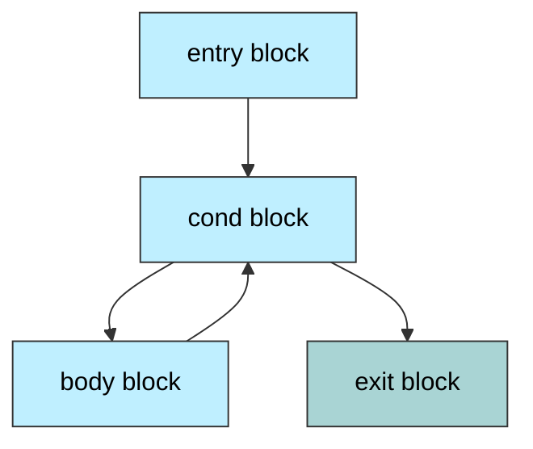
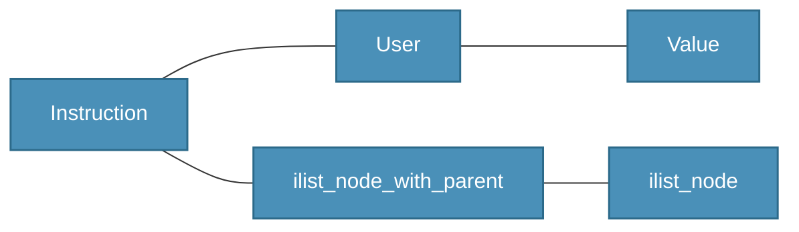
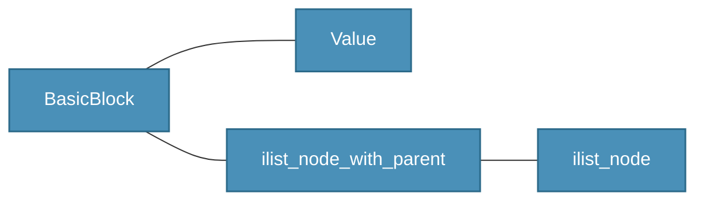
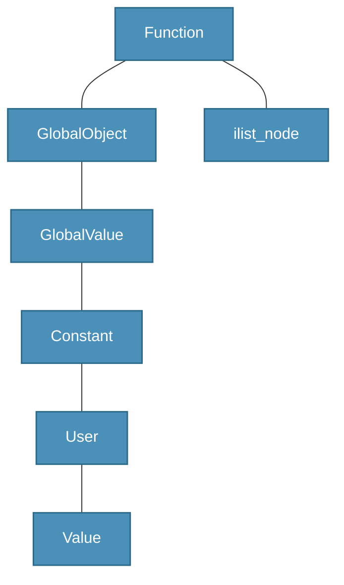

<h1 align="center">LLVM</h1>

---
<p align="center">Нетривиальные приложения ООП и шаблонов, итераторов и контейнеров на примере большого проекта.</p>
## Основы LLVM IR и экосистема
#### Разработка и предназначение
• Лицензионная дружелюбность.
• Модульность.
• Текстовая читаемость.
• Сильная типизация.
• IR - это виртуальный набор инструкций, подходящий для всех языков.
• Более низкие уровни IR играют ту же роль для архитектур.
![[../../../_Meta/attachments/15.1.png]]
#### Основные термины LLVM IR
• Ключевые слова
• <span style="color: blue;">Глобальные символы</span>
• Локальные символы
• <span style="color: green;">Типы</span>
• <span style="color: red;">Метки</span>
• Базовые блоки
• phi-узлы
• <span style="color: gray;">Комментарии</span>
• Инструкции

define <span style="color: green;">i32</span> <span style="color: blue;">@fib</span>(<span style="color: green;">i32</span>) {
<span style="color: red;">entry:</span>
	%1 = icmp ult <span style="color: green;">i32</span> %0, 2
	br <span style="color: green;">i1</span> %1, label %final, label %st
	
<span style="color: red;">std:</span> <span style="color: gray;">; main recursion entry</span>
	%2 = add <span style="color: green;">i32 </span>%0, -1
	%3 = call <span style="color: green;">i32</span> <span style="color: blue;">@fib</span>(<span style="color: green;">i32</span> %2)
	%4 = add <span style="color: green;">i32</span> %0, -2
	%5 = call <span style="color: green;">i32</span> <span style="color: blue;">@fib</span>(<span style="color: green;">i32</span> %4)
	%6 = add <span style="color: green;">i32</span> %3, %5
	br label %final
	
<span style="color: red;">final:</span>
	%7 = phi <span style="color: green;">i32</span> \[%6, %st\], \[1, %entry\]
	ret <span style="color: green;">i32</span> %7
}

• Ключевые слова
• Глобальные символы
• Локальные символы
• Типы
• Метки
• <span style="color: brown;">Базовые блоки</span>
• phi-узлы
• Комментарии
• Инструкции

define i32 @fib(i32) {
<span style="color: gray;">; 1:</span> 
	%2 = icmp ult i32 %0, 2
	br i1 %2, label %9, label %3
	
<span style="color: gray;">; 3:</span> 
	<span style="color: brown;">%4 = add i32 %0, -1</span> 
	<span style="color: brown;">%5 = call i32 @fib(i32 %4)</span> 
	<span style="color: brown;">%6 = add i32 %0, -2</span> 
	<span style="color: brown;">%7 = call i32 @fib(i32 %6)</span>
	<span style="color: brown;">%8 = add i32 %5, %7</span>
<span style="color: brown;">br label %9</span>                   <span style="color: gray;">; terminator</span> 
	
<span style="color: gray;">; 9:</span> 
	%10 = phi i32 \[%8, %3\], \[1, %1\]
	ret i32 %10
}
#### LLVM - это SSA представление
• Обычное представление
```
x = foo();
y = x;
x = bar();
y = x + y;
```
• SSA
```
x.0 = foo();
y.0 = x.0;
x.1 = bar();
y.1 = x.1 + y.0;
```
• Конечно, тут есть проблема. Как представить схождения управления?
• Обычное представление
```
x = foo();
if(x > 5) x = x + 1;
x = x + 2;
```
• SSA
```
x.0 = foo();
if(x.0 > 5) x.1 = x.0 + 1;
x.2 = ? + 2;
```
#### Явные phi-узлы
• SSA
```
x.0 = foo();
if(x.0 > 5) x.1 = x.0 + 1;
x.2 = phi(x.0, x.1) + 2;
```
#### Основные термины LLVM IR
• Ключевые слова
• Глобальные символы
• Локальные символы
• Типы
• Метки
• Базовые блоки
• <span style="color: blue;">phi-узлы</span>
• Комментарии
• Инструкции

define i32 @fib(i32) {
<span style="color: gray;">; 1:</span> 
	%2 = icmp ult i32 %0, 2
	br i1 %2, label %9, label %3
	
<span style="color: gray;">; 3:</span> 
	%4 = add i32 %0, -1
	%5 = call i32 @fib(i32 %4)
	%6 = add i32 %0, -2
	%7 = call i32 @fib(i32 %6)
	<span style="color: blue;">%8</span> = add i32 %5, %7
	br label %9              <span style="color: gray;">; terminator</span> 
	
<span style="color: gray;">; 9:</span> 
	<span style="color: blue;">%10 = phi i32 [%8,</span>  %3<span style="color: blue;">], [1,</span>  %1<span style="color: blue;">]</span> 
	ret i32 %10
}
#### Инструкции
• Базовый LLVM IR содержит фиксированное количество платформенно-независимых инструкций.
\<result\> = <span style="color: blue;">add</span> \<ty\> \<op1\>, \<op2\>
\<result\> =<span style="color: blue;">icmp</span> \<cond\> \<ty\> \<op1\>, \<op2\>
\<result\> = <span style="color: blue;">phi</span> \<ty\> \[ \<val0\>, \<label0\> \], ...
<span style="color: blue;">br</span> i1 \<cond\>, label \<iftrue\>, label \<iffalse\>
<span style="color: blue;">br</span> label \<dest\>
• Добавление новой инструкции крайне болезненно и меняет биткод.
#### Типы
• Пустой тип: `void`
• Скалярные типы: `i1`, `i8`, `i16`, ... , `half`, `float`, `double`
• Векторные типы: `<10 x i32>`
• Указатели: `i32*`, `i32 addrspace(5)*`
• Массивы: `[10 x i32], [12 x [10 x float]]`
• Структуры: `{i32, i32, float, i8`
• Функции: `i32 (i32, i32)`
#### Возвращаемся к числам Фибоначчи
```llvm
@fibarr = global [10 x i32] zeroinitializer

.....
	; fibarr[0] = 0; fibarr[1] = 1;
	br label %for.cond
	
for.cond:
	%i.0 = phi i64 [2, %entry], [%inc, %for.body]
	%cmp = icmp ult i64 %i.0, 10
	br i1 %cmp, label %for.body, label %for.end
	
for.body:
	; fibarr[i] = fibarr[i - 1] + fibarr[i - 2]
	%inc = add i64 %i.0, 1
	br label %for.cond
	
for.end:
```

#### Обсуждение
• Теперь нам надо построить заполнение массива.
• Наличие в языке таких типов как "указатель" предполагает некую модель памяти.
• Разумно ли вносить на уровень общего для всех IR такие тонкости как alignment, padding, etc?
#### Симметрия в store & load
• Все операции с памятью происходят по указателю.
• Чтобы загрузить значение, мы указываем его <span style="color: blue;">слева</span>.
<span style="color: blue;">%1</span> = load i32, i32* %idx2
• Чтобы сохранить значение, мы указываем его <span style="color: blue;">справа</span>.
store i32 <span style="color: blue;">%1</span>, i32* %idx2
• Откуда приходит указатель?
• Для начала: очень часто он уже есть.
#### Сослаться на fibarr
• Глобальная переменная это всегда указатель.
```llvm
@gv = global i8 0 ; i8 const *
@gvc = constant i8 42 ; const i8 const *
```
• Это означает, что она может использоваться в load/store напрямую.
```llvm
%1 = load i32, i32* gvc
store i32 %1, i32* gv
```
• Но в примере выше было написано
```llvm
@fibarr = global [10 x i32] zeroinitializer
```
• Как достать указатель на его нулевой и первый элемент?
#### GEP: униформность доступа
• Идея `getelementptr` - одинаковый доступ к массивам и структурам.
\<result\> = getelementptr \<ty\>, <span style="color: blue;">&#60ty>*</span> \<ptrval\> {, \<ty\> \<idx\>}*
• Здесь каждый индекс снимает один уровень косвенности.
<span style="color: gray;">; мы хотим написать: fibarr\[1\] = 1</span>
%fst = i32* getlementptr \[10 x i32\],
										 <span style="color: blue;">[10 x i32]*</span> @fibarr, <span style="color: red;">i64 1</span> <span style="color: gray;">; FAIL</span>
store i32 1, %fst
![[../../../_Meta/attachments/15.2.png]]
Правильный вариант
<span style="color: gray;">; мы хотим написать: fibarr\[1\] = 1</span>
%fst = i32* getlementptr \[10 x i32\],
										 <span style="color: blue;">[10 x i32]*</span> @fibarr, <span style="color: blue;">i64 0, i64 1</span> <span style="color: gray;">; OK</span>
store i32 1, %fst
![[../../../_Meta/attachments/15.3.png]]
#### GEP для структуры
• Смоделируем своего рода структуру.
```llvm
; struct S { int x; double y; float z[10]; };
%struct.S = { i32, double, [10 x float] }

@x = %struct.S zeroinitializer

define i32 @main() {
	%eltptr = getlementptr %struct.S,
												 %struct.S* @x, i32 0, i32 2, i64 3
	store float 1.000000e+00, float* %eltptr
}
```
К какому элементу идёт обращение через `eltptr`?
#### Пишем голову цикла
```llvm
@fibarr = global [10 x i32] zeroinitializer

define void @fill() {
entry:
	%f0 = getlementptr ([10 x i32], [10 x i32]* @fibarr, i64 0, i64 0)
	%f1 = getlementptr ([10 x i32], [10 x i32]* @fibarr, i64 0, i64 1)
	store i32 1, i32* %f0
	store i32 1, i32* %f1
	br label %for.cond
	
for.cond:
	%i.0 = phi i64 [2, %entry], [%inc, %for.body]
	%cmp = icmp ult i64 %i.0, 10
	br i1 %cmp, label %for.body, label %for.end
....
}
```
#### Как написать тело цикла?
```llvm
....
for.cond:
	%i.0 = phi i64 [2, %entry], [%inc, %for.body]
	%cmp = icmp ult i64 %i.0, 10
	br i1 %cmp, label %for.body, label %for.end
	
for.body:
	; fibarr[i] = fibarr[i - 1] + fibarr[i - 2]
	%inc = add i64  %i.0, 1
	br label %for.cond
	
for.end:
....
```
#### Искомое тело цикла
```llvm
; fibarr[i] = fibarr[i - 1] + fibarr[i - 2]
for.body:
	%sub1 = sub i64 %i.0, 1
	%idx1 = getelementptr [10 x i32], [10 x i32]* @fibarr, i64 0, i64 %sub1
	%0 = load i32, i32* %idx1
	
	%sub2 = sub i64 %i.0, 2
	%idx2 = getelementptr [10 x i32], [10 x i32]* @fibarr, i64 0, i64 %sub2
	%1 = load i32, i32* %idx2
	
	%add = add i32, %0, %1
	%idx3 = getelementptr [10 x i32], [10 x i32]* @fibarr, i64 0, i64 %i.0
	store i32 %add, i32* %idx3
	
	%inc = add i64 %i.0, 1
	br label %for.cond
```
#### Обсуждение
• И для структуры и для массива у нас был `gep` с первым индеком 0.
<span style="color: gray;">// auto arrayfirst = &fibarr[1]</span>
%arrayfirst = i32* getelementptr \[10 x i32\], \[10 x i32\]* @fibarr. <span style="color: red;">i64 0,</span> i64 1
<span style="color: gray;">// auto eltptr = &S.field3[3]</span>
%eltptr = getelementptr %struct.S, %struct.S* @x, <span style="color: red;">i32 0</span>, i32 2, i64 3
• Можно ли придумать, когда он будет не ноль?
#### Обсуждение
• В LLVM IR нет <span style="color: blue;">объектов</span> в том смысле, в каком они есть в C.
• Есть SSA-values, которые не перезаписываются.
• Есть локации в "памяти", которые униформны и доступны только по указателю.
• Сложно ли материализовать SSA-value?
• Сложно ли поднять семантическую сеть операций с памятью в SSA?
#### Фибоначчи без phi: локальные allocas
```llvm
define dso_local i32 @fib(i32) #0 {
	%2 = alloca i32, allign 4 ; слоты для материализации
	%3 = alloca i32, allign 4 ; SSA значений
	%4 = alloca i32, allign 4
	%5 = alloca i32, allign 4
	%6 = alloca i32, allign 4
	
	store i32 %0, i32* %2, allign 4
	store i32 0, i32* %3, allign 4
	store i32 1, i32* %4, allign 4
	store i32 0, i32* %5, allign 4
	br label %7
}
```
Дальше
```llvm
store i32 %0, i32* %2, allign 4
store i32 0, i32* %3, allign 4
store i32 1, i32* %4, allign 4
store i32 0, i32* %5, allign 4
br label %compare

compare: ; preds = %body, %entry

%8 = load i32, i32* %5, align 4
%9 = load i32, i32* %2, align 4
%10 = icmp ult i32 %8, %9
br i1 %10, label %body, label %exit

body: ; preds: %compare

%12 = load i32, i32* %3, align 4
store i32 %12, i32* %6, align 4

%13 = load i32, i32* %4, align 4
store i32 %13, i32* %3, align 4

%14 = load i32, i32* %6, align 4
%15 = load i32, i32* %4, align 4
%16 = add nsw i32 %15, %14

store i32 %16, i32* %4, align 4
br label %compare

exit: ; preds: %body
```
#### Обсуждение
• Понятно, что классы всех инструкций (add, sub, gep, phi, ...) наследуются от базового класса Instruction.
• Как бы вы спроектировали этот класс?
#### Представление инструкции
```cpp
class Instruction : public User, 
										public ilist_node_with_parent<Instruction, BasicBlock>
```

#### Идеология User / Value
<span style="color: blue;">%1</span> = add i64 %0, 1 <span style="color: gray;">; value</span>
<span style="color: red;">%2</span> = add i64 <span style="color: blue;">%1</span>, <span style="color: blue;">%1</span> <span style="color: gray;">; user / value</span>
%3 = add i64 <span style="color: blue;">%1</span>, <span style="color: red;">%2</span> <span style="color: gray;">; user</span>
• Инструкция, которая порождает Value - <span style="color: blue;">это и есть Value</span> (по SSA)
• Value знает обо всех свои Users(Value\:\:use_iterator)
• User знает о других своих операндах (User\:\:op_iterator)
```cpp
User::getOperand(i) // вернёт Value*
```
#### ilist: интрузивные списки
• Вообще-то в идеологии C++ большинство стандартных контейнеров <span style="color: blue;">неинтрузивны</span>. То есть, объект, помещённый в контейнер, не знает, помещён он в контейнер или нет.
• Увы, на идеологию LLVM лучше легли интрузивные списки. В таком списке сам элемент списка предоставляет механизмы prev/next.
• Поскольку каждая инструкция является узлом интрузивного списка, она должна наследовать от `ilist_node`.
• Благодаря этому допустимо сделать так:
```cpp
Instruction* subInst = addInst->getNextNode();
```
#### Представление базового блока
```cpp
class BasicBlock : public Value,
									 public ilist_node_with_parent<BasicBlock, Function>
```

#### Представление функции
```cpp
class Function : public GlobalObject, public ilist_node<Function>
```

#### Функции в LLVM IR
• Чтобы использовать функцию, её следует объявить.
```llvm
declare i8* @malloc(i32) ; вероятно это malloc из C standard library
```
• Далее она используется через `call`.
• Также через `call` заведён инлайн-ассемблер.
```llvm
call void asm sideffect "mov ax, bx", ""()
```
• Также через `call` можно делать индиректные вызовы.
```llvm
%result = call i64 %binop(i64 %x, i64 %y)
```
## Генерация IR
Далее лектор на примере простейшей программы на ParaCL (числа Фибоначчи) показывает разницу между скомпилированной программой и интерпретируемой.
```pcl
n = 0;
a = 0;
b = 1;
x = ?;

while(n < x) {
  n = n + 1;

  if (n == 1)
    print a;

  if (n == 2)
    print b;

  if (n > 2) {
    tmp = b;
    b = a + b;
    a = tmp;
    print b;
  }
}
```
Комплит так:
```bash
./build/ParaCL tests-pcl/fib/file.pcl
```
Из этого получается LLVM IR модуль (pcl.module). Далее лектор говорит, что чтобы получить исполняемый модуль из LLVM IR модуля, его надо слинковать со стандартной библиотекой. Стандартная библиотека языка ParaCL:
```cpp
//------------------------------------------------------------------------------
//
// pcllib.cc -- ParaCL driver
//
// main calls __pcl_start
// defines __pcl_print and __pcl_scan
//
//------------------------------------------------------------------------------

#include <iostream>

extern "C" void __pcl_start();

extern "C" void __pcl_print(int n) { std::cout << n << std::endl; }

extern "C" int __pcl_scan() {
  int n;
  std::cin >> n;
  if (!std::cin) {
    std::cerr << "Problem reading stdin\n";
    exit(1);
  }
  return n;
}

int main() { __pcl_start(); }
```
Далее ловким движением рук лектор делает:
```bash
clang++ file.pcl.ll ./pcl-lib/pcllib.cc
```
и получает исполняемый файл.
Далее лектор замечает, что точно так же можно интерпретировать:
```bash
./build/ParaCLi tests-pcl/fib/file.pcl
```
И отмечает, что исполняемый файл работает в разы быстрее.
Далее лектор предлагает сравнить на последовательности collatz:
```pcl
n = ?;
x = 2;
cmax = 0;
xmax = 0;

while (x < n) {
  c = 0;
  y = x;
  while (y > 1) {
    c = c + 1;
    t = 0;
    if ((y % 2) == 0) {
      t = 1;
      y = y / 2;
    } 
    if ((t == 0) && ((y % 2) != 0)) {
      y = 3 * y + 1;
    }
  }

  if (c > cmax) {
    xmax = x;
    cmax = c; 
  }

  x = x + 1;
}

print xmax;
print cmax;
```
Далее лектор запускает на интерпретаторе:
```bash
./build/ParaCLi tests-pcl/collatz/bench.pcl
```
На миллионе (1000000) интерпретатор завис более чем на 10 секунд.
Далее на компиляторе:
```bash
./build/ParaCL tests-pcl/collatz/bench.pcl
clang++ bench.pcl.ll ./pcl-lib/pcllib.cc
```
Для миллиона отработало мгновенно. Для пяти миллионов тоже достаточно быстро.
#### Контекст
• LLVM исходно проектировался как компилятор, способный работать в многозадачных режимах.
• LLVMContext содержит все глобальные сущности. Например, типы.
• Примитивные типы можно просто получить:
```cpp
llvm::Type::getInt32Ty(*currentContext)
```
• Более сложные типы конструируются из примитивных.
```cpp
// using FTPrint = void (int);
Type* Tys[] = { getInt32Ty(*currentContext) };
FunctionType* FTPrint =
		FunctionType::get(getVoidTy(*currentContext), Tys, false);
```
#### Владение контекстом
• Любая работа начинается с создания контекста, которое обычно тривильно.
```cpp
Context = new llvm::LLVMContext; // можно и без new
```
• У контекста стёрт конструктор копирования, поэтому его нельзя положить в контейнер вроде vector.
• Означает ли это, что у нас нет возможности следить за его временем жизни автоматически?
Далее лектор приводит пример:
```cpp
//-----------------------------------------------------------------------------
//
// Source code for MIPT ILab
// Slides: https://sourceforge.net/projects/cpp-lects-rus/files/cpp-graduate/
// Licensed after GNU GPL v3
//
//------------------------------------------------------------------------------
//
// Codegen.hpp -- code generation support
// main design flaw: global code generator
//
//------------------------------------------------------------------------------

#pragma once

#include <map>
#include <string>

#include "llvm/ADT/APInt.h"
#include "llvm/IR/BasicBlock.h"
#include "llvm/IR/Constants.h"
#include "llvm/IR/DerivedTypes.h"
#include "llvm/IR/Function.h"
#include "llvm/IR/IRBuilder.h"
#include "llvm/IR/Instructions.h"
#include "llvm/IR/LLVMContext.h"
#include "llvm/IR/LegacyPassManager.h"
#include "llvm/IR/Module.h"
#include "llvm/IR/Type.h"
#include "llvm/IR/Value.h"
#include "llvm/IR/Verifier.h"
#include "llvm/Support/TargetSelect.h"
#include "llvm/Support/raw_ostream.h"
#include "llvm/Target/TargetMachine.h"
#include "llvm/Transforms/InstCombine/InstCombine.h"
#include "llvm/Transforms/Scalar.h"
#include "llvm/Transforms/Scalar/GVN.h"
#include "llvm/Transforms/Utils.h"

#include "INode.hpp"

struct CodeGen {
  llvm::LLVMContext Context_;
  llvm::IRBuilder<> *Builder_;
  llvm::Module *Module_;
  std::map<std::string, llvm::Value *> NamedValues_;

  // Function initialized in StartFunction, this is questionable design
  // We need to call EndCurrentFunction mandatory
  // Can we redesign it?
  llvm::Function *Function_ = nullptr;

  CodeGen(std::string Name)
      : Builder_(new llvm::IRBuilder<>(Context_)),
        Module_(new llvm::Module(Name, Context_)) {}

  // assumption: extern void Name() { ..... }
  void StartFunction(std::string Name);

  void EndCurrentFunction() { Builder_->CreateRetVoid(); }

  void SaveModule(std::string ModuleName);

  llvm::Value *AddDeclRead(std::string Varname) {
    auto *V = NamedValues_[Varname];
    assert(V);
    auto *Ty = static_cast<llvm::AllocaInst *>(V)->getAllocatedType();
    return Builder_->CreateLoad(Ty, V, Varname.c_str());
  }

  llvm::Value *AddDeclWrite(std::string Varname, llvm::Value *Rhs) {
    auto *V = NamedValues_[Varname];
    assert(V);
    return Builder_->CreateStore(Rhs, V);
  }

  void AddDecl(std::string Varname) {
    auto &&BB = Function_->getEntryBlock();
    auto Ty = llvm::Type::getInt32Ty(Context_);
    llvm::IRBuilder<> TmpB(&BB, BB.begin());
    auto *Alloca = TmpB.CreateAlloca(Ty, 0, Varname.c_str());
    NamedValues_[Varname] = Alloca;
  }

  llvm::BasicBlock *StartIf(llvm::Value *CondV) {
    llvm::BasicBlock *ThenBB = llvm::BasicBlock::Create(Context_, "then", Function_);
    llvm::BasicBlock *MergeBB = llvm::BasicBlock::Create(Context_, "endif", Function_);
    Builder_->CreateCondBr(CondV, ThenBB, MergeBB);
    Builder_->SetInsertPoint(ThenBB);
    return MergeBB;
  }

  void EndIf(llvm::BasicBlock *MergeBB) {
    // assume we are now in ThenBB
    Builder_->CreateBr(MergeBB);
    Builder_->SetInsertPoint(MergeBB);
  }

  using WhileBlocksTy = std::pair<llvm::BasicBlock *, llvm::BasicBlock *>;

  WhileBlocksTy StartWhile(llvm::Value *CondV) {
    llvm::BasicBlock *BodyBB = llvm::BasicBlock::Create(Context_, "body", Function_);
    llvm::BasicBlock *MergeBB = llvm::BasicBlock::Create(Context_, "endwhile", Function_);
    Builder_->CreateCondBr(CondV, BodyBB, MergeBB);
    Builder_->SetInsertPoint(BodyBB);
    return std::make_pair(BodyBB, MergeBB);
  }

  void EndWhile(llvm::Value *CondV, WhileBlocksTy BBs) {
    // assume we are now inside body
    Builder_->CreateCondBr(CondV, BBs.first, BBs.second);
    Builder_->SetInsertPoint(BBs.second);
  }

  llvm::Value *AddOperation(Node::Operation Op, llvm::Value *LeftV,
                            llvm::Value *RightV);

  llvm::Type *getInt32Ty() { return llvm::Type::getInt32Ty(Context_); }

  llvm::Type *getVoidTy() { return llvm::Type::getVoidTy(Context_); }

  void createFnDecl(llvm::FunctionType *FT, std::string Name) {
    llvm::Function::Create(FT, llvm::Function::ExternalLinkage, Name, Module_);
  }

  ~CodeGen() {
    delete Builder_;
    delete Module_;
  }
};

CodeGen *createCodeGen(std::string Name);

extern std::unique_ptr<CodeGen> GlobalGen;
```
И рассматривает драйвер:
```cpp
//-----------------------------------------------------------------------------
//
// Source code for MIPT ILab
// Slides: https://sourceforge.net/projects/cpp-lects-rus/files/cpp-graduate/
// Licensed after GNU GPL v3
//
//------------------------------------------------------------------------------
//
// driver.cpp -- main entry point
//
//------------------------------------------------------------------------------

#include <filesystem>
#include <fstream>
#include <iostream>
#include <map>
#include <memory>
#include <string>

#include "Codegen.hpp"
#include "parser.hpp"

Node::IScope *CurrentScope = nullptr;
std::unique_ptr<CodeGen> GlobalGen = nullptr;

static int CurrentInlinePos = 0;

FILE *OpenFile(const char *Name) {
  FILE *F = fopen(Name, "r");
  if (!F) {
    perror("Cannot open file");
    throw std::runtime_error("No input file exists");
  }
  return F;
}

int main(int argc, char *argv[]) try {
  if (argc < 2) {
    std::cerr << "Usage: " << argv[0] << " file.pcl" << std::endl;
    return 0;
  }

  auto fdeleter = [](FILE *f) { fclose(f); };

  std::unique_ptr<FILE, decltype(fdeleter)> F(OpenFile(argv[1]), fdeleter);
  yyin = F.get();
  std::unique_ptr<Node::IScope> CurrentScopeOwner{createScope()};
  CurrentScope = CurrentScopeOwner.get();

#if (CODEGEN == 1)
  GlobalGen.reset(createCodeGen("pcl.module"));
  GlobalGen->StartFunction("__pcl_start");
#endif

  yyparse();

#if (CODEGEN == 1)
  // bad assumption that function is single
  GlobalGen->EndCurrentFunction();

  // save module to file
  auto ModuleName = std::filesystem::path(argv[1]).filename().string() + ".ll";
  std::cout << "Saving module to: " << ModuleName << "\n";
  GlobalGen->SaveModule(ModuleName);
#endif
} catch (const std::exception &e) {
  std::cerr << "Exception: " << e.what() << std::endl;
} catch (...) {
  std::cerr << "Exception unknown\n";
}

void PrintError(char const *Errmsg) {
  std::cerr << "Error: " << Errmsg << " - Line " << yylineno << ", Column "
            << CurrentInlinePos << std::endl;
  throw std::runtime_error("parse error");
}

void BeginToken(char *t, int *yyinlinePos) {
  yylloc.first_line = yylineno;
  yylloc.first_column = *yyinlinePos;
  yylloc.last_line = yylineno;
  *yyinlinePos += strlen(t);
  yylloc.last_column = *yyinlinePos;
  CurrentInlinePos = *yyinlinePos;
}
```
#### Модули
• Итак, у нас есть контекст.
• Далее мы используем его, чтобы создать модуль.
```cpp
Module = std::make_unique<llvm::Module>("pcl.module", Context);
```
• Модуль обозначает единицу трансляции. Скомпилируем fib.cc, и мы увидим:
```llvm
; ModuleID = 'fib.cc'
source_filename = "fib.cc"
target datalayout = какой-то layout
target triple = "x86_64-pc-linux-gnu"
```
#### DataLayout и TargetTriple
• Технически выставить после создания DataLayout и TargetTriple может быть неплохой идеей.
```cpp
Module->setTargetTriple("x86_64-unknown-unknown");
```
• В обычном кланге есть возможность задавать march или mcpu.
• Поддержать во фронтенде PCL эти опции может быть хорошей идеей.
• Немного странные правила DataLayout строчек можно посмотреть в официальной [документации](https://llvm.org/docs/LangRef.html#langref-datalayout).
• Что ещё может быть в модуле?
#### Модуль как мультиконтейнер
• Интересный способ заглянуть в содержимое - это посмотреть итераторы.
• <span style="color: blue;">Итератор по функциям: begin/end/rbegin/rend</span>.
• Итератор по глобальным переменным: global_begin/global_end.
• Итератор по алиасам: alias_begin/alias_end.
• Итератор по косвенным вызовам: ifunc_begin/ifunc_end.
• Итератор по метаданным: named_metadata_begin/named_metadata_end, etc...
• Кроме того, для каждого поддержан range: aliases/globals, etc...
```cpp
for(auto&& g : Module->globals()) { // нечто с g
```
#### Функции
• Функция создаётся после того, как создан её тип.
```cpp
auto* Int32Ty = llvm::Type::getInt32Ty(Context);

// using scanty = int ();
auto* ScanTy = llvm::FunctionType::get(Int32Ty, false);

auto* ScanF = Function::Create(ScanTy, ExternalLinkage, "__pcl_scan", Module); 
```
• Мы создаём "функцию" и назначаем её в модуль.
• Мы создаём "функцию", чтобы назначить её в модуль позднее:
```cpp
Module->getFunctionList().push_back(ScanF);
```
• Здесь используется тот факт, что функции - это интрузивный список.
#### Базовые блоки
• Чтобы начать вставку нам понадобится базовый блок.
```cpp
auto* BB = BasicBlock::Create(*Ctx, "entry", CurrentFunction);
```
• Имя и функция - необязательные параметры.
• Ещё один параметр, четвёртый - это блок после которого вставлять (по умолчанию в конец).
• Функция является родителем блока, но блок всегда может быть отвязан от функции через `removeFromParent` и вставлен в другую через `insertInto`.
• Кроме того, у блока есть `eraseFromParent`, которая отвязывает его от родителя и стирает.
Далее лектор рассуждает о том, что парсер должен быть отделён от кодгена и приводит пример:
