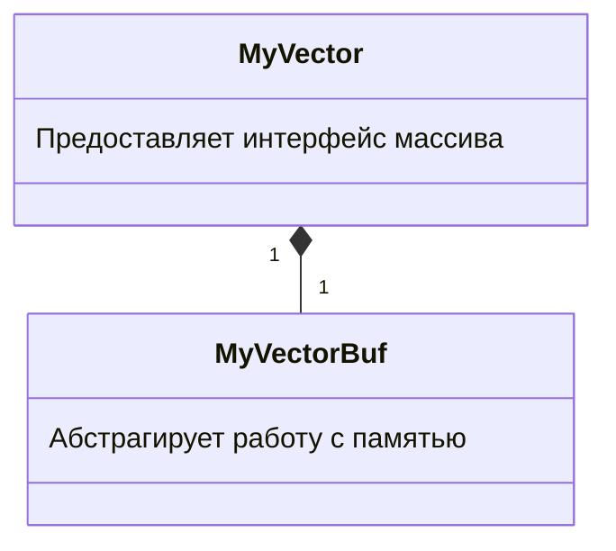

<h1 align="center">ИСКЛЮЧЕНИЯ</h1>

---
<p align="center">Механизмы нелокальной обработки ошибок. Гарантии безопасности. Проектирование с учётом исключений.</p>
## Ошибки и исключения
#### Обработка ошибок в стиле C
• Определяется область целочисленных кодов ошибок:
```c
enum error_t { E_OK = 0, E_NO_MEM, E_UNEXPECTED };
```
• Как функция сигнализирует, что результат её исполнения - это E_OK?
• Вернёт код ошибки
```c
error_t open_file(const char *name, FILE **handle);
```
• Использует thread-local facility. Например, errno/GetLastError.
```c
FILE *open_file(const char *name);
```
• Вернёт error_t* в списке параметров
```c
FILE *open_file(const char *name, error_t *errcode);
```
#### Проблемы уже в C
• Замечательно стандартная функция
```c
int atoi(const char *nptr);
```
• В случае, если конвертировать невозможно, возвращает 0.
	• <span style="color: blue;">Действительно ли возвращать ноль - хорошая идея?</span>
• В случае, если число слишком большое, возвращает HUGE_VAL и устанавливает errno = ERANGE.
	• <span style="color: blue;">Часто ли вы проверяли возврат на HUGE_VAL?</span>
#### Проблема в C++
```cpp
template <typename T> class MyVector {
	T *arr_ = nullptr;
	size_t size_, used_ = 0;

public:
	MyVector(size_t sz) : size_(sz) {
		arr_ = static_cast<T*>(malloc(sizeof(T) * sz_));
	}
// .... тут всё остальное ....
};
```
• Вы видите, в чём проблема в этом коде?
```cpp
MyVector(size_t sz) : size_(sz) {
	arr_ = static_cast<T*>(malloc(sizeof(T) * sz_));
	// тут должна быть обработка случая arr_ == nullptr
}
```
• Не обработана ситуация, когда malloc возвращает nullptr.
#### Чем нам грозит эта ситуация?
```cpp
MyVector v(100);
// тут объект v может оказаться в несогласованном состоянии
// v.arr_ = 0 т.к. память кончилась
// v.size_ = 100 т.к. конструктор никак не обработал ошибку
```
• Хуже всего то, что объект в несогласованном сотоянии никак не отличается от нормального объекта.
• Несогласованность может проявиться через тысячи строк кода.
• Это даже не UB. Несогласованное состояние вполне корректно.
#### Попытка решения: iostream style
```cpp
template <typename T> class MyVector {
	T *arr_ = nullptr;
	size_t size_, used = 0;
	bool valid_ = true;

public:
	MyVector(size_t sz) : size_(sz) {
		arr_ = static_cast<T*>(malloc(sizeof(T) * sz));
		if(!arr_) valid_ = false;
	}
	
	bool is_valid() const { return valid_; }
// .... и так далее ....
};
```
#### Обсуждение
• Покритикуйте решение в стиле потоков ввода-вывода.
```cpp
MyVector v(1000);

if(!v.is_valid())
	return -1;

// здесь используем v
```
• Кому оно нравится?
#### Копирование и присваивание
• Похоже, такой вектор тяжело использовать.
```cpp
MyVector v(1000); assert(v.is_valid());
MyVector v2(v); assert(v2.is_valid());
v2.push_back(3); assert(v2.is_valid());
v = v2; assert(v.is_valid());
```
• Есть ли идеи получше?
#### Перегрузка операторов
• Делаеть вещи ещё хуже.
```cpp
Matrix operator+(Matrix a, Matrix b);
```
• Здесь неоткуда вернуть код возврата.
• И поскольку это отдельная функция, здесь негде сохранить  goodbit.
• Конечно, мы всё ещё можем вернуть errno. Кому нравится идея его проверять в таких случаях?
#### Основная идея решения
• Выйти из вызванной функции в вызывающий код в обход обычных механизмов возврата управления.
• Аннотировать этот <span style="color: blue;">нелокальный</span> выход информацией о случившемся.
• Но что вообще мы знаем о нелокальных переходах?
#### Типы передачи управления
• Локальная передача управления
	• условные операторы
	• циклы
	• локальный goto
	• прямой вызов функций и возврат из них
• Нелокальная передача управления
	• косвенный вызов функций (напр. по указателю)
	• возобновление/приостановка сопрограммы
	• <span style="color: blue;">исключения</span>
	• переключение контекста потоков
	• нелокальный longjmp и вычисляемый goto
#### Исключения
• Исключительные ситуации уровня аппаратуры (например, undefined instruction exception).
• Исключительные ситуации уровня операционной системы (например, data page fault).
• Исключения C++ (только они и будут нас далее интересовать).
#### Исключительные ситуации
• Ошибки (исключительными ситуациями не являются)
	• рантайм ошибки, после которых состояние не восстановимо (например, segmentation fault)
	• ошибки контракта функции (assertion failure из-за неверных аргументов, невыполненные предусловия вызова)
• Исключительные ситуации
	• Состояние программы должно быть восстановимо (например: исчерпание памяти или отсутствие файла на диске)
	• Исключительная ситуация не может быть обработана на том уровне, на котором возникла (программа сортировки не обязана знать, что делать при нехватке памятина временный буфер)
#### Порождение ошибки
```cpp
struct UnwShow {
	UnwShow() { cout << "ctor\n"; }
	~UnwShow() { cout << "dtor\n"; }
};

int foo(int n) {
	UnwShow s;
	if(n == 0) abort(); // abort - это убийство
	foo(n - 1);
}

foo(4); // что на экране?
```
На экране 5 выводов конструктора.
#### Порождение исключения
```cpp
struct UnwShow {
	UnwShow() { cout << "ctor\n"; }
	~UnwShow() { cout << "dtor\n"; }
};

int foo(int n) {
	UnwShow s;
	if(n == 0) throw 1;
	foo(n - 1);
}

// вызов внутри try-блока
foo(4); // что на экране?
```
Теперь на экране 5 конструкторов, 5 деструкторов.
Полный пример:
```cpp
//---------------------------------------------------------------------------
//
// Source code for MIPT ILab
// Slides: https://sourceforge.net/projects/cpp-lects-rus/files/cpp-graduate/
// Licensed after GNU GPL v3
//
//---------------------------------------------------------------------------
//
// Demonstration of stack unwinding
//
//---------------------------------------------------------------------------

#include <iostream>

struct UnwShow {
	int n_;
	long t = 0xDEADBEEF;
	UnwShow(int n) : n_(n) { std::cout << "ctor: " << n_ << "\n"; }
	~UnwShow() { std::cerr << "dtor: " << n_ << "\n"; }
};

void foo(int n) {
	UnwShow s{n};
	
	// odr-use to materialize
	std::cout << "Addr of " << n << ": " << &s << std::endl;
	if(n == 0) {
		std::cout << "throw\n";
		throw 1;
	}
	foo(n - 1);
}

int main() {
	try {
		foo(5);
	} catch(int n) {
		std::cout << "catch\n";
	}
}
```
Компиляция показала то же самое. Помимо этого, видно ещё, что адреса стека растут вниз. А ещё см. ниже:
#### Раскрутка стека
![[8.1.png]]
#### Больше про throw
• Конструкция <span style="color: blue;">throw &ltexpression&gt</span> означает следующее:
	• Создать объект исключения
	• Начать размотку стека
• Примеры:
```cpp
throw 1;
throw new int(1);
throw MyClass(1, 1);
```
• Исключения отличаются от ошибок тем, что их нужно <span style="color: blue;">ловить</span>.
#### Ловля исключений
• Производится внутри <span style="color: blue;">try</span>. блока
```cpp
int divide(int x, int y) {
	if(y == 0) throw OVF_ERROR; // это так себе идея
	return x / y;
}

// где-то далее:

try {
	c = divide(a, b);
} catch (int x) {
	if(x == OVF_ERROR) std::cout << "Overflow" << std::endl;
}
```
#### Некоторые правила
• Ловля происходит по точному типу:
```cpp
try { throw 1; } catch(long l) {} // не поймали
```
• Или по ссылке на точный тип:
```cpp
try { throw 1; } catch(const int &ci) {} // поймали
```
• Или по указателю на точный тип:
```cpp
try { throw new int(1); } catch(int *pi) {} // поймали
```
• Или по ссылке или указателю на базовый класс:
```cpp
try { throw Derived(); } catch(Base &b) {} // поймали
```
Пример:
```cpp
//---------------------------------------------------------------------------
//
// Source code for MIPT ILab
// Slides: https://sourceforge.net/projects/cpp-lects-rus/files/cpp-graduate/
// Licensed after GNU GPL v3
//
//---------------------------------------------------------------------------
//
// Demonstration of different throws
//
//---------------------------------------------------------------------------

#include <iostream>

struct Base {
	virtual ~Base() {}
};

struct Derived : Base {};

enum MyErrs { MY_OK, MYFAL };

enum class MyErrsC : int { MY_OK, MYFAL };

int main() {
	try {
		MyErrs m = MY_OK;
		throw m;
	} catch (int) {
		std::cout << "int\n";
	} catch (MyErrs) {
		std::cout << "MyErrs\n"; // ловим тут
	}
	
	try {
		MyErrsC m = MyErrsC::MY_OK;
		throw m;
	} catch (int) {
		std::cout << "int\n";
	} catch (MyErrsC) {
		std::cout << "MyErrsC\n"; // ловим тут
	}
	
	try {
		throw 1;
	} catch (long) {
		std::cout << "long\n";
	} catch (int) {
		std::cout << "int\n"; // ловим тут
	}
	
	try {
		throw 1;
	} catch (const double &) {
		std::cout << "const double &\n";
	} catch (const int &) {
		std::cout << "const int&\n"; // ловим тут
	}
	
	try {
		throw 1;
	} catch (const int &) {
		std::cout << "first\n"; // ловим тут
	} catch (int) {
		std::cout << "second\n";
	}
	
	try {
		throw 1;
	} catch (int) {
		std::cout << "new first\n"; // ловим тут
	} catch (const int&) {
		std::cout << "new second\n";
	}
	
	try {
		throw Derived();
	} catch (Base) {
		std::cout << "Base sliced\n"; // ловим тут
	}
	
	try {
		throw Derived();
	} catch (Base &) {
		std::cout << "Base ref\n"; // ловим тут
	}
	
	try {
		throw new Derived();
	} catch (Base *b) {
		std::cout << "Base ptr\n"; // ловим тут
		delete b;
	}
}
```
• Catch-блоки пробуются в порядке перечисления:
```cpp
try { throw 1; }
catch(long l) {} // не поймали
catch(const int &ci) {} // поймали
```
• Пойманную переменную можно менять или удалять.
```cpp
try { throw new Derived(); } catch(Base *b) { delete b; } // ok
```
• Пойманное исключение можно перевыбросить.
```cpp
try { throw Derived(); } catch(Base &b) { throw; } // ok
```
#### Обсуждение
• Чуть раньше был приведён следующий код для обработки ошибки переполнения:
```cpp
enum class errs_t { OVF_ERROR, UDF_ERROR, /*и так далее*/ };

int divide(int x, int y) {
	if(y == 0) throw errs_t::OVF_ERROR; // это так себе идея
	return x / y;
}
```
• Покритикуйте, что тут плохо?
• Как можно улучшить этот код?
• Очевидное улучшение: переход к классам исключений.
```cpp
class MathErr { /*информация об ошибке*/ };

class DivByZero : public MathErr { /*расширение*/ };

int divide(int x, int y) {
	if(y == 0) throw DivByZero("Division by zero occured");
	return x / y;
}

// где-то дальше
catch (MathErr &e) { std::cout << e.what() << std::endl; }
```
#### Некоторые неприятности
• Какие проблемы вы видите в этом коде?
```cpp
class MathErr { /*информация об ошибке*/ };
class Overflow : public MathErr { /*расширение*/ };

// где-то дальше
try {
	// тут много опасного кода
}
catch(MathErr e) { /* обработка всех ошибок */ } // slicing!
catch(Overflow o) { /* обработка переполнения */ }
```
Пример:
```cpp
//---------------------------------------------------------------------------
//
// Source code for MIPT ILab
// Slides: https://sourceforge.net/projects/cpp-lects-rus/files/cpp-graduate/
// Licensed after GNU GPL v3
//
//---------------------------------------------------------------------------
//
// Demonstration of slicing inside exception handling
//
//---------------------------------------------------------------------------

#include <iostream>

using std::cout;
using std::endl;

struct Base {
	virtual ~Base() { cout << "~Base" << endl; }
};

struct Derived : Base {
	~Derived() { cout << "~Derived" << endl; }
};

int main() {
	try {
		throw Derived();
	}
#if defined(CORR)
	catch (Base &b) {
	}
#else
	catch (Base b) {
	}
#endif
}
```
Вывод без CORR:
```bash
~Base
~Derived
~Base
```
Вывод с CORR:
```
~Base
~Derived
```
#### Избегаем неприятностей
• Обсужденеи: какие <span style="color: red;">ещё</span> проблемы вы видите в этом коде?
```cpp
class MathErr { /*информация об ошибке*/ };
class Overflow : public MathErr { /*расширение*/ };

// где-то дальше
try {
	// тут много опасного кода
}
// 1. Правильный порядок: от частных к общим
// 2. Ловим строго по косвенности
catch(Overflow& o) { /* обработка переполнения */ }
catch(MathErr& e) { /* обработка всех ошибок */ }
```
#### Но как избежать самобытности?
• Теперь всё неплохо, но хм... неужели я первый, кто наткнулся на такие ошибки?
```cpp
class MathErr { /*информация об ошибке*/ };
class Overflow : public MathErr { /*расширение*/ };

// где-то дальше
try {
	// тут много опасного кода
}
// 1. Правильный порядок: от частных к общим
// 2. Ловим строго по косвенности
catch(Overflow& o) { /* обработка переполнения */ }
catch(MathErr& e) { /* обработка всех ошибок */ }
```
#### Стандартные классы исключений
![[8.2.png]]
![[8.3.png]]
#### Обсуждение
• Какой интерфейс вы бы сделали у std::exception?
```cpp
struct exception {
	exception() noexcept;
	exception(const exception&) noexcept;
	exception& operator=(const exception&) noexcept;
	virtual ~exception();
	virtual const char *what() const noexcept;
};
```
• Аннотация noexcept означает обещание, что эта функция не выбросил исключений.
• Она распространяется на определения виртуальных функций.
#### Используем стандартные классы
• Наследование от стандартного класса вводит расширение в иерархию
```cpp
class MathErr : public std::runtime_error { /* информация */ };
class Overflow : public MathErr { /* расширение */ };

// где-то дальше
try {
	// тут много опасного кода
}
catch (Overflow& o) { /* обработка переполнения */ }
catch (MathErr& e) { /* обработка всех ошибок */ }
```
• Впрочем, у наследования есть и тёмные стороны...
#### Множественное наследование
Пример:
```cpp
//---------------------------------------------------------------------------
//
// Source code for MIPT ILab
// Slides: https://sourceforge.net/projects/cpp-lects-rus/files/cpp-graduate/
// Licensed after GNU GPL v3
//
//---------------------------------------------------------------------------
//
// Demonstration of problems with multiple inheritance
//
//---------------------------------------------------------------------------

#include <iostream>
#include <stdexcept>

struct my_exc1 : std::exception {
	char const* what() const noexcept override { return "exc1"; }
};

struct my_exc2 : std::exception {
	char const* what() const noexcept override { return "exc2"; }
};

struct your_exc3 : my_exc1, my_exc2 {};

int main() {
	try {
		throw your_exc3();
	} catch(std::exception const& e) {
		std::cout << e.what() << "\n";
	} catch(...) {
		std::cerr << "whoops!\n";
	}
}
```
Вывод:
```bash
whoops!
```
#### Перехват всех исключений
• Используется троеточие (как в printf).
```cpp
try {
	// тут много опасного кода
} catch (...) {
	// тут обрабатываются все исключения
}
```
• Сама идея, что можно как-то осмысленно обработать любое исключение очень сомнительна.
#### Нейтральность
• Функция называется нейтрально относительно исключений, если она не ловит чужих исключений.
• Хорошо написанная функций в хорошо спроектированном коде как минимум нейтральна.
![[../../../_Meta/attachments/8.4.png]]
#### Перевыброс
• Единственное разумное применение catch-all - это очистка критического ресурса и перевыброс исключения.
• На самом деле, даже разумность этого варианта под сомнением.
```cpp
int *critical = new int[10000]();
try {
	// тут много опасного кода
}
catch (...) {
	delete [] critical;
	throw;
}
```
• Кто-нибудь предложит лучше?
#### Обсуждение
• Кажется, есть одно место, где мы не можем поймать исключение.
```cpp
template <typename T> struct Foo {
	T x_, y_;
	Foo(int x, int y) : x_(x), y_(y) { // <-- exception in x_(x)
		try {
			// some actions
		}
		catch(std::exception& e) {
			// some processing
		}
	}
};
```
• С одной стороны, вроде и не нужно ловить. Или, может быть, нужно?
#### Try-блоки уровня функций
• Мы можем завернуть всю функцию в try-block.
```cpp
int foo() try { bar(); }
catch(std::exception& e) { throw; }
```
• В том числе и конструктор.
```cpp
Foo::Foo(int x, int y) try : x_(x), y_(y) {
	// some actions
}
catch(std::exception& e) {
	// some processing
}
```
• Техника скорее экзотическая, но лучше знать чем не знать.
#### Catch уровня функций
• На уровне функций, catch входит в scope функции.
```cpp
int foo(int x) try {
	bar();
}
catch(std::exception& e) {
	std::cout << x << ': ' << e.what() << std::endl; // ok
}
```
• Увы, но try-block на main не ловит исключения в конструкторах глобальных объектов.
#### Исключения для лучшего кода?
• <span style="color: blue;">Преимущества</span>:
	• Текст не замусоривается обработкой кодов возврата или errno, вся обработка ошибок отделена от логики приложения.
	• Ошибки не игнорируются по умолчанию. Собственно, они не могут быть проигнорированы.
• <span style="color: red;">Недостатки</span>:
	• Code path disruption - появление в коде неожиданных выходных дуг.
	• Некоторый оверхед на исключения.
## Гарантии безопасности
#### Вернёмся к исходной проблеме
```cpp
template <typename T> class MyVector {
	T *arr_ = nullptr;
	size_t size_, used_ = 0;
public:
	explicit MyVector(size_t sz) : size_(sz) {
		arr_ = static_cast<T*>(malloc(sizeof(T) * sz));
		if(!arr_) {
			// и что здесь делать?
		}
	}
// .... тут всё остальное ....
};
```
• Теперь <span style="color: blue;">вполне</span> ясно, как эта ошибка вообще может быть обработана.
```cpp
template <typename T> class MyVector {
	T *arr_ = nullptr;
	size_t size_, used_ = 0;
public:
	explicit MyVector(size_t sz) : size_(sz) {
		arr_ = static_cast<T*>(malloc(sizeof(T) * sz));
		if(!arr_) {
			throw std::bad_alloc();
		}
	}
// .... тут всё остальное ....
};
```
• Этот код можно упростить, так как по сути тут написан оператор new.
```cpp
template <typename T> class MyVector {
	T *arr_ = nullptr;
	size_t size_, used_ = 0;
public:
	// бросает bad_alloc
	explicit MyVector(size_t sz) : arr_(new T[sz]), size_(sz) {}
// .... тут всё остальное ....
};
```
• Задача: написать копирующий конструктор.
#### Пример Каргилла
• Все ли понимают, что тут плохо?
```cpp
template <typename T> class MyVector {
	T *arr_ = nullptr;
	size_t size_, used_ = 0;
	
public:
	MyVector(const MyVector &rhs) {
		arr_ = new T[rhs.size_]; // здесь утечка памяти
		size_ = rhs.size_; used_ = rhs.used_;
		for(size_t i = 0; i != rhs.size_; ++i) {
			arr_[i] = rhs.arr_[i]; // если здесь исключение
		}
	}
};
```
#### Безопасность относительно исключений
• Код, в котором при исключении могут утечь ресурсы, оказаться в несогласованном состоянии объекты и прочее, называется <span style="color: blue;">небезопасным</span> относительно исключений.
• Каргилл писал: "<span style="color: brown;">I suspect that most members of the C++ community vastly underestimate the skills needed to program with exceptions and therefore underestimate the true costs of their use.</span>" \[3]
• И, в общем, это до сих пор так, хотя прекрасные книги Саттера \[5] и \[6] сильно улучшили общую грамотность.
#### Гарантии безопасности
• Базовая гарантия: исключение при выполнении операции может изменить состояние программы, но не вызывает утечек и оставляет все объекты в согласованном (<span style="color: blue;">но не обязательно предсказуемом</span>) состоянии.
• Строгая гарантия: при исключении гарантируется <span style="color: blue;">неизменность состояния</span> программы относительно задействованных в операции объеков (commit/rollback).
• Гарантия бессбойности: функция не генерирует исключений (noexcept).
#### Безопасное копирование
```cpp
template <typename T>
T *safe_copy(const T* src, size_t srcsize) {
	T *dest = new T[srcsize];
	try {
		for(size_t idx = 0; idx != srcsize; ++idx)
			dest[idx] = src[idx];
	}
	catch (...) {
		delete [] dest;
		throw;
	}
	return dest;
}
```
#### Теперь конструктор копирования
```cpp
template <typename T> class MyVector {
	T *arr_ = nullptr;
	size_t size_, used_ = 0;
	
public:
	MyVector(const MyVector &rhs) :
		arr_(safe_copy(rhs.arr_, rhs.size_)),
		size_(rhs.size), used_(rhs.used_) {}
};
```
• Следующий шаг: оператор присваивания.
• Вероятно теперь, когда у нас есть safe_copy, нам будет совсем просто?
#### Оператор присваивания
• Вы видите проблемы в этой реализации?
```cpp
template <typename T> class MyVector {
	T *arr_ = nullptr;
	size_t size_, used_ = 0;
	
public:
	MyVector& operator= (const MyVector &rhs) {
		if(this == &rhs) return *this;
		delete [] arr_; // уже стёрли
		arr_ = safe_copy(rhs.arr_, rhs.size_); // исключение
		size_ = rhs.size_; used_ = rhs.used_;
		return *this;
	} // объект в неконсистентном состоянии
};
```
#### Оператор присваивания v2
```cpp
template <typename T> class MyVector {
	T *arr_ = nullptr;
	size_t size_, used_ = 0;
	
public:
	MyVector& operator= (const MyVector &rhs) {
		if(this == &rhs) return *this;
		T *narr = safe_copy(rhs.arr_. rhs.size_);
		delete [] arr_;
		arr_ = narr;
		size_ = rhs.size_; used_ = rhs.used_;
		return *this;
	}
};
```
• Теперь ok, но это как-то хрупко и подвержено случайным проблемам.
#### Внезапно swap
```cpp
template <typename T> class MyVector {
	T *arr_ = nullptr;
	size_t size_, used_ = 0;
	
public:
	void swap(MyVector& rhs) {
		std::swap(arr_, rhs.arr_);
		std::swap(size_, rhs.size_);
		std::swap(used_, rhs.used_);
	}
};
```
• Вроде бы этот оператор не бросает исключений, и это хочется задокументировать.
#### Интерлюдия: noexcept
• Специальное слово noexcept документирует гарантию бессбойности для кода.
```cpp
void swap(MyVector& rhs) noexcept {
	std::swap(arr_, rhs.arr_);
	std::swap(size_, rhs.size_);
	std::swap(used_, rhs.used_);
}
```
• При оптимизациях, компилятор будет уверен, что исключений не будет.
• Если они всё-таки вылетят, то это сразу std::terminate.
• Вы не должны употреблять noexcept там, где исключения всё же возможны.
#### Оператор присваивания: линия Калба
```cpp
template <typename T> class MyVector {
	T *arr_ = nullptr;
	size_t size_, used_ = 0;
	
public:
	void swap(MyVector& rhs) noexcept;
	
	MyVector& operator= (const MyVector &rhs) {
		MyVector tmp(rhs); // тут мы можем бросить исключение
// ------------------------------------------------------ линия Калба
		swap(tmp); // тут мы меняем состояние класса
		return *this;
	}
};
```
• Это даёт строгую гарантию по присваиванию.
#### Подумаем про push?
• Подумайте про push.
```cpp
template <typename T> class MyVector {
	T *arr_ = nullptr;
	size_t size_, used_ = 0;
	
public:
	void push(T new_elem);
};
```
• Может потребоваться реаллокация, если size_ == used_.
#### Kalb line
• При проектировании очень полезно провести в уме эту линию.
```cpp
void push(const T& t) {
	if(used_ == size_) {
		MyVector tmp(size_*2 + 1);
		while(tmp.size() < used_)
			tmp.push(arr_[tmp.size()]);
		tmp.push(t);
// Выше этой линии инварианты класса неизменны
//-------------------------------------------------------
// Ниже этой линии операции не кидают исключений
		swap(*this, tmp); // операция noexcept
		return;
	}
// и так далее
}
```
#### Условный noexcept
• Некоторые функции непонятно аннотировать noexcept или нет?
```cpp
template <class T>
T copy(T const& original) /* noexcept? */ {
	return original;
}
```
• Эта функция noexcept для int, но не для vector.
• Некоторые функции можно различить простыми определителями.
```cpp
template <class T>
T copy(T const& orig) noexcept(is_fundamental<T>::value) {
	return orig;
}
```
• noexcept(true) - это всё равно, что просто noexcept.
• noexcept(false) - это его отсутствие, а не обещани, что функция точно что-то бросит.
• Решение рабочее, но недостаточно точное. Даже у типов, не являющихся фундаментальными, копирующий конструктор может не бросать исключений.
#### Оператор noexcept
• Для более тонкой настройки служит оператор noexcept.
```cpp
template <class T>
T copy(T const& orig) noexcept(noexcept(T(orig))) {
	return orig;
}
```
• Оператор noexcept возвращает true или false в зависимости от вычисления выражения под ним на этапе компиляции.
• Разумеется, выражение T(orig) выглядит так себе.
#### Оператор noexcept: альтернативы
```cpp
template <class T>
T copy(T const& orig) noexcept(std::is_nothrow_copy_constructible<T>::value) {
	return orig;
}
```
• Внутри этот определитель реализован через оператор noexcept  и настоящее место этого оператора именно там - в библиотечном коде.
• Тем не менее, какие-то детали о нём знать полезно.
#### Оператор noexcept: детали
• Оценивает каждую функцию, задействованную в выражении, но не вычисляет выражение.
```cpp
struct ThrowingCtor { ThrowingCtor(){} };

void foo(ThrowingCtor) noexcept;
void foo(int) noexcept;

assert(noexcept(foo(1)) == true);
assert(noexcept(foo(ThrowingCtor{})) == false);
```
• Возвращает false для constant expressions.
• Интересно, что разыменование nullptr - это вариант нормы для noexcept.
Пример:
```cpp
//---------------------------------------------------------------------------
//
// Source code for MIPT ILab
// Slides: https://sourceforge.net/projects/cpp-lects-rus/files/cpp-graduate/
// Licensed after GNU GPL v3
//
//---------------------------------------------------------------------------
//
// Some details of noexcept expressions
//
//---------------------------------------------------------------------------

#include <iostream>
#include <type_traits>

struct DefaultCtor {};

struct ThrowinCtor {
	ThrowingCtor(){}; // =default will create noexcept one
	ThrowingCtor(const ThrowingCtor &) = default;
	ThrowingCtor(ThrowingCtor &&) = default;
};

struct Inherited {
	ThrowingCtor c;
};

void foo(int) noexcept;
void foo(DefaultCtor) noexcept;
void foo(ThrowingCtor) noexcept;

int main() {
	std::cout << std::boolalpha;
	std::cout << "noexcept(null pointer deref): "
						<< noexcept(*static_cast<int *>(nullptr)) << std::endl;
	
	std::cout << "foo(int): " << noexcept(foo(1)) << std::endl;
	std::cout << "foo(Default): " << noexcept(foo(DefaultCtor{})) << std::endl;
	std::cout << "foo(Throwing): " << noexcept(foo(ThrowingCtor{})) << std::endl;
	
	std::cout << "Default constr: "
	          << std::is_nothrow_constructable<DefaultCtor>::value << std::endl;
	std::cout << "Default copy constr: "
	          << std::is_nothrow_copy_constructible<DefaultCtor>::value
	          << std::endl;
	std::cout << "Default move constr: "
	          << std::is_nothrow_move_constructible<DefaultCtor>::value
	          << std::endl;
	
	std::cout << "Inherited constr: "
	          << std::is_nothrow_constructable<Inherited>::value << std::endl;
	std::cout << "Inherited copy constr: "
	          << std::is_nothrow_copy_constructible<Inherited>::value
	          << std::endl;
	std::cout << "Inherited move constr: "
	          << std::is_nothrow_move_constructible<Inheritedr>::value
	          << std::endl;
}
```
#### Обсуждение: noexcept(false)
• Любой деструктор по умолчанию noexcept.
• Одним из способов позволить исключениям покидать деструктор является его пометка как noexcept(false).
• Вы должны быть осторожны, помечая так деструкторы, потому что деструктор сам по себе используется в процессе размотки (см. пример).
• Вы можете проверить внутри деструктора, идёт ли размотка посредством вызова std::uncaught_exceptions().
Пример:
```cpp
//---------------------------------------------------------------------------
//
// Source code for MIPT ILab
// Slides: https://sourceforge.net/projects/cpp-lects-rus/files/cpp-graduate/
// Licensed after GNU GPL v3
//
//---------------------------------------------------------------------------
//
// Demonstration of noexcept(false)
//
//---------------------------------------------------------------------------

#include <iostream>
#include <stdexcept>

#ifdef BAD
struct T {
	~T() { throw std::runtime_error(""); }
};

void test0() {
	try {
		T t;
	} catch(std::runtime_error &e) {
		std::cerr << "Exception catched\n";
	}
	std::cerr << "Success\n";
}
#endif

struct S {
	~S() noexcept(false) {
		if(std::uncaught_exceptions())
			std::cerr << "Dtor called in unwinding\n";
		throw std::runtime_error("");
	}
};

void test1() {
	try {
		S s;
	} catch(std::runtime_error &e) {
		std::cerr << "Exception catched\n";
	}
	std::cerr << "Success\n";
}

void test2() {
	try {
		S s;
		throw std::runtime_error("");
	} catch(std::runtime_error &e) {
		std::cerr << "Exception catched\n";
	}
	std::cerr << "Success\n";
}

int main() {
#ifdef BAD
	std::cerr << "test0: ";
	test0();
#endif
	std::cerr << "test1: ";
	test1();
	std::cerr << "test2: ";
	test2();
}
```
Вывод:
С -DBAD
```bash
warning: 'throw' will always call 'terminate' [-Wterminate]
# ...
test0: terminate called after throwing an instance of 'std::runtime_error'
	what():
Aborted (core dumped)
```
Без -DBAD
```bash
test1: Exception catched
Success
test2: Dtor called in unwinding
terminate called after throwing an instance of 'std::runtime_error'
	what():
Aborted (core dumped)
```
#### Извлечение из массива
• Безопасен ли этот код относительно исключений?
```cpp
template <typename T> class MyVector {
	T *arr_ = nullptr;
	size_t size_, used_ = 0;

public:
	T pop() {
		if(used_ <= 0) throw underflow{};
		T result = arr_[used_ - 1];
		used_ -= 1;
		return result;
	}
};
```
#### Внезапная проблема
• Кажется, что всё хорошо.
• Но что произойдёт в точке использования?
```cpp
MyVector<SomeType> v;
// тут много кода
SomeType s = v.pop(); // исключение при копировании в s
```
• Тогда окажется, что объект уже удалён, но по месту назначения не пришёл и навсегда потерян.
#### Извлечение из массива v2
• Тут правильное проектирование страхует от проблем.
```cpp
template <typename T> class MyVector {
	T *arr_ = nullptr;
	size_t size_, used_ = 0;

public:
	T top() const {
		if(used_ <= 0) throw outofbounds{};
		return arr_[used_ - 1];
	}
	
	void pop() {
		if(used_ <= 1) throw underflow{}; used_ -= 1;
	}
};
```
#### Обсуждение
• Оказывается, безопасность относительно исключений влияет на проектирование!
• Если это так, то почему бы сразу не спроектировать нечто, что нам удобно будет делать безопасным?
• Удивительно, но для этого нам надо будет посмотреть на тонкости работы с памятью.
## Детали работы с памятью
#### Глобальные операторы
• В языке C для выделения памяти служат функции malloc и free.
```c
void *p = malloc(10);
free(p);
```
• В языке C++ этим занимаются операторы new и delete.
• При этом в отличии, от, скажем, оператора +, у них есть **глобальные формы**.
• Когда вы пишете new-expression для встроенного типа, он будет истолкован именно как вызов глобального оператора.
```cpp
int *n = new int(5); // выделение + конструирование
n = (int *) ::operator new(sizeof(int)); // только выделение
```
• Вы можете переопределить глобальные операторы и изменить поведение всех классов, которые ими пользуются.
```cpp
void *operator new(std::size_t n) {
	void *p = malloc(n); if(!p) throw std::bad_alloc();
	printf("Alloc: %p, size if %zu\n", p, n);
	return p;
}
```
• Теперь что мы ожидаем увидеть на экране при создании списка из одного элемента?
```cpp
std::list<int> l;
l.push_back(42);
```
Пример:
```cpp
//---------------------------------------------------------------------------
//
// Source code for MIPT ILab
// Slides: https://sourceforge.net/projects/cpp-lects-rus/files/cpp-graduate/
// Licensed after GNU GPL v3
//
//---------------------------------------------------------------------------
//
// operator new overload
//
//---------------------------------------------------------------------------

#include <cstdio>
#include <cstdlib>
#include <iostream>
#include <list>
#include <new>
#include <stdexcept>

void *operator new(std::size_t n) {
	void *p = std::malloc(n);
	if(!p)
		throw std::bad_alloc{};
		
#ifdef USECOUT
	// Probably bad idea. Why?
	std::cout << "Alloc: " << p << ", size is " << n << "\n";
#else
	std::printf("Alloc: %p, size is %zi\n", p, n);
#endif
	return p
}

void operator delete(void *mem) noexcept {
	std::printf("Free: %p\n", mem);
	std::free(mem);
}

int main() {
	std::list<int> l;
	l.push_back(42);
}
```
Вывод:
Без -DUSECOUT:
```bash
Alloc: 0x7fffbda15eb0, size is 24
Free: 0x7fffbda15eb0
```
#### Обсуждение
• Мы отделяем вызов конструкторов от выделения памяти. Но что если конструктор выбросит исключение?
```cpp
struct S {
	S(); // десятый конструктор кинет исключение
	~S();
};

S *sarr = new S[20];
```
• Сколько тут будет конструкторов и деструкторов, если мы знаем, что new\[] даёт строгую гарантию?
#### Формы глобальных операторов
• Основные формы все в чём-то похожи на malloc.
```cpp
void *operator new(std::size_t);
void operator delete(void*) noexcept;
void *operator new[](std::size_t);
void operator delete[](void*) noexcept;
```
• Предусмотрены также дополнительные варианты с семантикой noexcept.
```cpp
void *operator new(std::size_t, const std::nothrow_t&) noexcept;
void *operator new[](std::size_t, const std::nothrow_t&) noexcept;
```
• Пока что должно быть не слишком понятно, как их использовать.
#### Небросающий new
• Если для new-expression не передано аргументов, она раскрывается просто.
```cpp
p = new int{42};
// p = (int *) ::operator new(sizeof(int)); *p = 42;
```
• Если аргументы переданы, они ставятся в конец глобального оператора.
```cpp
p = new (nothrow) int{42};
// p = (int *) ::operator new(sizeof(int), nothrow); *p = 42;
```
• Специальный аргумент std::nothrow типа std::nothrow_t показывает, что мы не хотим бросать исключение.
• Тогда нам надо возвращать нулевой указатель при неудаче.
#### Размещающий new
• Поскольку аллокация/деаллокация - это операторы, они могут быть переопределены.
• Но есть непереопределяемый глобальный оператор.
```cpp
void* operator new(std::size_T size, void* ptr) noexcept;
void* operator new[](std::size_T size, void* ptr) noexcept;
```
• Он называется размещающим new, и ему не соответствует никакого delete, потому что всё, что он делает - это размещает объект в сырой памяти.
#### Работа с размещающим new
• Работа с памятью отделена от работы с объектом в памяти.
```cpp
void *raw = ::operator new(sizeof(Widget), std::nothrow);
if(!raw) { /* обработка */ }

Widget *w = new (raw) Widget;
// .... тут использование w ....

w->~Widget();
::operator delete(raw);
```
• Обсуждение: может ли это помочь проектированию безопасных контейнеров?
#### Переопределение new и delete
• Замечательным свойством new и delete является возможность переопределить их не глобально, а на уровне своего класса.
```cpp
struct Widget {
	static void *operator new(std::size_t n);
	static void operator delete(void *mem) noexcept;
};
```
• Теперь для класса Widget будут использоваться его собственные операторы, а не глобальные.
• При этом, в отличии от глобального, размещающий new тоже может быть переопределён.
Пример:
```cpp
//---------------------------------------------------------------------------
//
// Source code for MIPT ILab
// Slides: https://sourceforge.net/projects/cpp-lects-rus/files/cpp-graduate/
// Licensed after GNU GPL v3
//
//---------------------------------------------------------------------------
//
// operator new custom overload
//
//---------------------------------------------------------------------------

#include <cstdlib>
#include <iostream>
#include <list>

void *operator new(std::size_t n) {
	void *p = malloc(n);
	if(!p)
		throw std::bad_alloc{};
	printf("Alloc: %p, size is %zu\n", p, n);
	return p;
}

void operator delete(void *mem) noexcept {
	printf("Free: %p\n", mem);
	free(mem);
}

struct Widget {
	static void *operator new(std::size_t n);
	static void operator delete(void *mem) noexcept;
	int n[4];
};

void *Widget::operator new(std::size_t n) {
	void *p = malloc(n);
	if(!p)
		throw std::bad_alloc{};
	printf("Custom alloc: %p, size if %zu\n", p, n);
	return p'
}

void Widget::operator delete(void *mem) noexcept {
	printf("Custom free: %p\n", mem);
	free(mem);
}

int main() {
	std::list<int> l;
	l.push_back(42);
	Widget *w = new Widget;
	delete w;
}
```
Вывод:
```bash
Alloc: 0x7ffff1166eb0, size is 24
Custom alloc: 0x7ffff11670e0, size is 16
Custom free: 0x7ffff11670e0
Free: 0x7ffff1166eb0
```
#### Работа с пользовательским классом
• new с исключением при исчерпании памяти
```cpp
Widget *w = new Widget; // возможно bad_alloc
```
• new с возвратом нулевого указателя
```cpp
Widget *w = new (std::nothrow) Widget;
if(!w) { /* обработка */ }
```
• размещающий new
```cpp
void *raw = ::operator new(sizeof(Widget)); // возможно bad_alloc

// только конструирование в готовой памяти
Widget *w = new (raw) Widget;
```
#### Обсуждение (Stepanov assignment)
• Что вы думаете о таком операторе присваивания?
```cpp
T& T::operator=(T const& x) {
	if(this != &x) {
		this->~T();
		new (this) T(x); // исключение тут
		                 // и дальше dtor при размотке
	}
	return *this;
}
```
• Алекс Степанов написал его в одной из первых реализация std::vector и эта ошибка там <span style="color: red;">была незамеченной 6 лет</span>.
## Проектирование с исключениями
#### Отделённая реализация
• Идея для проектирования ваших классов с учётом исключений - это разделить функциональность:
	• Класс, работающий с сырой памятью.
	• Использующий объекты этого класса внешний класс, работающий с типизированным содержимым.
• Для этого часто используется управление памятью вручную через нестандартные формы new и delete.
Пример:
```cpp
//---------------------------------------------------------------------------
//
// Source code for MIPT ILab
// Slides: https://sourceforge.net/projects/cpp-lects-rus/files/cpp-graduate/
// Licensed after GNU GPL v3
//
//---------------------------------------------------------------------------
//
// First naive implementation: not exception safe
// try: g++ myvec-1.cc -O0 -g -DEXTEND_CONTROL
// try: g++ myvec-1.cc -O0 -g
// for both: valgrind ./a.out
//
//---------------------------------------------------------------------------

#include <cassert>
#include <iostream>
#include <stdexcept>
#include <utility>

template <typename T> class MyVector {
	T *arr_ = nullptr;
	size_t size_, used_ = 0;

public:
	explicit MyVector(size_t sz = 0) : arr_(new T[sz]), size_(sz) {}
	
	MyVector(const MyVector &rhs)
			: arr_(new T[rhs.size_]), size_(rhs.size_), used_(rhs.used_) {
		for(size_t idx = 0; idx != size_; ++idx)
			arr[idx] = rhs.arr_[idx];
	}
	
	MyVector(MyVector &&rhs) noexcept
			: arr_(rhs.arr_), size_(rhs.size_), used_(rhs.used_) {
		rhs.arr_ = nullptr;
		rhs.size_ = 0;
		rhs.used_ = 0;
	}
	
	MyVector &operator=(MyVector &&rhs) noexcept {
		std::swap(arr_, rhs.arr_);
		std::swap(size_, rhs.size_);
		std::swap(used_, rhs.used_);
	}
	
	MyVector &operator=(const MyVector &rhs) {
		if(this != &rhs) {
			size_ = rhs.size_;
			delete[] arr_;
			arr_ = new T[size_];
			for(size_t idx = 0; idx != size_; ++idx)
				arr_[idx] = rhs.arr_[idx];
		}
		return *this;
	}
	
	T pop() {
		if(used_ < 1)
			throw std::runtime_error("Vector is empty");
		used_ -= 1;
		return arr_[used_];
	}
	
	void push(const T &t) {
		assert(used_ <= size_);
		if(used_ == size_) {
			std::cout << "Realloc\n";
			size_t newsz = size_ * 2 + 1;
			T *newarr = new T[newsz];
			for(size_t idx = 0; idx != size_; ++idx)
				newarr[idx] = arr_[idx];
			delete[] arr_;
			arr_ = newarr;
			size_ = newsz;
			assert(used_ < size_);
		}
		arr_[used_] = t;
		++used_;
	}
	
	size_t size() const { return used_; }
	size_t capacity const { return size_; }
}

#ifdef EXTEND_CONTROL
int control = 100;
#else
int control = 5;
#endif

struct Controllable {
	Controllable() {}
	Controllable(Controllable &&) {}
	Controllable &operator=(Controllable &&rhs) { return *this; }
	Controllable(conmst Controllable&) {
		std::cout << "Copying\n";
		if(control == 0) {
			control = 5;
			throw std::bad_alloc{};
		}
		control -= 1;
	}
	Controllable &operator=(const Controllable &rhs) {
		Controllable tmp(rhs);
		std::swap(*this, tmp);
		return *this;
	}
	
	~Controllable() {}
}

void test1() {
	Controllable c1, c2, c3;
	MyVector<Controllable> vv1(1);
	vv1.push(c1);
	vv1.push(c2);
	vv1.push(c3);
	std::cout << "Invoke copy ctor\n";
	MyVector<Controllable> vv2(vv1); // oops
	std::cout << vv2.size() << std::endl;
}

int main() {
	try {
		test1();
	} catch (std::bad_alloc &) {
		std::cout << "Exception catched\n";
	}
}
```
Вывод:
Без -DEXTEND_CONTROL под valgrind:
```
definitely lost: 11 bytes in 1 blocks
```
Пример 2:
```cpp
//---------------------------------------------------------------------------
//
// Source code for MIPT ILab
// Slides: https://sourceforge.net/projects/cpp-lects-rus/files/cpp-graduate/
// Licensed after GNU GPL v3
//
//---------------------------------------------------------------------------
//
// Second better implementation: exception safe, but ugly
// try: g++ myvec-2.cc -O0 -g
// for both: valgrind ./a.out
//
//---------------------------------------------------------------------------

#include <cassert>
#include <iostream>
#include <stdexcept>
#include <utility>

template <typename T>
T *safe_copy(const T *src, size_t srcsize, size_t dstsize) {
	assert(srcsize <= dstsize);
	T *dest = new T[dstsize];
	try {
		for(size_t idx = 0; idx != srcsize; ++idx)
			dest[idx] = src[idx];
	} catch(...) {
		delete[] dest;
		throw;
	}
	return dest;
}

template <typename T> class MyVector {
	T *arr_ = nullptr;
	size_t size_, used_ = 0;

public:
	explicit MyVector(size_t sz = 0) : arr_(new T[sz]), size_(sz) {}
	
	MyVector(const MyVector &rhs) {
		arr_ = safe_copy(rhs.arr_, rhs.size_, rhs.size_);
		size_ = rhs.size_;
		used_ = rhs.used_;
	}
	
	MyVector(MyVector &&rhs) noexcept
			: arr_(rhs.arr_), size_(rhs.size_), used_(rhs.used_) {
		rhs.arr_ = nullptr;
		rhs.size_ = 0;
		rhs.used_ = 0;
	}
	
	MyVector &operator=(MyVector &&rhs) noexcept {
		std::swap(arr_, rhs.arr_);
		std::swap(size_, rhs.size_);
		std::swap(used_, rhs.used_);
	}
	
	MyVector &operator=(const MyVector &rhs) {
		NyVector tmp(rhs);
		swap(*this, tmp);
		return *this;
	}
	
	T top() const {
		if(used_ < 1)
			throw std::out_of_range();
		return arr_[used_ - 1];
	}
	
	void pop() {
		if(used_ < 1)
			throw std::underflow_error();
		used_ -= 1;
	}
	
	void push(const T &t) {
		assert(used_ <= size_);
		if(used_ == size_) {
			std::cout << "Realloc\n";
			size_t newsz = size_ * 2 + 1;
			T *newarr = safe_copy(arr_, size_, newsz)
			delete[] arr_;
			arr_ = newarr;
			size_ = newsz;
			assert(used_ < size_);
		}
		arr_[used_] = t;
		++used_;
	}
	
	size_t size() const { return used_; }
	size_t capacity const { return size_; }
}

int control = 5;

struct Controllable {
	Controllable() {}
	Controllable(Controllable &&) {}
	Controllable &operator=(Controllable &&rhs) { return *this; }
	Controllable(conmst Controllable&) {
		std::cout << "Copying\n";
		if(control == 0) {
			control = 5;
			throw std::bad_alloc{};
		}
		control -= 1;
	}
	Controllable &operator=(const Controllable &rhs) {
		Controllable tmp(rhs);
		std::swap(*this, tmp);
		return *this;
	}
	
	~Controllable() {}
}

void test1() {
	Controllable c1, c2, c3;
	MyVector<Controllable> vv1(1);
	vv1.push(c1);
	vv1.push(c2);
	vv1.push(c3);
	std::cout << "Invoke copy ctor\n";
	MyVector<Controllable> vv2(vv1); // oops
	std::cout << vv2.size() << std::endl;
}

int main() {
	try {
		test1();
	} catch (std::bad_alloc &) {
		std::cout << "Exception catched\n";
	}
}
```
Вывод под valgrind:
```
Copying
Realloc
Copying
Copying
Copying
Invoke copy ctor
Copying
Copying
Exception catched
...
All heap blocks were freed -- no leaks are possible
```
Пример 3:
```cpp
//---------------------------------------------------------------------------
//
// Source code for MIPT ILab
// Slides: https://sourceforge.net/projects/cpp-lects-rus/files/cpp-graduate/
// Licensed after GNU GPL v3
//
//---------------------------------------------------------------------------
//
// Third attempt: rather good implementation
// try: g++ myvec-3.cc -O0 -g
// for both: valgrind ./a.out
//
//---------------------------------------------------------------------------

#include <cassert>
#include <iostream>
#include <stdexcept>
#include <utility>

using std::cout;
using std::endl;
using std::runtime_error;

template <typename T> void construct(T *p, const T &rhs) { new (p) T(rhs); }

template <class T> void destroy(T *p) noexcept { p->~T(); }

template <typename FwdIter> void destroy(FwdIter first, FwdIter last) noexcept {
	while(first++ != last)
		destroy(&*first);
}

template <typename T> struct MyVectorBuf {
protected:
	T *arr_;
	size_t size_, used_ = 0;
	
protected:
	MyVectorBuf(const MyVectorBuf &) = delete;
	MyVectorBuf &operator=(const MyVectorBuf &) = delete;
	MyVectorBuf(MyVectorBuf &&rhs) noexcept
			: arr_(rhs.arr_), size_(rhs.size_), used_(rhs.used_) {
		rhs.arr_ = nullptr;
		rhs.size_ = 0;
		rhs.size_ = 0;
	}
	
	MyVectorBuf &operator=(MyVectorBuf &&rhs) noexcept {
		std::swap(arr_, rhs.arr_);
		std::swap(size_, rhs.size_);
		std::swap(used_, rhs.used_);
		return *this;
	}
	
	MyVectorBuf(size_t sz = 0)
			: arr_((sz == 0) ? nullptr 
			                 : static_cast<T *>(::operator new(sizeof(T) *sz))),
			  size_(sz) {}
	
	~MyVectorBuf() {
		destroy(arr_, arr_ + used_);
		::operator delete(arr_);
	}
};

template <typename T> struct MyVector : private MyVectorBuf<T> {
	using MyVectorBuf<T>::used_;
	using MyVectorBuf<T>::size_;
	using MyVectorBuf<T>::arr_;
	
	explicit MyVector(size_t sz = 0) : MyVectorBuf<T>(sz) {}
	
	MyVector(MyVector &&rhs) = default;
	MyVector &operator=(MyVector &&rhs) = default;
	
	MyVector(const MyVector &rhs) : MyVectorBuf<T>(rhs.used_) {
		while(used_ < rhs.used_) {
			construct(arr_ + used_, rhs.arr_[used_]);
			used_ += 1;
		}
	}
	
	MyVector &operator=(const MyVector &rhs) {
		NyVector tmp(rhs);
		swap(*this, tmp);
		return *this;
	}
	
	T top() const {
		if(used_ < 1)
			throw runtime_error("Vector is empty");
		return arr_[used_ - 1];
	}
	
	void pop() {
		if(used_ < 1)
			throw runtime_error("Vector is empty");
		used_ -= 1;
		destroy(arr_ + used_);
	}
	
	void push(const T &t) {
		assert(used_ <= size_);
		if(used_ == size_) {
			std::cout << "Realloc\n";
			MyVector tmp(size_ * 2 + 1);
			while(tmp.size() < used_)
				tmp.push(arr_[tmp.size()]);
			tmp.push(t);
			std::swap(*this, tmp);
		} else {
			construct(arr_ + used_, t);
			used_ += 1;
		}
	}
	
	size_t size() const { return used_; }
	size_t capacity const { return size_; }
}

int control = 5;

struct Controllable {
	Controllable() {}
	Controllable(Controllable &&) {}
	Controllable &operator=(Controllable &&rhs) { return *this; }
	Controllable(conmst Controllable&) {
		std::cout << "Copying\n";
		if(control == 0) {
			control = 5;
			throw std::bad_alloc{};
		}
		control -= 1;
	}
	Controllable &operator=(const Controllable &rhs) {
		Controllable tmp(rhs);
		std::swap(*this, tmp);
		return *this;
	}
	
	~Controllable() {}
}

void test1() {
	Controllable c1, c2, c3;
	MyVector<Controllable> vv1(1);
	vv1.push(c1);
	vv1.push(c2);
	vv1.push(c3);
	std::cout << "Invoke copy ctor\n";
	MyVector<Controllable> vv2(vv1); // oops
	std::cout << vv2.size() << std::endl;
}

int main() {
	try {
		test1();
	} catch (std::bad_alloc &) {
		std::cout << "Exception catched\n";
	}
}
```
Вывод под valgrind:
```
Copying
Realloc
Copying
Copying
Copying
Invoke copy ctor
Copying
Copying
Exception catched
...
All heap blocks were freed -- no leaks are possible
```
#### Обсуждение
• Что можно сказать о возможных исключениях в следующем коде, деконструирующем содержимое forward-итерируемого контейнера?
```cpp
template <typename FwdIter>
void destroy(FwdIter first, FwdIter last) {
	while(first != last)
		destroy(&*first++);
}
```
• Возможна критика: что если деструктор выбросит исключение. Попробуем от этого защититься...
```cpp
template <typename FwdIter>
void destroy(FwdIter first, FwdIter last) {
	while(first++ != last)
		try {
			destroy(&*first++);
		}
		catch(...) {
			// и что здесь делать?
		}
}
```
#### Правило для деструкторов
• <span style="color: blue;">Исключения не должны покидать деструктор</span>.
• По стандарту исключение, покинувшее деструктор, если при этом остались необработанные исключения, приводит к вызову std::terminate и завершению программы.
#### Общий вывод и картинка
• Проектирование с использованием исключений, в итоге, позволяет упростить и улучшить код, структурируя его с чётким распределением овтетственности.

• В реальной libstdc++ вектор тоже будет устроен по такому принципу.
#### Обсуждение
• Приведённый ранее метод push не очень эффективен.
```cpp
void MyVector::push(const T& t) {
	if(used_ == size_) {
		MyVector tmp(size_ * 2 + 1);
		while(tmp.size() < used_)
			tmp.push(arr_[tmp.size()]); // копирование
		tmp.push(t);
		// и т.д.
	}
}
```
• Можем ли мы вместо этого использовать перемещение?
#### Первая проблема: константность
• Нам придётся немного дублировать, чтобы не снимать константность.
```cpp
void MyVector::push(const T& t) { T t2(t); push(move(t2)); }

void MyVector::push(T&& t) {
	if(used_ == size_) {
		MyVector tmp(size_ * 2 + 1);
		while(tmp.size() < used_)
			tmp.push(std::move(arr_[tmp.size()])); // перемещение
		tmp.push(std::move(t));
		// и т.д.
	}
}
```
• Тут всё хорошо?
#### Вторая проблема: линия Калба
• Идея сделать его более эффективным использует move.
• Но это порождает проблемы: мы портим состояние arr.
```cpp
void MyVector:::push(T&& t) {
	if(used_ == size_) {
		MyVector tmp(size_ * 2 + 1);
		while(tmp.size() < used_)
			tmp.push(std::move(arr_[tmp.size()]))l // если тут throw?
		tmp.push(std::move(t));
		swap(*this, tmp);
	}
	// всё остальное
}
```
![[../../../_Meta/attachments/8.5.png]]
#### Решение
• Перемещающие конструктор и присваивание не должны бросать исключений.
```cpp
MyVector(MyVector &&rhs) noexcept = default;
MyVector& operator=(MyVector &&rhs) noexcept = default;
```
• При этом, если они неправильные или их нет, помещение в контейнер становится менее эффективным.
```cpp
void MyVector::push(const T& t) {
	if(std::is_nothrow_move_assignable<T>::value)
		push_move(t);
	else
		push_copy(t);
}
```
#### Смещение линии Калба
• Случай с копированием
```cpp
MyVector tmp(size_ * 2 + 1);
while(tmp.size() < used_) tmp.push(arr_[tmp.size()]);
tmp.push(t);
//--------------------------------------------------------
swap(*this, tmp);
```
• Случай с перемещением
```cpp
MyVector tmp(size_ * 2 + 1);
//------------------------------------------------------------
while(tmp.size() < used_) tmp.push(move(arr_[tmp.size()]));
tmp.push(move(t));
swap(*this, tmp);
```
Пример:
```cpp
//---------------------------------------------------------------------------
//
// Source code for MIPT ILab
// Slides: https://sourceforge.net/projects/cpp-lects-rus/files/cpp-graduate/
// Licensed after GNU GPL v3
//
//---------------------------------------------------------------------------
//
// Fourth attempt: move push
// try: g++ myvec-4.cc -O0 -g
// for both: valgrind ./a.out
//
//---------------------------------------------------------------------------

#include <cassert>
#include <iostream>
#include <stdexcept>
#include <utility>

using std::cout;
using std::endl;
using std::runtime_error;

template <typename T> void construct(T *p, const T &rhs) { new (p) T(rhs); }
template <typename T< void construct(T *p, T &&rhs) {
	new (p) T(std::move(rhs));
}

template <class T> void destroy(T *p) noexcept { p->~T(); }

template <typename FwdIter> void destroy(FwdIter first, FwdIter last) noexcept {
	while(first++ != last)
		destroy(&*first);
}

template <typename T> struct MyVectorBuf {
protected:
	T *arr_;
	size_t size_, used_ = 0;
	
protected:
	MyVectorBuf(const MyVectorBuf &) = delete;
	MyVectorBuf &operator=(const MyVectorBuf &) = delete;
	MyVectorBuf(MyVectorBuf &&rhs) noexcept
			: arr_(rhs.arr_), size_(rhs.size_), used_(rhs.used_) {
		rhs.arr_ = nullptr;
		rhs.size_ = 0;
		rhs.size_ = 0;
	}
	
	MyVectorBuf &operator=(MyVectorBuf &&rhs) noexcept {
		std::swap(arr_, rhs.arr_);
		std::swap(size_, rhs.size_);
		std::swap(used_, rhs.used_);
		return *this;
	}
	
	MyVectorBuf(size_t sz = 0)
			: arr_((sz == 0) ? nullptr 
			                 : static_cast<T *>(::operator new(sizeof(T) *sz))),
			  size_(sz) {}
	
	~MyVectorBuf() {
		destroy(arr_, arr_ + used_);
		::operator delete(arr_);
	}
};

template <typename T> struct MyVector : private MyVectorBuf<T> {
	using MyVectorBuf<T>::used_;
	using MyVectorBuf<T>::size_;
	using MyVectorBuf<T>::arr_;
	
	explicit MyVector(size_t sz = 0) : MyVectorBuf<T>(sz) {}
	
	MyVector(MyVector &&rhs) = default;
	MyVector &operator=(MyVector &&rhs) = default;
	
	MyVector(const MyVector &rhs) : MyVectorBuf<T>(rhs.used_) {
		while(used_ < rhs.used_) {
			construct(arr_ + used_, rhs.arr_[used_]);
			used_ += 1;
		}
	}
	
	MyVector &operator=(const MyVector &rhs) {
		NyVector tmp(rhs);
		swap(*this, tmp);
		return *this;
	}
	
	T top() const {
		if(used_ < 1)
			throw runtime_error("Vector is empty");
		return arr_[used_ - 1];
	}
	
	void pop() {
		if(used_ < 1)
			throw runtime_error("Vector is empty");
		used_ -= 1;
		destroy(arr_ + used_);
	}
	
	void push(const T &t) {
		T t2(t);
		push(std::move(t2));
	}
	
	void push(T &&t) {
		assert(used_ <= size_);
		static_assert(std::is_nothrow_move_constructible<T>::value);
		static_assert(std::is_nothrow_move_assignable<T>::value);
		if(used_ == size_) {
			std::cout << "Realloc\n";
			MyVector tmp(size_ * 2 + 1);
			while(tmp.size() < used_)
				tmp.push(std::move(arr_[tmp.size()]));
			tmp.push(std::move(t));
			std::swap(*this, tmp);
		} else {
			construct(arr_ + used_, std::move(t));
			used_ += 1;
		}
	}
	
	size_t size() const { return used_; }
	size_t capacity const { return size_; }
}

int control = 5;

struct Controllable {
	Controllable() {}
	Controllable(Controllable &&) {}
	Controllable &operator=(Controllable &&rhs) { return *this; }
	Controllable(conmst Controllable&) {
		std::cout << "Copying\n";
		if(control == 0) {
			control = 5;
			throw std::bad_alloc{};
		}
		control -= 1;
	}
	Controllable &operator=(const Controllable &rhs) {
		Controllable tmp(rhs);
		std::swap(*this, tmp);
		return *this;
	}
	
	~Controllable() {}
}

void test1() {
	Controllable c1, c2, c3;
	MyVector<Controllable> vv1(1);
	vv1.push(c1);
	vv1.push(c2);
	vv1.push(c3);
	std::cout << "Invoke copy ctor\n";
	MyVector<Controllable> vv2(vv1); // oops
	std::cout << vv2.size() << std::endl;
}

int main() {
	try {
		test1();
	} catch (std::bad_alloc &) {
		std::cout << "Exception catched\n";
	}
}
```
#### Обсуждение
• Исключения влияют на проектирование.
• Использование перемещающих конструкторов влияет на проектирование.
• Кажется, приходит время обсудить проектирование.
#### Литература
1. ISO/IEC, "Information technology - Programming Laguages - C++", ISO/IEC 14882:2017
2. The C++ Programming Language (4th Edition)
3. Tom Cargill, Exception handling: a false sense of security, C++ Report\`1994
4. David Abrahams, Exception-safety in generic components\`1998
5. Herb Sutter, Exceptional C++: 47 engineering puzzles, programming problems, and solutions, Addison-Wesley, 2000
6. Herb Sutter, More exceptional C++: 40 new engineering puzzles, programming problems, and solutions, Addison-Wesley, 2002
7. Jon Kalb, Exception Safe code (3 parts), CppCon\`2014
8. Arne Mertz, Modern C++ features - keyword \`noexcept\`, blog post, Jan\`2016
9. Niall Douglas, Mongrel Monads, ACCU\`2017
10. Nico Brailovsky, Exception handling internals