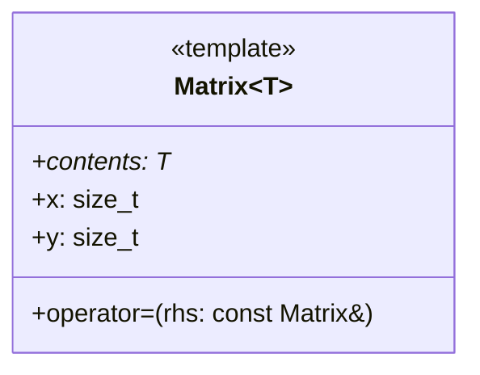

<h1 align="center">ПРИНЦИПЫ ООП</h1>

---
<p align="center">Язык UML, принципы объектно-ориентированного проектирования и паттерны проектирования.</p>
## Проектирование и UML
#### Контексты и интерфейсы
**Интерфейс (C-style): matrix.h**
```c
struct M;
M* create_diag(size_t);
M* prod(const M*, const M*);
double det(const M*);
void destroy(M*);
// .....
```
**Контекст (C-style): matrix.c**
```c
struct M {
	double *contents;
	size_t x, y;
};

#define Msz sizeof(M);

M* create_diag(size_t w) {
	M* ret = malloc(Msz);
	// .....
}
```
**Интерфейс (C++ style): imatrix.h**
```cpp
struct IM {
	virtual IM& clone(const IM&);
	virtual ~IM() = 0;
};
```
**Контекст (C++ style): matrix.hpp**
```cpp
template <typename T>
class M : public IM {
	T *contents;
	size_t x, y;

public:
	M(M& rhs);
	M& clone(const IM&) override;
	// все реализации в том же файле
}
```
#### Контексты и инварианты
**Контекст (C++ style): matrix.hpp**
```cpp
template <typename T>
class M : public IM {
	T *contents;
	size_t x, y;

public:
	M(M& rhs);
	M& clone(const IM&) override;
	// ....
}
```
**Инварианты**
• Указатель contents валиден, если *x* ≠ 0.
• Если *x* ≠ 0, то всегда *y* ≠ 0.
• Для contents аллоцирована память размером *x* \* *y* \* *sizeof(T)*.
• После клонирования матрица равно исходной.
• Ещё?
#### Базовые понятия
• Контекст инкапсулирует данные и охраняет инварианты.
• Контекст реализует интерфейс (для типов в C++ через наследование интерфейса).
• Производный контекст расширяет базовый (для типов в C++ через наследование реализации).
• Если контексты - это типы, производный контекст связан с базовым дополнительными отношениями (частное/общеей, быть частью и подобными).
• Если несколько типов реализуют общий интерфейс, вызовы их методов через этот интерфейс полиморфны.
#### Обсуждение: проектирование
• Проектирование сложной системы классов - это человеческая деятельность.
• Что является артефактом этой деятельности?
• Как можно было бы хотя бы частично формализовать этот процесс?
#### Обсуждение: язык моделирования
• Проектирование - это моделирование отношений между типами.
• В каких отношениях могут быть друг с другом классы в C++?
• Примеры отношений: "A наследует от B" или "C является полем в D".
• Назовите все, какие сможете вообразить.
#### Отношения между классами и UML
• UML - это специальный язык, который моделирует классы и отношения между классами (отношения будут далее).
• Класс в UML определяется через своё имя, поля и методы.
• По традиции имя идёт в первом квадрате, поля во втором, а методы в третьем.
• Формат полей "поле: тип" (несколько контринтуитивно для C++).
• UML поддерживает также тонны других атрибутов, например, шаблонные параметры.

