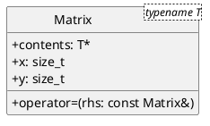
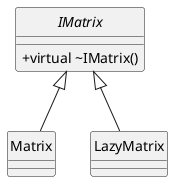
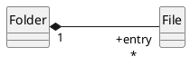
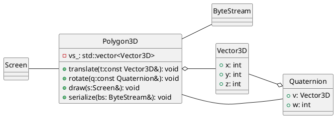
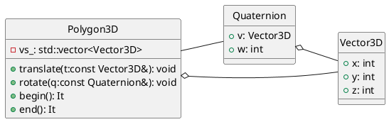
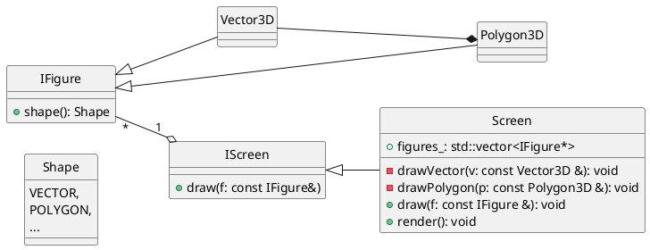
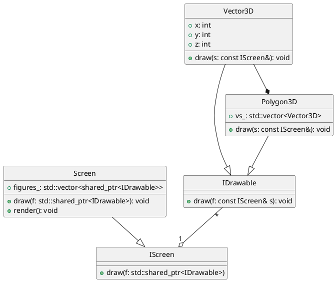
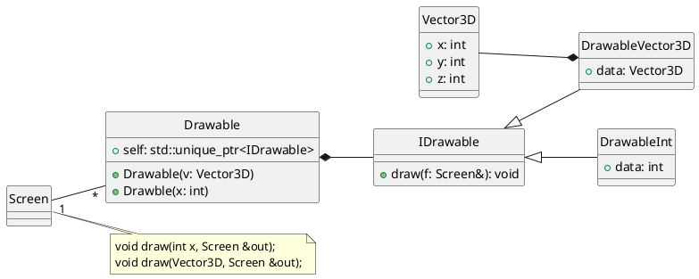
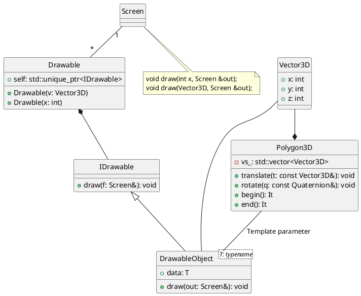

<h1 align="center">ПРИНЦИПЫ ООП</h1>

---
<p align="center">Язык UML, принципы объектно-ориентированного проектирования и паттерны проектирования.</p>
## Проектирование и UML
#### Контексты и интерфейсы
**Интерфейс (C-style): matrix.h**
```c
struct M;
M* create_diag(size_t);
M* prod(const M*, const M*);
double det(const M*);
void destroy(M*);
// .....
```
**Контекст (C-style): matrix.c**
```c
struct M {
	double *contents;
	size_t x, y;
};

#define Msz sizeof(M);

M* create_diag(size_t w) {
	M* ret = malloc(Msz);
	// .....
}
```
**Интерфейс (C++ style): imatrix.h**
```cpp
struct IM {
	virtual IM& clone(const IM&);
	virtual ~IM() = 0;
};
```
**Контекст (C++ style): matrix.hpp**
```cpp
template <typename T>
class M : public IM {
	T *contents;
	size_t x, y;

public:
	M(M& rhs);
	M& clone(const IM&) override;
	// все реализации в том же файле
}
```
#### Контексты и инварианты
**Контекст (C++ style): matrix.hpp**
```cpp
template <typename T>
class M : public IM {
	T *contents;
	size_t x, y;

public:
	M(M& rhs);
	M& clone(const IM&) override;
	// ....
}
```
**Инварианты**
• Указатель contents валиден, если *x* ≠ 0.
• Если *x* ≠ 0, то всегда *y* ≠ 0.
• Для contents аллоцирована память размером *x* \* *y* \* *sizeof(T)*.
• После клонирования матрица равно исходной.
• Ещё?
#### Базовые понятия
• Контекст инкапсулирует данные и охраняет инварианты.
• Контекст реализует интерфейс (для типов в C++ через наследование интерфейса).
• Производный контекст расширяет базовый (для типов в C++ через наследование реализации).
• Если контексты - это типы, производный контекст связан с базовым дополнительными отношениями (частное/общеей, быть частью и подобными).
• Если несколько типов реализуют общий интерфейс, вызовы их методов через этот интерфейс полиморфны.
#### Обсуждение: проектирование
• Проектирование сложной системы классов - это человеческая деятельность.
• Что является артефактом этой деятельности?
• Как можно было бы хотя бы частично формализовать этот процесс?
#### Обсуждение: язык моделирования
• Проектирование - это моделирование отношений между типами.
• В каких отношениях могут быть друг с другом классы в C++?
• Примеры отношений: "A наследует от B" или "C является полем в D".
• Назовите все, какие сможете вообразить.
#### Отношения между классами и UML
• UML - это специальный язык, который моделирует классы и отношения между классами (отношения будут далее).
• Класс в UML определяется через своё имя, поля и методы.
• По традиции имя идёт в первом квадрате, поля во втором, а методы в третьем.
• Формат полей "поле: тип" (несколько контринтуитивно для C++).
• UML поддерживает также тонны других атрибутов, например, шаблонные параметры.

```plantuml
@startuml
hide circle
skinparam classAttributeIconSize 0
class Matrix<typename T> {
	+contents: T*
	+x: size_t
	+y: size_t
	+operator=(rhs: const Matrix&)
}
@enduml
```
• Ассоциация: сущности каким-то образом связаны друг с другом.
• Например, появляются вместе внутри одной функции.

```plantuml
@startuml
hide circle
left to right direction
class Professor
class Book
Professor "+author\n1..*" ---- "+textbook\n0..*" Book
@enduml
```
• Здесь также видно, что у каждой связи можно указать роли и множественность.
• Генерализация: отношение частное/общее (для C++ это открытое наследование).

```plantuml
@startuml
hide circle
skinparam classAttributeIconSize 0
abstract class IMatrix {
	+virtual ~IMatrix()
}
IMatrix <|-- Matrix
IMatrix <|-- LazyMatrix
@enduml
```
• Композиция означает, что сущность B является частью сущности A.

```plantuml
@startuml
hide circle
left to right direction
class Folder
class File
Folder "1" *--- "+entry\n*" File
@enduml
```
• Здесь файл принадлежит только одной папке и связан с ней временем жизни.
• Агрегация: сущность A владеет сущностью B, но кроме A у B может быть много владельцев.

```plantuml
@startuml
hide circle
left to right direction
class Triangle
class Segment
Triangle "*" o-- "3" Segment
@enduml
```
• Здесь треугольник состоит из отрезков, но каждый из отрезков может участвовать во многих треугольниках.
#### Обсуждение
• UML - это средство описания, которым можно описать любую систему, в том числе сколь угодно плохую.
• Software имеет английский корень soft, означающий нечто, что легко изменять.
• Но часто вместо куска пластилина у нас под руками оказывается странная засохшая субстанция с обломками гвоздей и лезвий внутри.
• Первый шаг к хорошему коду - это <span style="color: blue;">легко изменяемый</span> код.
## Принципы SOLID
• <span style="color: red;">S</span>RP - single responsibility principle
	• каждый контекст должен иметь одну ответственность
• <span style="color: red;">O</span>CP - open-close principle
	• каждый контекст должен быть закрыт для изменения и открыт для расширения
• <span style="color: red;">L</span>SP - Liskov substitution principle
	• частный класс должен иметь возможность свободно заменять общий
• <span style="color: red;">I</span>SP - interface separation principle
	• тип не должен зависеть от тех интерфейсов, которые он не использует
• <span style="color: red;">D</span>IP - dependency inversion principle
	• высокоуровневые классы не должны зависеть от низкоуровневых
#### Пример плохого проектирования (SRP)

```plantuml
@startuml
hide circle
left to right direction
class Screen
class Polygon3D {
	-vs_: std::vector<Vector3D>
	+translate(t:const Vector3D&): void
	+rotate(q:const Quaternion&): void
	+draw(s:Screen&): void
	+serialize(bs: ByteStream&): void
}
class ByteStream
class Vector3D {
	+x: int
	+y: int
	+z: int
}
class Quaternion {
	+v: Vector3D
	+w: int
}

Screen -- Polygon3D
Polygon3D -- ByteStream
Polygon3D o-- Vector3D
Polygon3D --- Quaternion
Vector3D --o Quaternion
@enduml
```
• В каком случае мы тут должны будем изменять полигон?
• Что в этом плохого?
• Есть ли нечто плохое в зависимости от вектора и от кватернионов?
• <span style="color: brown;">"A class should have only one reason to change"</span> (Robert C. Martin)
```cpp
//---------------------------------------------------------------------------
//
// Source code for MIPT ILab
// Slides: https://sourceforge.net/projects/cpp-lects-rus/files/cpp-graduate/
// Licensed after GNU GPL v3
//
//---------------------------------------------------------------------------
//
// Bad code violating SRP: polygon does too much
//
//---------------------------------------------------------------------------

#include <iostream>
#include <vector>

using Screen = std::ostream;
using ByteStream = std::ostream;

struct Vector3D {
	int x, y, z;
	Vector3D& operator+=(const Vector3D& lhs) {
		x += lhs.x;
		y += lhs.y;
		z += lhs.z;
		return *this;
	}
};

struct Quaternion {
	Vector3D v;
	int w;
};

void draw(Screen& s, Vector3D v) {
	s << "(" << v.x << ", " << v.y << ", " << v.z << ")";
}

class Polygon3D {
	std::vector<Vector3D> vs_;
	
public:
	Polygon3D(std::initializer_list<Vector3D> il) : vs_(il) {}
	void translate(const Vector3D& t) {
		for(auto& v : vs_)
			v += t;
	}
	void rotate(const Quaternion& q) {
		// for(auto& p : vs_)
		//   p = inverse(q) * p * q;
	}
	void draw(Screen& s) const {
		for(auto v : vs_) {
			::draw(s, w);
			std::cout << "\n";
		}
	}
	void serialize(ByteStream &bs) const { draw(bs); }
};

int main() {
	Polygon3D p = {{2, 1, 6}, {-3, 7, 4}};
	p.draw(std::cout);
}
```
#### Принцип единственной ответственности

```plantuml
@startuml
hide circle
left to right direction
class Polygon3D {
	-vs_: std::vector<Vector3D>
	+translate(t:const Vector3D&): void
	+rotate(q:const Quaternion&): void
	+begin(): It
	+end(): It
}
class Quaternion {
	+v: Vector3D
	+w: int
}
class Vector3D {
	+x: int
	+y: int
	+z: int
}
Polygon3D -- Quaternion
Quaternion o-- Vector3D
Vector3D --o Polygon3D
@enduml
```
• Теперь единственная обязанность - это геометрия.
• Для вывода есть итераторы.
• В итоге, внешние функции могут обращаться к элементам, но не к состоянию полигона.
• <span style="color: brown;">"We want to design components that are self-contained: independent and with single well-defined purpose"</span> (Andrew Hunt, David Thomas)
Пример хорошей реализации:
```cpp
//---------------------------------------------------------------------------
//
// Source code for MIPT ILab
// Slides: https://sourceforge.net/projects/cpp-lects-rus/files/cpp-graduate/
// Licensed after GNU GPL v3
//
//---------------------------------------------------------------------------
//
// Good code satisfying SRP
//
//---------------------------------------------------------------------------

#include <iostream>
#include <vector>

using Screen = std::ostream;
using ByteStream = std::ostream;

struct Vector3D {
	int x, y, z;
	Vector3D& operator+=(const Vector3D& lhs) {
		x += lhs.x;
		y += lhs.y;
		z += lhs.z;
		return *this;
	}
};

struct Quaternion {
	Vector3D v;
	int w;
};

void draw(Screen& s, Vector3D v) {
	s << "(" << v.x << ", " << v.y << ", " << v.z << ")";
}

class Polygon3D {
	std::vector<Vector3D> vs_;
	using CItt = typename std::vector<Vector3D>::const_iterator;
	
public:
	Polygon3D(std::initializer_list<Vector3D> il) : vs_(il) {}
	void translate(const Vector3D& t) {
		for(auto& v : vs_)
			v += t;
	}
	void rotate(const Quaternion& q) {
		// for(auto& p : vs_)
		//   p = inverse(q) * p * q;
	}
	CItt begin() const { return vs_.cbegin(); }
	CItt end() const { return vs_.cend(); }
};

void draw(Screen& s, const Polygon3D &p) {
	for(auto v : p) {
		::draw(s, v);
		std::cout << "\n";
	}
}

void serialize(ByteStream& bs, const Polygon3D& p) { draw(bs, p); }

int main() {
	Polygon3D p = {{2, 1, 6}, {-3, 7, 4}};
	draw(std::cout, p);
}
```
#### Гайдлайн: связность
• Ваши сущности должны быть внутренне связаны (cohesive) и внешне разделены.
• Разделяйте всё, что может быть разделено без создания жёстких внешних связей. Пример: отделение алгоритмов от контейнеров.
• <span style="color: brown;">"Cohesion is a measure of the strength of association of the elements inside a module. A highly cohesive module is a collection of statements and data items that should be treated as a whole because they are so closely related."</span> (Tom DeMarco)
#### Пример плохого проектирования (OCP)

```plantuml
@startuml

hide circle
left to right direction

enum Shape {
	VECTOR,
	POLYGON,
	...
}
class IFigure {
+shape(): Shape
}
class Vector3D
class Polygon3D
class IScreen {
	+draw(f: const IFigure&)
}
class Screen {
	+figures_: std::vector<IFigure*>
	-drawVector(v: const Vector3D &): void
	-drawPolygon(p: const Polygon3D &): void
	+draw(f: const IFigure &): void
	+render(): void
}

IFigure <|-- Vector3D
IFigure <|-- Polygon3D
Vector3D --* Polygon3D
IFigure "*" --o "1" IScreen
IScreen <|-- Screen
@enduml
```
Пример с гита:
```cpp
//---------------------------------------------------------------------------
//
// Source code for MIPT ILab
// Slides: https://sourceforge.net/projects/cpp-lects-rus/files/cpp-graduate/
// Licensed after GNU GPL v3
//
//---------------------------------------------------------------------------
//
// Bad code violating OCP: switch too ugly
//
//---------------------------------------------------------------------------

#include <iostream>
#include <vector>

struct IFigure {
	enum class Shape { VECTOR, POLYGON, CIRCLE };
	virtual Shape shape() const = 0;
	virtual ~IFigure() = default;
};

struct IScreen {
	virtual void draw(const IFigure &f) = 0;
	virtual void render() const = 0;
	virtual ~IScreen() = default;
};

using ByteStream = IScreen;
void serialize(ByteStream &bs, const IFigure &p) { bs.draw(p); }

struct Vector3D : public IFigure {
	int x_, y_, z_;
	Vector3D(int x = 0, int y = 0, int z = 0) : x_(x), y_(y), z_(z) {}
	Vector3D& operator+=(const Vector3D &lhs) {
		x_ += lhs.x_;
		y_ += lhs.y_;
		z_ += lhs.z_;
		return *this;
	}
	
	Shape shape() const override { return IFigure::Shape::VECTOR; }
};

struct Quaternion {
	Vector3D v;
	int w;
};

class Polygon3D: public IFigure {
	std::vector<Vector3D> vs_;
	using CItt = typename std::vector<Vector3D>::const_interator;
	
public:
	Polygon3D(std::initializer_list<Vector3D> il) : vs_(il) {}
	void translate(const Vector3D& t) {
		for(auto& v : vs_)
			v += t;
	}
	void rotate(const Quaternion& q) {
		// for(auto& p : vs_)
		//   p = inverse(q) * p * q;
	}
	Shape shape() const override { return IFigure::Shape::POLYGON; }

	CItt begin() const { return vs_.cbegin(); }
	CItt end() const { return vs_.cend(); }
};

class Screen : public IScreen {
	std::vector<const IFigure*> figures_;
	
	void drawVector(const Vector3D& v) const {
		std::cout << "(" << v.x << ", " << v.y << ", " << v.z << ")";
	}
	
	void drawPolygon(const Polygon3D& p) const {
		for(auto v : p) {
			drawVector(v);
			std::cout << "\n";
		}
	}
	
public:
	void draw(const IFigure& f) override { figures_.push_back(&f); }
	
	void render() const override {
		for(auto f : figures_) {
			switch(t->shape()) {
				case IFigure::Shape::POLYGON:
					drawPolygon(*static_cast<const Polygon3D*>(f));
					break;
				case IFigure::Shape::VECTOR:
					drawVector(*static_cast<const Vector3D*>(f));
					break;
			}
		}
	} 
};

int main() {
	Polygon3D p = {{2, 1, 6}, {-3, 7, 4}};
	Screen n;
	s.draw(p);
	s.render();
}
```
#### Принцип открытости и закрытости

```plantuml
@startuml

hide circle

class IDrawable {
	+draw(f: const IScreen& s): void
}
class Vector3D {
	+x: int
	+y: int
	+z: int
	+draw(s: const IScreen&): void
}
class Polygon3D {
	+vs_: std::vector<Vector3D>
	+draw(s: const IScreen&): void
}
class IScreen {
	+draw(f: std::shared_ptr<IDrawable>)
}
class Screen {
	+figures_: std::vector<shared_ptr<IDrawable>>
	+draw(f: std::shared_ptr<IDrawable>): void
	+render(): void
}

Vector3D --|> IDrawable
Polygon3D --|> IDrawable
Vector3D --* Polygon3D
IDrawable "*" --o "1" IScreen
Screen --|> IScreen

@enduml
```
Пример с гита:
```cpp
//---------------------------------------------------------------------------
//
// Source code for MIPT ILab
// Slides: https://sourceforge.net/projects/cpp-lects-rus/files/cpp-graduate/
// Licensed after GNU GPL v3
//
//---------------------------------------------------------------------------
//
// Good code not violating OCP
//
//---------------------------------------------------------------------------

#include <iostream>
#include <memory>
#include <vector>

struct IDrawable;

struct IScreen {
	virtual void render() const = 0;
	virtual void draw(std::shared_ptr<IDrawable> f) = 0;
	std::ostream &stream() const { return std::cout; }
	virtual ~IScreen() = default;
};

struct IDrawable {
	virtual void draw(const IScreen& s) const = 0;
	virtual ~IDrawable() = default;
};

using ByteStream = IScreen;
void serialize(ByteStream &bs, std::shared_ptr<IDrawable> p) { bs.draw(p); }

struct Vector3D : public IDrawable {
	int x_, y_, z_;
	Vector3D(int x = 0, int y = 0, int z = 0) : x_(x), y_(y), z_(z) {}
	Vector3D& operator+=(const Vector3D &lhs) {
		x_ += lhs.x_;
		y_ += lhs.y_;
		z_ += lhs.z_;
		return *this;
	}
	
	void draw(const IScreen& s) const override {
		s.stream() << "(" << x_ << ", " << y_ << ", " << z_ << ")";
	}
};

struct Quaternion {
	Vector3D v;
	int w;
};

class Polygon3D: public IDrawable {
	std::vector<Vector3D> vs_;
	using CItt = typename std::vector<Vector3D>::const_interator;
	
public:
	Polygon3D(std::initializer_list<Vector3D> il) : vs_(il) {}
	void translate(const Vector3D& t) {
		for(auto& v : vs_)
			v += t;
	}
	void rotate(const Quaternion& q) {
		// for(auto& p : vs_)
		//   p = inverse(q) * p * q;
	}
	void draw(const IScreen &s) const override {
		for(auto v : vs_) {
			v.draw(s);
			s.stream() << "\n";
		}
	}

	CItt begin() const { return vs_.cbegin(); }
	CItt end() const { return vs_.cend(); }
};

class Screen : public IScreen {
	std::vector<std::shared_ptr<IDrawable>> figures_;

public:
	void draw(std::shared_ptr<IDrawable> f) override { figures_.push_back(f); }
	
	void render() const override {
		for(auto f: figures_)
			f->draw(*this);
	} 
};

int main() {
	std::initializer_list<Vector3d> il{{2, 1, 6}, {-3, 7, 4}};
	auto p = std::make_shared<Polygon3D>(il);
	Screen n;
	s.draw(p);
	s.render();
}
```
#### Обсуждение
• Такое чувство, что OCP в таком наивном виде противоречит SRP.
• Мы добавили виртуальную функцию draw в полигон, но мы несколькими слайдами раньше договорились этого <span style="color: blue;">не</span> делать.
• <span style="color: brown;">"Inheritance is the base class of Evil"</span> (Sean Parent)
• Посмотрите на код справа (в данном конспекте снизу).
```cpp
using document_t = std::vector<int>;

// документ хранит объекты
// семантика значения
// no incidental data structures
document.push_back(1);
document.push_back(2);
document.push_back(3);

draw(document, std::cout);
```
• Чего мы хотели бы?
Меняет код, подразумевает, что хотели бы так:
```cpp
using document_t = std::vector<???>;

// документ хранит объекты
// семантика значения
// no incidental data structures
document.push_back(circle);
document.push_back(polygon);
document.push_back(vector);

draw(document, std::cout);
// мы хотели бы хранить и полиморфно
// отображать разнородные объекты
```
#### Модель и концепция

```plantuml
@startuml

hide circle
left to right direction

class Screen

class Drawable {
	+self: std::unique_ptr<IDrawable>
	+Drawable(v: Vector3D)
	+Drawble(x: int)
}

class Vector3D {
	+x: int
	+y: int
	+z: int
}

class IDrawable {
	+draw(f: Screen&): void
}

class DrawableVector3D {
	+data: Vector3D
}

class DrawableInt {
	+data: int
}
note as DrawFunctions
	void draw(int x, Screen &out);
	void draw(Vector3D, Screen &out);
end note

Screen "1" -- "*" Drawable
Drawable *-- IDrawable
Vector3D --* DrawableVector3D
IDrawable <|-- DrawableVector3D
IDrawable <|-- DrawableInt
Screen -- DrawFunctions

@enduml
```
Очередной пример с гита:
```cpp
//---------------------------------------------------------------------------
//
// Source code for MIPT ILab
// Slides: https://sourceforge.net/projects/cpp-lects-rus/files/cpp-graduate/
// Licensed after GNU GPL v3
//
//---------------------------------------------------------------------------
//
// Demonstration of parent inversion: model is inside the class
//
//---------------------------------------------------------------------------

#include <algorithm>
#include <iostream>
#include <memory>
#include <string>
#include <utility>
#include <vector>

using Screen = std::ostream;

struct Vector3D {
	int x, y, z;
};

void draw(int x, Screen& out, size_t position) {
	out << std::string(position, ' ') << x << "\n";
}

class Drawable {
	struct IDrawable {
		virtual ~IDrawable() = default;
		virtual std::unique_ptr<IDrawable> copy_() const = 0;
		virtual void draw_(Screen&, size_t) const = 0;
	};
	
	struct DrawableInt final : IDrawable {
		int data_;
		DrawableInt(int x) : data_(std::move(x)) {}
		std::unique_ptr<IDrawable> copy_() const override {
			return std::make_unique<DrawableInt>(*this);
		}
		void draw_(Screen& out, size_t position) const override {
			::draw(data_, out, position);
		}
	};
	
	std::unique_ptr<IDrawable> self_;
	
public:
	Drawable(int x) : self_(std::make_unique<DrawableInt>(std::move(x))) {}
	
	// copy ctor, move ctor and assignment
public:
	Drawable(const Drawable& x) : self_(x.self_->copy_()) {}
	Drawable(Drawable&& x) noexcept = default;
	Drawable& operator=(Drawable x) noexcept {
		self_ = std::move(x.self_);
		return *this;
	}
	
public:
	friend void draw(const Drawable& x, Screen& out, size_t position) {
		x.self_->draw_(out, position);
	}
};

using Model = std::vector<Drawable>;

void draw(const Model& x, Screen& out, size_t position) {
	out << std::string(position, ' ') << "<world>" << std::endl;
	for(const auto& e : x)
		draw(e, out, position + 2);
	out << std::string(position, ' ') << "</world>" << std::endl;
}

int main() {
	Model document;
	document.push_back(0);
	document.push_back(Vector3D{2, 1, 6});
	document.push_back(Vector3D{-1, 7, 4});
	document.push_back(3);
	draw(document, std::cout, 0);
}
```
Вывод
```
<world>
0
(2, 1, 6)
(-3, 7, 4)
3
</world>
```
Также вслух отмечает, что с шаблонами можно убрать дублирование и упрощается интеграция новых объектов.
#### Parent reversal: вводим шаблоны

```plantuml
@startuml

hide circle

class Screen

class Drawable {
	+self: std::unique_ptr<IDrawable>
	+Drawable(v: Vector3D)
	+Drawble(x: int)
}

class IDrawable {
	+draw(f: Screen&): void
}

class DrawableObject<T: typename> {
	+data: T
	+draw(out: Screen&): void
}

class Vector3D {
	+x: int
	+y: int
	+z: int
}

class Polygon3D {
	-vs_: std::vector<Vector3D>
	+translate(t: const Vector3D&): void
	+rotate(q: const Quaternion&): void
	+begin(): It
	+end(): It
}

note as DrawFunctions
	void draw(int x, Screen &out);
	void draw(Vector3D, Screen &out);
end note 

Screen "1" -- "*" Drawable
Drawable *-- IDrawable
IDrawable <|-- DrawableObject
Vector3D -- DrawableObject
Polygon3D -- DrawableObject : Template parameter
Vector3D --* Polygon3D
Screen -- DrawFunctions

@enduml
```
Пример с гита:
```cpp
//---------------------------------------------------------------------------
//
// Source code for MIPT ILab
// Slides: https://sourceforge.net/projects/cpp-lects-rus/files/cpp-graduate/
// Licensed after GNU GPL v3
//
//---------------------------------------------------------------------------
//
// Demonstration of parent inversion: model is inside the class
//
//---------------------------------------------------------------------------

#include <algorithm>
#include <iostream>
#include <memory>
#include <string>
#include <utility>
#include <vector>

using Screen = std::ostream;

struct Vector3D {
	int x, y, z;
};

struct Polygon3D {
	std::vector<Vector3D> vs;
	Polygon3D(std::initializer_list<Vector3D> il : vs(il)) {}
};

void draw(int x, Screen& out, size_t position) {
	out << std::string(position, ' ') << x << "\n";
}

void draw(Vector3D v, Screen& out, size_t position) {
	out << std::string(position, ' ') << "(" << v.x << ", " << v.y << ", " << v.z
			<< ")\n";
}

void draw(const Polygon3D& p, Screen& out, size_t position) {
	out << std::string(position, ' ') << "<polygon>" << std::endl;
	for(auto v : p.vs)
		::draw(v, out, position + 2);
	out << std::string(position, ' ') << "</polygon>" << std::endl;
}

class Drawable {
	struct IDrawable {
		virtual ~IDrawable() = default;
		virtual std::unique_ptr<IDrawable> copy_() const = 0;
		virtual void draw_(Screen&, size_t) const = 0;
	};
	
	template<typename T> struct DrawableObject final : IDrawable {
		T data_;
		DrawableObject(T x) : data_(std::move(x)) {}
		std::unique_ptr<IDrawable> copy_() const override {
			return std::make_unique<DrawableObject>(*this);
		}
		void draw_(Screen &out, size_t position) const override;
	};
	
	std::unique_ptr<IDrawable> self_;
	
public:
	template<typename T>
	Drawable(int x) : self_(std::make_unique<DrawableObject<T>>(std::move(x))) {}
	
	// copy ctor, move ctor and assignment
public:
	Drawable(const Drawable& x) : self_(x.self_->copy_()) {}
	Drawable(Drawable&& x) noexcept = default;
	Drawable& operator=(Drawable x) noexcept {
		self_ = std::move(x.self_);
		return *this;
	}
	
public:
	friend void draw(const Drawable& x, Screen& out, size_t position) {
		x.self_->draw_(out, position);
	}
};

using Model = std::vector<Drawable>;

void draw(const Model& x, Screen& out, size_t position) {
	out << std::string(position, ' ') << "<world>" << std::endl;
	for(const auto& e : x)
		draw(e, out, position + 2);
	out << std::string(position, ' ') << "</world>" << std::endl;
}

template<typename T>
void Drawable::DrawableObject<T>::draw_(Screen& out, size_t position) const {
	::draw(data_, out, position);
}

int main() {
	Model document;
	document.push_back(0);
	document.push_back(Vector3D{2, 1, 6});
	document.push_back(document);
	document.push_back(Vector3D{-1, 7, 4});
	draw(document, std::cout, 0);
}
```
После этих небольших манипуляций получаем такой вот вывод, а код становится более абстрактным:
```
<world>
	0
	<polygon>
		(2, 1, 6)
		(-3, 7, 4)
	</polygon>
	<world>
		0
		<polygon>
			(2, 1, 6)
			(-3, 7, 4)
		</polygon>
	</world>
	(-3, 7, 4)
</world>
```
#### Обсуждение
• Техники наподобие Parent Reversal позволяют помирить OCP и SRP
• Теперь мы расширяем, добавляя свободные функции, полиморфные, как множество перегрузки.
• Динамический полиморфизм, при этом, остаётся деталью реализации.
• Шаблонный полиморфизм используется, чтобы позволить обобщённое программирование.
#### Пример плохого проектирования (LSP)
• Все ли видят, в чём тут основная проблема?
```cpp
bool intersect(Polygon2D& l, Polygon2D& r); // 2D intersection

class Polygon2D {
	std::vector<double> xcoord, ycoord;
	// .... everything else ....
};
class Polygon3D : public Polygon2D {
	std::vector<double> zcoord;
	// .... everything else ....
};
```
#### Принцип подстановки Лисков
• Более общие классы должны быть более общими и по составу и по поведению.
```cpp
class Polygon3D : public Polygon2D;
```
• Это читается как: <span style="color: brown;">трёхмерный полигон может быть использован во всех контекстах, где нам нужен двумерный полигон.</span> Если это некорректно, наследоваться нельзя.
• Предусловия алгоритмов не могут быть усилены производным классом.
• Постусловия алгоритмов не могут быть ослаблены производным классом.
• Важной концепцией для LSP является ковариативность.
#### Ковариантность
• Мы говорим, что изменение типа <span style="color: brown;">ковариантно к генерализации</span>, если выполняется условие:
```
если A обобщает B, то A' обобщает B'
```
• Собственно, указатели ковариантны к генерализации, если трактовать A' = A*.
```cpp
class Rectangle : public Shape { /* ... */ };

void draw(Shape* shapes, size_t size);

Rectangle rects[5];
draw(rects, 5); // ok, Rectangle* is Shape*
``` 