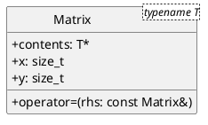
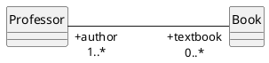
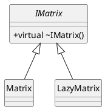
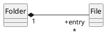
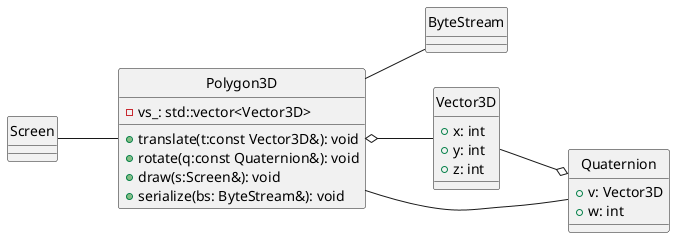
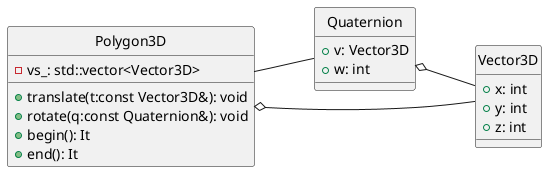

<h1 align="center">ПРИНЦИПЫ ООП</h1>

---
<p align="center">Язык UML, принципы объектно-ориентированного проектирования и паттерны проектирования.</p>
## Проектирование и UML
#### Контексты и интерфейсы
**Интерфейс (C-style): matrix.h**
```c
struct M;
M* create_diag(size_t);
M* prod(const M*, const M*);
double det(const M*);
void destroy(M*);
// .....
```
**Контекст (C-style): matrix.c**
```c
struct M {
	double *contents;
	size_t x, y;
};

#define Msz sizeof(M);

M* create_diag(size_t w) {
	M* ret = malloc(Msz);
	// .....
}
```
**Интерфейс (C++ style): imatrix.h**
```cpp
struct IM {
	virtual IM& clone(const IM&);
	virtual ~IM() = 0;
};
```
**Контекст (C++ style): matrix.hpp**
```cpp
template <typename T>
class M : public IM {
	T *contents;
	size_t x, y;

public:
	M(M& rhs);
	M& clone(const IM&) override;
	// все реализации в том же файле
}
```
#### Контексты и инварианты
**Контекст (C++ style): matrix.hpp**
```cpp
template <typename T>
class M : public IM {
	T *contents;
	size_t x, y;

public:
	M(M& rhs);
	M& clone(const IM&) override;
	// ....
}
```
**Инварианты**
• Указатель contents валиден, если *x* ≠ 0.
• Если *x* ≠ 0, то всегда *y* ≠ 0.
• Для contents аллоцирована память размером *x* \* *y* \* *sizeof(T)*.
• После клонирования матрица равно исходной.
• Ещё?
#### Базовые понятия
• Контекст инкапсулирует данные и охраняет инварианты.
• Контекст реализует интерфейс (для типов в C++ через наследование интерфейса).
• Производный контекст расширяет базовый (для типов в C++ через наследование реализации).
• Если контексты - это типы, производный контекст связан с базовым дополнительными отношениями (частное/общеей, быть частью и подобными).
• Если несколько типов реализуют общий интерфейс, вызовы их методов через этот интерфейс полиморфны.
#### Обсуждение: проектирование
• Проектирование сложной системы классов - это человеческая деятельность.
• Что является артефактом этой деятельности?
• Как можно было бы хотя бы частично формализовать этот процесс?
#### Обсуждение: язык моделирования
• Проектирование - это моделирование отношений между типами.
• В каких отношениях могут быть друг с другом классы в C++?
• Примеры отношений: "A наследует от B" или "C является полем в D".
• Назовите все, какие сможете вообразить.
#### Отношения между классами и UML
• UML - это специальный язык, который моделирует классы и отношения между классами (отношения будут далее).
• Класс в UML определяется через своё имя, поля и методы.
• По традиции имя идёт в первом квадрате, поля во втором, а методы в третьем.
• Формат полей "поле: тип" (несколько контринтуитивно для C++).
• UML поддерживает также тонны других атрибутов, например, шаблонные параметры.

```plantuml
@startuml
hide circle
skinparam classAttributeIconSize 0
class Matrix<typename T> {
	+contents: T*
	+x: size_t
	+y: size_t
	+operator=(rhs: const Matrix&)
}
@enduml
```
• Ассоциация: сущности каким-то образом связаны друг с другом.
• Например, появляются вместе внутри одной функции.

```plantuml
@startuml
hide circle
left to right direction
class Professor
class Book
Professor "+author\n1..*" ---- "+textbook\n0..*" Book
@enduml
```
• Здесь также видно, что у каждой связи можно указать роли и множественность.
• Генерализация: отношение частное/общее (для C++ это открытое наследование).

```plantuml
@startuml
hide circle
skinparam classAttributeIconSize 0
abstract class IMatrix {
	+virtual ~IMatrix()
}
IMatrix <|-- Matrix
IMatrix <|-- LazyMatrix
@enduml
```
• Композиция означает, что сущность B является частью сущности A.

```plantuml
@startuml
hide circle
left to right direction
class Folder
class File
Folder "1" *--- "+entry\n*" File
@enduml
```
• Здесь файл принадлежит только одной папке и связан с ней временем жизни.
• Агрегация: сущность A владеет сущностью B, но кроме A у B может быть много владельцев.

```plantuml
@startuml
hide circle
left to right direction
class Triangle
class Segment
Triangle "*" o-- "3" Segment
@enduml
```
• Здесь треугольник состоит из отрезков, но каждый из отрезков может участвовать во многих треугольниках.
#### Обсуждение
• UML - это средство описания, которым можно описать любую систему, в том числе сколь угодно плохую.
• Software имеет английский корень soft, означающий нечто, что легко изменять.
• Но часто вместо куска пластилина у нас под руками оказывается странная засохшая субстанция с обломками гвоздей и лезвий внутри.
• Первый шаг к хорошему коду - это <span style="color: blue;">легко изменяемый</span> код.
## Принципы SOLID
• <span style="color: red;">S</span>RP - single responsibility principle
	• каждый контекст должен иметь одну ответственность
• <span style="color: red;">O</span>CP - open-close principle
	• каждый контекст должен быть закрыт для изменения и открыт для расширения
• <span style="color: red;">L</span>SP - Liskov substitution principle
	• частный класс должен иметь возможность свободно заменять общий
• <span style="color: red;">I</span>SP - interface separation principle
	• тип не должен зависеть от тех интерфейсов, которые он не использует
• <span style="color: red;">D</span>IP - dependency inversion principle
	• высокоуровневые классы не должны зависеть от низкоуровневых
#### Пример плохого проектирования (SRP)

```plantuml
@startuml
hide circle
left to right direction
class Screen
class Polygon3D {
	-vs_: std::vector<Vector3D>
	+translate(t:const Vector3D&): void
	+rotate(q:const Quaternion&): void
	+draw(s:Screen&): void
	+serialize(bs: ByteStream&): void
}
class ByteStream
class Vector3D {
	+x: int
	+y: int
	+z: int
}
class Quaternion {
	+v: Vector3D
	+w: int
}

Screen -- Polygon3D
Polygon3D -- ByteStream
Polygon3D o-- Vector3D
Polygon3D --- Quaternion
Vector3D --o Quaternion
@enduml
```
• В каком случае мы тут должны будем изменять полигон?
• Что в этом плохого?
• Есть ли нечто плохое в зависимости от вектора и от кватернионов?
• <span style="color: brown;">"A class should have only one reason to change"</span> (Robert C. Martin)
```cpp
//---------------------------------------------------------------------------
//
// Source code for MIPT ILab
// Slides: https://sourceforge.net/projects/cpp-lects-rus/files/cpp-graduate/
// Licensed after GNU GPL v3
//
//---------------------------------------------------------------------------
//
// Bad code violating SRP: polygon does too much
//
//---------------------------------------------------------------------------

#include <iostream>
#include <vector>

using Screen = std::ostream;
using ByteStream = std::ostream;

struct Vector3D {
	int x, y, z;
	Vector3D& operator+=(const Vector3D& lhs) {
		x += lhs.x;
		y += lhs.y;
		z += lhs.z;
		return *this;
	}
};

struct Quaternion {
	Vector3D v;
	int w;
};

void draw(Screen& s, Vector3D v) {
	s << "(" << v.x << ", " << v.y << ", " << v.z << ")";
}

class Polygon3D {
	std::vector<Vector3D> vs_;
	
public:
	Polygon3D(std::initializer_list<Vector3D> il) : vs_(il) {}
	void translate(const Vector3D& t) {
		for(auto& v : vs_)
			v += t;
	}
	void rotate(const Quaternion& q) {
		// for(auto& p : vs_)
		//   p = inverse(q) * p * q;
	}
	void draw(Screen& s) const {
		for(auto v : vs_) {
			::draw(s, w);
			std::cout << "\n";
		}
	}
	void serialize(ByteStream &bs) const { draw(bs); }
};

int main() {
	Polygon3D p = {{2, 1, 6}, {-3, 7, 4}};
	p.draw(std::cout);
}
```
#### Принцип единственной ответственности

```plantuml
@startuml
hide circle
left to right direction
class Polygon3D {
	-vs_: std::vector<Vector3D>
	+translate(t:const Vector3D&): void
	+rotate(q:const Quaternion&): void
	+begin(): It
	+end(): It
}
class Quaternion {
	+v: Vector3D
	+w: int
}
class Vector3D {
	+x: int
	+y: int
	+z: int
}
Polygon3D -- Quaternion
Quaternion o-- Vector3D
Vector3D --o Polygon3D
@enduml
```
• Теперь единственная обязанность - это геометрия.
• Для вывода есть итераторы.
• В итоге, внешние функции могут обращаться к элементам, но не к состоянию полигона.
• <span style="color: brown;">"We want to design components that are self-contained: independent and with single well-defined purpose"</span> (Andrew Hunt, David Thomas)
Пример хорошей реализации:
```cpp
//---------------------------------------------------------------------------
//
// Source code for MIPT ILab
// Slides: https://sourceforge.net/projects/cpp-lects-rus/files/cpp-graduate/
// Licensed after GNU GPL v3
//
//---------------------------------------------------------------------------
//
// Good code satisfying SRP
//
//---------------------------------------------------------------------------

#include <iostream>
#include <vector>

using Screen = std::ostream;
using ByteStream = std::ostream;

struct Vector3D {
	int x, y, z;
	Vector3D& operator+=(const Vector3D& lhs) {
		x += lhs.x;
		y += lhs.y;
		z += lhs.z;
		return *this;
	}
};

struct Quaternion {
	Vector3D v;
	int w;
};

void draw(Screen& s, Vector3D v) {
	s << "(" << v.x << ", " << v.y << ", " << v.z << ")";
}

class Polygon3D {
	std::vector<Vector3D> vs_;
	using CItt = typename std::vector<Vector3D>::const_iterator;
	
public:
	Polygon3D(std::initializer_list<Vector3D> il) : vs_(il) {}
	void translate(const Vector3D& t) {
		for(auto& v : vs_)
			v += t;
	}
	void rotate(const Quaternion& q) {
		// for(auto& p : vs_)
		//   p = inverse(q) * p * q;
	}
	CItt begin() const { return vs_.cbegin(); }
	CItt end() const { return vs_.cend(); }
};

void draw(Screen& s, const Polygon3D &p) {
	for(auto v : p) {
		::draw(s, v);
		std::cout << "\n";
	}
}

void serialize(ByteStream& bs, const Polygon3D& p) { draw(bs, p); }

int main() {
	Polygon3D p = {{2, 1, 6}, {-3, 7, 4}};
	draw(std::cout, p);
}
```
#### Гайдлайн: связность
• Ваши сущности должны быть внутренне связаны (cohesive) и внешне разделены.
• Разделяйте всё, что может быть разделено без создания жёстких внешних связей. Пример: отделение алгоритмов от контейнеров.
• <span style="color: brown;">"Cohesion is a measure of the strength of association of the elements inside a module. A highly cohesive module is a collection of statements and data items that should be treated as a whole because they are so closely related."</span> (Tom DeMarco)
#### Пример плохого проектирования (OCP)
```plantuml
@startuml
hide circle

enum class Shape {
	VECTOR,
	POLYGON,
	...
}
class IFigure {
+shape(): Shape
}
class Vector3D
class Polygon3D
class IScreen {
	+draw(f: const IFigure&)
}
class Screen {
	+figures_: std::vector<IFigure*>
	-drawVector(v: const Vector3D &): void
	-drawPolygon(p: const Polygon3D &): void
	+draw(f: const IFigure &): void
	+render(): void
}

IFigure <-- Vector3D
IFigure <-- Polygon3D
Vector3D --* Polygon3D
IFigure --o IScreen
IScreen <-- Screen
@enduml
```
